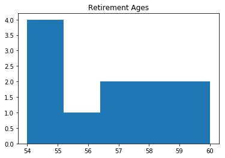
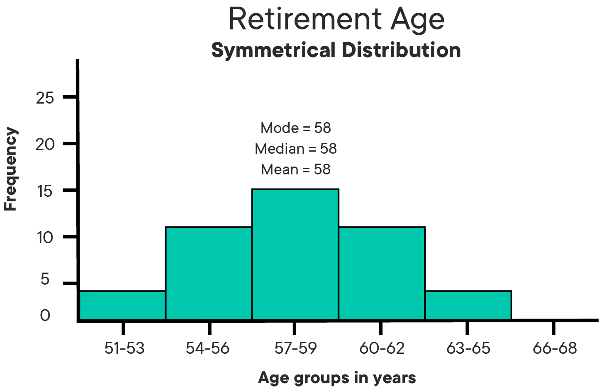
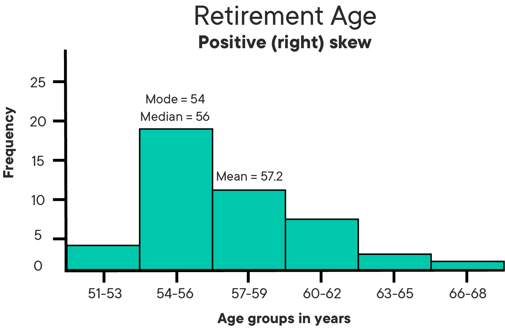
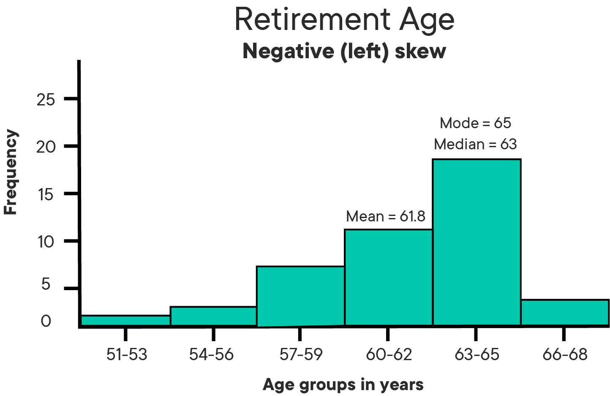

# Measures of Central Tendency

## Introduction

When we are working with a small set of data values, it is often possible to discuss these values individually. However, when we are dealing or working with large sets of data in real-world problems, we prefer to have some features that can summarize and represent the data in a concise format.

In this lesson, we will look at such measures first for a single data variable. e.g., the salary of workers in a particular factory. These measures will include measures of central tendency and measures of dispersion.


## Objectives
You will be able to:
* Understand and describe the significance of measuring central tendency of continuous data
* Understand the formula and intuition behind the mean, median, mode, and modal class
* Compare mean-median-mode, along with histograms to explain the central tendency of given data

## Background

The term *Central Tendency* or a *Measure of Central Tendency* is the **typical** or **central** value for a data distribution. It is also commonly known as just the *Center* of the distribution. If you weren't becoming a data scientist, you might just call it the "average", but it turns out that there are different types of "averages" that work better for answering different sorts of problems.

There are three main measures of central tendency: the mean, the median and the mode. Each of these measures describes a different way of indicating the typical or central value in the data as we will see below. 


## Mean

**Mean** or **Arithmetic Average** is the value obtained by dividing the sum of all the data by the total number of data points as shown in the formula below:

$$ 
\Large\bar X = \dfrac{\sum X}{N} $$

> Yes, we're using the dreaded "mathematical notation". It's OK. It's just a concise way to write things down. It's along (along with long, confusion model names like "Recurrent Neural Networks") one of the ways that data scientists make so much money. The math and long words scare people away from ideas that are actually pretty straightforward!

So if you're a math whiz, great. If not, take a little time to look at an unpack the formulae we show in this course. Over time it'll become second nature and that's going to be really important as a practicing data scientist.

Let's start with the $\bar{x}$ (x-bar) - the bar over the top just means "mean of the sample".   

The mean value, shown as $\bar{x}$ (x-bar) for a vector $X$ is achieved by adding together all values of $X$ (shown as $\sum{X}$),  and dividing $N$ (Number of observations).
e.g. Let’s look at a very simple set of data representing the retirement age of 11 individuals
```
54, 54, 54, 55, 56, 57, 57, 58, 58, 60, 60
```

The mean value is calculated as: 
1.  Adding together all the values 
```
54+54+54+55+56+57+57+58+58+60+60 = 623 
```
2. Dividing by the numbers of observations
```
623/11 = 56.6
```

For most people, the "mean" is what they think of as the "average". If I got paid \$20k and you got paid \$40k last year our "average" salary was \$30,000.

## Median

The median is another measure of central tendency. It refers to the data situated at exactly the middle location of the distribution.

In a set with an odd number of data points, the median is the middle value. So the median of 2, 4, 12 is 4. In our retirement data above, as we have 11 values, we can pick the 6th value (57) to be our median.

If the number of data points is even then the median is the average (mean) of the two middle items. Let's look at this dataset for the average weight of 10 individuals:
```
55, 56, 56, 58, 60, 61, 63, 64, 70, 78
```

So here, for the even number of observations (i.e. 10), the median would be calculated as:
```
Median = (60 + 61)/2 = 60.5
```

Why might we want to use the median instead of the mean? Well, imagine there are 10 people sitting in a bar. All of them make \$50k a year. A hedge fund manager comes in who makes \$20m a year. The "average" (mean) salary of people in the bar is now just over \$1.86m a year! It is true, but it might be misleading if you relied on that data to ask any of the first 10 people to loan you \$500k!

So medians are particularly useful for data sets where there are a number of significant outliers (like the hedge fund managers salary) and you want to get a sense of a "representative" measure of centrality. If we looked at the median salary in the bar, it'd still be \$50k even with the hedge fund manager. It'd be a little misleading for that one person but would give you a better sense of the kind of salary that most people in the bar made.

## Mode

The Mode refers to the data value that occurs most frequently in a given data set. Hence, it uses the frequency (repetition) of a certain value to be a representative of the central tendency of data. 

For our retirement data above, we can see that the value 54 appears most frequently (i.e. 3 times). So the mode value for retirement age , based on our data , would be 54 years. Similarly, for the weight data, the value 56 appears more frequently than the rest and hence would be considered a mode for this data.  

If two (or more) values occur with the same frequency in a dataset, both (or all) of the items are considered the mode of the data and the data set is **multimodal**. (Multimodality and its impact data analysis will be discussed later in the course.)

The mode is particularly useful for categorical data (data grouped into categories) and is often used for filling in missing data in a messy data set. However, it's important to look at a plot of the distribution of data before using the mode to represent centrality as sometimes the most popular category will not be centrally positioned.

## Histograms and Central Tendency

We have already seen how to draw histograms for a given set of values. Histograms can also be used as an additional aid to help decide between different measures of central tendency. 

>A histogram is a type of graph in which the x-axis lists categories or values for a data set, and the y-axis shows a count of the number of cases falling into each category.

For the sample data above, let's draw a histogram for retirement ages.


```python
import matplotlib.pyplot as plt
x = [54, 54, 54, 55, 56, 57, 57, 58, 58, 60, 60]
plt.hist(x, bins=5)
plt.title("Retirement Ages")
plt.show()
```





Here we can see that the mean value i.e. 56.6 does not fully reflect the typical behavior of this particular data if we wanted to use this as a representative figure for retirement age. The median i.e. 57 also fails to represent the general tendency found in this dataset. The mode, i.e. 54 shows the most frequency value which could be used as a representative value. Such decisions, however, are subjective and may differ based on the analytical question asked. For this example, the average or median may still be used to reflect the overall range of values present in the dataset. 

> In a histogram, you can always visually locate the bin where most of the values occur (as peaks). That's the concept that a measure of central tendency attempts to represent as a number.

Try putting in the values for weight dataset and see what you think of the histogram. Also, try changing the bin size and see if it helps you better understand the distribution of underlying data.  

## Histogram Shape and Measures of Central Tendency

### Symmetrical distributions

For symmetric distributions, the mode, median and mean are all in the middle of the distribution. The following histogram shows a larger retirement age dataset with a distribution which is symmetrical. All central measures in this case are equal to 58 years.



### Skewed distributions

A non-symmetrical distribution is called a "skewed distribution". For skewed distribution, the mode and median remain unchanged, but the mean generally moves in the direction of the tails. For such distributions, the median is often a preferred measure of central tendency, as the mean does not clearly reflect the central tendency. Based on the direction of mean's movement, such distributions can be further categorized as positively or negatively skewed distributions as shown below:





While performing analytical tasks, skewed distributions need special treatment at times. We shall look deeper into this later during the course. 

### Outliers and measures of central tendency

Outliers are extreme, or unusual data value(s) that are notably different from the rest of the data. It is important to detect outliers within a distribution, because they can alter the results of the data analysis. The mean is more sensitive to the existence of outliers than the median or mode. 

Let's look again at our retirement dataset, but with one difference; the last observation of 60 years has been replaced with a retirement age of 81 years. 

```
54, 54, 54, 55, 56, 57, 57, 58, 58, 60, **81**
```

The new value is unusual as it is much higher than the other values, and hence considered an *outlier*. 

As all values are included in the calculation of the mean, the outlier will influence the mean value. 

```
 54+54+54+55+56+57+57+58+58+60+81 = 644 divided by 11 = 58.5 years
```
So we see that In this distribution the outlier value has increased the mean value. However, it has not changed the middle of the distribution, and therefore the median value is still 57 years. 

Despite the existence of outliers in a distribution, the mean can still be an appropriate measure of central tendency, especially if the rest of the data is normally distributed. If the outlier is confirmed as a valid extreme value, it should be treated accordingly. 

## Summary

In this lesson, we looked at three measures that can be used to identify the central tendency of a given dataset. These measures will be used throughout our data analysis journey and with practice, we shall learn to see how we can choose one (or more) of these measures to represent different datasets with different characteristics.


