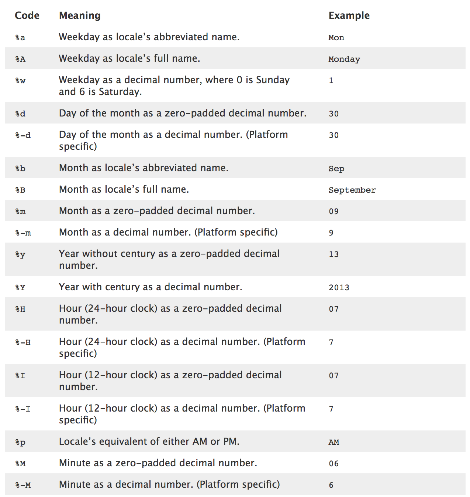

# Understanding Pandas Series and DataFrames

## Introduction

In this lesson, we're digging into Pandas Series and DataFrames - the two main data types you'll work with.

## Objectives
You will be able to:
* Understand and explain what Pandas Series and DataFrames are and how they differ from dictionaries and lists
* Create Series & DataFrames from dictionaries and lists
* Manipulate columns in DataFrames (df.rename, df.drop)
* Manipulate the index in DataFrames (df.reindex, df.drop, df.rename)
* Manipulate column datatypes

## Pandas Data Types vs. Native Python Data Types

As we'll see as we talk more about object orientated programming, using Pandas Series and DataFrames instead of built in Python datatypes can have a range of benefits.  Most importantly is that Series and DataFrames have a range of built in methods which make standard practices and procedures streamlined. This includes many of the methods we have investigated such as groupby, columns and value_counts.

## Setup

Lets take a little time to import the packages we need and to import and previuew a dataset...

## Import pandas and other packages to be used


```python
import pandas as pd
import matplotlib.pyplot as plt
%matplotlib inline
```

## Import and preview a dataset


```python
df = pd.read_csv('turnstile_180901.txt')
print(len(df))
df.head()
```

    197625


<div>
<style>
    .dataframe thead tr:only-child th {
        text-align: right;
    }

    .dataframe thead th {
        text-align: left;
    }

    .dataframe tbody tr th {
        vertical-align: top;
    }
</style>
<table border="1" class="dataframe">
  <thead>
    <tr style="text-align: right;">
      <th></th>
      <th>C/A</th>
      <th>UNIT</th>
      <th>SCP</th>
      <th>STATION</th>
      <th>LINENAME</th>
      <th>DIVISION</th>
      <th>DATE</th>
      <th>TIME</th>
      <th>DESC</th>
      <th>ENTRIES</th>
      <th>EXITS</th>
    </tr>
  </thead>
  <tbody>
    <tr>
      <th>0</th>
      <td>A002</td>
      <td>R051</td>
      <td>02-00-00</td>
      <td>59 ST</td>
      <td>NQR456W</td>
      <td>BMT</td>
      <td>08/25/2018</td>
      <td>00:00:00</td>
      <td>REGULAR</td>
      <td>6736067</td>
      <td>2283184</td>
    </tr>
    <tr>
      <th>1</th>
      <td>A002</td>
      <td>R051</td>
      <td>02-00-00</td>
      <td>59 ST</td>
      <td>NQR456W</td>
      <td>BMT</td>
      <td>08/25/2018</td>
      <td>04:00:00</td>
      <td>REGULAR</td>
      <td>6736087</td>
      <td>2283188</td>
    </tr>
    <tr>
      <th>2</th>
      <td>A002</td>
      <td>R051</td>
      <td>02-00-00</td>
      <td>59 ST</td>
      <td>NQR456W</td>
      <td>BMT</td>
      <td>08/25/2018</td>
      <td>08:00:00</td>
      <td>REGULAR</td>
      <td>6736105</td>
      <td>2283229</td>
    </tr>
    <tr>
      <th>3</th>
      <td>A002</td>
      <td>R051</td>
      <td>02-00-00</td>
      <td>59 ST</td>
      <td>NQR456W</td>
      <td>BMT</td>
      <td>08/25/2018</td>
      <td>12:00:00</td>
      <td>REGULAR</td>
      <td>6736180</td>
      <td>2283314</td>
    </tr>
    <tr>
      <th>4</th>
      <td>A002</td>
      <td>R051</td>
      <td>02-00-00</td>
      <td>59 ST</td>
      <td>NQR456W</td>
      <td>BMT</td>
      <td>08/25/2018</td>
      <td>16:00:00</td>
      <td>REGULAR</td>
      <td>6736349</td>
      <td>2283384</td>
    </tr>
  </tbody>
</table>
</div>


```python
df.info()
```

    <class 'pandas.core.frame.DataFrame'>
    RangeIndex: 197625 entries, 0 to 197624
    Data columns (total 12 columns):
    C/A                                                                     197625 non-null object
    UNIT                                                                    197625 non-null object
    SCP                                                                     197625 non-null object
    STATION                                                                 197625 non-null object
    LINENAME                                                                197625 non-null object
    DIVISION                                                                197625 non-null object
    DATE                                                                    197625 non-null object
    TIME                                                                    197625 non-null object
    DESC                                                                    197625 non-null object
    ENTRIES                                                                 197625 non-null int64
    EXITS                                                                   197625 non-null int64
    On_N_Line                                                               197625 non-null bool
    dtypes: bool(1), int64(2), object(9)
    memory usage: 16.8+ MB


# Data Munging/ Manipulation
This MTA turnstile dataset is a great place for us to get our hands dirty wrangling and cleaning some data! Here's the data dictionary if you want to know more about the data set http://web.mta.info/developers/resources/nyct/turnstile/ts_Field_Description.txt  

Let's start by filtering the data down to all stations for the N line. To do this, we'll need to extract all "N"s from the LINENAME column, or create a column indicating whether or not the stop is an N line stop.

### Defining Functions

At this point, we will need to define some functions to perform data manipulation so that we can reuse them easily. In Python, we define a function using the `def` keyword. Afterwords, we give the function a name, followed by parentheses. Any required (or optional parameters) are specified within the parentheses, just as you would normally call a function. You then specify the functions behavior using a colon and an indendation, much the same way you would a for loop or conditional block. Finally, if you want your function to return something (as with the str.pop() method) as opposed to a function that simply does something in the background but returns nothing (such as list.append()), you must use the `return` keyword. Note that as soon as a function hits a point in execution where something is returned, the function would terminate and no further commands would be executed. In other words the `return` command both returns a value and forces termination of the function.


```python
def contains_n(text):
    if 'N' in text:
        return True
    else:
        return False

#or the shorter, more pythonic:
def contains_n(text):
    bool_val = 'N' in text
    return bool_val
```


```python
df['On_N_Line'] = df.LINENAME.map(contains_n)
df.head(2)
```


<div>
<style scoped>
    .dataframe tbody tr th:only-of-type {
        vertical-align: middle;
    }

    .dataframe tbody tr th {
        vertical-align: top;
    }

    .dataframe thead th {
        text-align: right;
    }
</style>
<table border="1" class="dataframe">
  <thead>
    <tr style="text-align: right;">
      <th></th>
      <th>C/A</th>
      <th>UNIT</th>
      <th>SCP</th>
      <th>STATION</th>
      <th>LINENAME</th>
      <th>DIVISION</th>
      <th>DATE</th>
      <th>TIME</th>
      <th>DESC</th>
      <th>ENTRIES</th>
      <th>EXITS</th>
      <th>On_N_Line</th>
    </tr>
  </thead>
  <tbody>
    <tr>
      <th>0</th>
      <td>A002</td>
      <td>R051</td>
      <td>02-00-00</td>
      <td>59 ST</td>
      <td>NQR456W</td>
      <td>BMT</td>
      <td>08/25/2018</td>
      <td>00:00:00</td>
      <td>REGULAR</td>
      <td>6736067</td>
      <td>2283184</td>
      <td>True</td>
    </tr>
    <tr>
      <th>1</th>
      <td>A002</td>
      <td>R051</td>
      <td>02-00-00</td>
      <td>59 ST</td>
      <td>NQR456W</td>
      <td>BMT</td>
      <td>08/25/2018</td>
      <td>04:00:00</td>
      <td>REGULAR</td>
      <td>6736087</td>
      <td>2283188</td>
      <td>True</td>
    </tr>
  </tbody>
</table>
</div>


```python
df.tail(2)
```


<div>
<style scoped>
    .dataframe tbody tr th:only-of-type {
        vertical-align: middle;
    }

    .dataframe tbody tr th {
        vertical-align: top;
    }

    .dataframe thead th {
        text-align: right;
    }
</style>
<table border="1" class="dataframe">
  <thead>
    <tr style="text-align: right;">
      <th></th>
      <th>C/A</th>
      <th>UNIT</th>
      <th>SCP</th>
      <th>STATION</th>
      <th>LINENAME</th>
      <th>DIVISION</th>
      <th>DATE</th>
      <th>TIME</th>
      <th>DESC</th>
      <th>ENTRIES</th>
      <th>EXITS</th>
      <th>On_N_Line</th>
    </tr>
  </thead>
  <tbody>
    <tr>
      <th>197623</th>
      <td>TRAM2</td>
      <td>R469</td>
      <td>00-05-01</td>
      <td>RIT-ROOSEVELT</td>
      <td>R</td>
      <td>RIT</td>
      <td>08/31/2018</td>
      <td>17:00:00</td>
      <td>REGULAR</td>
      <td>5554</td>
      <td>348</td>
      <td>False</td>
    </tr>
    <tr>
      <th>197624</th>
      <td>TRAM2</td>
      <td>R469</td>
      <td>00-05-01</td>
      <td>RIT-ROOSEVELT</td>
      <td>R</td>
      <td>RIT</td>
      <td>08/31/2018</td>
      <td>21:00:00</td>
      <td>REGULAR</td>
      <td>5554</td>
      <td>348</td>
      <td>False</td>
    </tr>
  </tbody>
</table>
</div>


```python
df.On_N_Line.value_counts(normalize=True)
```


    False    0.870441
    True     0.129559
    Name: On_N_Line, dtype: float64


# Explanation
Above we used the map method for pandas series. This allows us to pass a function that will be applied to each and every data entry within the series. As shorthand, we could also pass a lambda function to determine whether or not each row was on the N line or not.  
`df['On_N_Line'] = df.LINENAME.map(lambda x: 'N' in x)`
This is shorter and equivalent to the above functions defined above. Lambda functions are often more covenient shorthand, but have less functionality then defining functions explicitly.

# Cleaning Column Names
Sometimes, you have messy column names


```python
df.columns
```


    Index(['C/A', 'UNIT', 'SCP', 'STATION', 'LINENAME', 'DIVISION', 'DATE', 'TIME',
           'DESC', 'ENTRIES',
           'EXITS                                                               ',
           'On_N_Line'],
          dtype='object')


You might notice that foolishly, the EXITS column has a lot of annoying whitespace following it.
We can quickly use a list comprehension to clean up all of the column names.

# Reformatting Column Types
Another common data munging technique can be reformating column types. We first previewed column types above using the `df.info()` method, which we'll repeat here.


```python
df.info()
```

    <class 'pandas.core.frame.DataFrame'>
    RangeIndex: 197625 entries, 0 to 197624
    Data columns (total 12 columns):
    C/A                                                                     197625 non-null object
    UNIT                                                                    197625 non-null object
    SCP                                                                     197625 non-null object
    STATION                                                                 197625 non-null object
    LINENAME                                                                197625 non-null object
    DIVISION                                                                197625 non-null object
    DATE                                                                    197625 non-null object
    TIME                                                                    197625 non-null object
    DESC                                                                    197625 non-null object
    ENTRIES                                                                 197625 non-null int64
    EXITS                                                                   197625 non-null int64
    On_N_Line                                                               197625 non-null bool
    dtypes: bool(1), int64(2), object(9)
    memory usage: 16.8+ MB


A common transformation needed is converting numbers stored as text to *float* or *integer* representations. In this cas ENTRIES and EXITS are appropriately *int64*, but to practice, we'll demonstrate changing that to a float and then back to an int.


```python
print(df.ENTRIES.dtype) #We can also check an individual column type rather then all 
df.ENTRIES = df.ENTRIES.astype(float) #Changing the column to float
print(df.ENTRIES.dtype) #Checking our changes
```

    int64
    float64


```python
#Converting Back
print(df.ENTRIES.dtype) 
df.ENTRIES = df.ENTRIES.astype(int)
print(df.ENTRIES.dtype)
```

    float64
    int64


Attempting to convert a string column to int or float will produce errors if there are actually non numeric characters


```python
df.LINENAME = df.LINENAME.astype(int)
```


    ---------------------------------------------------------------------------

    ValueError                                Traceback (most recent call last)

    <ipython-input-15-9635123507d4> in <module>()
    ----> 1 df.LINENAME = df.LINENAME.astype(int)
    

    ~/anaconda3/lib/python3.6/site-packages/pandas/util/_decorators.py in wrapper(*args, **kwargs)
        175                 else:
        176                     kwargs[new_arg_name] = new_arg_value
    --> 177             return func(*args, **kwargs)
        178         return wrapper
        179     return _deprecate_kwarg


    ~/anaconda3/lib/python3.6/site-packages/pandas/core/generic.py in astype(self, dtype, copy, errors, **kwargs)
       4995             # else, only a single dtype is given
       4996             new_data = self._data.astype(dtype=dtype, copy=copy, errors=errors,
    -> 4997                                          **kwargs)
       4998             return self._constructor(new_data).__finalize__(self)
       4999 


    ~/anaconda3/lib/python3.6/site-packages/pandas/core/internals.py in astype(self, dtype, **kwargs)
       3712 
       3713     def astype(self, dtype, **kwargs):
    -> 3714         return self.apply('astype', dtype=dtype, **kwargs)
       3715 
       3716     def convert(self, **kwargs):


    ~/anaconda3/lib/python3.6/site-packages/pandas/core/internals.py in apply(self, f, axes, filter, do_integrity_check, consolidate, **kwargs)
       3579 
       3580             kwargs['mgr'] = self
    -> 3581             applied = getattr(b, f)(**kwargs)
       3582             result_blocks = _extend_blocks(applied, result_blocks)
       3583 


    ~/anaconda3/lib/python3.6/site-packages/pandas/core/internals.py in astype(self, dtype, copy, errors, values, **kwargs)
        573     def astype(self, dtype, copy=False, errors='raise', values=None, **kwargs):
        574         return self._astype(dtype, copy=copy, errors=errors, values=values,
    --> 575                             **kwargs)
        576 
        577     def _astype(self, dtype, copy=False, errors='raise', values=None,


    ~/anaconda3/lib/python3.6/site-packages/pandas/core/internals.py in _astype(self, dtype, copy, errors, values, klass, mgr, **kwargs)
        662 
        663                 # _astype_nansafe works fine with 1-d only
    --> 664                 values = astype_nansafe(values.ravel(), dtype, copy=True)
        665                 values = values.reshape(self.shape)
        666 


    ~/anaconda3/lib/python3.6/site-packages/pandas/core/dtypes/cast.py in astype_nansafe(arr, dtype, copy)
        707         # work around NumPy brokenness, #1987
        708         if np.issubdtype(dtype.type, np.integer):
    --> 709             return lib.astype_intsafe(arr.ravel(), dtype).reshape(arr.shape)
        710 
        711         # if we have a datetime/timedelta array of objects


    pandas/_libs/lib.pyx in pandas._libs.lib.astype_intsafe()


    pandas/_libs/src/util.pxd in util.set_value_at_unsafe()


    ValueError: invalid literal for int() with base 10: 'NQR456W'


# Converting Dates
A slightly more complicated data type transformation is creating *date* or *datetime* objects. These are built in datatypes that have useful information such as being able to quickly calculate the time between two days, or extracting the day of the week from a given date. However, if we look at our current date column, we will notice it is simply a *non-null object* (probably simply text).


```python
df.DATE.dtype
```


    dtype('O')


# pd.to_datetime()
This is the handiest of methods when converting strings to datetime objects.


```python
#Often you can simply pass the series into this method.
pd.to_datetime(df.DATE).head() #It is good practice to preview the results first
#This prevents overwriting data if some error was produced. However everything looks good!
```


    0   2018-08-25
    1   2018-08-25
    2   2018-08-25
    3   2018-08-25
    4   2018-08-25
    Name: DATE, dtype: datetime64[ns]


Sometimes the above won't work and you'll have to explicitly pass how the date is formatted.  
To do that, you have to use some datetime codes. Here's a preview of some of the most common ones:  


To explicitly pass formatting parameters, preview your dates and write the appropriate codes.


```python
df.DATE.iloc[0] #Another method for slicing series/dataframes
```


    '08/25/2018'


```python
#Notice we include delimiters (in this case /) between the codes.
pd.to_datetime(df.DATE, format='%m/%d/%Y').head()
```


    0   2018-08-25
    1   2018-08-25
    2   2018-08-25
    3   2018-08-25
    4   2018-08-25
    Name: DATE, dtype: datetime64[ns]


```python
#Actually apply and save our changes
df.DATE = pd.to_datetime(df.DATE)
print(df.DATE.dtype)
#Preview updated dataframe
df.head(2)
```

    datetime64[ns]


<div>
<style scoped>
    .dataframe tbody tr th:only-of-type {
        vertical-align: middle;
    }

    .dataframe tbody tr th {
        vertical-align: top;
    }

    .dataframe thead th {
        text-align: right;
    }
</style>
<table border="1" class="dataframe">
  <thead>
    <tr style="text-align: right;">
      <th></th>
      <th>C/A</th>
      <th>UNIT</th>
      <th>SCP</th>
      <th>STATION</th>
      <th>LINENAME</th>
      <th>DIVISION</th>
      <th>DATE</th>
      <th>TIME</th>
      <th>DESC</th>
      <th>ENTRIES</th>
      <th>EXITS</th>
      <th>On_N_Line</th>
    </tr>
  </thead>
  <tbody>
    <tr>
      <th>0</th>
      <td>A002</td>
      <td>R051</td>
      <td>02-00-00</td>
      <td>59 ST</td>
      <td>NQR456W</td>
      <td>BMT</td>
      <td>2018-08-25</td>
      <td>00:00:00</td>
      <td>REGULAR</td>
      <td>6736067</td>
      <td>2283184</td>
      <td>True</td>
    </tr>
    <tr>
      <th>1</th>
      <td>A002</td>
      <td>R051</td>
      <td>02-00-00</td>
      <td>59 ST</td>
      <td>NQR456W</td>
      <td>BMT</td>
      <td>2018-08-25</td>
      <td>04:00:00</td>
      <td>REGULAR</td>
      <td>6736087</td>
      <td>2283188</td>
      <td>True</td>
    </tr>
  </tbody>
</table>
</div>


# Datetime Methods
Now that we have converted the DATE field to a datetime object we can use some useful built in methods.


```python
#dt stores all the built in datetime methods (only works for datetime columns)
df.DATE.dt.day_name().head()
```


    0    Saturday
    1    Saturday
    2    Saturday
    3    Saturday
    4    Saturday
    Name: DATE, dtype: object


# Renaming Columns
You can rename columns using dictionaries as follows:


```python
df = df.rename(columns={'DATE' : 'date'})
df.head()
```


<div>
<style>
    .dataframe thead tr:only-child th {
        text-align: right;
    }

    .dataframe thead th {
        text-align: left;
    }

    .dataframe tbody tr th {
        vertical-align: top;
    }
</style>
<table border="1" class="dataframe">
  <thead>
    <tr style="text-align: right;">
      <th></th>
      <th>C/A</th>
      <th>UNIT</th>
      <th>SCP</th>
      <th>STATION</th>
      <th>LINENAME</th>
      <th>DIVISION</th>
      <th>date</th>
      <th>TIME</th>
      <th>DESC</th>
      <th>ENTRIES</th>
      <th>EXITS</th>
    </tr>
  </thead>
  <tbody>
    <tr>
      <th>0</th>
      <td>A002</td>
      <td>R051</td>
      <td>02-00-00</td>
      <td>59 ST</td>
      <td>NQR456W</td>
      <td>BMT</td>
      <td>08/25/2018</td>
      <td>00:00:00</td>
      <td>REGULAR</td>
      <td>6736067</td>
      <td>2283184</td>
    </tr>
    <tr>
      <th>1</th>
      <td>A002</td>
      <td>R051</td>
      <td>02-00-00</td>
      <td>59 ST</td>
      <td>NQR456W</td>
      <td>BMT</td>
      <td>08/25/2018</td>
      <td>04:00:00</td>
      <td>REGULAR</td>
      <td>6736087</td>
      <td>2283188</td>
    </tr>
    <tr>
      <th>2</th>
      <td>A002</td>
      <td>R051</td>
      <td>02-00-00</td>
      <td>59 ST</td>
      <td>NQR456W</td>
      <td>BMT</td>
      <td>08/25/2018</td>
      <td>08:00:00</td>
      <td>REGULAR</td>
      <td>6736105</td>
      <td>2283229</td>
    </tr>
    <tr>
      <th>3</th>
      <td>A002</td>
      <td>R051</td>
      <td>02-00-00</td>
      <td>59 ST</td>
      <td>NQR456W</td>
      <td>BMT</td>
      <td>08/25/2018</td>
      <td>12:00:00</td>
      <td>REGULAR</td>
      <td>6736180</td>
      <td>2283314</td>
    </tr>
    <tr>
      <th>4</th>
      <td>A002</td>
      <td>R051</td>
      <td>02-00-00</td>
      <td>59 ST</td>
      <td>NQR456W</td>
      <td>BMT</td>
      <td>08/25/2018</td>
      <td>16:00:00</td>
      <td>REGULAR</td>
      <td>6736349</td>
      <td>2283384</td>
    </tr>
  </tbody>
</table>
</div>


# Dropping Columns
You can also drop columns


```python
df = df.drop('C/A', axis=1) #If you don't pass the axis=1 parameter, pandas will try and drop a row with the specified index
df.head()
```


<div>
<style>
    .dataframe thead tr:only-child th {
        text-align: right;
    }

    .dataframe thead th {
        text-align: left;
    }

    .dataframe tbody tr th {
        vertical-align: top;
    }
</style>
<table border="1" class="dataframe">
  <thead>
    <tr style="text-align: right;">
      <th></th>
      <th>UNIT</th>
      <th>SCP</th>
      <th>STATION</th>
      <th>LINENAME</th>
      <th>DIVISION</th>
      <th>date</th>
      <th>TIME</th>
      <th>DESC</th>
      <th>ENTRIES</th>
      <th>EXITS</th>
    </tr>
  </thead>
  <tbody>
    <tr>
      <th>0</th>
      <td>R051</td>
      <td>02-00-00</td>
      <td>59 ST</td>
      <td>NQR456W</td>
      <td>BMT</td>
      <td>08/25/2018</td>
      <td>00:00:00</td>
      <td>REGULAR</td>
      <td>6736067</td>
      <td>2283184</td>
    </tr>
    <tr>
      <th>1</th>
      <td>R051</td>
      <td>02-00-00</td>
      <td>59 ST</td>
      <td>NQR456W</td>
      <td>BMT</td>
      <td>08/25/2018</td>
      <td>04:00:00</td>
      <td>REGULAR</td>
      <td>6736087</td>
      <td>2283188</td>
    </tr>
    <tr>
      <th>2</th>
      <td>R051</td>
      <td>02-00-00</td>
      <td>59 ST</td>
      <td>NQR456W</td>
      <td>BMT</td>
      <td>08/25/2018</td>
      <td>08:00:00</td>
      <td>REGULAR</td>
      <td>6736105</td>
      <td>2283229</td>
    </tr>
    <tr>
      <th>3</th>
      <td>R051</td>
      <td>02-00-00</td>
      <td>59 ST</td>
      <td>NQR456W</td>
      <td>BMT</td>
      <td>08/25/2018</td>
      <td>12:00:00</td>
      <td>REGULAR</td>
      <td>6736180</td>
      <td>2283314</td>
    </tr>
    <tr>
      <th>4</th>
      <td>R051</td>
      <td>02-00-00</td>
      <td>59 ST</td>
      <td>NQR456W</td>
      <td>BMT</td>
      <td>08/25/2018</td>
      <td>16:00:00</td>
      <td>REGULAR</td>
      <td>6736349</td>
      <td>2283384</td>
    </tr>
  </tbody>
</table>
</div>


# Setting a New Index
It can also be helpful to set an index such as when graphing.


```python
df = df.set_index('date')
df.head()
```


<div>
<style>
    .dataframe thead tr:only-child th {
        text-align: right;
    }

    .dataframe thead th {
        text-align: left;
    }

    .dataframe tbody tr th {
        vertical-align: top;
    }
</style>
<table border="1" class="dataframe">
  <thead>
    <tr style="text-align: right;">
      <th></th>
      <th>UNIT</th>
      <th>SCP</th>
      <th>STATION</th>
      <th>LINENAME</th>
      <th>DIVISION</th>
      <th>TIME</th>
      <th>DESC</th>
      <th>ENTRIES</th>
      <th>EXITS</th>
    </tr>
    <tr>
      <th>date</th>
      <th></th>
      <th></th>
      <th></th>
      <th></th>
      <th></th>
      <th></th>
      <th></th>
      <th></th>
      <th></th>
    </tr>
  </thead>
  <tbody>
    <tr>
      <th>08/25/2018</th>
      <td>R051</td>
      <td>02-00-00</td>
      <td>59 ST</td>
      <td>NQR456W</td>
      <td>BMT</td>
      <td>00:00:00</td>
      <td>REGULAR</td>
      <td>6736067</td>
      <td>2283184</td>
    </tr>
    <tr>
      <th>08/25/2018</th>
      <td>R051</td>
      <td>02-00-00</td>
      <td>59 ST</td>
      <td>NQR456W</td>
      <td>BMT</td>
      <td>04:00:00</td>
      <td>REGULAR</td>
      <td>6736087</td>
      <td>2283188</td>
    </tr>
    <tr>
      <th>08/25/2018</th>
      <td>R051</td>
      <td>02-00-00</td>
      <td>59 ST</td>
      <td>NQR456W</td>
      <td>BMT</td>
      <td>08:00:00</td>
      <td>REGULAR</td>
      <td>6736105</td>
      <td>2283229</td>
    </tr>
    <tr>
      <th>08/25/2018</th>
      <td>R051</td>
      <td>02-00-00</td>
      <td>59 ST</td>
      <td>NQR456W</td>
      <td>BMT</td>
      <td>12:00:00</td>
      <td>REGULAR</td>
      <td>6736180</td>
      <td>2283314</td>
    </tr>
    <tr>
      <th>08/25/2018</th>
      <td>R051</td>
      <td>02-00-00</td>
      <td>59 ST</td>
      <td>NQR456W</td>
      <td>BMT</td>
      <td>16:00:00</td>
      <td>REGULAR</td>
      <td>6736349</td>
      <td>2283384</td>
    </tr>
  </tbody>
</table>
</div>


# Summary
We've seen in this lesson the differences between Pandas (Series and DataFrames) and Python native (Dictionaries and Lists) data types. We've also looked at how to create the Series and DataFrames from dictionaries and lists, and how to manipulate both columns and the index in DataFrame. 
