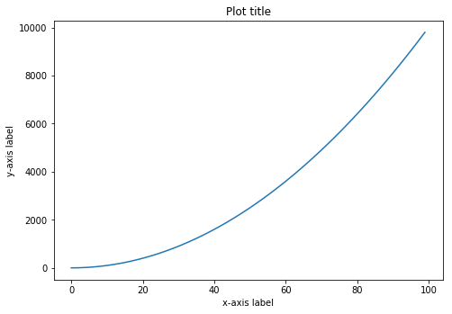
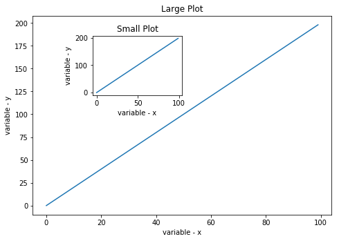
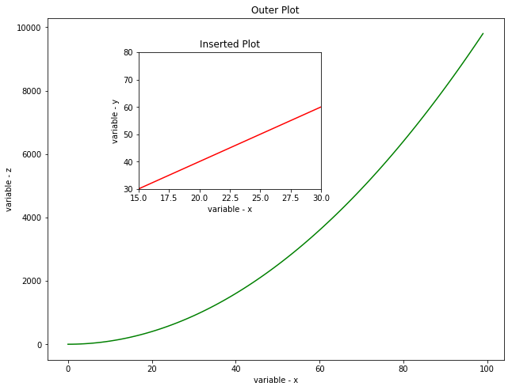
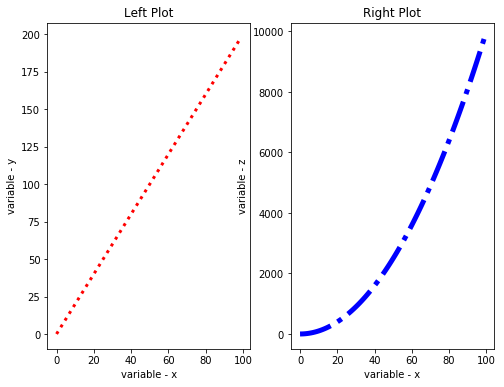
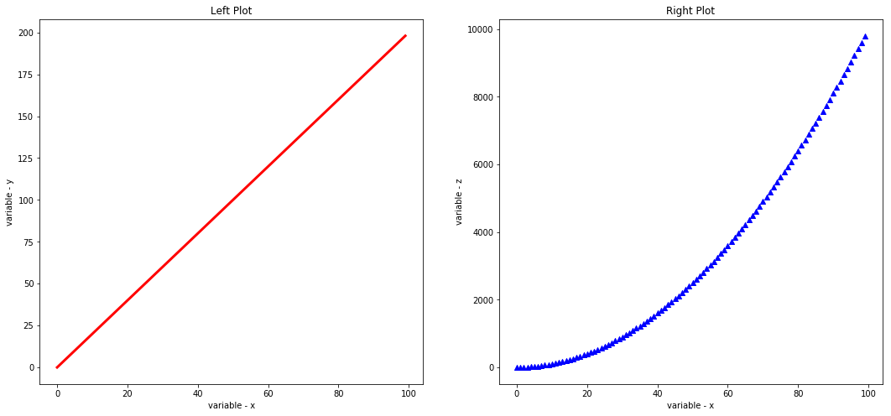

# Customizing Visualizations with Matplotlib - Lab

## Introduction

This lab will give you a chance to practice generating some basic visualizations using the techniques learnt in the previous lesson. 

## Objectives
You will be able to:
* Change styles and attributes for plotting objects in python to allow customisation
* Customize plots with titles, labels and positioning

Let's let's give you a head start by generating some data for you to plot:

We are performing following tasks:


```python
import numpy as np

# Generate a list of numbers from 0 to 99
x = np.arange(0,100)

# Multiply values of x with 2 to get y
y = x*2

# Calculate square of values in for variable z
z = x**2

# Print x, y and z
print (x, y, z)
```

    [ 0  1  2  3  4  5  6  7  8  9 10 11 12 13 14 15 16 17 18 19 20 21 22 23
     24 25 26 27 28 29 30 31 32 33 34 35 36 37 38 39 40 41 42 43 44 45 46 47
     48 49 50 51 52 53 54 55 56 57 58 59 60 61 62 63 64 65 66 67 68 69 70 71
     72 73 74 75 76 77 78 79 80 81 82 83 84 85 86 87 88 89 90 91 92 93 94 95
     96 97 98 99] [  0   2   4   6   8  10  12  14  16  18  20  22  24  26  28  30  32  34
      36  38  40  42  44  46  48  50  52  54  56  58  60  62  64  66  68  70
      72  74  76  78  80  82  84  86  88  90  92  94  96  98 100 102 104 106
     108 110 112 114 116 118 120 122 124 126 128 130 132 134 136 138 140 142
     144 146 148 150 152 154 156 158 160 162 164 166 168 170 172 174 176 178
     180 182 184 186 188 190 192 194 196 198] [   0    1    4    9   16   25   36   49   64   81  100  121  144  169
      196  225  256  289  324  361  400  441  484  529  576  625  676  729
      784  841  900  961 1024 1089 1156 1225 1296 1369 1444 1521 1600 1681
     1764 1849 1936 2025 2116 2209 2304 2401 2500 2601 2704 2809 2916 3025
     3136 3249 3364 3481 3600 3721 3844 3969 4096 4225 4356 4489 4624 4761
     4900 5041 5184 5329 5476 5625 5776 5929 6084 6241 6400 6561 6724 6889
     7056 7225 7396 7569 7744 7921 8100 8281 8464 8649 8836 9025 9216 9409
     9604 9801]


Import `matplotlib.pyplot` as `plt` and set `%matplotlib inline`  for generating inline images in jupyter notebooks. 


```python
# import matplotlib.pyplot and set inline plotting 

```

Now that we have our data all set and matplotlib in our python environment, we can try some basic plotting techniques.

## Exercise 1

Perform the following steps in the cell below:

* Create a new figure object `fig` using `.figure()` function.
* Use `add_axes()` to add an axis `ax` to the canvas at absolute location [0,0,1,1].
* Plot (x,y) on that axes and set the labels and title. 


```python

```





This was easy, let's move on to drawing multiple plots within a figure space. 

## Exercise 2

Perform following actions:

* Create a figure object `fig` and put two axes on it, `ax1` and `ax2`. 
* Set the locations of `ax1` and `ax2` at [0,0,1,1] and [.2,.6,.3,.3] respectively.
* Plot x and y on both axes. 
* Label the axes with variable names and give the plots titles as "Small Plot" and "Large Plot". 


```python

```





## Exercise 3

Perform following tasks in the cell below:

* Create a new figure of size 8 x 6 inches. 
* Create the plot below by adding two absolute axes to the figure object at [0,0,1,1] and [0.2,0.5,.4,.4].

* Use x,y, and z arrays to create:
    * Large plot between x and z. 
    * Small (inserted) plot between x and y. 

* Set the axes range for small plot as 15 - 45 for x-axis, and 30 - 80 for y -axis
* Set the line color for outer and inserted plots as green and red respectively
* Label your axes and give suitable titles to the plot.


```python

```





## Exercise 4

Perform following steps in the cell below:

* Create a figure of size 8x6 inches
* Add two axes using relative subplots to the figure by dividing it in 1 row and 2 columns
* Plot (x,y) and (x,z) on the ax1 and ax2 respectively. 
* Set the line width of first axes to 3, line style as dotted and color it red.
* Set the line width of second axes to5, line style as dash-dot (-.) and color it blue.
* Give the plots some labels and titles


```python

```





## Exercise 5

Above figure looks fine but a bit out of proportion. Let's resize this to make the plots look more appealing by ensuring that subplots are square in shape. Also change the line style of first plot (left) and change the type of 2nd plot (right) to a scatter plot with a `^` marker style.


```python

```





Congratulations, You have now learnt the basics plotting/labelling and customization techniques in matplotlib. Following lessons will focus on employing these techniques to plot for multiple data types in different analysis contexts. 


### Summary :

This lab focused on ensuring that you understand the basics plotting techqniues in matplotlib using plotting objects and functions to draw single plots, multiple/subplots using absolute and relative plotting. You also learnt how to customize the plots with labels, titles and axes definitions. 
