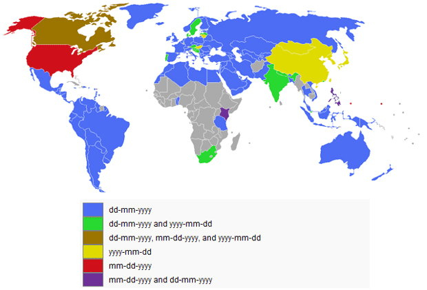

# Lambda Functions - Lab

## Introduction|

In this lab, you'll get some hands on practice creating and using lambda functions.

## Objectives
You will be able to:
* Understand what lambda functions are and why they are useful
* Use lambda functions to transform data within lists and DataFrames

## Lambda Functions


```python
import pandas as pd
df = pd.read_csv('Yelp_Reviews.csv')
df.head(2)
```


<div>
<style>
    .dataframe thead tr:only-child th {
        text-align: right;
    }

    .dataframe thead th {
        text-align: left;
    }

    .dataframe tbody tr th {
        vertical-align: top;
    }
</style>
<table border="1" class="dataframe">
  <thead>
    <tr style="text-align: right;">
      <th></th>
      <th>Unnamed: 0</th>
      <th>business_id</th>
      <th>cool</th>
      <th>date</th>
      <th>funny</th>
      <th>review_id</th>
      <th>stars</th>
      <th>text</th>
      <th>useful</th>
      <th>user_id</th>
    </tr>
  </thead>
  <tbody>
    <tr>
      <th>0</th>
      <td>1</td>
      <td>pomGBqfbxcqPv14c3XH-ZQ</td>
      <td>0</td>
      <td>2012-11-13</td>
      <td>0</td>
      <td>dDl8zu1vWPdKGihJrwQbpw</td>
      <td>5</td>
      <td>I love this place! My fiance And I go here atl...</td>
      <td>0</td>
      <td>msQe1u7Z_XuqjGoqhB0J5g</td>
    </tr>
    <tr>
      <th>1</th>
      <td>2</td>
      <td>jtQARsP6P-LbkyjbO1qNGg</td>
      <td>1</td>
      <td>2014-10-23</td>
      <td>1</td>
      <td>LZp4UX5zK3e-c5ZGSeo3kA</td>
      <td>1</td>
      <td>Terrible. Dry corn bread. Rib tips were all fa...</td>
      <td>3</td>
      <td>msQe1u7Z_XuqjGoqhB0J5g</td>
    </tr>
  </tbody>
</table>
</div>


# Simple Arithmetic

Use a lambda function to create a new column called 'stars_squared' by squarring the stars column.


```python
#Your code here
```

# Dates
Select the month from the date string using a lambda function.


```python
# Your code here
```

# What is the average number of words for a yelp review?
Do this with a single line of code!


```python
# Your code here
```

# Create a new column for the number of words in the review.


```python
#Your code here
```

## Rewrite the following as a lamda function. Create a new column 'Review_Length'


```python
def rewrite_as_lambda(value):
    if len(value) < 50:
        return 'Short'
    elif len(value) < 80:
        return 'Medium'
    else:
        return 'Long'
#Hint: nest your if, else conditionals
```


```python
#Your code here
```

# Level Up: Dates Adavanced!
  

Overwrite the date column by reordering the month and day from YYYY-MM-DD to DD-MM-YYYY. Try to do this using a lambda function.


```python
#Your code here
```

## Summary

Great! Hopefully you're getting the hang of lambda functions now! It's important not to overuse them - it will often make more sense to define a function so that it's reusable elsewhere. But whenever you need to quickly apply some simple processing to a collection of data you have a new technique that will help you to do just that. It'll also be useful if you're reading someone elses code that happens to use lambdas.
