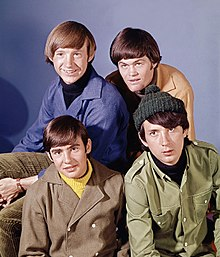

# Inheritance


## Introduction

In this lesson, we'll learn about how we can use inheritance to create relationships between **_Superclasses_** and **_Subclasses_** to save us from writing redundant code!

## Objectives

You will be able to:

* Use inheritance to to write D.R.Y. code 
* Understand the relationship between subclasses and superclasses
* Create Object-Oriented data models that describe the real world with classes and subclasses

## Writing D.R.Y. Code

Let's assume for a second that we are going to build a data model around the most popular band of the last century, the Beatles!


<center>**_John, Paul, George, and Ringo, shortly before recording their
    breakout hit, "Hey Hey We're the Monkees"_**</center>
    
    
Using the skills we've learned so far, we could absolutely create classes for each of the different roles in the band.  If we created a class for each different musician, it would probably look something like this:

```python
class Drummer(object):
    
    def __init__(self):
        self.name = "Ringo"
        self.role = "Drummer"
    
    def tune_instrument(self):
        #some code
        pass
    
    def practice(self):
        # some code
        pass
    
    def perform(self):
        #some code
        pass
    
class Singer(object):
    
    def __init__(self):
        self.name = "John"
        self.role = "Singer"
        
    def tune_instrument(self):
        #some code
        pass
    
    def practice(self):
        # some code
        pass
    
    def perform(self):
        #some code
        pass
    
# Class Guitarist code...

# Class Bass_Guitarist code...
```

If you're thinking about what it would be like to write this code, the first thing you'll notice is probably that there's a lot of redundant code that you can fill in using copy and paste.  If this makes you nervous, it should--copying and pasting is usually a sign that your program can be improved.  After all, good programmers are lazy!

> “I will always choose a lazy person to do a hard job. Because a lazy person will find an easy way to do it.” - Bill Gates

Good programmers try to follow the D.R.Y. rule, which stands for **_Don't Repeat Yourself!_** In the example above, we find ourselves having to type the same lines of code over and over again--the attributes in each class, the same method names (even though the bodies of the functions will likely be different), again and again.  This violates our D.R.Y. rule! Luckily, we can restructure our code in an intelligent way that will allow us to accomplish the same thing without repeating anything by using **_Inheritance_**!


## Our First Subclass

The `Guitarist` class and the `Bass_Guitarist` class are extremely similar.  In fact, we could say that Bass Guitarists are a special case of Guitarists.  With a few notable exceptions, the `Bass_Guitarist` class is generally going to be more similar than different to the `Guitarist` class.  

In python, we can make `Bass_Guitarist` a **_subclass_** of `Guitarist`.  This will mean that the `Bass_Guitarist` class will **_Inherit_** the attributes and methods of its superclass, `Guitarist`.  This will save us a lot of redundant code!

See the example in the cell below. 


```python
class Guitarist(object):
    
    def __init__(self):
        self.name = "George"
        self.role = "Guitarist"
        self.instrument_type = "Stringed Instrument"
        
    def tune_instrument(self):
        print("Tune the strings!")
        
    def practice(self):
        print("Strumming the old 6 string!")
        
    def perform(self):
        print("Hello, New  York!")
        
class Bass_Guitarist(Guitarist):
    
    def __init__(self):
        super().__init__()
        self.name = "Paul"
        self.role = "Guitarist"
        
    def practice(self):
        print("I play the Seinfeld Theme Song when I get bored")
        
    def perform(self):
        super().perform()
        print("Thanks for coming out!")
```


```python
george = Guitarist()
paul = Bass_Guitarist()
```


```python
print(george.instrument_type)
print(paul.instrument_type)
```

    Stringed Instrument
    Stringed Instrument


```python
george.tune_instrument()
paul.tune_instrument()
```

    Tune the strings!
    Tune the strings!


```python
george.practice()
paul.practice()
```

    Strumming the old 6 string!
    I play the Seinfeld Theme Song when I get bored


```python
george.perform()
paul.perform()
```

    Hello, New  York!
    Hello, New  York!
    Thanks for coming out!


Take a look at the way the classes were created, and the corresponding outputs in the cells above.  A couple things stand out:

1.  We never declared a `perform()` method for class `Bass_Guitarist`, but our `george` instance still has access to this method.  
<br>  
1.  We never set a value for the `instrument_type` attribute in class `Bass_Guitarist`, but our instance, `george`, has that attribute, and the attribute has the same value as it had in the `Guitarist` class. This is because we called the `super().__init__()` method first.  
<br>  
1. We were able to change/overwrite the things that were different in `Bass_Guitarist` class, such as the behavior of the `practice` and `perform` methods, as well as the values for the `name` and `role` attributes.

### Using `.super()`

The `super()` method gives us access to the superclass of the object that calls `super()`.  In this case, we accessed `super()` to call its constructor method, `__init__()` to initialize the object just as if we were creating a new `guitar` object.  Then, we modified the attributes as needed.  Although we did not do it in this example, it is worth noting that we can also add attributes and methods to a subclass that a superclass does not have.  For instance, if we added the attribute `self.string_type = "bass"` inside the `Bass_Guitarist.__init__()` method, all bass guitarist objects would have that attribute, but guitarist objects would not.  Conversely, any changes that we make to the superclass `guitarist` will always be reflected in the subclass `Bass_Guitarist`. 


### Changing Values and Methods 

Note that in both of these classes, we have methods named `practice` with have the same name, but different behaviors. This is an example of **_Polymorphism_**, meaning that we can have methods that have the same name, but contain different code inside their bodies.  This is not a naming collision because these functions exist attached to different classes.  

Also take note of the way the `perform` method is written inside of `Bass_Guitarist`. If we want a method in a subclass to do everything that method does in a superclass and *then* do something else, we can accomplish this by simply calling the superclass's version of the method by accessing it with `super()` and then adding any remaining behavior afterwards in the body of the function. 

### Accessing Methods

Note that by default, subclasses have access to all methods contained in a superclass. Because they are a subclass, they can automatically do the same things as the corresponding superclass.   Note that we do not need to declare the functions in the body of the subclass to have access to them--we did not mention the method `tune_instrument` at all, but `paul` still has access to the exact same `tune_instrument` method as `george`.  We only declare methods that are mentioned in the superclass if we want to override their behavior in the subclass.  

## Abstract Superclasses

When we make use of a subclass and a superclass, we are defining levels of **_Abstraction_**.  In this case, the superclass `Guitarist` is one level of abstraction higher than the subclass `Bass_Guitarist`.  Intuitively, this makes sense--bass guitarists are a kind of guitarist, but ~~thankfully~~ not all guitarists are bass guitarists.

However, it's worth noting that we can always go a level of abstraction higher by defining a class that is more vague, but still captures the common thread amongst the subclasses. We'll demonstrate this with the following example:

At first glance, it may seem that guitarists, singers, and drummers don't have enough in common with each other to make use of inheritance--a drummer is not a type of singer, etc.  However, one thing they all have in common is they are all a type of `Musician`.  No matter what sort of musician you are, you:

* Have a `name`
* Have an `instrument`
* Know how to `tune_instrument`
* Can `practice` and `perform`

In this way, we can write a single superclass that we can use for all of the subclasses in our band: `Drummer`, `Guitarist`, `Bass_Guitarist`, and `Singer` are all types of musicians!

This is called an **_Abstract Superclass_** because the superclass we're using is at a level of abstraction where it does not make sense for it to exist on its own.  For example, it makes sense to instantiate drummers, singers, and guitarists--they are members of a band, and by playing these instruments, they are musicians.  However, you cannot be a `musician` without belonging to one of these subclasses--there is no such thing as a musician that doesnt play any instruments or sing!  It makes no sense to instantiate a `Musician`, because they don't really exist in the real world--we only create this **_Abstract Superclass_** to define the commonalities between our subclasses and save ourselves some redundant code!

### Creating The Beatles Using an Abstract Superclass

In the cell below, we'll model the Beatles by making use of the abstract superclass `Musician`, and then subclassing it when we create `Drummer`, `Singer`, and `Guitarist`.  Note that since we can have multiple layers of abstraction, we'll still keep `Bass_Guitarist` as a subclass of `Guitarist`.


```python
class Musician(object):
    
    def __init__(self, name): # We'll set name at instantiation time to demonstrate passing in arguments to super().__init__()
        self.name = name
        self.band = "The Beatles"
    
    def tune_instrument(self):
        print("Tuning Instrument!")
    
    def practice(self):
        print("Practicing!")
        
    def perform(self):
        print("Hello New York!")
        
class Singer(Musician):
    
    def __init__(self, name):
        super().__init__(name)  # Notice how we pass in name argument from init to the super().__init() method, because it expects it
        self.role = "Singer"
        
    def tune_instrument(self):
        print("No tuning needed--I'm a singer!")
    
class Guitarist(Musician):
    
    def __init__(self, name):
        super().__init__(name)
        self.role = "Guitarist"
        
    def practice(self):
        print("Strumming the old 6 string!")
        
class Bass_Guitarist(Guitarist):
    
    def __init__(self, name):
        super().__init__(name)
        self.role = "Bass Guitarist"
        
    def practice(self):
        print("I play the Seinfeld Theme Song when I get bored")
        
    def perform(self):
        super().perform()
        print("Thanks for coming out!")
        
class Drummer(Musician):
    
    def __init__(self, name):
        super().__init__(name)
        self.role = "Drummer"
        
    def tune_instrument(self):
        print('Where did I put those drum sticks?')
        
    def practice(self):
        print('Why does my chair still say "Pete Best"?')
```


```python
john = Singer("John Lennon")
paul = Bass_Guitarist("Paul McCartney")
ringo = Drummer("Ringo Starr")
george = Guitarist("George Harrison")

the_beatles = [john, ringo, george, paul]
```


```python
for musician in the_beatles:
    print("{} is the {}!".format(musician.name, musician.role))
```

    John Lennon is the Singer!
    Ringo Starr is the Drummer!
    George Harrison is the Guitarist!
    Paul McCartney is the Bass Guitarist!


```python
for musician in the_beatles:
    musician.tune_instrument()
```

    No tuning needed--I'm a singer!
    Where did I put those drum sticks?
    Tuning Instrument!
    Tuning Instrument!


```python
for musician in the_beatles:
    musician.practice()
```

    Practicing!
    Why does my chair still say "Pete Best"?
    Strumming the old 6 string!
    I play the Seinfeld Theme Song when I get bored


```python
for musician in the_beatles:
    musician.perform()
```

    Hello New York!
    Hello New York!
    Hello New York!
    Hello New York!
    Thanks for coming out!


## Summary

In this lab, you learned how to:

* Use inheritance to to write D.R.Y. code 
* Understand the relationship between subclasses and superclasses
* Create Object-Oriented data models that describe the real world with classes and subclasses
