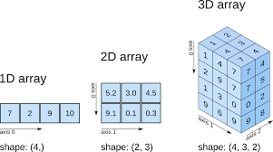

# Getting Started with NumPy

## Introduction

NumPy is one of the main libraries for performing scientific computing in Python. Using NumPy, you can create high-performance multi-dimensional arrays, and several tools to work with these arrays. 

A numpy array can store a grid of values. All the values must be of the same type. numpy arrays are n-dimensional, and the number of dimensions is denoted the *rank* of the numpy array. The shape of an array is a tuple of integers which hold the size of the array along each of the dimensions.

For more information on NumPy, we refer to http://www.numpy.org/.


## Objectives

You will be able to:

* Understand how to initialize NumPy arrays from nested Python lists, and access elements using square brackets
* Understand the shape attribute on NumPy arrays
* Understand how to create arrays from scratch including np.zeros, np.ones, np.full
* Learn to perform scalar and vector math  

## NumPy array creation and basic operations

First, remember how the naming for NumPy is to import it as `np`.


```python
import numpy as np
```

One easy way to create a numpy array is from a python list. The two are similar in a number of manners but NumPy is optimized in a number of ways for performing mathematical operations, including having a number of built in methods that will be extraordinarily useful.


```python
x = np.array([1,2,3])
print(type(x))
```

    <class 'numpy.ndarray'>


## Broadcasting Mathematical Operations

Notice right off the bat how basic mathematical operations will be applied element wise in a NumPy array versus a literal interpretation with a python list:


```python
x * 3 #multiplies each element by 3
```


    array([3, 6, 9])


```python
[1,2,3] * 3 #returns the list 3 times
```


    [1, 2, 3, 1, 2, 3, 1, 2, 3]


```python
x + 2 #Adds two to each element
```


    array([3, 4, 5])


```python
[1,2,3] + 2 # Returns an error; different data types
```


    ---------------------------------------------------------------------------

    TypeError                                 Traceback (most recent call last)

    <ipython-input-6-b531f5f7b60f> in <module>()
    ----> 1 [1,2,3] + 2 # Returns an error; different data types
    

    TypeError: can only concatenate list (not "int") to list


## Even more math!

### Scalar Math

* np.add(arr,1) | Add 1 to each array element
* np.subtract(arr,2) | Subtract 2 from each array element
* np.multiply(arr,3) | Multiply each array element by 3
* np.divide(arr,4) | Divide each array element by 4 (returns np.nan for division by zero)
* np.power(arr,5) | Raise each array element to the 5th power  
  
### Vector Math

* np.add(arr1,arr2) | Elementwise add arr2 to arr1
* np.subtract(arr1,arr2) | Elementwise subtract arr2 from arr1
* np.multiply(arr1,arr2) | Elementwise multiply arr1 by arr2
* np.divide(arr1,arr2) | Elementwise divide arr1 by arr2
* np.power(arr1,arr2) | Elementwise raise arr1 raised to the power of arr2
* np.array_equal(arr1,arr2) | Returns True if the arrays have the same elements and shape
* np.sqrt(arr) | Square root of each element in the array
* np.sin(arr) | Sine of each element in the array
* np.log(arr) | Natural log of each element in the array
* np.abs(arr) | Absolute value of each element in the array
* np.ceil(arr) | Rounds up to the nearest int
* np.floor(arr) | Rounds down to the nearest int
* np.round(arr) | Rounds to the nearest int

#### Here's a few more examples from the list above


```python
[1,2,3] + [4,5,6] #Adding raw lists is just appending
```


    [1, 2, 3, 4, 5, 6]


```python
np.array([1,2,3]) + np.array([4,5,6]) #Adds elements
```


    array([5, 7, 9])


```python
#Same as above with built in method
x = np.array([1,2,3])
y = np.array([4,5,6])
np.add(x,y)
```


    array([5, 7, 9])


## Multidimensional Arrays
NumPy arrays are also very useful for storing multidimensional data such as matrices. Notice how NumPy tries to nicely allign the elements.


```python
#An ordinary nested list
y = [[1,2], [3,4]]
print(type(y))
y
```

    <class 'list'>


    [[1, 2], [3, 4]]


```python
#Reformatted as a NumPy array
y = np.array([[1,2], [3,4]])
print(type(y))
y
```

    <class 'numpy.ndarray'>


    array([[1, 2],
           [3, 4]])


## The Shape Attribute
One of the most important attributes to understand with this is the shape of a NumPy array.


```python
y.shape
```


    (2, 2)


```python
y = np.array([[1,2,3],[4,5,6]])
print(y.shape)
y
```

    (2, 3)


    array([[1, 2, 3],
           [4, 5, 6]])


```python
y = np.array([[1,2],[3,4],[5,6]])
print(y.shape)
y
```

    (3, 2)


    array([[1, 2],
           [3, 4],
           [5, 6]])


### We can also have higher dimensional data such as working with 3 dimensional data



```python
y = np.array([[[1,2],[3,4],[5,6]],
             [[1,2],[3,4],[5,6]]
             ])
print(y.shape)
y
```

    (2, 3, 2)


    array([[[1, 2],
            [3, 4],
            [5, 6]],
    
           [[1, 2],
            [3, 4],
            [5, 6]]])


## Built in Methods for Creating Arrays
NumPy also has several built in methods for creating arrays that are useful in practice. In particular these methods are particularly useful:
* np.zeros(shape) 
* np.ones(shape)
* np.full(shape, fill)


```python
np.zeros(5) #one dimensional; 5 elements
```


    array([0., 0., 0., 0., 0.])


```python
np.zeros([2,2]) #two dimensional; 2x2 matrix
```


    array([[0., 0.],
           [0., 0.]])


```python
np.zeros([3,5]) #2 dimensional;  3x5 matrix
```


    array([[0., 0., 0., 0., 0.],
           [0., 0., 0., 0., 0.],
           [0., 0., 0., 0., 0.]])


```python
np.zeros([3,4,5]) #3 dimensional; 3 4x5 matrices
```


    array([[[0., 0., 0., 0., 0.],
            [0., 0., 0., 0., 0.],
            [0., 0., 0., 0., 0.],
            [0., 0., 0., 0., 0.]],
    
           [[0., 0., 0., 0., 0.],
            [0., 0., 0., 0., 0.],
            [0., 0., 0., 0., 0.],
            [0., 0., 0., 0., 0.]],
    
           [[0., 0., 0., 0., 0.],
            [0., 0., 0., 0., 0.],
            [0., 0., 0., 0., 0.],
            [0., 0., 0., 0., 0.]]])


### Similarly the np.ones() method returns an array of ones


```python
np.ones(5)
```


    array([1., 1., 1., 1., 1.])


```python
np.ones([3,4])
```


    array([[1., 1., 1., 1.],
           [1., 1., 1., 1.],
           [1., 1., 1., 1.]])


### The np.full() method allows you to create an array of arbitrary values


```python
np.full(5, 3) #Create a 1d array with 5 elements, all of which are 3
```


    array([3, 3, 3, 3, 3])


```python
np.full(5, range(5)) #Create a 1d array with 5 elements, filling them with the values 0 to 4
```


    array([0, 1, 2, 3, 4])


```python
#Sadly this trick won't work for multidimensional arrays
np.full([2,5], range(10))
```


    ---------------------------------------------------------------------------

    ValueError                                Traceback (most recent call last)

    <ipython-input-24-4dfd668a5ec0> in <module>()
          1 #Sadly this trick won't work for multidimensional arrays
    ----> 2 np.full([2,5], range(10))
    

    ~/anaconda3/lib/python3.6/site-packages/numpy/core/numeric.py in full(shape, fill_value, dtype, order)
        297         dtype = array(fill_value).dtype
        298     a = empty(shape, dtype, order)
    --> 299     multiarray.copyto(a, fill_value, casting='unsafe')
        300     return a
        301 


    ValueError: could not broadcast input array from shape (10) into shape (2,5)


```python
np.full([2,5], np.pi) #NumPy also has useful built in mathematical numbers
```


    array([[3.14159265, 3.14159265, 3.14159265, 3.14159265, 3.14159265],
           [3.14159265, 3.14159265, 3.14159265, 3.14159265, 3.14159265]])


## Numpy array subsetting

You can subset NumPy arrays very similar to list slicing in python.


```python
x = np.array([[1,2,3], [4,5,6], [7,8,9], [10,11,12]])
print(x.shape)
x
```

    (4, 3)


    array([[ 1,  2,  3],
           [ 4,  5,  6],
           [ 7,  8,  9],
           [10, 11, 12]])


```python
x[0] #Retrieving the first row
```


    array([1, 2, 3])


```python
x[1:] #Retrieving all rows after the first row
```


    array([[ 4,  5,  6],
           [ 7,  8,  9],
           [10, 11, 12]])


### This becomes particularly useful in multidimensional arrays when we can slice on multiple dimensions


```python
#x[slice_dim1, slice_dim2]
x[:,0] #All rows, column 0
```


    array([ 1,  4,  7, 10])


```python
x[2:4,1:3] #Rows 2 through 4, columns 1 through 3
```


    array([[ 8,  9],
           [11, 12]])


### Notice that you can't slice in multiple dimensions naturally with built in lists


```python
x = [[1,2,3], [4,5,6], [7,8,9], [10,11,12]]
x

```


    [[1, 2, 3], [4, 5, 6], [7, 8, 9], [10, 11, 12]]


```python
x[0]
```


    [1, 2, 3]


```python
x[:,0]
```


    ---------------------------------------------------------------------------

    TypeError                                 Traceback (most recent call last)

    <ipython-input-33-879a04ce8a40> in <module>()
    ----> 1 x[:,0]
    

    TypeError: list indices must be integers or slices, not tuple


```python
#To slice along a second dimension with lists we must verbosely use a list comprehension
[i[0] for i in x]
```


    [1, 4, 7, 10]


```python
#Doing this in multiple dimensions with lists
[i[1:3] for i in x[2:4]]
```


    [[8, 9], [11, 12]]


### 3D Slicing


```python
#With an array
x = np.array([
              [[1,2,3], [4,5,6]],
              [[7,8,9], [10,11,12]]
             ])
x
```


    array([[[ 1,  2,  3],
            [ 4,  5,  6]],
    
           [[ 7,  8,  9],
            [10, 11, 12]]])


```python
x.shape
```


    (2, 2, 3)


```python
x[:,:,-1]
```


    array([[ 3,  6],
           [ 9, 12]])


## Summary

Great! You learned about a bunch of NumPy commands. Now, let's move over to the lab to put your new skills into practice!
