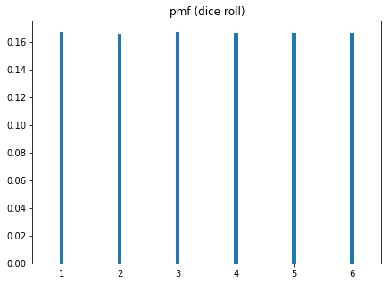
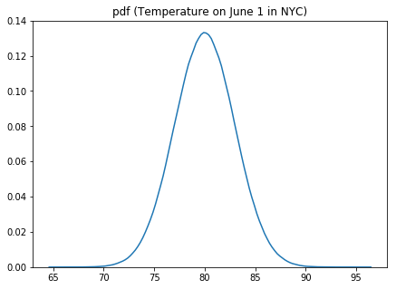
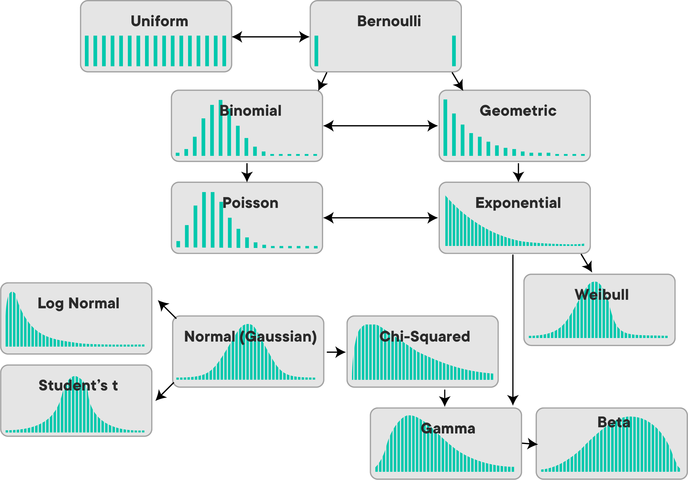

# Statistical Distributions and Their Use Cases

## Introduction

As a data scientist, you'll often have to work with statistical distributions.  This includes selecting which distribution is most representative of a given set of data. A typical use case includes A/B testing, where understanding the process that generated the data is important. You can think of distributions in relation to statistical analysis as to data structures to computer programming.

There are an enormous amount of distributions out there, but you'll see about a handful of distributions that can represent the vast majority of situations you'll come across. In the upcoming series of lessons, you'll look at ways to analyze common distributions you will encounter most frequently.

## Objectives

You will be able to:

* Understand the concept of statistical distributions
* Differentiate between discrete and continuous distributions
* Understand commonly used distributions and their use cases

## What is a Statistical Distribution?

A statistical distribution is a representation of the frequencies of potential events or the percentage of time each event occurs.

This may feel pretty vague which is why we'll use two examples to clarify this concept.

### Rolling a Dice Distribution
Let's think back about our example rolling a dice. You know that when rolling dice once, you will obtain a number between 1 and 6, with each outcome to be as likely, as denoted in this table:

| outcome     | 1   | 2   | 3   | 4   | 5   | 6   |
|-------------|-----|-----|-----|-----|-----|-----|
| probability | 1/6 | 1/6 | 1/6 | 1/6 | 1/6 | 1/6 |

You can also represent this graphically as follows:

Note how, with a fair coin, the chance of throwing each number is _exactly_ 1/6 (or 0.1666). The number of outcomes is finite and the outcome is a set of values. In this case, you are dealing with a **discrete distribution**.

### Weather Distribution

Let's look at another situation. Imagine we want to think of the distribution of the temperature in New York on June 1st. Thinking about this, you could say that the temperature would generally range between 65 and 95 Degrees (more extreme values would be exceptional), with the average around 80 Degrees Fahrenheit.

A potential distribution looks like this:

Note that instead of bars, which we had for the dice example, we have _continuous_ lines here. Our distribution is a **continuous distribution**, because temperature is a continuous value (we can have a temperature of 80 degrees, of 80.5 degrees, of 80.0034 degrees, etc.).

### Discrete vs Continuous Distributions

When dealing with **discrete** data you use a **Probability Mass Function (PMF)** (as in our dice example). When dealing with **continuous** data, you use a **Probability Density Function (PDF)** (see our weather example).

Based on the variation of their attributes, data distributions can take many shapes and forms. In the next few lessons, you'll learn how to describe data distributions. Very often, distributions are described using their statistical mean (or **expected value**) and variance of the data, but this is not always the case. You'll see more on this in the next few lessons.

## Common Distributions

In this image, you can see the general shapes of some common distributions. The horizontal axis in each chart represents the set of possible numeric outcomes. The vertical axis describes the probability of the respective outcomes.

You'll get a more in-depth overview of some important distributions in the next few lessons, but to give you an initial idea of some applications, we give you a quick overview below.
Let's quickly talk about some common distributions and their use cases below:

## Examples of Discrete Distributions

### The Bernoulli Distribution 

The Bernoulli distribution represents the probability of success for a certain experiment (the outcome being "success or not", so there are two possible outcomes). A coin toss is a classic example of a Bernoulli experiment with a probability of success 0.5 or 50%, but a Bernoulli experiment can have any probability of success between 0 and 1.

### The Poisson Distribution

The Poisson distribution represents the probability of $n$ events in a given time period when the overall rate of occurrence is constant. A typical example is pieces of mail. If your overall mail received is constant, the number of items received on a single day (or month) follows a Poisson distribution. Other examples might include visitors arriving on a website, or customers arrive at a store, or clients waiting to be served in a queue.

### The Uniform Distribution

The uniform distribution occurs when all possible outcomes are equally likely. The dice example shown before follows a uniform distribution with equal probabilities for throwing values from 1 to 6. The dice example follows a discrete uniform distribution, but continuous uniform distributions exist as well.

## Examples of Continuous Distributions

### The Normal or Gaussian distribution

A normal distribution is the single most important distribution, you'll basically come across it very often. The normal distribution follows a bell shape and is a foundational distribution for many models and theories in statistics and data science. A normal distribution turns up very often when dealing with real world data including heights, weights of different people, errors in some measurement or marks on a test. Our temperature example above follows a normal distribution as well!

## Summary

In this lesson, you learned about the concept of (discrete and continuous) statistical distributions, as well as some common ones. You'll learn more about distributions and their properties in the next few lessons! 
