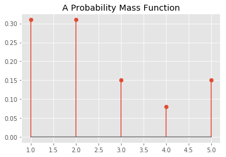

# The Probability Mass Function (PMF)

## Introduction
In this lesson we shall look at another way to represent a distribution - a probability mass function (pmf), which maps from each value to its probability. Recall that PMFs are exclusive to discrete data. We'll investigate a similar concept, the probability density function (PDF) in future lessons.

## Objectives
You will be able to: 
* Develop a mathematical understanding of a discrete variable pmf
* Develop an intuition for pmf while working with a toy example
* Visualize the probability mass function and describe its relationship with histograms

## What is pmf ?

A probability mass function (pmf), sometimes also called just a frequency function gives us probabilities for discrete random variables. We already know that discrete random variables from examples like coin flips and dice rolls etc. The **discrete** part in discrete distributions means that there is a known number of possible outcomes. For example, you can only roll a 1,2,3,4,5, or 6 on a die. **Based on our observations** of all the values from 1 to 6 in a number of dice rolls, we can develop a pmf for the dice showing the probability of each possible value occurring. 

Here is a more formal understanding:

> There is a probability that a discrete random variable X takes on a particular value x, so that P(X = x), denoted as f(x). The function f(x) is typically called the probability mass function, or pmf. 

If X is a discrete random variable then its range R<sub>X</sub> is a countable set of all possible values of X. We can list the elements in $R_x$ as:

$R_x = { x1,x2,x3,... }$

where $x1,x2,x3 ...$ are the possible values of $x$. We are interested in quantifying the probability that x is equal to some given quantity k. That is, we want to know $P(k)$. In the case of our die, we might be interested in the probability  of getting a 3 which would be $P(3) = 1/6$

Think of the event A , such that  A = { X = x<sub>k</sub> } is defined as the set of outcomes s in the sample space S for which the corresponding value of X is equal to x<sub>k</sub>.  This can be written as:

> A = { s ∈ S | X(s) = x<sub>k</sub> }

The probabilities of events **{ X = x<sub>k</sub> }** are formally shown by the probability mass function (pmf) of X.

Thus, the pmf is a probability measure that gives us probabilities of the possible values for a random variable. 


## PMF Intuition

At this stage, some of us may not be able to translate the mathematics above into an intuition. So let's work through a brief example calculating the pmf for a variable. 

We have seen previously that **probability** is a number in the range [0,1] that is calculated as *frequency expressed as a fraction of the sample size.* So this would mean that in order to convert and random variable's frequency into a probability, we need to perform following steps:

* Get the frequency of each possible value in the dataset
* Divide the frequency of each value by the total number of values (length of dataset)
* Get the probability of for each value

Let's show this using a simple toy example:


```python
# Count the frequency of values in a given dataset

import collections
x = [1,1,1,1,2,2,2,2,3,3,4,5,5]
counter = collections.Counter(x)
print(counter)
print (len(x))

```

    Counter({1: 4, 2: 4, 3: 2, 5: 2, 4: 1})
    13


So now we have a dictionary that contains keys showing all possible items, and values of these keys set to the frequency of items. We can simply calculate pmf using step 2 above. 


```python
# Convert frequency to probability - divide each frequency value by total number of values
pmf = []
for key,val in counter.items():
    pmf.append(round(val/len(x), 2))
    
print(counter.keys(), pmf)

```

    dict_keys([1, 2, 3, 4, 5]) [0.31, 0.31, 0.15, 0.08, 0.15]


The pmf is normalized so total probability is 1 as we can check by adding all the values in the pmf list above. 


```python
import numpy as np
```


```python
np.array(pmf).sum()
```


    1.0


## Visualizing pmf

We can inspect pmf of a discrete variable by visualizing it in matplotlib. For this, we can use a simple bar graph to show the pmf using the probabilities calculated above. Here's the code:


```python
import matplotlib.pyplot as plt
%matplotlib inline
plt.style.use('ggplot')

plt.stem(counter.keys(), pmf);
plt.title ("A Probability Mass Function");
```





This looks pretty familiar. Its essentially just a normalized histogram.


```python
plt.hist(x);
plt.title('Histogram');
```


If you look carefully, the difference is only there in the y-axis. A histogram shows the frequency count of each value in a dataset, whereas a pmf, being a probability function shows the data as probabilities. And this is where we started off from. A pmf ingests frequencies of values and convert them into a function of their probability of occurance of those values. 

**NOTE**: In some literature, the pmf is also called just the **probability distribution**. The phrase distribution function is usually reserved exclusively for the cumulative distribution function CDF. 


## Summary

In this lesson we looked at probability mass function, and how to get a list of probabilities for each possible value in a discrete random variable, by looking at their frequency of occurring. So we bassically moved from a purely frequenstist domain to a more probabilistic domain with these pmfs. Moving on, we'll see another couple of such probabilistic functions for discrete and continuous variables. 
