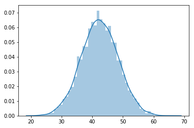
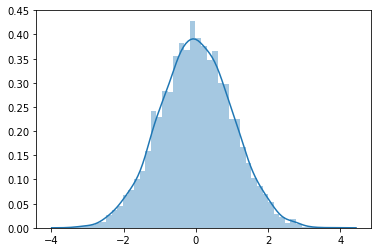

# Standard Normal Distribution - Lab

## Introduction

In the previous lesson, we looked at the formula and a few toy examples to explain an observation's standard score and data standardization for normally distributed data. This lab, will shall standardize and visualize some normal distributions before we see standardization's real impact in machine learning in upcoming lessons. 

## Objectives

You will be able to:

* Calculate and interpret z-scores for observations
* Visualize the data before-after standardization to visually inspect the results. 

## Let's get started

> A Z-score tells us “how many standard deviations above or below the mean.” Every time you obtain a Z-score, use “above” or “below” in your phrasing.

The yields of apples trees in an orchard has been recorded in the file `yield.csv`. Each observation is recorded by weighing apples from trees (in pounds) and adding their weights. There are 5000 observations in total for this data. 

**1. Load, visualize and give general comments on the dataset. Use pandas for loading and inspecting the data.**


```python
# Import libraries

# Read the yield data as a dataframe

```


    <matplotlib.axes._subplots.AxesSubplot at 0x1a1951e0f0>





```python
# Your comments about the data here. 


```

**2. Write a simple sentence to explain what does each value represent in this data?**


```python
# Your answer here


```

**3. What does the 3-sigma rule say about yields of trees ?**


```python
# Perform any calculations necessary here


```


```python
# Write your answer here 


```

**4. Compute the Z-score for a tree yielding 35 pounds of apples. Interpret this Z-score.**


```python
# Calculate z

```


```python
# Interpret the result


```

**5. Suppose a tree has a Z-score of 1.85. Interpret this Z-score. What is the yield of this tree?**


```python
# Interpret the z score


```


```python
# Calculate yield

```


```python
# What is the yield ?

```

**6. Convert each tree’s yield is converted to a Z-score so that “new” derived variable is “Z-score for weight”. The units are still the apple trees. For the data set of all Z-scores:**
* What is the shape? 
* The mean? 
* The standard deviation?


```python
# Give your solution here 
```

    Mean: 0.0
    SD: 1.0





```python
# Your observations

```

## Summary 

In this lab, you practiced your knowledge on the standard normal distribution!
