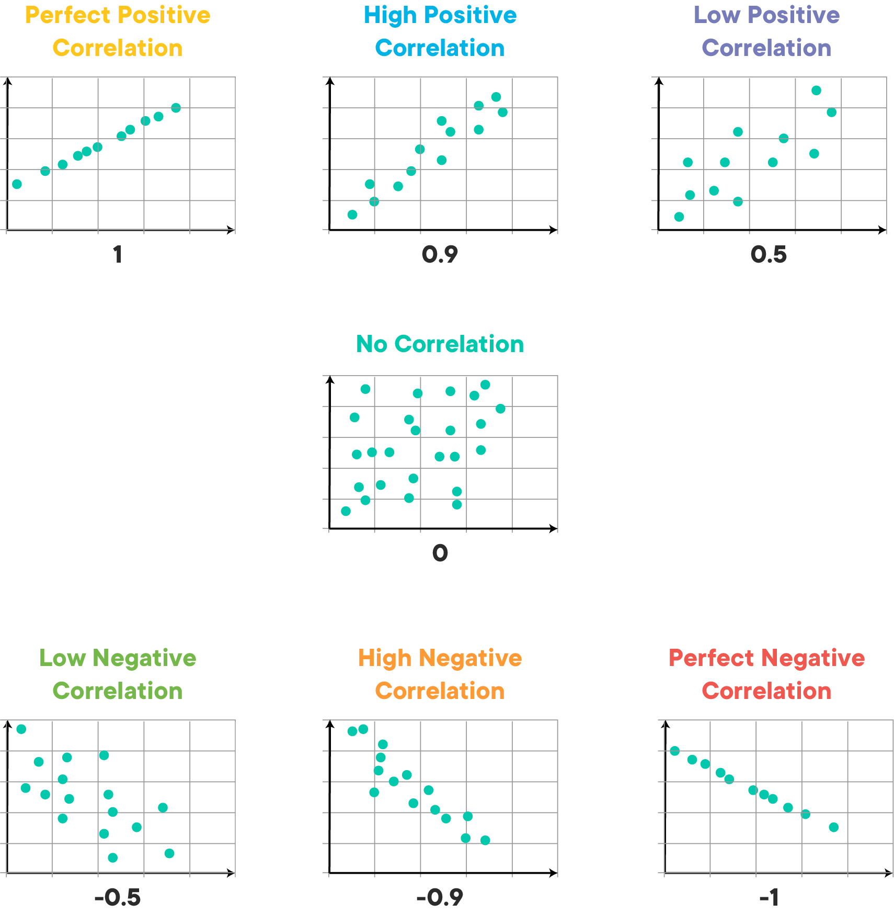
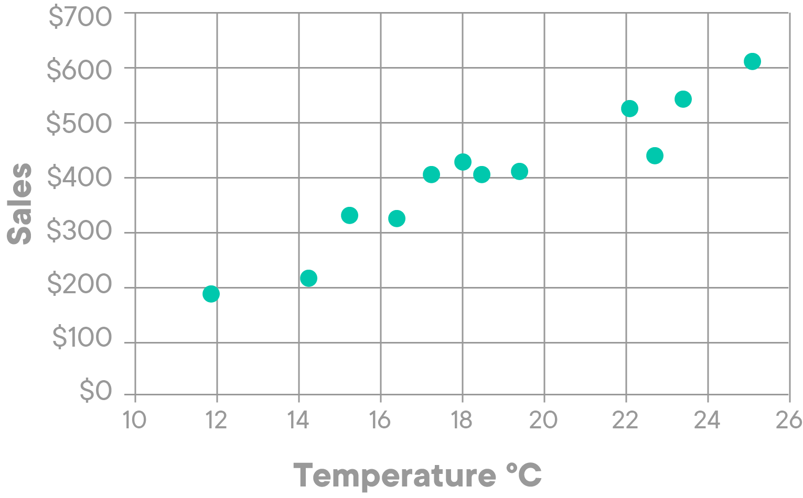
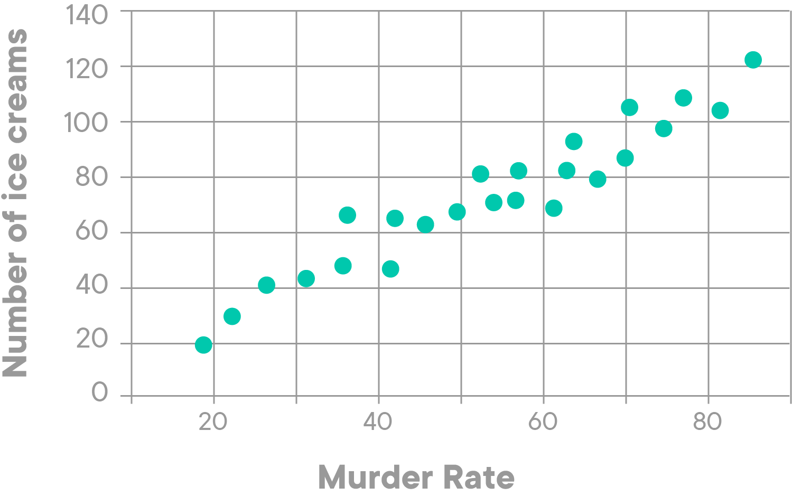
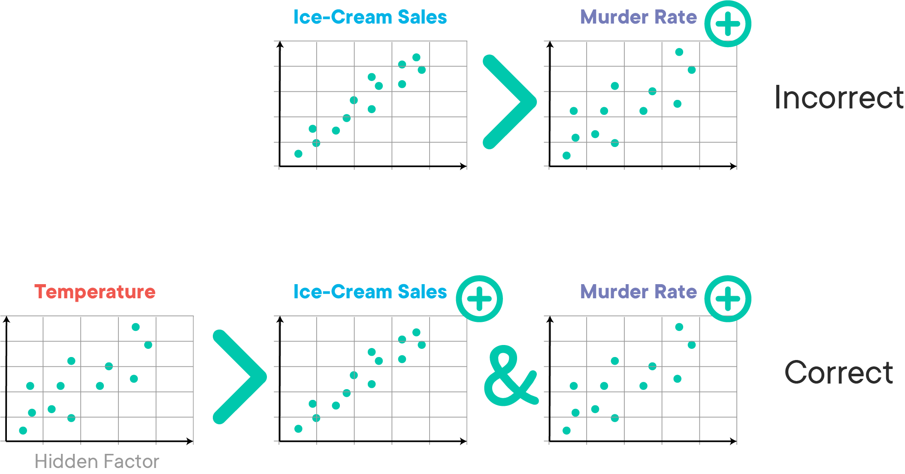

# Covariance and Correlation

## Introduction 

In this lesson, you'll learn how the **variance** of a random variable is used to calculate **covariance** and **correlation** as key measures used in statistics to find causal relationships between random variables. Based on these measures, you can find out if two variables are associated with each other, and to what extent. This lesson will help you develop a conceptual understanding, necessary calculations, and some precautions while using these measures. 

## Objectives

You will be able to:

* Understand and calculate covariance and correlation between two random variables
* Visualize and interpret the results of covariance and correlation
* Explain what is meant by the popular phrase "correlation does not imply causation"

## Variance

Earlier in the course, you learned about __variance__ (represented by $\sigma^2$) as a measure of dispersion for continuous random variables from its expected mean value. Let's quickly revisit this, as variance formula plays a key role while calculating covariance and correlation measures.

The formula for calculating variance as shown below:

$$\sigma^2 = \dfrac{1}{n}\displaystyle\sum_{i=1}^{n}(x_i-\mu)^2$$

- $x$ represents an individual data points
- $\mu $ is the sample mean of the data points
- $n$ is the total number of data points 

**Example**: let's consider the monthly ice cream sales for a small ice cream vendor in NYC (January-May):

| Month   |   Amount  |
|----------|-----|
|  January | 100 |
| February | 200 |
| March    | 300 |
| April    | 500 |
| May      | 900 |

You can calculate that, with a mean of 400 over these 5 months, the variance of the sales amounts is 80,000 (and the standard deviation is 282.84).

Now, let's take this further and see how this relates to **covariance**. 

## Covariance

In some cases, you'll want to look at **two random variables** to get an idea on how they **change together**. In statistics, when trying to figure out how two random variables **vary together**, you can use the so-called **covariance** between these variables.

Covariance calculation plays a major role in a number of advanced machine learning algorithms like dimensionality reduction, predictive analyses, etc.

### Calculating Covariance
If you have $X$ and $Y$, two random variables having $n$ elements each. You can calculate covariance ($\sigma_{xy}$) between these two variables by using the formula:

$$\sigma_{XY} = \dfrac{1}{n}\displaystyle\sum_{i=1}^{n}(x_i -\mu_x)(y_i - \mu_y)$$

- $\sigma_{XY}$ = Covariance between $X$ and $Y$
- $x_i$ = ith element of variable $X$
- $y_i$ = ith element of variable $Y$
- $n$ = number of data points (__$n$ must be same for $X$ and $Y$__)
- $\mu_x$ = mean of the independent variable $X$
- $\mu_y$ = mean of the dependent variable $Y$

> You can see that the formula calculates the variance of $X$ and $Y$ by multiplying the variance of each of their corresponding elements. Hence the term **CO-variance**.

A general proof for covariance is available [here](https://math.tutorvista.com/statistics/covariance.html).

**Back to our ice cream sales example**:

Imagine there is another ice cream vendor, Vendor B. Let's calculate the covariance between our previous Vendor A and this new Vendor B.

Ice cream sales for a small ice cream vendor in NYC (January-May):

| Month   |   Vendor A  | Vendor B |
|----------|-----|-----|
|  January | 100 |220|
| February | 200 |400|
| March    | 300 |600|
| April    | 500 |900|
| May      | 900 |1300|

Recall that Vendor A sold on average 400, and Vendor B sells on average 684, considerably higher.

Using this along with the covariance formula, you can compute that the covariance between ice cream Vendor A and B sales is 106800. Now the question is, what does that mean?

### Interpreting covariance values 

Covariance values range from positive infinity to negative infinity. 

* A **positive covariance** indicates that two variables are **positively related**

* A **negative covariance** indicates that two variables are **inversely related**

* A **covariance equal or close to 0** indicates that there is **no linear relationship** between two variables

Looking back at our ice cream example, it is no surprise that you found a positive covariance there. While the sales amounts are different, it is clear that when sales went up for Vendor A, they also went up for Vendor B. 

You'll immediately notice the main shortcoming of covariance: because it ranges between negative and positive infinity, it only tells us when 2 variables are negatively or positively related. It doesn't tell us anything about to what **extent** they are negative or positively related. This makes interpretation difficult and comparing covariances to each other impossible. 

Assume you have four different variables a, b, p and q. Next, let's say you can have $ Cov(a, b)  = 3.6$ and $Cov(p, q) = 9$. These covariance values tell us that these pairs are positively associated, but it is difficult to tell whether the relationship between a and b is stronger than p and q without looking at the **means and distributions of these variables**.

This is where the concept of correlation comes in.

> Correlation is calculated by **standardizing covariance** by some measure of variability in the data, it produces a quantity that has intuitive interpretations and consistent scale.

Let's consider another ice cream Vendor C to reinforce this idea. The mean sales amount for this vendor is 132,000, and the covariance between Vendor A and C is 132,000, which is considerably higher than the covariance of 106,800 which we've seen before. Does this mean the positive relationship between A and C is stronger? We need the correlation here to answer this question!

| Month   |   Vendor A  | Vendor B | Vendor C |
|----------|-----|-----|-------|
|  January | 100 |220|900 |
| February | 200 |400|800 |
| March    | 300 |600|500 |
| April    | 500 |900|1400 |
| May      | 900 |1300|2000 |

## Correlation

Covariance uses a formulation that only depends on the units of $X$ and $Y$ variables. When doing data science, it is often not appropriate to use covariance as such because different experiments may contain underlying data measured in different units. 

Because of this, it is important to normalize this degree of variation into a standard unit, with interpretable results, *independent of the units of data*. You can achieve this with a derived normalized measure, called **correlation**. 

The term "correlation" refers to a relationship or association between variables. In almost any business, it is useful to express one quantity in terms of its relationship with others. For example: 
- Sales might increase when the marketing department spends more on TV advertisements
- Customer's average purchase amount on an e-commerce website might depend on a number of factors related to that customer, e.g. location, age group, gender etc.
- Social media activity and website clicks might be associated with revenue that a digital publisher makes. etc.

Correlation is the first step to understanding these relationships and subsequently building better business and statistical models.

### Pearson's Correlation Coefficient $r$

__Pearson Correlation Coefficient__, $r$, also called the __linear correlation coefficient__, measures the strength and the direction of a __linear relationship__ between two variables. This coefficient quantifies the degree to which a relationship between two variables can be described by a line. 

**Note:** There are a [number other correlation coefficients](https://math.tutorvista.com/statistics/correlation.html),  but for now, we will focus on __Pearson correlation__ as it is the go-to correlation measure for most needs.

### Calculating Correlation Coefficient

Pearson Correlation ($r$) is calculated using following formula :

$$ r = \frac{\sum_{i=1}^{n}(x_i -\mu_x)(y_i - \mu_y)} {\sqrt{\sum_{i=1}^{n}(x_i - \mu_x)^2 \sum_{i=1}^{n}(y_i-\mu_y)^2}}$$

So just like in the case of covariance,  $X$ and $Y$ are two random variables having n elements each. 

- $x_i$ = ith element of variable $X$
- $y_i$ = ith element of variable $Y$
- $n$ = number of data points (__$n$ must be same for $X$ and $Y$__)
- $\mu_x$ = mean of the independent variable $X$
- $\mu_y$ = mean of the dependent variable $Y$
- $r$ = Calculated Pearson Correlation

### Interpreting Correlation values

> _The Pearson Correlation formula always gives values in a range between -1 and 1_

You'll often see patterns or relationships in scatter plots. Pearson Correlation, which is a linear measure can be identified through a scatter plot by inspecting the "linearity of association" between two variables. 

If two variables have a correlation of +0.9,  this means the change in one item results in an almost similar change to another item. A correlation value of -0.9 means that the change is one variable results as an opposite change in the other variable. A Pearson correlation near 0 would be no effect. 

Here are some example of Pearson correlation calculations as scatter plots. 

** Let's go back to our ice cream example**:

| Month   |   Vendor A  | Vendor B | Vendor C |
|----------|-----|-----|-------|
|  January | 100 |220|900 |
| February | 200 |400|800 |
| March    | 300 |600|500 |
| April    | 500 |900|1400 |
| May      | 900 |1300|2000 |

Recall that Cov(A,C) was higher than Cov(A, B). Using the formula for correlation coefficient, Vendor A and B have a correlation coefficient of 0.9888 where Vendor A and C have a **lower** correlation coefficient of 0.8858!

** Ice cream and the weather:**

Let's take a deep dive into an Ice Cream Vendor's sales data. Now, we're going to look at the relationship between the average daily temperature and the daily profit on 12 days in April (the degrees are on the Celsius scale):

| Temp (°C) |   Ice Cream Sales (USD) |
|--------|------|
|14.2|	215|
|16.4|	325|
|11.9|	185|
|15.2|	332|
|18.5|	406|
|22.1|	522|
|19.4|	412|
|25.1|	614|
|23.4|	544|
|18.1|	421|
|22.6|	445|
|17.2|	408|

And here is the same data as a Scatter Plot:

Just by looking at the plot, you can easily see that hotter weather goes along with higher ice cream sales. The relationship is good but not perfect.
The correlation for this example is 0.9575 which indicates a very strong positive relationship.

## Correlation is not Causation

You may have come across the saying: **“correlation is not causation”** or **“correlation does not imply causation”**. 

What do we mean by saying this?

Causation takes a step further than correlation.
> Any change in the value of one variable will cause a change in the value of another variable, which means one variable causes the other one to happen. It is also referred to as __cause and effect__.

Let's try to understand this with an example.

### Consider Hidden Factors

Suppose for the above ice cream sales example, we now have some extra data on the number of homicide cases in New York. Out of curiosity,  we analyze sales numbers vs. homicide rate as scatterplot and see that these two also related to each other. Mind blown... Is ice cream turning people into murderers?

#### Example 1: "Ice cream sales are correlated with the number of homicides in New York" 

For our example, its actually the weather as a hidden factor which is causing both these events. It is actually causing the rise in ice cream sales and homicides. As in summer people usually go out, enjoy a nice sunny day and chill themselves with ice creams. So when it’s sunny, a wide range of people are outside and there is a wider selection of victims for predators. There is no causal relationship between the ice cream and rate of homicide, sunny weather is bringing both the factors together. We can say that ice cream sales and homicide rate have a __causal relationship__ with weather.

This is reflected in the image below:

**Just after finding the correlation, we shouldn't draw the conclusion too quickly. Instead, we should take time to find other underlying factors as correlation is just the first step. Find the hidden factors, verify if they are correct and then conclude.**

Here are some other (rather funny) examples of how correlation analysis may lead to inconceivable findings.

#### Example 2: Number of Nicholas Cage movie releases correlates with people drowning in pools

So, how about this chart?

The internet is full of other funny and weird correlations, you'll come across other ones if you do a quick Google search. This particular correlation between Nicolas Cage movies and drowning accidents was found on [this website](http://www.tylervigen.com/spurious-correlations). The key takeaway here is that covariance and correlation analysis should be used with care. The thing is that nowadays, you can find data on a wide variety of subjects. This means that if you search long enough, you'll find a high correlation somewhere between two completely unrelated subjects. This phenomenon is also referred to as "the law of large numbers".

#### Example 3: Our very own ice cream example

Our very own ice cream example in this lesson is a good example of why correlation does not automatically imply causation.

The sales increase for Vendor A did not _cause_ a sales increase for vendor B. The hidden factor here was (clearly) the weather.

What is important to note is here that, where correlation does not imply causation, *IF* there is a causal effect, there generally will be a high correlation as well. In other words:

> If one factor has an effect on another one (causation), there generally will be a high correlation as well. 
   Yet, this doesn't mean that a high correlation means that there is causation. 

## Key Takeaways
- Correlation is dimensionless, i.e. it is a unit-free measure of the relationship between variables. 
- Correlation is a normalized form of covariance and exists between [0,1]
- Correlation is not causation

**IMPORTANT NOTE:** The variance formula used in this lesson considers $X$ and $Y$ to be population variables.  For samples, we divide by (n-1), instead of n due to the principle called Bessel's correction. [Here is a mathematical proof for this](https://lazyprogrammer.me/covariance-matrix-divide-by-n-or-n-1/). We will visit this point again later in the course to explore it in greater details. 

## Summary
In this lesson, you learned how to compute the variance of random variables as a measure of deviation from the mean. Them you learned how this measure can be used to first calculate covariance, and the correlation to analyze how two variables change together. You learned the formulas for calculating these measures and you were provided with mathematical proofs of these formulas. Next, you'll learn how you can use correlation analysis to run a __regression analysis__.
