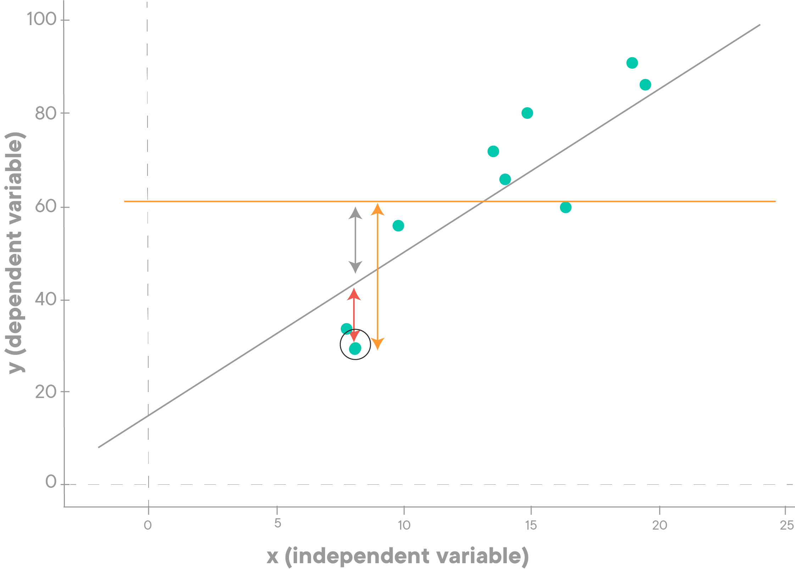
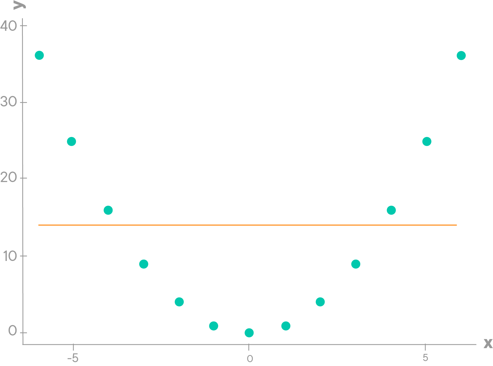
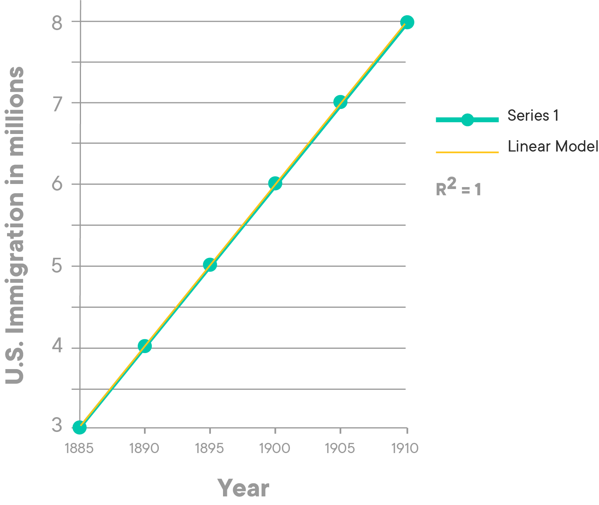

# Coefficient of Determination

## Introduction
For linear regression analysis, as we saw earlier, the straight line does not **fully** describe the relationship between variables and there is always some error. In general, you'll want to determine a "goodness of fit"-measure of the fitted line. In this lesson, you'll learn about the "R-Squared"($R^2$) measure, also known as the Coefficient of Determination.

## Objectives
You will be able to:

* Describe squared error to identify the difference between predicted and actual values

* Calculate the Coefficient of Determination (R-Squared) for a given regression line

## R-Squared
> **The $R^2$ or Coefficient of determination is a statistical measure that is used to assess the goodness of fit of a regression model**

Here is how it works. 

R-Squared uses a so-called "baseline" model which is the **worst** model. This baseline model does not make use of any independent variables to predict the value of dependent variable Y. Instead, it uses the **mean** of the observed responses of the dependent variable $y$ and always predicts this mean as the value of $y$ for any value of $x$. In the image below, this model is given by the straight green line.

You can see that, in this plot, the baseline model always predicts the mean of $y$ **irrespective** of the value of the $x$. The red line, however, is our fitted regression line which makes use of $x$ values to predict the values of $y$. Looking at the plot above, R-Squared simply asks the question:

>** Is our fitted regression line better than our baseline (worst) model ?**

Any regression model that we fit is compared to this baseline model to understand its **goodness of fit**. Simply put, R-Squared just explains how good is your model when compared to the baseline model. That's about it. 

### Great, so how do you calculate R-Squared ?

The mathematical formula to calculate R-Squared for a linear regression line is in terms of **squared errors** for the fitted model and the baseline model. It's calculated as :

$$ \large R^2 = 1- \dfrac{SS_{RES}}{SS_{TOT}} = \dfrac{\sum_i(y_i - \hat y_i)^2}{\sum_i(y_i - \overline y_i)^2} $$

* $SS_{RES}$ (also called RSS) is the **Residual** sum of squared errors of our regression model also known as **$SSE$** (Sum of Squared Errors). $SS_{RES}$ is the squared difference between $y$ and $\hat y$. For the one highlighted observation in our graph above, the $SS_{RES}$ is denoted by the red arrow. This part of the error is not explained by our model.

* $SS_{TOT}$ (also called TSS)is the **Total** sum of squared error. $SS_{TOT}$ is the squared difference between $y$ and $\overline y$. For the one highlighted observation in our graph above, the $SS_{TOT}$ is denoted by the green arrow.

Looking at this, you'll understand that you can interpret R-Squared as "1 - the proportion of the variance _not_ explained by the model", which means as much as "the variation explained by the model". As a result, you'll want to maximize the R-Squared.

For completion, 

* $SS_{EXP}$ (also called ESS) is the **Explained** sum of squared error. $SS_{EXP}$ is the squared difference between $\hat y$ and $\overline y$. For the one highlighted observation in our graph above, the $SS_{EXP}$ is denoted by the blue arrow.

### Let's interpret the outcome of $R^2$

Our worst possible regression model could be the baseline model itself. In that case, the RSS is equal to TSS looking at the graph above. Then your R_squared value is 0. Look at the plot below, where you notice that $\hat y$ is simply a straight line.

Due to this particular shape of the distribution, the regression line $\hat y$ is the same as the mean line for $\overline y$. The R-Squared for this model is 0. It's clear that a straight line is probably not the right fit for this data.

On the other extreme, the best model could also be one that fits all the data points perfectly. Because the unexplained part of the variation is 0, R-Squared is 1–0, so 1 in this case, which indicates a perfect model. Below is an example of this (know that this will rarely happen with real world data).

> **R-Squared can take value between 0 and 1 where values closer to 0 represent a poor fit and values closer to 1 represent an (almost) perfect fit**

### Phrasing R-Squared values 

An obtained R-squared value of say 0.85 can be put into a statement as 

> ***85% of the variations in dependent variable $y$ are explained by the independent variable in our model.***

## Summary 
In this lesson, we looked at the R-Squared, or the Coefficient of Determination to evaluate the goodness of fit for a regression line. We saw how R-Squared is calculated by comparing a given model to a baseline model and indicating it with values between 0 and 1. In the next lab, you'll move on to calculating R-Squared in python. 
