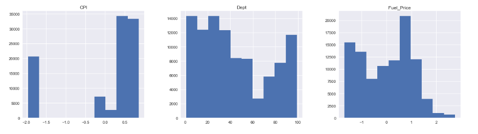
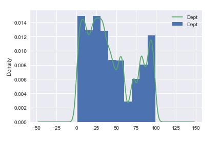
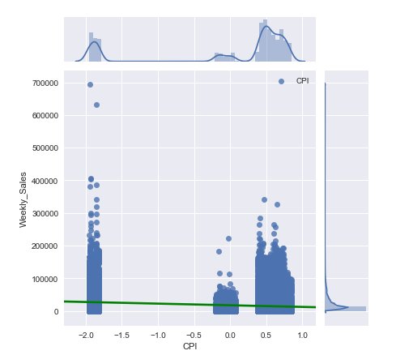

# Exploring Our Data


## Introduction

In this lesson we'll learn about performing an exploratory data analysis task, using all the statistical and visual EDA skills we have seen so far. 

## Objectives

You will be able to:

* Check the distribution of various columns
* Examine the descriptive statistics of our data set
* Create visualizations to help us better understand our data set


## Exploratory Data Analysis

Exploratory Data Analysis, or **_EDA_**, is a crucial part of of Data Science Project.  Before we can go off building models on a dataset, we need to be familiar with the actual data it contains--otherwise, we'll have no intuition about how to interpret the results of these models, or even if we can trust them at all!

This lesson will outline the basic steps that should be taken--and questions that should be answered--during EDA. 

## Understanding the Distribution of the Dataset

One of the foundational pieces of an EDA investigation is to understand the underlying distribution of our data.  Often, some of the most interesting/important business insights come not from machine learning models, but simply from exploring the distribution of the dataset! If your company or organization has not yet mastered reporting on descriptive analytics, the insights gained here can be invaluable to company strategy--think questions such as "who is my most profitable customer segment?" or "is there a seasonality to our customer churn rate?".  These are important questions to any business, and they don't require machine learning models to answer them--just some basic visualizations, and the ability to ask good questions.

Getting a feel for the distribution of a dataset is done in a few different ways. Generally, we'll make use of high-level descriptive statistics, followed by visualizations.  During the EDA process, it is quite common to uncover interesting things in the data that spur further questions for the investigation.  

> "The most exciting phrase to hear in science, the one that heralds new discoveries, is not 'Eureka!' (I found it!) but 'That's funny...'"
>
>                                            - Isaac Asimov


Recall that pandas can easily provide descriptive statistics on a DataFrame by using the DataFrame class's built-in `.describe()` method.  The resulting output of method is a table containing information such as the count, mean, median, min, max, and quartile values for every column in the DataFrame.  This is especially handy for answering questions such as "how much variance can I expect in column {X}?"

### Visualizing Distributions - Histograms

The easiest way to understand the distribution of a dataset is to visualize it! Recall that since pandas wraps the matplotlib library, we can easily create histograms showing the distribution of each column by making use of the DataFrame class's built-in `.hist()` method.  



### Visualizing Distributions - Kernel Density Estimation (KDE) Plots

Another great way of quickly visualizing the distribution of a column is to construct a **_KDE Plot_**. This is often overlaid on a histogram to create a line that visualizes the probability mass for every value in the histogram. 




### Using Joint Plots

A more advanced visualization tool we can make use of is the **_Joint Plot_**.  This allows us to visualize a scatterplot, the distributions of two different columns, a kde plot, and even a simple regression line all on the same visualization. In practice, this is incredibly handy for doing this like checking the linearity assumption between predictors and a target variable during a regression analysis (which is exactly what we'll be using these for in the next lab!). 

Since joint plots are more advanced than a basic visualization like a histogram or scatterplot, we'll need to make use of the **_seaborn_** library to create them. The syntax for creating a joint plot is:

```python
# sns is the standard alias for seaborn
sns.jointplot(x= <column>, y= <column>, data=<dataset>, kind='reg')

```



For full details on how to use create joint plots with seaborn, see the [seaborn documentation on joint plots](https://seaborn.pydata.org/generated/seaborn.jointplot.html)!

## Interpreting Our EDA Results

Before we finish this lesson, it is worth noting that the goal of EDA is not pretty visualizations--it's _insight into our data_!  Don't fall into the trap of thinking that EDA means building a couple quick visualizations and then moving onto modeling--you should actively try to generate questions and see if you can answer them by exploring the dataset.  Visualizations are great, but only because they make it easy to quickly interpret our data.  Use them as a tool, not a goal, during the EDA process!

## Summary

In this lesson, we learned how to:

* Check the distribution of various columns
* Examine the descriptive statistics of our data set
* Create visualizations to help us better understand our data set
