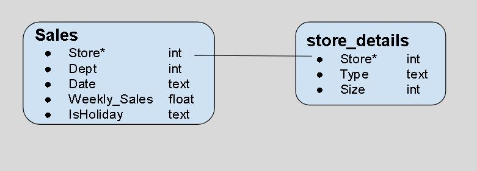

# Obtaining Our Data - Lab

## Introduction
In this lab you'll practice your munging and transforming skills in order to load in your data to solve a regression problem.

## Objectives
You will be able to:
* Understand the ETL process and the steps it consists of
* Understand the challenges of working with data from multiple sources 

## Task Description

Your boss gives you a general description of some of the datasets at your disposal for analyzing weekly store sales. They're eventually looking for you to build a model to help determine what factors impact sales, and model future sales forecasting for business planning.  
  
Most of the properietary store data sits in the company sql database, accessible by all managers and above. The database is called **Walmart.db** Your boss provides you with the following basic schema:  

  

She then tells you that she's put together a second dataset on general economy statistics for the various dates that she would also like you to incorporate in your analysis. That data, she says, is stored in a file **economy_data.csv**.

As a first step in creating your model for providing recommendations and projections, load and synthesize these disperate datasets into a singular unified DataFrame. Then save your results to a file **Merged_Store_Data.csv**.

Make sure you check the various data types and merge appropriately.


```python
# Your code here
```

## Summary
Nice work! You're working more and more independently through the workflow, and ensuring data integrity!
