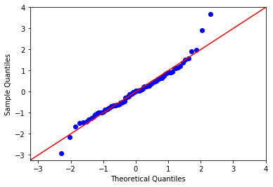
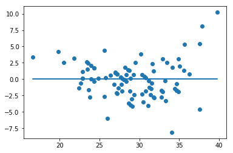
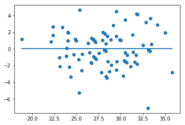

# Modeling Your Data 

## Introduction 

In this lesson you'll review the modeling process for running regression or similar statistical experiments.

## Objectives
You will be able to:
    
* Identify the various steps involved  in building a model
* Understand that modeling is an iterative process
* Identify target variables and predictor variables

## Fitting an Initial Model

Take a quick review here of how to find a linear regression model. You can also use the sci-kit learn package to do this, but you won't get as many descriptive statistics.


```python
import pandas as pd
import matplotlib.pyplot as plt
import seaborn as sns
%matplotlib inline
```


```python
df = pd.read_excel('mpg excercise.xls')
df.head()
```


<div>
<style scoped>
    .dataframe tbody tr th:only-of-type {
        vertical-align: middle;
    }

    .dataframe tbody tr th {
        vertical-align: top;
    }

    .dataframe thead th {
        text-align: right;
    }
</style>
<table border="1" class="dataframe">
  <thead>
    <tr style="text-align: right;">
      <th></th>
      <th>MPG Highway</th>
      <th>Passengers</th>
      <th>Length</th>
      <th>Wheelbase</th>
      <th>Width</th>
      <th>U Turn Space</th>
      <th>Rear seat</th>
      <th>Luggage</th>
      <th>Weight</th>
      <th>Horsepower</th>
      <th>Fueltank</th>
    </tr>
  </thead>
  <tbody>
    <tr>
      <th>0</th>
      <td>31</td>
      <td>5</td>
      <td>177</td>
      <td>102</td>
      <td>68</td>
      <td>37</td>
      <td>26.5</td>
      <td>11</td>
      <td>2705</td>
      <td>140</td>
      <td>13.2</td>
    </tr>
    <tr>
      <th>1</th>
      <td>25</td>
      <td>5</td>
      <td>195</td>
      <td>115</td>
      <td>71</td>
      <td>38</td>
      <td>30.0</td>
      <td>15</td>
      <td>3560</td>
      <td>200</td>
      <td>18.0</td>
    </tr>
    <tr>
      <th>2</th>
      <td>26</td>
      <td>5</td>
      <td>180</td>
      <td>102</td>
      <td>67</td>
      <td>37</td>
      <td>28.0</td>
      <td>14</td>
      <td>3375</td>
      <td>172</td>
      <td>16.9</td>
    </tr>
    <tr>
      <th>3</th>
      <td>26</td>
      <td>6</td>
      <td>193</td>
      <td>106</td>
      <td>70</td>
      <td>37</td>
      <td>31.0</td>
      <td>17</td>
      <td>3405</td>
      <td>172</td>
      <td>21.1</td>
    </tr>
    <tr>
      <th>4</th>
      <td>30</td>
      <td>4</td>
      <td>186</td>
      <td>109</td>
      <td>69</td>
      <td>39</td>
      <td>27.0</td>
      <td>13</td>
      <td>3640</td>
      <td>208</td>
      <td>21.1</td>
    </tr>
  </tbody>
</table>
</div>


```python
#Define the Problem
outcome = 'MPG_Highway'
x_cols = ['Passengers', 'Length', 'Wheelbase', 'Width', 'U_Turn_Space',
          'Rear_seat', 'Luggage', 'Weight', 'Horsepower', 'Fueltank']
```


```python
#Some Brief preprocessing
df.columns = [col.replace(' ', '_') for col in df.columns]
for col in x_cols:
    df[col] = (df[col] - df[col].mean())/df[col].std()
df.head()
```


<div>
<style scoped>
    .dataframe tbody tr th:only-of-type {
        vertical-align: middle;
    }

    .dataframe tbody tr th {
        vertical-align: top;
    }

    .dataframe thead th {
        text-align: right;
    }
</style>
<table border="1" class="dataframe">
  <thead>
    <tr style="text-align: right;">
      <th></th>
      <th>MPG_Highway</th>
      <th>Passengers</th>
      <th>Length</th>
      <th>Wheelbase</th>
      <th>Width</th>
      <th>U_Turn_Space</th>
      <th>Rear_seat</th>
      <th>Luggage</th>
      <th>Weight</th>
      <th>Horsepower</th>
      <th>Fueltank</th>
    </tr>
  </thead>
  <tbody>
    <tr>
      <th>0</th>
      <td>31</td>
      <td>-0.082794</td>
      <td>-0.424883</td>
      <td>-0.285386</td>
      <td>-0.364210</td>
      <td>-0.607145</td>
      <td>-0.456945</td>
      <td>-0.992270</td>
      <td>-0.623674</td>
      <td>-0.073088</td>
      <td>-1.056458</td>
    </tr>
    <tr>
      <th>1</th>
      <td>25</td>
      <td>-0.082794</td>
      <td>0.807793</td>
      <td>1.620864</td>
      <td>0.429654</td>
      <td>-0.296901</td>
      <td>0.723496</td>
      <td>0.326032</td>
      <td>0.825733</td>
      <td>1.072509</td>
      <td>0.407238</td>
    </tr>
    <tr>
      <th>2</th>
      <td>26</td>
      <td>-0.082794</td>
      <td>-0.219437</td>
      <td>-0.285386</td>
      <td>-0.628831</td>
      <td>-0.607145</td>
      <td>0.048958</td>
      <td>-0.003544</td>
      <td>0.512118</td>
      <td>0.537897</td>
      <td>0.071808</td>
    </tr>
    <tr>
      <th>3</th>
      <td>26</td>
      <td>0.879689</td>
      <td>0.670829</td>
      <td>0.301153</td>
      <td>0.165033</td>
      <td>-0.607145</td>
      <td>1.060764</td>
      <td>0.985183</td>
      <td>0.562975</td>
      <td>0.537897</td>
      <td>1.352541</td>
    </tr>
    <tr>
      <th>4</th>
      <td>30</td>
      <td>-1.045278</td>
      <td>0.191455</td>
      <td>0.741057</td>
      <td>-0.099589</td>
      <td>0.013344</td>
      <td>-0.288310</td>
      <td>-0.333119</td>
      <td>0.961350</td>
      <td>1.225256</td>
      <td>1.352541</td>
    </tr>
  </tbody>
</table>
</div>


```python
from statsmodels.formula.api import ols
```


```python
#Fitting the actual model
predictors = '+'.join(x_cols)
formula = outcome + "~" + predictors
model = ols(formula=formula, data=df).fit()
model.summary()
```


<table class="simpletable">
<caption>OLS Regression Results</caption>
<tr>
  <th>Dep. Variable:</th>       <td>MPG_Highway</td>   <th>  R-squared:         </th> <td>   0.746</td>
</tr>
<tr>
  <th>Model:</th>                   <td>OLS</td>       <th>  Adj. R-squared:    </th> <td>   0.715</td>
</tr>
<tr>
  <th>Method:</th>             <td>Least Squares</td>  <th>  F-statistic:       </th> <td>   24.03</td>
</tr>
<tr>
  <th>Date:</th>             <td>Fri, 05 Apr 2019</td> <th>  Prob (F-statistic):</th> <td>2.02e-20</td>
</tr>
<tr>
  <th>Time:</th>                 <td>12:20:41</td>     <th>  Log-Likelihood:    </th> <td> -223.47</td>
</tr>
<tr>
  <th>No. Observations:</th>      <td>    93</td>      <th>  AIC:               </th> <td>   468.9</td>
</tr>
<tr>
  <th>Df Residuals:</th>          <td>    82</td>      <th>  BIC:               </th> <td>   496.8</td>
</tr>
<tr>
  <th>Df Model:</th>              <td>    10</td>      <th>                     </th>     <td> </td>   
</tr>
<tr>
  <th>Covariance Type:</th>      <td>nonrobust</td>    <th>                     </th>     <td> </td>   
</tr>
</table>
<table class="simpletable">
<tr>
        <td></td>          <th>coef</th>     <th>std err</th>      <th>t</th>      <th>P>|t|</th>  <th>[0.025</th>    <th>0.975]</th>  
</tr>
<tr>
  <th>Intercept</th>    <td>   29.0860</td> <td>    0.295</td> <td>   98.465</td> <td> 0.000</td> <td>   28.498</td> <td>   29.674</td>
</tr>
<tr>
  <th>Passengers</th>   <td>   -1.0138</td> <td>    0.577</td> <td>   -1.757</td> <td> 0.083</td> <td>   -2.162</td> <td>    0.134</td>
</tr>
<tr>
  <th>Length</th>       <td>    0.4625</td> <td>    0.624</td> <td>    0.741</td> <td> 0.461</td> <td>   -0.779</td> <td>    1.704</td>
</tr>
<tr>
  <th>Wheelbase</th>    <td>    1.9899</td> <td>    0.833</td> <td>    2.389</td> <td> 0.019</td> <td>    0.333</td> <td>    3.647</td>
</tr>
<tr>
  <th>Width</th>        <td>    1.2067</td> <td>    0.759</td> <td>    1.591</td> <td> 0.115</td> <td>   -0.302</td> <td>    2.716</td>
</tr>
<tr>
  <th>U_Turn_Space</th> <td>   -0.4858</td> <td>    0.545</td> <td>   -0.892</td> <td> 0.375</td> <td>   -1.570</td> <td>    0.598</td>
</tr>
<tr>
  <th>Rear_seat</th>    <td>    0.2338</td> <td>    0.459</td> <td>    0.509</td> <td> 0.612</td> <td>   -0.679</td> <td>    1.147</td>
</tr>
<tr>
  <th>Luggage</th>      <td>    0.3229</td> <td>    0.447</td> <td>    0.723</td> <td> 0.472</td> <td>   -0.566</td> <td>    1.212</td>
</tr>
<tr>
  <th>Weight</th>       <td>   -5.2787</td> <td>    1.220</td> <td>   -4.327</td> <td> 0.000</td> <td>   -7.705</td> <td>   -2.852</td>
</tr>
<tr>
  <th>Horsepower</th>   <td>   -0.1101</td> <td>    0.660</td> <td>   -0.167</td> <td> 0.868</td> <td>   -1.422</td> <td>    1.202</td>
</tr>
<tr>
  <th>Fueltank</th>     <td>   -1.6742</td> <td>    0.703</td> <td>   -2.383</td> <td> 0.019</td> <td>   -3.072</td> <td>   -0.276</td>
</tr>
</table>
<table class="simpletable">
<tr>
  <th>Omnibus:</th>       <td>15.867</td> <th>  Durbin-Watson:     </th> <td>   1.460</td>
</tr>
<tr>
  <th>Prob(Omnibus):</th> <td> 0.000</td> <th>  Jarque-Bera (JB):  </th> <td>  23.638</td>
</tr>
<tr>
  <th>Skew:</th>          <td> 0.749</td> <th>  Prob(JB):          </th> <td>7.36e-06</td>
</tr>
<tr>
  <th>Kurtosis:</th>      <td> 4.963</td> <th>  Cond. No.          </th> <td>    12.2</td>
</tr>
</table><br/><br/>Warnings:<br/>[1] Standard Errors assume that the covariance matrix of the errors is correctly specified.


## Assessing the Model
 
When performing an initial assessment of the model you might focus on a number of different perspectives. There are metrics assessing the overall accuracy of the model including $r^2$ and mean square error. There are also many metrics when analyzing how various features contribute to the overall model. These are essential to building a story and intuition behind the model so that educated business strategies can be implemented to optimize the target variable. After all, typically you aren't soley interested in predicting a quantity in a blakc box given said information. Rather, you would often like to know the underlying influencers and how those can be adjusted in order to increase or decrease the final measured quanity whether it be sales, customer base, costs or risk. Such metrics would include p-values associated with the various features, comparing models with features removed and investigating potential multicollinearity in the model. Muliticollinearity also touches upon checking model assumptions. One underlying intuition motivating the regression model is that the features constitute a *set of levers* which, if appropriately adjusted, account for the target variable. The theory then goes that the errors should be simply the cause of noise in our measurements, or smaller unaccounted factors. These errors are then assumed to be normally distributed. 

## Comments on P-Values

Based on the p-values above, you can see that there are a number of extraneous features. Recall that a common signifigance cutoff is 0.05. The refined model should eliminate these irrelevant features.

## Initial Refinement


```python
outcome = 'MPG_Highway'
x_cols = ['Passengers', 'Wheelbase', 'Weight', 'Fueltank']
predictors = '+'.join(x_cols)
formula = outcome + "~" + predictors
model = ols(formula=formula, data=df).fit()
model.summary()
```


<table class="simpletable">
<caption>OLS Regression Results</caption>
<tr>
  <th>Dep. Variable:</th>       <td>MPG_Highway</td>   <th>  R-squared:         </th> <td>   0.726</td>
</tr>
<tr>
  <th>Model:</th>                   <td>OLS</td>       <th>  Adj. R-squared:    </th> <td>   0.713</td>
</tr>
<tr>
  <th>Method:</th>             <td>Least Squares</td>  <th>  F-statistic:       </th> <td>   58.19</td>
</tr>
<tr>
  <th>Date:</th>             <td>Fri, 05 Apr 2019</td> <th>  Prob (F-statistic):</th> <td>6.35e-24</td>
</tr>
<tr>
  <th>Time:</th>                 <td>12:20:41</td>     <th>  Log-Likelihood:    </th> <td> -226.97</td>
</tr>
<tr>
  <th>No. Observations:</th>      <td>    93</td>      <th>  AIC:               </th> <td>   463.9</td>
</tr>
<tr>
  <th>Df Residuals:</th>          <td>    88</td>      <th>  BIC:               </th> <td>   476.6</td>
</tr>
<tr>
  <th>Df Model:</th>              <td>     4</td>      <th>                     </th>     <td> </td>   
</tr>
<tr>
  <th>Covariance Type:</th>      <td>nonrobust</td>    <th>                     </th>     <td> </td>   
</tr>
</table>
<table class="simpletable">
<tr>
       <td></td>         <th>coef</th>     <th>std err</th>      <th>t</th>      <th>P>|t|</th>  <th>[0.025</th>    <th>0.975]</th>  
</tr>
<tr>
  <th>Intercept</th>  <td>   29.0860</td> <td>    0.296</td> <td>   98.232</td> <td> 0.000</td> <td>   28.498</td> <td>   29.674</td>
</tr>
<tr>
  <th>Passengers</th> <td>   -1.0457</td> <td>    0.418</td> <td>   -2.501</td> <td> 0.014</td> <td>   -1.877</td> <td>   -0.215</td>
</tr>
<tr>
  <th>Wheelbase</th>  <td>    2.8249</td> <td>    0.713</td> <td>    3.960</td> <td> 0.000</td> <td>    1.407</td> <td>    4.243</td>
</tr>
<tr>
  <th>Weight</th>     <td>   -4.9206</td> <td>    0.894</td> <td>   -5.505</td> <td> 0.000</td> <td>   -6.697</td> <td>   -3.144</td>
</tr>
<tr>
  <th>Fueltank</th>   <td>   -1.4385</td> <td>    0.668</td> <td>   -2.154</td> <td> 0.034</td> <td>   -2.766</td> <td>   -0.111</td>
</tr>
</table>
<table class="simpletable">
<tr>
  <th>Omnibus:</th>       <td>10.649</td> <th>  Durbin-Watson:     </th> <td>   1.397</td>
</tr>
<tr>
  <th>Prob(Omnibus):</th> <td> 0.005</td> <th>  Jarque-Bera (JB):  </th> <td>  15.761</td>
</tr>
<tr>
  <th>Skew:</th>          <td> 0.489</td> <th>  Prob(JB):          </th> <td>0.000378</td>
</tr>
<tr>
  <th>Kurtosis:</th>      <td> 4.763</td> <th>  Cond. No.          </th> <td>    6.70</td>
</tr>
</table><br/><br/>Warnings:<br/>[1] Standard Errors assume that the covariance matrix of the errors is correctly specified.


> **Comments:** Note that while the $r^2$ value did drop, it did so only marginally despite dropping 6/10 of the orignal features. Additionally, all of the p-values indicate that all of the current features are substantially influential.

## Additional Assessments and Refinement

Now that you've made some initial refinements to the model, it's time to continue checking further assumptions.

## Checking for Multicollinearity

While you've examined the bi-variable relations previously by examining pair-wise correlation between features, you haven't fully accounted for multicollinearity which is a relation of 3 or more variables. One test for this is the [variance inflation factor](https://en.wikipedia.org/wiki/Variance_inflation_factor). Typically, variables with a vif of 5 or greater (or more definitively 10 or greater) are displaying multicollinearity with other variables in the feature set. While we'll check this here, 


```python
from statsmodels.stats.outliers_influence import variance_inflation_factor
```


```python
X = df[x_cols]
vif = [variance_inflation_factor(X.values, i) for i in range(X.shape[1])]
list(zip(x_cols, vif))
```


    [('Passengers', 1.972330344357365),
     ('Wheelbase', 5.743165022553869),
     ('Weight', 9.016035842933373),
     ('Fueltank', 5.032060527995974)]


> **Comment:** While the p-values indicate that all of the current features are impactful, the variance inflation factor indicates that there is moderate multicollinearity between our variables. With that, it makes sense to briefly update the features once again and recheck for multicollinearity.


```python
outcome = 'MPG_Highway'
x_cols = ['Passengers', 'Wheelbase', 'Fueltank']
predictors = '+'.join(x_cols)
formula = outcome + "~" + predictors
model = ols(formula=formula, data=df).fit()
model.summary()
```


<table class="simpletable">
<caption>OLS Regression Results</caption>
<tr>
  <th>Dep. Variable:</th>       <td>MPG_Highway</td>   <th>  R-squared:         </th> <td>   0.631</td>
</tr>
<tr>
  <th>Model:</th>                   <td>OLS</td>       <th>  Adj. R-squared:    </th> <td>   0.619</td>
</tr>
<tr>
  <th>Method:</th>             <td>Least Squares</td>  <th>  F-statistic:       </th> <td>   50.77</td>
</tr>
<tr>
  <th>Date:</th>             <td>Fri, 05 Apr 2019</td> <th>  Prob (F-statistic):</th> <td>3.21e-19</td>
</tr>
<tr>
  <th>Time:</th>                 <td>12:23:56</td>     <th>  Log-Likelihood:    </th> <td> -240.73</td>
</tr>
<tr>
  <th>No. Observations:</th>      <td>    93</td>      <th>  AIC:               </th> <td>   489.5</td>
</tr>
<tr>
  <th>Df Residuals:</th>          <td>    89</td>      <th>  BIC:               </th> <td>   499.6</td>
</tr>
<tr>
  <th>Df Model:</th>              <td>     3</td>      <th>                     </th>     <td> </td>   
</tr>
<tr>
  <th>Covariance Type:</th>      <td>nonrobust</td>    <th>                     </th>     <td> </td>   
</tr>
</table>
<table class="simpletable">
<tr>
       <td></td>         <th>coef</th>     <th>std err</th>      <th>t</th>      <th>P>|t|</th>  <th>[0.025</th>    <th>0.975]</th>  
</tr>
<tr>
  <th>Intercept</th>  <td>   29.0860</td> <td>    0.341</td> <td>   85.203</td> <td> 0.000</td> <td>   28.408</td> <td>   29.764</td>
</tr>
<tr>
  <th>Passengers</th> <td>   -0.8302</td> <td>    0.480</td> <td>   -1.730</td> <td> 0.087</td> <td>   -1.784</td> <td>    0.123</td>
</tr>
<tr>
  <th>Wheelbase</th>  <td>    0.4075</td> <td>    0.648</td> <td>    0.629</td> <td> 0.531</td> <td>   -0.881</td> <td>    1.696</td>
</tr>
<tr>
  <th>Fueltank</th>   <td>   -4.1077</td> <td>    0.529</td> <td>   -7.759</td> <td> 0.000</td> <td>   -5.160</td> <td>   -3.056</td>
</tr>
</table>
<table class="simpletable">
<tr>
  <th>Omnibus:</th>       <td>25.731</td> <th>  Durbin-Watson:     </th> <td>   1.417</td>
</tr>
<tr>
  <th>Prob(Omnibus):</th> <td> 0.000</td> <th>  Jarque-Bera (JB):  </th> <td>  56.037</td>
</tr>
<tr>
  <th>Skew:</th>          <td> 1.002</td> <th>  Prob(JB):          </th> <td>6.79e-13</td>
</tr>
<tr>
  <th>Kurtosis:</th>      <td> 6.231</td> <th>  Cond. No.          </th> <td>    3.57</td>
</tr>
</table><br/><br/>Warnings:<br/>[1] Standard Errors assume that the covariance matrix of the errors is correctly specified.


```python
X = df[x_cols]
vif = [variance_inflation_factor(X.values, i) for i in range(X.shape[1])]
list(zip(x_cols, vif))
```


    [('Passengers', 1.955034462110378),
     ('Wheelbase', 3.567043045106437),
     ('Fueltank', 2.378966703427496)]


> **Comment:** This is a modelling choice. Clearly there are advantages and tradebacks to the two approaches. On the one hand, removing the weight component has substantially diminished the model's performance. On the other hand, multicollinearity between the features has been reduced. For now, let's opt for the previous version of the model which does suffer from some multicollinearity, which could impact model interpretation, but produces a more accurate model overall.


```python
outcome = 'MPG_Highway'
x_cols = ['Passengers', 'Wheelbase', 'Weight', 'Fueltank']
predictors = '+'.join(x_cols)
formula = outcome + "~" + predictors
model = ols(formula=formula, data=df).fit()
model.summary()
```


<table class="simpletable">
<caption>OLS Regression Results</caption>
<tr>
  <th>Dep. Variable:</th>       <td>MPG_Highway</td>   <th>  R-squared:         </th> <td>   0.726</td>
</tr>
<tr>
  <th>Model:</th>                   <td>OLS</td>       <th>  Adj. R-squared:    </th> <td>   0.713</td>
</tr>
<tr>
  <th>Method:</th>             <td>Least Squares</td>  <th>  F-statistic:       </th> <td>   58.19</td>
</tr>
<tr>
  <th>Date:</th>             <td>Fri, 05 Apr 2019</td> <th>  Prob (F-statistic):</th> <td>6.35e-24</td>
</tr>
<tr>
  <th>Time:</th>                 <td>12:26:27</td>     <th>  Log-Likelihood:    </th> <td> -226.97</td>
</tr>
<tr>
  <th>No. Observations:</th>      <td>    93</td>      <th>  AIC:               </th> <td>   463.9</td>
</tr>
<tr>
  <th>Df Residuals:</th>          <td>    88</td>      <th>  BIC:               </th> <td>   476.6</td>
</tr>
<tr>
  <th>Df Model:</th>              <td>     4</td>      <th>                     </th>     <td> </td>   
</tr>
<tr>
  <th>Covariance Type:</th>      <td>nonrobust</td>    <th>                     </th>     <td> </td>   
</tr>
</table>
<table class="simpletable">
<tr>
       <td></td>         <th>coef</th>     <th>std err</th>      <th>t</th>      <th>P>|t|</th>  <th>[0.025</th>    <th>0.975]</th>  
</tr>
<tr>
  <th>Intercept</th>  <td>   29.0860</td> <td>    0.296</td> <td>   98.232</td> <td> 0.000</td> <td>   28.498</td> <td>   29.674</td>
</tr>
<tr>
  <th>Passengers</th> <td>   -1.0457</td> <td>    0.418</td> <td>   -2.501</td> <td> 0.014</td> <td>   -1.877</td> <td>   -0.215</td>
</tr>
<tr>
  <th>Wheelbase</th>  <td>    2.8249</td> <td>    0.713</td> <td>    3.960</td> <td> 0.000</td> <td>    1.407</td> <td>    4.243</td>
</tr>
<tr>
  <th>Weight</th>     <td>   -4.9206</td> <td>    0.894</td> <td>   -5.505</td> <td> 0.000</td> <td>   -6.697</td> <td>   -3.144</td>
</tr>
<tr>
  <th>Fueltank</th>   <td>   -1.4385</td> <td>    0.668</td> <td>   -2.154</td> <td> 0.034</td> <td>   -2.766</td> <td>   -0.111</td>
</tr>
</table>
<table class="simpletable">
<tr>
  <th>Omnibus:</th>       <td>10.649</td> <th>  Durbin-Watson:     </th> <td>   1.397</td>
</tr>
<tr>
  <th>Prob(Omnibus):</th> <td> 0.005</td> <th>  Jarque-Bera (JB):  </th> <td>  15.761</td>
</tr>
<tr>
  <th>Skew:</th>          <td> 0.489</td> <th>  Prob(JB):          </th> <td>0.000378</td>
</tr>
<tr>
  <th>Kurtosis:</th>      <td> 4.763</td> <th>  Cond. No.          </th> <td>    6.70</td>
</tr>
</table><br/><br/>Warnings:<br/>[1] Standard Errors assume that the covariance matrix of the errors is correctly specified.


## Checking for Normality

Again recall that we should check to ensure that our residuals are normally distributed. As you've seen before, a Q-Q plot is a helpful visual for analyzing this.


```python
import statsmodels.api as sm
import scipy.stats as stats
```


```python
fig = sm.graphics.qqplot(model.resid, dist=stats.norm, line='45', fit=True)
```





> **Comment:** Overall, looks fairly robust, although there are some violations near the tails.

## Checking for Homoscedasticity

You should also check that your errors do not display heteroscedasticity; if the errors appear to increase or decrease based on the target variable, then the model does not meet the initial assumptions.


```python
plt.scatter(model.predict(df[x_cols]), model.resid)
plt.plot(model.predict(df[x_cols]), [0 for i in range(len(df))])
```


    [<matplotlib.lines.Line2D at 0x1c19401a58>]





> **Comment:** There appears to be some issues with high outliers displaying disprportionate errors. Further work with outliers could be warranted.

## Model Refinement III
 
Due to the particularly large errors visible above ~37MPG, it's reasonable to remove these outliers and retrain the model on the remaining subset. While the model will be specific to this subset, it could prove to be more accurate and reflective of the general domain.


```python
#Finding a cutoff point
for i in range(90,99):
    q = i / 100
    print('{} percentile: {}'.format(q, df['MPG_Highway'].quantile(q=q)))
```

    0.9 percentile: 36.0
    0.91 percentile: 36.0
    0.92 percentile: 36.64
    0.93 percentile: 37.0
    0.94 percentile: 37.0
    0.95 percentile: 37.39999999999999
    0.96 percentile: 38.95999999999998
    0.97 percentile: 41.47999999999999
    0.98 percentile: 43.47999999999999


```python
subset = df[df['MPG_Highway']<38]
print('Percent removed:',(len(df) - len(subset))/len(df))
outcome = 'MPG_Highway'
x_cols = ['Passengers', 'Wheelbase', 'Weight', 'Fueltank']
predictors = '+'.join(x_cols)
formula = outcome + "~" + predictors
model = ols(formula=formula, data=subset).fit()
model.summary()
```

    Percent removed: 0.053763440860215055


<table class="simpletable">
<caption>OLS Regression Results</caption>
<tr>
  <th>Dep. Variable:</th>       <td>MPG_Highway</td>   <th>  R-squared:         </th> <td>   0.716</td>
</tr>
<tr>
  <th>Model:</th>                   <td>OLS</td>       <th>  Adj. R-squared:    </th> <td>   0.703</td>
</tr>
<tr>
  <th>Method:</th>             <td>Least Squares</td>  <th>  F-statistic:       </th> <td>   52.42</td>
</tr>
<tr>
  <th>Date:</th>             <td>Fri, 05 Apr 2019</td> <th>  Prob (F-statistic):</th> <td>5.93e-22</td>
</tr>
<tr>
  <th>Time:</th>                 <td>12:34:51</td>     <th>  Log-Likelihood:    </th> <td> -191.69</td>
</tr>
<tr>
  <th>No. Observations:</th>      <td>    88</td>      <th>  AIC:               </th> <td>   393.4</td>
</tr>
<tr>
  <th>Df Residuals:</th>          <td>    83</td>      <th>  BIC:               </th> <td>   405.8</td>
</tr>
<tr>
  <th>Df Model:</th>              <td>     4</td>      <th>                     </th>     <td> </td>   
</tr>
<tr>
  <th>Covariance Type:</th>      <td>nonrobust</td>    <th>                     </th>     <td> </td>   
</tr>
</table>
<table class="simpletable">
<tr>
       <td></td>         <th>coef</th>     <th>std err</th>      <th>t</th>      <th>P>|t|</th>  <th>[0.025</th>    <th>0.975]</th>  
</tr>
<tr>
  <th>Intercept</th>  <td>   28.6170</td> <td>    0.236</td> <td>  121.154</td> <td> 0.000</td> <td>   28.147</td> <td>   29.087</td>
</tr>
<tr>
  <th>Passengers</th> <td>   -0.6135</td> <td>    0.330</td> <td>   -1.860</td> <td> 0.066</td> <td>   -1.270</td> <td>    0.043</td>
</tr>
<tr>
  <th>Wheelbase</th>  <td>    1.4837</td> <td>    0.583</td> <td>    2.547</td> <td> 0.013</td> <td>    0.325</td> <td>    2.642</td>
</tr>
<tr>
  <th>Weight</th>     <td>   -3.2860</td> <td>    0.719</td> <td>   -4.570</td> <td> 0.000</td> <td>   -4.716</td> <td>   -1.856</td>
</tr>
<tr>
  <th>Fueltank</th>   <td>   -1.3575</td> <td>    0.518</td> <td>   -2.619</td> <td> 0.010</td> <td>   -2.388</td> <td>   -0.327</td>
</tr>
</table>
<table class="simpletable">
<tr>
  <th>Omnibus:</th>       <td> 2.603</td> <th>  Durbin-Watson:     </th> <td>   1.279</td>
</tr>
<tr>
  <th>Prob(Omnibus):</th> <td> 0.272</td> <th>  Jarque-Bera (JB):  </th> <td>   1.940</td>
</tr>
<tr>
  <th>Skew:</th>          <td>-0.257</td> <th>  Prob(JB):          </th> <td>   0.379</td>
</tr>
<tr>
  <th>Kurtosis:</th>      <td> 3.515</td> <th>  Cond. No.          </th> <td>    6.58</td>
</tr>
</table><br/><br/>Warnings:<br/>[1] Standard Errors assume that the covariance matrix of the errors is correctly specified.


## Rechecking Normality


```python
fig = sm.graphics.qqplot(model.resid, dist=stats.norm, line='45', fit=True)
```


## Rechecking Homoscedasticity


```python
plt.scatter(model.predict(subset[x_cols]), model.resid)
plt.plot(model.predict(subset[x_cols]), [0 for i in range(len(subset))])
```


    [<matplotlib.lines.Line2D at 0x1c199f29b0>]





> **Comments:** Awesome! The normality assumption as seen through the Q-Q plot appears improved. Similarly, there are no discernable patterns in the residuals, having removed some of the heavy outliers. There was marginal loss in model performance despite subsetting the data.

## Summary 

In this lesson, you reviewed some of the key steps towards building and evaluating a linear regression model. Next, you'll get a chance to continue on with the full-data science process yourself and attempt building a model to meet the original specs from your new boss at Lego!
