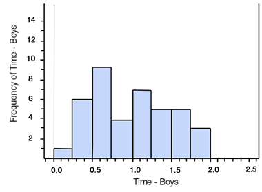
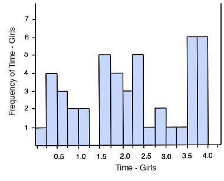

# Measures of Central Tendency - Quiz

## Objectives
You will be able to:
* Understand and describe the significance of measuring central tendency of continuous data
* Understand the formula and intuition behind the mean, median, mode and modal class
* Compare mean-median-mode, along with histograms to explain the central tendency of given data

**Note, for these exercises, you do not need to write code to answer them - we'll do that later. Just do them by hand or with a calculator to make sure you're comfortable with the process of calculating the answers!**

### Exercise 1
Calculate the mean, median and mode for this data set: 
```
19, 18, 21, 16, 15, 17, 20, 18
```
While comparing the results of three measures, comment about this distribution. 


```python
# Your answer here 
```

### Exercise 2

Calculate the mean, median and mode for given distribution and state which of these measures does not describe the "middle" of this data set? and why ?
```
100, 99, 97, 97, 96, 98, 95, 72
```


```python
# Your answer here 
```

### Exercise 3
On the first three days of his bookshop opening, Joe sold 15, 18, and 16 books (He initially hoped that he would sell 17 books every day).  How many books does he need to sell on the next day to have a mean sale of 17?


```python
# Your answer here 
```

### Exercise 4
The histograms show the amount of time (hours per day) spent on Facebook by 46 middle school girls and 40 middle school boys from a school in San Francisco. A total of 50 boys and 50 girls took the survey, 4 girls and 10 boys did not use Facebook at all. 
Each is graphed with a bin width of 0.25 hours.




Looking at these histograms, answer following questions. 

*Hint: For most parts, you will have to figure out the location of required bins and count the frequencies. *

#### How many boys spend more than 1.5 hours/day on Facebook?


```python
# Your answer here 
```

#### Compare the percentage of boys and girls that spend more than zero but less than 1 hour/day on Facebook.


```python
# Your answer here 
```

#### Find the bin where the median of the boys' data set lies.


```python
# Your answer here 
```

#### In terms of Facebook usage times based on given data, what can you conclude about usage habits of boys and girls?


```python
# Your answer here 
```
