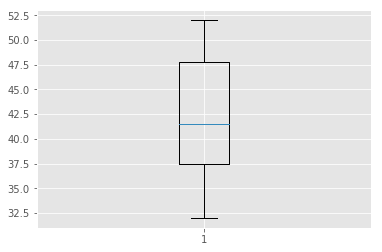

# Measures of Dispersion - Quiz

## Objectives
You will be able to:
* Describe the significance of calculating measures of dispersion for continuous data
* Understand the formula and intuition behind mean absolute deviation, standard deviation and variance
* Understand the formula and intuition behind quantiles/quartiles and percentiles
* Understand and interpret Interquartile distances with box plots

## Exercise 1
Summary statistics for two samples of data are
```
Sample 1:	
mean = 19 
variance = 10

Sample 2:	
mean = 10
variance = 19
```
Which sample has the larger spread of observations?


```python
2
```


    2


## Exercise 2
Consider the following ordered set of data
```
4 4 4 9 5 0 5 1 5 3 5 7 5 8 6 2

6 6 6 6 6 8 7 1 7 5 7 7 8 0 8 5
```

* What is the IQR? 
* Optional extension: Verify your answer in Python 


```python
import numpy as np
dist = [4, 4, 4, 9, 5, 0, 5, 1, 5, 3, 5, 7, 5, 8, 6, 2, 6, 6, 6, 6, 6, 8, 7, 1, 7, 5, 7, 7, 8, 0, 8, 5]
def iqr(dist):
    return np.percentile(dist, 75) - np.percentile(dist, 25)

print(iqr(dist))

```

    3.0


### Exercise 3
Create a box-and-whisker plot for the judges' scores for an artist's performances in a talent competition.

```
Evan L	52
Nicole S  50
Pamela A  47
Chad O	44
Erin A	39
Jake P	38
Niecy N   36
Kate G	32
```
Create a box plot in matplotlib to identify the median for giving a final score to the artist. Are there any outliers ?


```python
import matplotlib.pyplot as plt
plt.style.use('ggplot')
dict = {"Evan L  ":  52,
"Nicole S":  50,
"Pamela A":  47,
"Chad O  ":  44,
"Erin A  ":  39,
"Jake P  ":  38,
"Niecy N ":  36,
"Kate G  ":  32}

print(np.median(list(dict.values())))

plt.boxplot(list(dict.values()), showfliers=True)
plt.show()
```

    41.5





```python
print(np.median(list(dict.values())))

```

    41.5


### Exercise 4
Imagine that the number of marriages registered over a 10 year period were as follows:

Table 1.  Number of registered marriages
```
Year  Number of marriages

1	40,650
2	40,812
3	41,300
4	41,450
5	39,594
6	40,734
7	39,993
8	38,814
9	37,828
10   35,716
```
Using the data above:

####  Find the median 


```python
# Your answer here 
```

#### Find the upper and lower quartiles


```python
# Your answer here 
```

#### Calculate the interquartile range


```python
# Your answer here 
```

#### Plot a boxplot to verify your answers


```python
# Your answer here 
```
