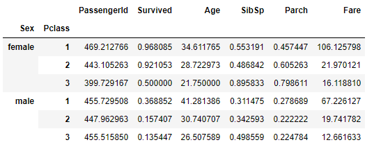

# Split, Apply and Combine in Pandas


## Introduction

In this lab, we're going to learn how to use `.groupby()` statements in Pandas to split, apply and group data sets.

## Objectives
You will be able to:
* Understand why split, apply and combines are useful for DataFrames
* Understand what a groupby object is and split a DataFrame using a groupby
* Use an `apply` on a DataFrame using a named function or a lambda function

## Using `.groupby()` statements

Consider an example of the titanic dataframe:


During the Exploratory Data Analysis phase, one of the most common tasks we'll want to do is split our dataset into subgroups and compare them to see if we can notice any trends.  For instance, we may want to group the passengers together by gender or age. We can do this by using the `.groupby()` function built-in to pandas DataFrames. 

To group passengers by gender, we would type:

```python
df.groupby('Sex')

# This line of code is equivalent to the one above
df.groupby(df['Sex'])
```

Note that this alone will not display a result--although we have split the dataset into groups, we do not have a meaningful way to display information until we chain it with an **_Aggregation Function_**.  This allows us the DataFrame to compute summary statistics, which we can them combine together and display. 

We can quickly use an aggregation function by chaining the call to the end of our groupby method.

```python
df.groupby('Sex').sum()
```


The code above returns displays the following DataFrame:


We can use aggregation functions to quickly help us compare subsets of our data.  For example, the aggregate statistics displayed above allow us to quickly notice that there were more female survivors overall than male survivors (although it is important to note that this does not tell us how many male or female passengers exist overall).

## Aggregation Functions


The following list contains aggregation functions that are built-in to pandas for use with `.groupby()` statements:

* `.min()` -- returns the minimum value for each column by group
* `.max()` -- returns the maximum value for each column by group
* `.mean()` -- returns the average value for each column by group
* `.median()` -- returns the median value for each column by group
* `.count()` -- returns the count of each column by group


We can see a list of all available aggregation functions by creating a grouped object and then using tab to inspect the available methods we can call:

```python
grouped_df = df.groupby('Sex')
grouped_df.<TAB>
```

This will display the following output:

```
In [26]: grouped_df.<TAB>
gb.agg        gb.boxplot    gb.cummin     gb.describe   gb.filter     gb.get_group  gb.height     gb.last       gb.median     gb.ngroups    gb.plot       gb.rank       gb.std        gb.transform
gb.aggregate  gb.count      gb.cumprod    gb.dtype      gb.first      gb.groups     gb.hist       gb.max        gb.min        gb.nth        gb.prod       gb.resample   gb.sum        gb.var
gb.apply      gb.cummax     gb.cumsum     gb.fillna     gb.gender     gb.head       gb.indices    gb.mean       gb.name       gb.ohlc       gb.quantile   gb.size       gb.tail       gb.weight
```

This is a comprehensive list of all built-in functions available to grouped objects.  Note thaat some are aggregation functions, while others, such as `gb.fillna()` allows us fill the null values to individual groups independently.  

## Grouping With Multiple Groups

We can also split our data into multiple different levels of groups by passing in an array containing the name of every column we would like to group by--for instance, by every combination of both `Sex` and `Pclass`.    

```python
df.groupby(['Sex', 'Pclass']).mean()
```

The code above would return the following DataFrame:



## Selecting Information From Grouped Objects

Since the resulting object returned is a DataFrame, we can also slice a selection of columns we're interested in from the DataFrame returned. 

The example below demonstrates the syntax for returning the mean of the `Survived` class for every combination of `Sex` and `Pclass`:

```python
df.groupby(['Sex', 'Pclass'])['Survived'].mean()
```

The code above returns the following DataFrame:


The above example slices by column, but we can also slice by index, by providing the combination of indices we want in order to slice by group--note that we can provide one or more levels of index values.  See the example below:

```python
grouped = df.groupby(['Sex', 'Pclass'])['Survived'].mean()
print(grouped['female'])

# Output:
# Pclass
# 1    0.968085
# 2    0.921053
# 3    0.500000
# Name: Survived, dtype: float64

print(grouped['female'][1])
# Output:
# 0.968085
```

Note that when we provide only the value `female` as the index, we get all groups where the passenger is female, regardless of the `Pclass` value. In the second example, we specify that we want the results for female passengers with a 1st-class ticket. 

## Conclusion

In this lab, we learned about how to:

* **_Split_** our DataFrameinto different subgroups with the `.groupby()` method
* **_Apply_** aggregation functions to our subgroups independently
* **_Combine_** the results into a new DataFrame that we can visualize and access using basic pandas slicing syntax

