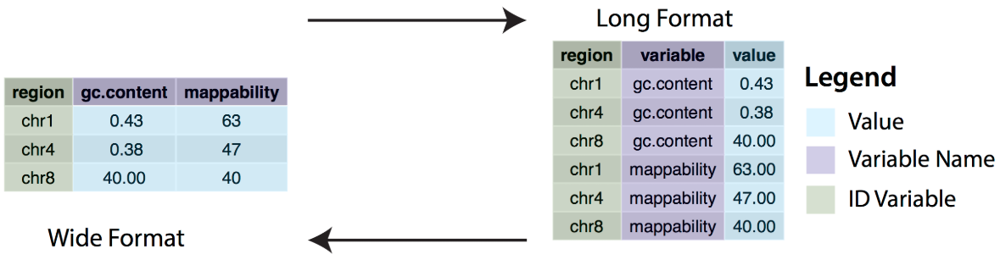
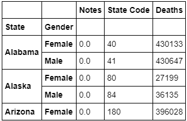
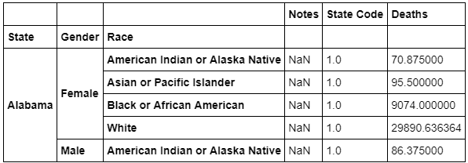
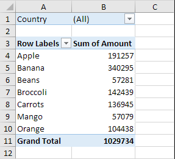
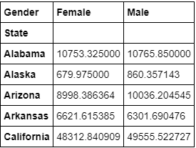

# Pivot Tables With Pandas

## Introduction

In this section, we'll learn about the various ways we can index and structure our data sets to make it easier to process or understand.  We start by learning about the difference between the **_Wide_** format and the **_Long_** format, compare basic flattened index structures with multi-hierarchical index structures, and then create them ourselves using aggregation functions and pivot tables!

## Objectives

You will be able to:

* Understand and explain what a multi-level hierarchical index is
* Understand, explain the difference and use df.pivot and pd.pivot_table
* Switch between “long” and “wide” in a DataFrame using stack() and unstack()
* Transform “wide” to “long” DataFrames using `melt`


## Long and Wide Formats


These two different formats refer to how we structure our data in a DataFrame.  We'll start by comparing the two, and discussing the salient points of each. 

### Wide Format

This is the common setup you're probably used to seeing. In the wide format, each column of data represents a variable, and each row represents 1 observation.  If this were a medical dataset, each row would be the data corresponding to a different patient. 

In wide format, the index usually an integer, with 0 being the topmost row.  


### Long Format

In Long format, each index is a point in time for each observation.  See the following diagram for comparison of the two:

<br>
<br>


Note that in this format, a given observation has values across multiple rows.  This is an especially useful format when dealing with time series data, or aggegrated data, because we can make use of **_Multi-Hierarchical Indexing_**,

## Multi-Hierarchical Indexing

A common task when working with data is to create pivot tables, or group the data using aggregation functions.  In this respect, the Long format is provides a very neat, organized way of structuring our data with multiple levels of indexes, allowing us to cleanly and easily represent different combinations of data.  Consider the following pivot table below (which you'll create yourself in the next lab):
<br>
<br>



We can see by looking at the left two columns that this DataFrame has a Multi-Hierarchical Index with 2 levels, consisting of the "State" and Gender.  In this way, we have an easy way to aggregate and organize information to allow us to quickly answer questions with our data like "What was the total number of deaths by gender in Alabama?".

Let's take a look at one more example:




In this DataFrame, the index has three hierarchical levels, with the outermost being "State" and the innermost being "Race".


## `.groupby()` and Aggregation Functions

Pandas DataFrames provide an easy way to group data using the `.groupby()` function.  To use this function, we just specify our indices in order (the columns we want to group the data by) and the function will return a new DataFrame containing the data grouped as we asked. 

For instance, if we wanted to group the Titanic Dataset by the port of embarkation, we would type:

```python
dataframe.groupby("Embarked")
```

This would give us a long format DataFrame with a flat index structure akin to the example in the top-most diagram.

Perhaps we want to group our data by both the port of embarkation and the ticket class (Labeled as _Pclass_ in the Titanic Dataset), we would type:

```python
dataframe.groupby(['Embarked', 'Pclass'])
```

This would return a DataFrame with a multihierarchical index, with `'Embarked'` being the outermost level.

Groupby statements are most commonly used with aggregation functions, which allow us to quickly calculate summary statistics such as the mean, median, min, max, mode, count, etc.  

Building on our last example, if we wanted to see the mean values for every grouping of `Embarked` and `Pclass` across different variables,  we would type:

```python
dataframe.groupby(['Embarked', 'Pclass']).mean()
```

Notice that we can make use of method chaining to quickly and concisely call the aggregation function at the same time as the groupby function.  

## Pivot Tables

Pivot tables are a common toolset that you might have used before in spreadsheet software such as Microsoft Excel or Google Sheets.  


<br>
<center>_An Example Pivot Table created in Microsoft Excel_</center>

Pivot tables allow us to quickly examine our data by "pivoting" on different variables of interest.  Pandas allows us to easily create pivot tables with a built-in `.pivot()` method.

In order to create a pivot table, we need to just call the `dataframe.pivot()` method and specify the `index` column, the `columns` to put in our pivot table, and the `value` to put in each cell.  

For example, let's look at a pivot table you'll create in the next lab:

```python
some_dataframe.pivot(index='State', columns='Gender', values='Deaths_mean')
```

would return this pivot table:



Don't worry about the data this actually contains, as you don't yet have the context because you haven't been introduced to the dataset. Instead, just pay attention to the structure of the indexes.


## Stacking and Unstacking Data

One of the quickest ways to manipulate the format of a dataset in python is to use the `.stack()` and `unstack()` methods built into pandas DataFrames.  

Take a look at the following diagram and see if you can figure out what the `unstack()` is doing.


By telling the `.unstack()` call which index we want to unstack, we can move it from the index section over to the right as a variable column--`.stack()` would do the exact opposite, moving data to the left and making it a level of the index.  

## Summary

We spent some time in this lesson learning about approaches to indexing and structuring our data sets. In the next lesson, we'll get some hands on practice!

