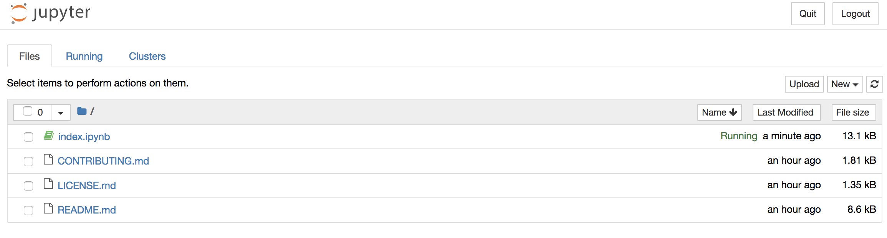
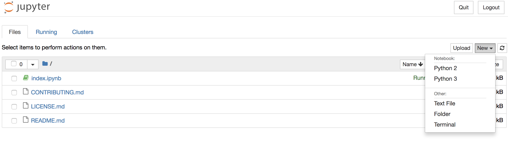
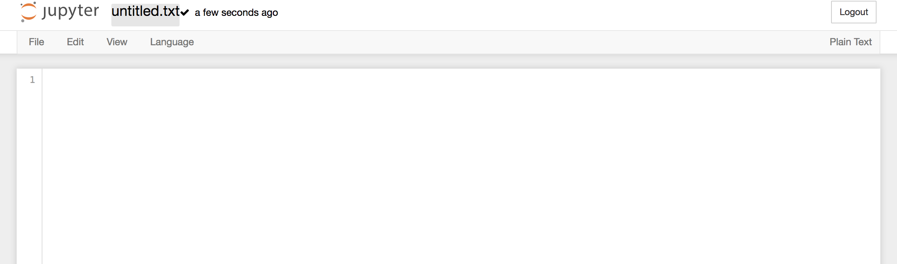
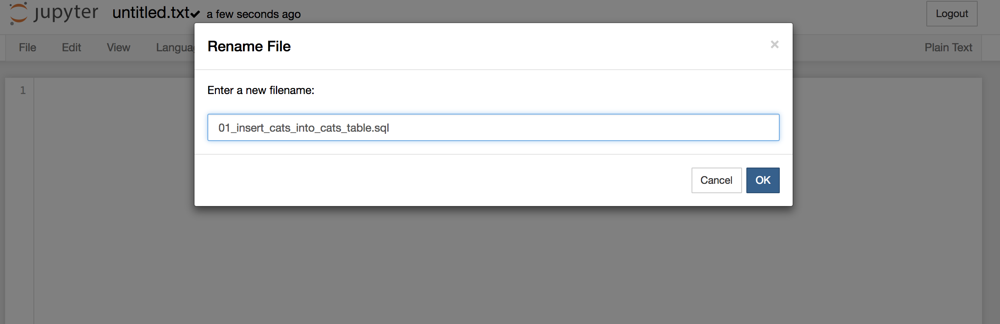

# Selecting Data

## Introduction

In this lesson, we'll cover different ways to manipulate and select data from SQL database tables including inserting, selecting, updating, and deleting database rows.

## Objectives

You will be able to:

* Understand the basic structure of a `SELECT` statement in SQL
* Use `INSERT INTO`, `UPDATE` and `DELETE` statements in SQL
* Understand the relationship between SQL and relational databases

## Setting Up Our Database

In this code along, we'll be creating a `cats` table in a `pets_database.db`. So, let's navigate to our terminal and get started.

First let's create our `pets_database` by importing sqlite3 and running the following commands in our notebook.
```python 
import sqlite3 
connection = sqlite3.connect('pets_database.db')
cursor = connection.cursor()
```


```python
# connect database and create cursor here
```

Now that we have a database, let's create our `cats` table along with `id`, `name`, `age` and `breed` columns. Remember that we use our cursor to execute these SQL statements, and that the statements must be wrapped in quotes (`'''SQL statement GOES here'''`)


```python
cursor.execute('''
CREATE TABLE cats (
	id INTEGER PRIMARY KEY,
	name TEXT,
	age INTEGER,
	breed TEXT
)
''')
```


```python
# create table here
```

Okay, let's start storing some cats.

### Code Along I: INSERT INTO

Next, to insert a record with values, type the following:

```python
cursor.execute('''INSERT INTO cats (name, age, breed) VALUES ('Maru', 3, 'Scottish Fold');''')
```


```python
# insert Maru into the pet_database.db here
```

We use the `INSERT INTO` command, followed by the name of the table to which we want to add data. Then, in parentheses, we put the column names that we will be filling with data. This is followed by the `VALUES` keyword, which is accompanied by a parentheses enclosed list of the values that correspond to each column name.

**Important:** Note that we *didn't specify* the "id" column name or value. Since we created the `cats` table with an "id" column whose type is `INTEGER PRIMARY KEY`, we don't have to specify the id column values when we insert data. Primary Key columns are auto-incrementing. As long as you have defined an id column with a data type of `INTEGER PRIMARY KEY`, a newly inserted row's id column will be automatically given the correct value.

Let's add a few more cats to our table. To do this, we can (1) use our jupyter notebook by navigating to the **home** tab in our browser that is opened after running the `jupyter notebook` command in our command line (*or you can open a new tab and navigate to `localhost:8888`*), or we can (2) open our text editor (i.e. atom or sublime). We'll need to create a file, `01_insert_cats_into_cats_table.sql`. 

To create a file with jupyter notebook, you will need to:
1. Click the `new` button on the right of the page

2. Select `text file` from the drop-down menu

3. Click in the top right on `Untitled.txt` and rename the file appropriately

4. Enter the appropriate new file name and press `ok`


To create a text file via your text editor, you can simply enter the following command in your command line:

> `touch 01_insert_cats_into_cats_table.sql`
* **Note:** *you will need to be located inside the directory where this file should be created.*

Once the `01_insert_cats_into_cats_table.sql` file is created, use two `INSERT INTO` statements to insert the following cats into the table:

|name|age|breed|
|----|---|-----|
|"Lil\' Bub"|5|"American Shorthair"|
|"Hannah"|1|"Tabby"|

Each `INSERT INTO` statement gets its own line in the `.sql` file in your text editor or jupyter notebook. Each line needs to end with a `;`. Run the file with the following code:

```python
file = open("./01_insert_cats_into_cats_table.sql", 'r') # opens the SQL file
sql = file.read() # reads and returns the SQL statements
cursor.executescript(sql) # executes the returned SQL statements and inserts the values into the table
file.close() # closes the file
```


```python
# execute the INSERT INTO statements here
```

Now, we'll learn how to `SELECT` data from a table, which will help us to confirm that we inserted the above data correctly.

## Selecting Data

Now that we've inserted some data into our `cats` table, we likely want to read that data. This is where the `SELECT` statement comes in. We use it to retrieve database data, or rows.

### Code Along II: SELECT FROM

A basic `SELECT` statement works like this:

```sql
SELECT [names of columns we are going to select] FROM [table we are selecting from];
```

We specify the names of the columns we want to SELECT and then tell SQL the table we want to select them FROM.

We want to select all the rows in our table, and we want to return the data stored in any and all columns in those rows. To do this, we could pass the name of each column explicitly:

```sql
SELECT id, name, age, breed FROM cats;
```

Which should give us back:

```bash
1|Maru|3|Scottish Fold
2|Lil\' Bub|5|American Shorthair
3|Hannah|1|Tabby
```

A faster way to get data from every column in our table is to use a special selector, known commonly as the 'wildcard', `*` selector. The `*` selector means: "Give me all the data from all the columns for all of the cats" Using the wildcard, we can `SELECT` all the data from all of the columns in the cats table like this:

```sql
SELECT * FROM cats;
```

Now let's try out some more specific `SELECT` statements:

#### Selecting by Column Names

To select just certain columns from a table, use the following:

```python
cursor.execute('''SELECT name FROM cats;''').fetchall()
```
That should return the following:

```python
[('Maru',), ("Lil' Bub",), ('hannah',)]
```

You can even select more than one column name at a time. For example, try out:

```python
cursor.execute('''SELECT name, age FROM cats;''').fetchall()
```


**Top-Tip:** If you have duplicate data (for example, two cats with the same name) and you only want to select unique values, you can use the `DISTINCT` keyword. For example:

```python
cursor.execute('''SELECT DISTINCT name FROM cats;''').fetchall()
```


```python
# select cats from database here
```

#### Selecting Based on Conditions: The `WHERE` Clause
What happens when we want to retrieve a specific table row? For example the row that belongs to Maru? Or to retrieve all the baby cats who are younger than two years old? We can use the `WHERE` keyword to select data based on specific conditions. Here's an example of a boilerplate `SELECT` statement using a `WHERE` clause.

```python
cursor.execute('''SELECT * FROM [table name] WHERE [column name] = [some value];''').fetchall()
```

Let's retrieve *just Maru* from our `cats` table:

```python
cursor.execute('''SELECT * FROM cats WHERE name = "Maru";''').fetchall()
```
That statement should return the following:

```python
[(1, 'Maru', 3, 'Scottish Fold')]
```

We can also use comparison operators, like `<` or `>` to select specific data. Let's give it a shot. Use the following statement to select the young cats:

```python
cursor.execute('''SELECT * FROM cats WHERE age < 2;''').fetchall()
```

**Advanced:** The SQL statements we're learning here will eventually be used to integrate the applications you'll build with a database. For example, it's easy to imagine a web application that has many users. When a user signs into your app, you'll need to access your database and select the user that matches the credentials an individual is using to log in.


```python
# select using WHERE clause here
```

## Altering a Table

We can also update a table like this:
    ```cursor.execute('''ALTER TABLE cats ADD COLUMN notes text;''')```
    
The general pattern is ```ALTER TABLE table_name ADD COLUMN column_name column_type;```

## Updating Data

Let's talk about updating, or changing, data in our table rows. We do this with the `UPDATE` keyword.

### Code Along III: UPDATE

A boilerplate `UPDATE` statement looks like this:

```python
cursor.execute('''UPDATE [table name] SET [column name] = [new value] WHERE [column name] = [value];''')
```

The `UPDATE` statement uses a `WHERE` clause to grab the row you want to update. It identifies the table name you are looking in and resets the data in a particular column to a new value.

Let's update one of our cats. Turns out Maru's friend Hannah is actually Maru's friend *Hana*. Let's update that row to change the name to the correct spelling:

```python
cursor.execute('''UPDATE cats SET name = "Hana" WHERE name = "Hannah";''')
```

One last thing before we move on: deleting table rows.


```python
# update hannah here
```

## Deleting Data

To delete table rows, we use the `DELETE` keyword.

### Code Along IV: DELETE

A boilerplate `DELETE` statement looks like this:

```python
cursor.execute('''DELETE FROM [table name] WHERE [column name] = [value];''')
```

Let's go ahead and delete Lil' Bub from our `cats` table (sorry Lil' Bub):

```python
cursor.execute('''DELETE FROM cats WHERE id = 2;''')
```


```python
# DELETE record with id=2 here
```

Notice that this time we selected the row to delete using the Primary Key column. Remember that every table row has a Primary Key column that is unique. Lil' Bub was the second row in the database and thus had an id of `2`.

<p data-visibility='hidden'>View <a href='https://learn.co/lessons/sql-insert-select-update-code-along' title='Inserting, Selecting, Updating, and Deleting Database Rows'>Inserting, Selecting, Updating, and Deleting Database Rows</a> on Learn.co and start learning to code for free.</p>


## Summary

In this section, you learned different ways to manipulate and select data from SQL database tables including inserting, selecting, updating, and deleting database rows.


