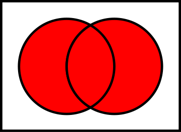
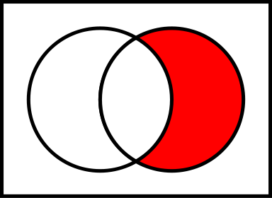
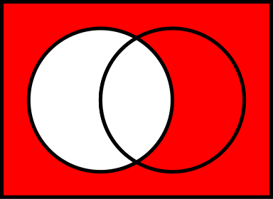
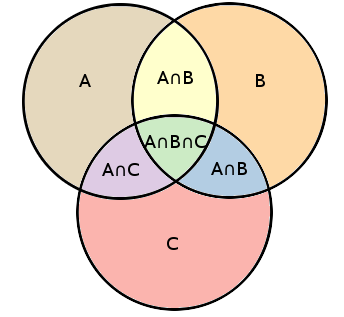

# Introduction to Sets

## Introduction

You have definitely heard of sets before. In this section, however, you will learn about a formal definition of sets, which will serve as a foundation for everything related to probability and combinatorics!

## Objectives

You will be able to: 

- Understand what a set is
- Define a universal set and subsets
- Learn about sets unions, intersections, complements
- Learn how to use Venn Diagrams to understand about the relationships between sets

## What is a set? 

In probability theory, a set is denoted as a *well-defined colletion of objects*. 

Mathematically, you can define a set by $S$. If an element $x$ belongs to a set $S$, then you'd write $x \in S$. On the other hand, if $x$ does not belong to a set $S$, then you'd write $x\notin S$.

Example: Imagine we define $S$ the set of even numbers.

If $x = 2$, $x\in S$ because $x$ is an even number.

If $x = 9$, $x\notin S$ because $x$ is not an even number.

## Subsets

Set $T$ is a subset of set $S$ if *every element* in set $T$ is also in set $S$. The mathematical notation for a subset is $T \subset S$. 

Do note that this particular definition doesn't require $S$ and $T$ to be different. In fact you could argue that a special case of a subset is where $T = S$! In this case, however, not only is $T \subset S$, but it is also true that $S \subset T$. We say that T is a *proper subset* if S if T and S are not equal, this is sometimes also denoted by $T \subsetneq S$. 

To avoid any confusion regarding whether $T$ is a proper subset of $S$ or not, you can use $T \subsetneq S$ and $T \subseteq S$ instead of the more ambiguous $\subset$.

**Example**: If S is the set of even numbers, set $T = {2, 6, 22}$ is a proper subset of $S$. Formally, you can write this as $T \subsetneq S$, or more ambiguously, $T \subset S$.

## Universal sets

The collection of all possible outcomes in a certain context or universe is called the **universal set**.
A universal set is often denoted by $\Omega$.

Example of a universal set: all the possible outcomes when rolling a dice.

$\Omega = \{1,2,3,4,5,6\}$

So remember that a universal set is not necessarily all the possible things that have ever existed. typically, a universal set is just all the possible elements within certain bounds, e.g., the set of all countries in the world, the set of all the animal species in the Bronx Zoo,...

Do note that a universal set can have an infinite number of elements, for example, the set of all real numbers!

## Elementary set operations

Let's talk about set operations. Imagine you have two sets of numbers, say the first 4 multiples of 3 in set $S$:

$ S = \{3,6,9,12\}$

and the first 4 multiples of 2 in set $T$:

$ T = \{2,4,6,8\} $.

### a) Union of two sets

The union of 2 sets $S$ and $T$ is the set of elements of either S or T, or in both.  

Applied to our example, the union of $S$ and $T$ is given by the elements $\{2,3,4,6,8,9,12\}$. 

In mathematical terms, the union of $S$ and $T$ is denoted as $S \cup T$

A popular way to represent sets and their relationships is through Venn Diagrams, (https://en.wikipedia.org/wiki/Venn_diagram), see picture below!

### b) Intersection of Two sets 

The intersection of two sets $S$ and $T$ is the set that contains all elements of $S$ that also belong to $T$. 

Applied to our example, the intersection of $S$ and $T$ is given by {6}, so it contains the elements that are multiples of both 2 AND 3.

In mathematical terms, the union of $S$ and $T$ is denoted as $S \cap T$.

### c) Relative complement or the difference

If we have S and T, the relative complement of S contains all the elements of T that are NOT in S. This is also sometimes referred to as the *difference*. The difference is denoted by $ T\backslash S $ or $T-S$.

In this case, the relative complement of S (or $ T\backslash S $) is $\{2,4,8\}$. The relative complement of T (or $ S\backslash T $) is $\{3,9,12\}$.

### d) Absolute complement

There is another definition of the complement when we consider universal sets $\Omega$ as well. In this context, we talk about the *absolute complement*.

The absolute complement of $S$, with respect to the Universal set $\Omega$, is the collection of the objects in $\Omega$ that don't belong to $S$.

Note how the definition of $\Omega$ is very important here. Imagine a set $S= \{\text{elephant, alligator, tiger, bear}\}$. The complement of this set will depend on how the universal set is defined. E.g. is $\Omega$ equal to *the animals in the Bronx Zoo*, or perhaps *the 20 most deadly animals in the world*?

Mathematically, the absolute complement of $S$ is denoted as $S'$ or $S^c$.

Let's reconsider $S$ and $T$ as defined previously.

Let's define $\Omega$ the universal set (denoted by the box around the two venn diagrams), and let
s assume this set contains the multiples of both 2 and 3 until 20. Then the elements of $\Omega$ are $\{2,3,4,6,8,9,10,12,14,15,16,18,20\}$. 

The absolute component of $S$ (so $S'$ or $S^c$) is then given by $\{2,4,8,10,14,15,16,18,20\}$.

## Inclusion Exclusion principle

Note that if we want to know how many elements are in set $S$ versus $T$ we cannot simply sum up the elements, because they have elements in common.

In combinational mathematics, the inclusion-exclusion principle is a counting technique solve this problem.

When having 2 sets, the method for obtaining the union of two finite sets is given by:

$\mid S \cup T \mid = \mid S \mid + \mid T \mid - \mid S \cap T \mid $

Where the horizontal lines denote the *cardinality* of a set, which is the number of elements, considering a finite set. 

The formula expresses the fact that the sum of the sizes of the two sets may be too large since some elements may be counted twice. For the double-counted elements, one is substracted again.

This formula can be extended to three sets, four sets, etc. Imagine we have a third set $R$:

$\mid S \cup T\cup R \mid = \mid S \mid + \mid T \mid + \mid R \mid - \mid S \cap T \mid  -\mid S \cap R \mid - \mid R \cap T \mid  + \mid S \cap T \cap R \mid $

## Empty sets

When there are no elements in a certain set, we say that the set is **empty**, denoted by $\emptyset$ or simply $\{\}$

## Sets in Python

Some things to bear in mind when working with sets in Python

* Sets are unordered collections of unique elements.
* Sets are iterable.
* Sets are collections of lower level python objects (just like lists or dictionaries).

documentations can be found here: 
https://docs.python.org/2/library/sets.html

## Summary

In this section, we started off explaining what sets, subsets and universal sets are. Next, you learned about some elementary such as unions, intersections and complements. After that, we tied all this info together through the inclusion exclusion principle. Finally we talked a little bit about how sets work in Python.
