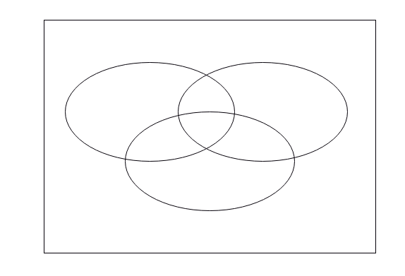

# Introduction to Sets - Lab

## Introduction

Probability theory is all around. A common example is in the game of poker or related card games, where players try to calculate the probability of winning a round given the cards they have in their hands. Also in the business context probabilities play an important role. Operating in an volatile economy, companies need to take uncertainty into account and this is exactly where probability theory plays a role.

As mentioned in the lesson before, a good understanding of probability starts with understanding of sets and set operations. That's exactly what you'll learn in this lab!

## Objectives

You will be able to:

- Have a better sense of what sets, universal sets, and subsets are
- Know how to perform common set operations in Python 
- Learn how to use Venn Diagrams to understand about the relationships between sets


## Exploring set operations using a Venn Diagram

Let's start with a pretty conceptual example. Let's consider the following sets:

   - $\Omega$ = positive integers between [1, 12]
   - $A$= even numbers between [1, 10]
   - $B = \{3,8,11,12\}$
   - $C = \{2,3,6,8,9,11\}$
    

#### a. Illustrate all the sets in a Venn Diagram like the one below. The rectangular shape represents the universal set.



#### b. Using your Venn Diagram, list the elements in each of the following sets:

- $ A \cap B$
- $ A \cup C$
- $A^c$ 
- The absolute complement of B
- $(A \cup B)^c$
- $B \cap C'$
- $A\backslash B$
- $C \backslash (B \backslash A)$ 
- $(C \cap A) \cup (C \backslash B)$
        
#### c. As seen in the lecture, you can easily create sets in Python as well. For the remainder of this exercise, let's  create sets A, B and C and universal set U in Python and test out the results you came up with.


```python
# Create set A
A = None
'Type A: {}, A: {}'.format(type(A), A)
```


```python
# Create set B
B = None
'Type B: {}, B: {}'.format(type(B), B)
```


```python
# Create set C
C = None
'Type C: {}, C: {}'.format(type(C), C)
```


```python
# Create universal set U
U = None
'Type U: {}, U: {}'.format(type(U), U)
```

Now, verify your answers in section 1 by using the correct methods in Python. To provide a little bit of help, you can find a table with common operations on sets below.

| Method        |	Equivalent |	Result |
| ------                    | ------       | ------    |
| s.issubset(t)             |	s <= t     | test whether every element in s is in t
| s.issuperset(t)           |	s >= t     | test whether every element in t is in s
| s.union(t)                |	s $\mid$ t | new set with elements from both s and t
| s.intersection(t)         |	s & t      | new set with elements common to s and t
| s.difference(t)           |	s - t 	   | new set with elements in s but not in t
| s.symmetric_difference(t) |	s ^ t      | new set with elements in either s or t but not both

#### 1. $ A \cap B$


```python
A_inters_B =  None
A_inters_B
```

#### 2. $ A \cup C $


```python
A_union_C = None
A_union_C
```

#### 3.  $A^c$ (you'll have to be a little creative here!)


```python
A_comp = None # or A_comp = U-A
A_comp
```

#### 4.  $(A \cup B)^c $

A_union_B_comp = U - (A | B) 
A_union_B_comp

#### 5. $B \cap C' $


```python
B_inters_C_comp = None
B_inters_C_comp
```

#### 6. $A\backslash B$


```python
A_min_B = None
A_min_B
```

#### 7. $C \backslash (B \backslash A) $


```python
C_min_B_min_A= None
C_min_B_min_A
```

#### 8.  $(C \cap A) \cup (C \backslash B)$


```python
C_inters_A_union_C_min_B= None
C_inters_A_union_C_min_B
```

## The Inclusion Exclustion Principle

Use A, B and C from exercise one to verify the inclusion exclusion principle in Python. What you'll do is translate the left hand side of the equation for the inclusion principle in the object `left_hand_eq`, and the right hand side in the object `right_hand_eq` and see if the results are the same.


```python
left_hand_eq = None
print(left_hand_eq)  # 9
```


```python
right_hand_eq = None
print(right_hand_eq) # 9
```


```python
None # needs to say "True"
```

## Set Operations in Python

Mary is preparing for a road trip from her hometown, Boston, to Chicago. She has quite a few pets, yet luckily, so do her friends. They try to make sure that they take care of each other's pets while someone is away on a trip. A month ago, each respective person's pet collection was given by the following three sets:


```python
Nina = set(["Cat","Dog","Rabbit","Donkey","Parrot", "Goldfish"])
Mary = set(["Dog","Chinchilla","Horse", "Chicken"])
Eve = set(["Rabbit", "Turtle", "Goldfish"])
```

In this exercise, you'll be able to use the following operations:

|Operation                          |	Equivalent |	Result|
| ------                            | ------       | ------   |
|s.update(t)                        | 	$s \mid t$ 	   |return set s with elements added from t|
|s.intersection_update(t)           | 	s &= t     |	return set s keeping only elements also found in t|
|s.difference_update(t)             |	s -= t 	   |return set s after removing elements found in t|
|s.symmetric_difference_update(t)   |	s ^= t 	   |return set s with elements from s or t but not both|
|s.add(x)                           |	           |	add element x to set s|
|s.remove(x)                        |	           |	remove x from set s|
|s.discard(x)                       |	           |	removes x from set s if present|
|s.pop()                            | 	           |	remove and return an arbitrary element from s|
|s.clear()            	            |  	           |remove all elements from set s|

Sadly, Eve's turtle passed away last week. Let's update her pet list accordingly.


```python
None
Eve # should be {'Rabbit', 'Goldfish'}
```

This time around, Nina promised to take care of Mary's pets while she's awat. but also wants to make sure her pets are well taken care of. As Nina is already spending a considerable amount of time taking care of her own pets, adding a few more won't make that much of a difference. Nina does want to update her list while Marie is away. 


```python
None
Nina # {'Chicken', 'Horse', 'Chinchilla', 'Parrot', 'Rabbit', 'Donkey', 'Dog', 'Cat', 'Goldfish'}
```

Mary, on the other hand, wants to clear her list altogether while away:


```python
None
Mary  # set()
```

Look at how many species Nina is taking care of right now.


```python
None
n_species_Nina # 9
```

Taking care of this many pets is weighing heavy on Nina. She remembered Eve had a smaller collection of pets lately, and that's why she asks Eve to take care of the common species. This way, the extra pets are not a huge effort on Eve's behalf. Let's update Nina's pet collection.


```python
None
Nina # 7
```

Taking care of 7 species seems doable for Nina!

## Writing down the elements in a set


Mary dropped off her Pet's at Nina's house, and finally made her way to the highway. Awesome, her vacation has begun!
She's approaching an exit. At the end of this particular highway exit, cars can either turn left (L), go straight (S) or turn right (R). It's pretty busy and there are two cars driving close to her. What we'll do now is create several sets. You won't be using Python here, it's sufficient to write the sets down on paper. A good notion of sets and subsets will help you calculate probabilities in the next lab!

a. Create a set $A$ of all possible outcomes assuming that all three cars drive in the same direction.
           
b. Create a set $B$ of all possible outcomes assuming that all three cars drive in a different direction.
             
c. Create a set $C$ of all possible outcomes assuming that exactly 2 cars turn right.
            
d. Create a set $D$ of all possible outcomes assuming that exactly 2 cars drive in the same direction.

                          
e. Write down the interpretation and give all possible outcomes for the sets denoted by:
 - I. $D'$ 
 - II. $C \cap D$, 
 - III. $C \cup D$. 

## Optional exercise: European Countries

Use set operations to determine which European countries are not in the European Union. You just might have to clean the data first with pandas.


```python
import pandas as pd

#Load Europe and EU
europe = pd.read_excel('Europe_and_EU.xlsx', sheet_name = 'Europe') 
eu = pd.read_excel('Europe_and_EU.xlsx', sheet_name = 'EU')

#Use pandas to remove any whitespace from names
None
None 
```


```python
europe.head(3) #preview dataframe
```


```python
eu.head(3)
```


```python
None
```


```python
None
```

## Summary

In this lab, you practiced your knowledge on sets, such as common set operations, the use of Venn Diagrams, the inclusion exclusion principle, and how to use sets in Python! 
