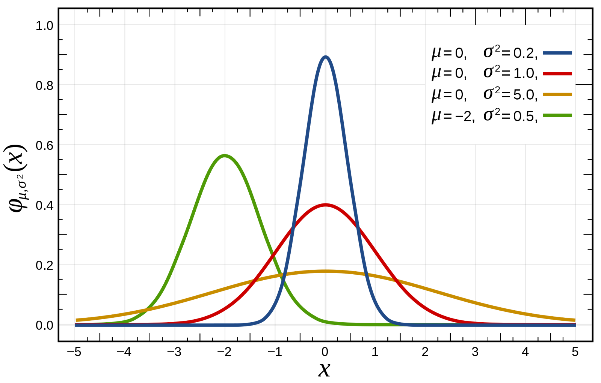
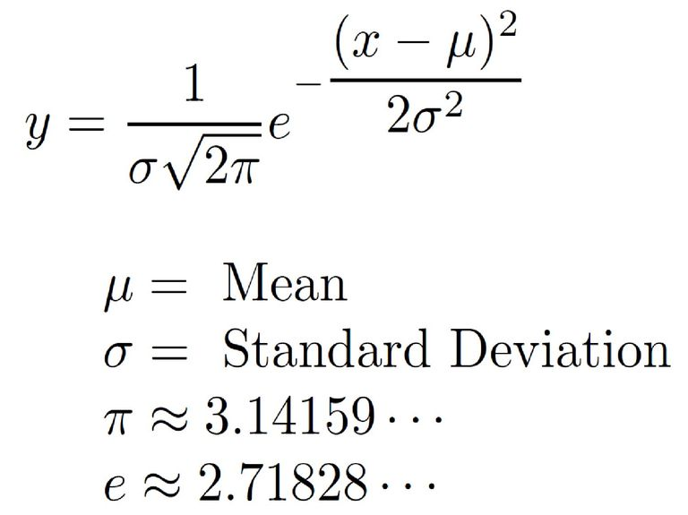
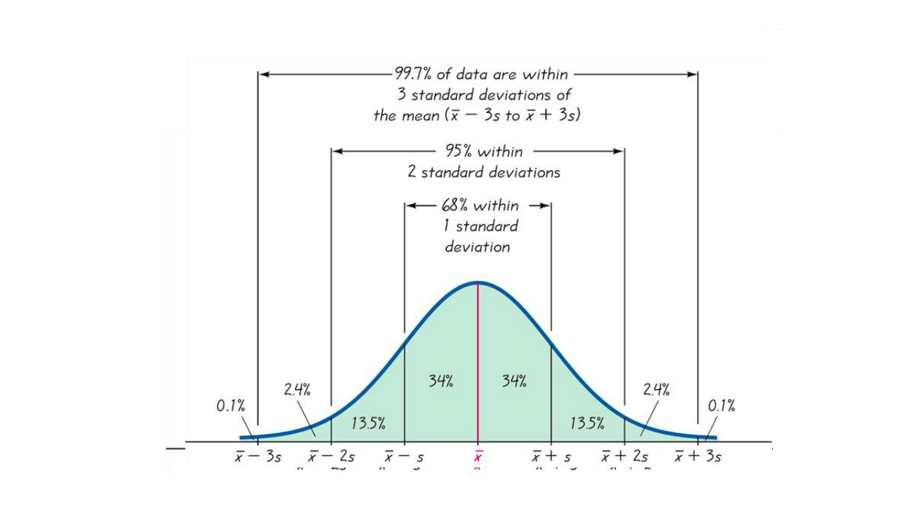
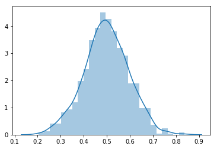

# Normal/Gaussian Distribution

## Introduction

For data scientists and machine learning professionals, gaussian (or normal) distribution stands out as one of the most commonly used distribution model. This lesson provides an introduction to gaussian distribution, its characteristics and its significance towards data analytics. 

## Objectives
You will be able to:

* Understand the characteristics of a Gaussian Distribution
* Identify examples in the real world that follow a Gaussian distribution
* Explain why the Gaussian Distribution is so important to data scientists
* How to generate and visualize normal distributions in Python

## The normal distribution
The normal distribution is the most important and most widely used distribution in statistics and analytics. It is also called the "bell curve," due to its shape or the "Gaussian curve" after the mathematician Karl Friedrich Gauss. This shape results in plotting normally distributed data as a histogram. A smoothing function may be used to smooth the outer edges of distribution to achieve the said "bell" shape as shown below. 


Here is a first simple definition for normal distribution like shown above: 

> Normal distribution is symmetrical and its mean, median and mode are equal. 

## Measures of Center and Spread 

If you remember skewness, you would recognize there is no skew in a perfectly normal distribution.  It is **centered around its mean**.

There could possibly be many normal distributions based on how they are defined. Normal distributions can differ in their means and in their standard deviations. 



The figure above shows four normal distributions. 
* The green distribution has a mean of -2 and a standard deviation of 0.5 
* The distribution in blue has a mean of 0 and a standard deviation of 0.2.
* The distribution in red has a mean of 0 and a standard deviation of 1. 
* The orange distribution has a mean 0 but a high spread with standard deviation 5.

These as well as all other normal distributions are symmetric with relatively higher densities of values at the center of the distribution and relatively lower density in the tails. We can also show above normal distributions using cdf approach we saw earlier. Here is what above distributions would look like as a function of their cumulative probabilities. 


## Normal Density Function
The density (number of values) of the normal distribution is reflected as the height for a given value on the x axis is shown below. A formula describing a normal distribution in terms of its tendencies of center and spread can be defined as:




Do not worry if this expression confuses you at this stage. The key takeaway here is to understand that normal distributions can be defined, created, processed and visualized only using two parameters as shown above, mean and standard deviation (pi and e are the constants in this equation). 

## Normal Characteristics

For now , we will identify normal distributions with following key characteristics. 

* Normal distributions are symmetric around their mean.
* The mean, median, and mode of a normal distribution are equal.
* The area under the bell curve is equal to 1.0.
* Normal distributions are denser in the center and less dense in the tails.
* Normal distributions are defined by two parameters, the mean (μ) and the standard deviation (σ).
* Around 68% of the area of a normal distribution is within one standard deviation of the mean 
(μ - σ to μ + σ)
* Approximately 95% of the area of a normal distribution is within two standard deviations of the mean ((μ - 2σ to μ + 2σ).

Above characteristics can be better visualized with a slightly more detailed description below. Here the spread is differentiated between different levels of deviation. If a value is found in the red region, it is termed as "within 1 standard deviation". Blue and green regions and 2 and 3 standard deviation away from mean respectively.





This forms a 68-95-99.7 rule, i.e., 68% values of a normal distribution are within 1 standard deviation of mean, 95% within 2 standard deviations and 99.7 % within 3 standard deviations. So normally distributed data is considered ideal for analysis due to this simplicity of description. Values in the extreme of tails (3 sd+) can be considered "interesting events" as their probability of occurrence is less than usual. Or in some cases, you consider them as outliers due to noise or error of measurement. It all depends on your analysis question.  

## Why so popular?

Here are some more reasons why these are so popular among data scientists:

### Ubiquitous in Natural Phenomena

An amazingly vast number of natural processes naturally follows the Gaussian distribution. A simple normal distribution gives the best model approximation for natural processes like weight, height, blood pressure, IQ levels of human beings (key in social sciences). Errors committed during some measurements are also found to be naturally distributed so they can be modeled and isolated with ease. The income, expenditure and other social attributes of masses are normally distributed etc. 


### Central Limit Theorem

Central limit theorem states: 
>When we add large number of independent random variables, irrespective of the original distribution of these variables, their normalized sum tends towards a Gaussian distribution.

The theorem provides a reason why many natural phenomena follow Gaussian distribution.

The key takeaway from central limit theorem is that fact that is allows different distributions to be processed as a normal distribution, even when they do not fulfill normality requirements shown above. We shall discuss this further when we talk about hypothesis testing 

[Here is an interesting youtube video highlighting this phenomenon](https://www.youtube.com/watch?v=AUSKTk9ENzg) for now. We will consider this in detail later. 

### Simplified Computation

When undergoing transformations, a number of distributions tend to change their nature and may result as a totally new distribution. With normal distributions, we can add random variables, take their product or apply any other advanced transformations like Fourier and Convolution - the resulting distribution will always be normal. 

For every Gaussian model approximation, there may exist a complex multi-parameter distribution that gives better approximation. But still Gaussian is preferred because it makes the math a lot simpler!

We shall explore normal distribution in great details through the course and how to define, process and visualize them in python. 

## Normal Distributions in Python 

In python, NumPy module provides a ton of methods to generate and inspect random variables. 
> The NumPy nickname for the normal distribution is **norm**. 

Here is how we can generate a random normal distribution by providing its parameters mu and sigma (mean and sd) to `np.random.norm()`, along with N (number of values to be generated for the normal distribution).


```python
import numpy as np
import seaborn as sns

mu, sigma = 0.5, 0.1
N = 1000
s = np.random.normal(mu, sigma, N)
sns.distplot(s);
```





The density function of a normal distribution can also be plotted using matplotlib line plot and using the formula given above. We shall try this in our lab next.

## Summary 

This lesson provides an introduction to normal distributions as the common distributions in the field of statistics and data analysis. We looked at the key characteristics of normal distributions, their density function based on mean and standard deviations and briefly discussed the reasons behind their ubiquitous nature. 
