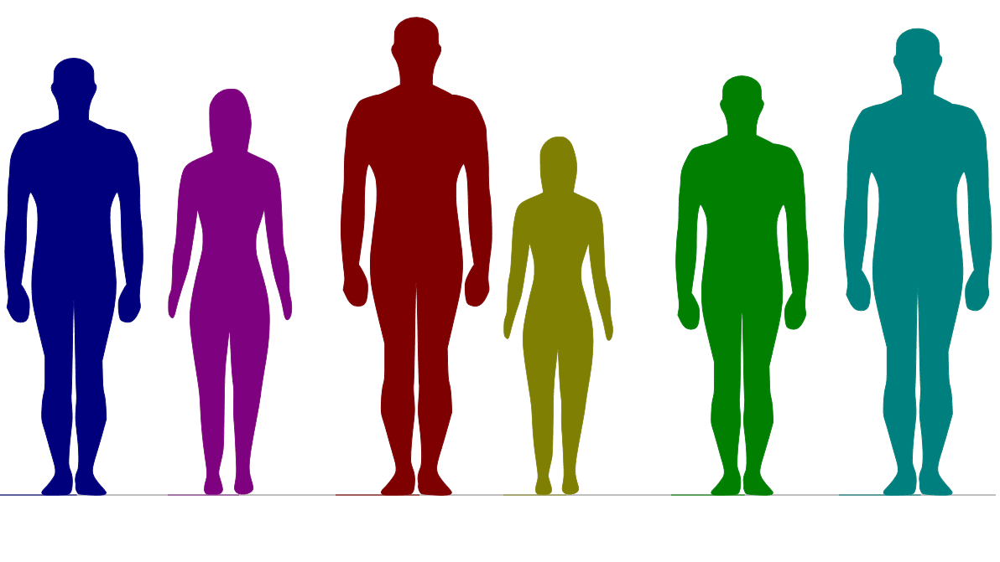
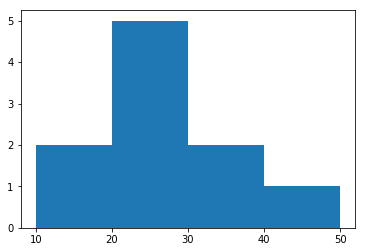
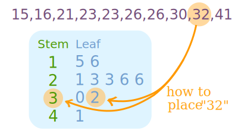
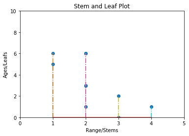

# Statistical Distributions with Stem and Leaf Plots 

## Introduction

This lesson is designed to give you an introduction to stem-and-leaf plots as a graphical way to represent a given data set. We shall look at the steps required to develop a stem and leaf plot and visualize it using simple plotting skills in matplotlib.


## Objectives

You will be able to:
* Visually observe and study the characteristics of a given distribution of data
* Describe stem and leaf plots as a very first step into studying data distributions
* Compare the use cases for histograms vs. stem and leaf plots

## Introduction

A Stem and Leaf Plot is just a table with each data value is split into a **"stem"** (the first digit or digits) and a **"leaf"** (usually the last digit). This type of plot offers some clear advantages over histograms that we've seen before. Let's think of a very simple dataset containing ages of a number of individuals to get an intuition of this point. 
```
15,16,21,23,23,26,26,30,32,41

```


We can make a frequency distribution table showing how many tens, twenties, thirties, and forties we have in our dataset. A histogram, as we saw before can do this for you as shown below:



## Creating Stem and Leaf Plots
The downside of frequency distribution tables and histograms is that, while the frequency of each class is easy to see, the original data points have been lost. You can tell, for instance, that there must have been five listed values that were in the twenties, but there is no way to tell from the histogram what exactly those values might have been.


This is an important concept regarding statistics and distributions in general; they help us describe and understand a dataset from a high level, but with the statistics alone we cannot retrieve the full granularity of information present in the data itself. 

On the other hand, stem-and-leaf and leaf plots are simply a (slightly) compressed representation of the data; the original data is still retrievable.




The **"stem"** is the left-hand column which contains the tens digits. The **"leaves"** are the lists in the right-hand column, showing all the ones digits for each of the tens, twenties, thirties, and forties. e.g. for number 32 shown above, 3 is the stem where 2 becomes a leaf. 

As you can see, unlike the histogram,  the original values can still be determined; you can tell, from the 2nd leaf, that the three values in twenties are : 21, 23, 26 and 26. 

Also, note that the horizontal leaves in the stem-and-leaf plot correspond to the vertical bars in the histogram, and the leaves have lengths (in terms of numbers of entries) that equal the numbers in the "Frequency" column of the frequency table.

## Visualizing Stem and Leaf plots

Stem and leaf plots like above can be plotted and visualized in order to get a deeper insight into the dataset. A stem and leaf plot for the above simple example can be visualized as below:



Comparing this to the histogram we had before, now we can clearly see not only how many values are in a class, but also an insight into what those values are. Do keep in mind that due to a complete overlap, repeating values are shown as a single dot (two 23s and two 26s). 

That's all there is to a stem-and-leaf plot. We just listed out how many entries we have in certain classes of numbers, and what those entries are. In the following lab, we shall move ahead and plot a stem and leaf graph (like the one above), using a slightly more complex dataset. 

## Summary

In this lesson, we learned about stem and leaf plots as a way to understand the distribution in a data set. We looked at how stem and leaf plots can provide us with a better understanding into classes or groups of data, in terms of the values contained within. In the following lab, we shall see how to plot and stem and leaf plot using matplotlib. 
