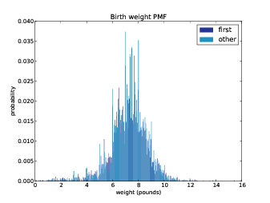
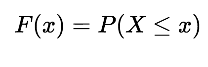

# The Cumulative Distribution Function (CDF)

## Introduction

The pmf function that we saw before works great for inspecting discrete random variables and calculating their expected values. However, as the size (S) of possible values of X increases, it becomes harder to visually inspect the the pmf. Thats where we can start considering a cdf (Cumulative Distribution Function). This lesson will introduce you to cdfs and how to calculate them.
## Objectives

You will be able to:

* Differentiate between a pmf and a cdf in terms of cumulative probabilities 
* Calculate cdf in python for a given discrete variable with limited set of possible values
* Visualize and inspect a given cdf in order to make assumptions about the underlying data 

## Limitations of PMFs

We have seen a few pmfs so far. Those were easy to calculate , visualize and analyze as the the size of S (possible values in the discrete variable) was small. As S increases, the size of individual values on the plot start to decrease. Too many values may end up rendering a pmf completely unreadable. 

The example shows a pmf of weights that children can possibly have on their birth. Due to large values present in survey observation, we see a lot of sudden peaks and dips in the function, making it hard to analyze and decide. Also, the data shown here attempts to differentiate between first born child and other children, which is extremely hard to observe and differentiate. There are way too many values.  

ONe way to deal with this problem could be reducing the size of bins and grouping neighboring values into a larger SECTION. But in doing so, we will end losing a lot of useful information. Another more appropriate way is to plot a cumulative distribution function (cdf), as we shall see below.

## So how does a CDF deal with this?

So we already know what a percentile is from when we plotted box plots. Just like pmf maps a value from its probability, a cdf maps a value from its percentile rank. 

> **A quick Percentile refresher**: A percentile (or a centile) is a measure used in statistics indicating the value below which a given percentage of observations in a group of observations fall. For example, the 20th percentile is the value (or score) below which 20% of the observations may be found. [wiki](https://en.wikipedia.org/wiki/Percentile)

The cdf is a function of x just like a pmf where x is any value that can possibly appear in given discrete distribution. To calculate cdf(x) for any value of x, we compute the fraction of values in the distribution less than or equal to x following the percentile intuition. 

>The cumulative distribution function, cdf, gives the probability that the random discrete variable X (e.g. dice roll, coin flip) is less than or equal to a certain possible value x. 

This can be shown as the equation given below:

### Calculating cdf

Looking at the description above, a cdf can be calculated as:

Here 𝐹 is a cdf function of discrete variable x which maps the probabilities of a value X to all value less than or equal to X. 

Let's see a quick example to develop a deeper intuition for cdfs.
#### Example: 

Lets see an example of rolling a single die. The probability of rolling a specific number e.g.  2 is 1 out of 6, 1/6, 0.166. (Remember thats how we calculated a pmf) 
Think of a situation (maybe a gambling game) where you want either a 2 or any number less than it. In this case, there is only one other number: 1. 

So you roll your die looking for a 2 OR a 1. You are now looking for 2 outcomes out of 6 (instead of just one as earlier), hence the probability now is 2/6 = 1/3. 

Similarly, if you want a 3 or less, the probability is 3/6 or 1/2. 

cdf is a **cumulative** function because it lets you find the probability by adding up the individual probabilities of all the outcomes included. For a die roll, when you want a 2 or less, you have 2 outcomes fulfilling this condition: 1 and 2, each with an individual probability of 1/6. Adding these up as 1/6 + 1/6 equals 2/6 or 1/3, which is the cumulative probability of a 2. 

>That's what cumulative means - its just adding up probabilities.

A cdf for above scenario (considering a fair coin) would look as shown below. See the probabilities are being added up and forward increasing as we move from 1 to 6:

another way to show a cdf plot is using a histogram type of approach towards plotting. Instead of showing point values, we show probabilities in bins, adding up to a 1. Later we shall see such an approach could be useful for dealing with continuous variables having large number of possible values. This would also deal with overly cluttered pmf we saw above. 

## Interpreting the CDF plot

In above plots, we see that as we approach from value 1 to 6 , the probability of occurrence of a particular value , or values less than it increases. The cumulative probability of seeing a 6 or less is (obviously) 1. Whereas, probability of seeing a 1 is still 1/6 = 0.17 - same as a pmf, as no value is less than 1 in a die roll.

The fact that points of cdf fall in a straight line , like our example above, reflects the fact that the underlying distribution is a **Uniform Distribution** i.e. equal chances of all possible occurrences.

The cumulative aspect here is the key difference between a cdf and pmf which we shall explore further as we move along. For now, let's move on to the cdf lab where we shall attempt to replicate above cdf plot in python using skills covered so far. 

## Summary 

In this lesson we looked at a cdf as a percentile probability function of a discrete random variable. We looked at how to calculate and visualize a cdf. This technique can also be applied to continuous random variables which we shall see later in this section. 
