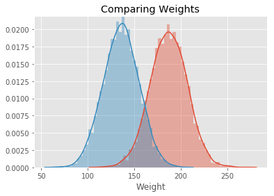

# The Probability Density Function (PDF) - Lab

## Introduction

In this lab we will look at building visualizations known as **density plots** to estimate the probability density for a given set of data. 

## Objectives

You will be able to: 

* Calculate the PDF from given dataset containing real valued random variables
* Plot density functions and comment on the shape of the plot
* Plot density functions using seaborn


## Let's get started!

We'll import all the required libraries for you for this lab.


```python
# Import required libraries
import numpy as np
import matplotlib.pyplot as plt
plt.style.use('ggplot')
import pandas as pd 
```

#### Import the dataset 'weight-height.csv' as pandas dataframe . Calculate the mean and standard deviation for weights and heights for male and female individually. 

Hint : Use your pandas dataframe subsetting skills like loc(), iloc() and groupby()


```python
data = None
male_df =  None
female_df =  None

  

# Male Height mean: 69.02634590621737
# Male Height sd: 2.8633622286606517
# Male Weight mean: 187.0206206581929
# Male Weight sd: 19.781154516763813
# Female Height mean: 63.708773603424916
# Female Height sd: 2.696284015765056
# Female Weight mean: 135.8600930074687
# Female Weight sd: 19.022467805319007
```

    Male Height mean: 69.02634590621737
    Male Height sd: 2.8633622286606517
    Male Weight mean: 187.0206206581929
    Male Weight sd: 19.781154516763813
    Female Height mean: 63.708773603424916
    Female Height sd: 2.696284015765056
    Female Weight mean: 135.8600930074687
    Female Weight sd: 19.022467805319007


#### Plot overlapping normalized histograms for male and female heights - use binsize = 10, set alpha level so that overlap can be visualized


```python

```


    <matplotlib.legend.Legend at 0x10a5a38d0>


```python
# Record your observations - are these inline with your personal observations?


```

#### Write a function density() that takes in a random variable and calculates the density function using `np.hist` and interpolation. The function should return two lists carrying x and y coordinates for plotting the density function


```python
def density(x):
    
    pass


# Generate test data and test the function - uncomment to run the test
# np.random.seed(5)
# mu, sigma = 0, 0.1 # mean and standard deviation
# s = np.random.normal(mu, sigma, 100)
# x,y = density(s)
# plt.plot(x,y, label = 'test')
# plt.legend()
```


```python

```


    <matplotlib.legend.Legend at 0x10acba668>


#### Add Overlapping density plots for male and female heights to the histograms plotted earlier


```python
# You code here 
```


```python

```


    [<matplotlib.lines.Line2D at 0x10e25c9b0>]


#### Repeat above exerice for male and female weights


```python
# Your code here 
```


```python

```


    [<matplotlib.lines.Line2D at 0x115c5fa90>]


#### Write your observations in the cell below.


```python
# Record your observations - are these inline with your personal observations?


# So whats the takeaway when comparing male and female heights and weights 


```

#### Repeat Above experiments in seaborn and compare with your results. 


```python

```


    Text(0.5,1,'Comparing weights')


```python

```


    Text(0.5,1,'Comparing Weights')





```python
# Your comments on the two approaches here. 
# are they similar ? what makes them different if they are ?
```

## Summary

In this lesson we saw how to build the probability density curves visually for given datasets and compare on the distribution visually by looking at the spread , center and overlap between data elements. This is a useful EDA technique and can be used to answer some initial questions before embarking on a complex analytics journey.
