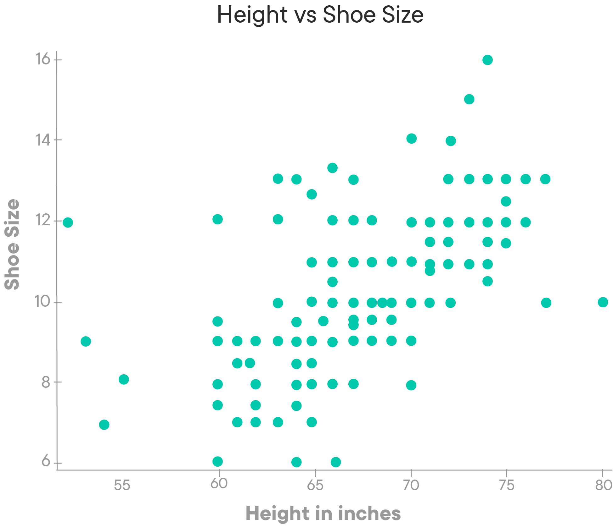
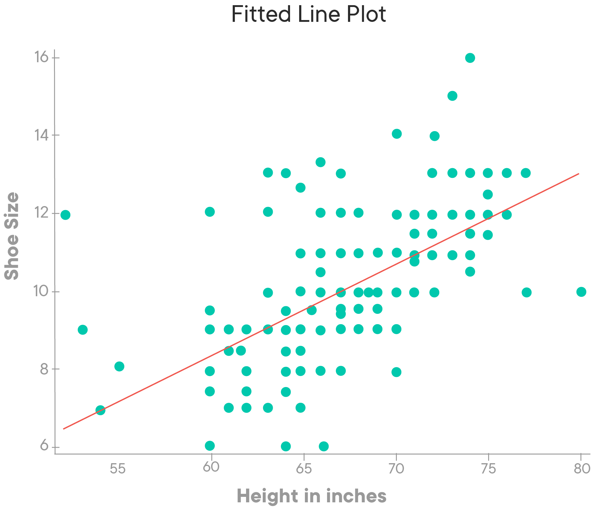
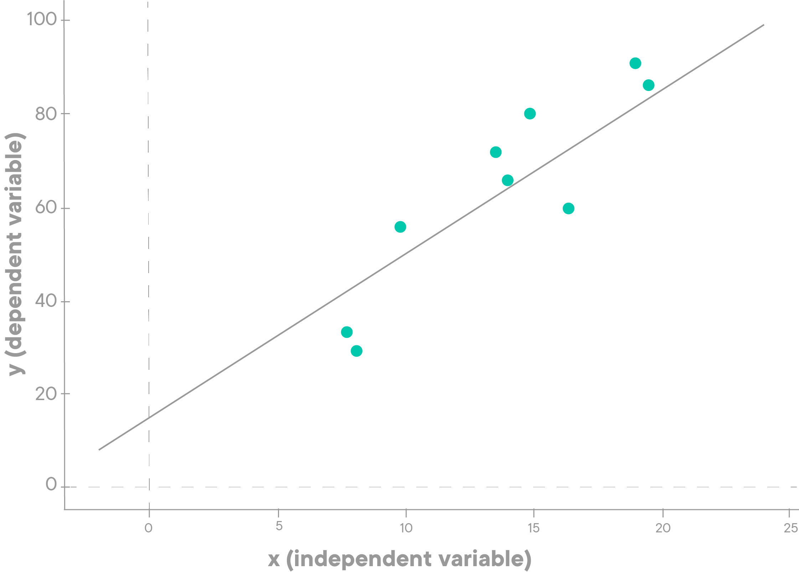
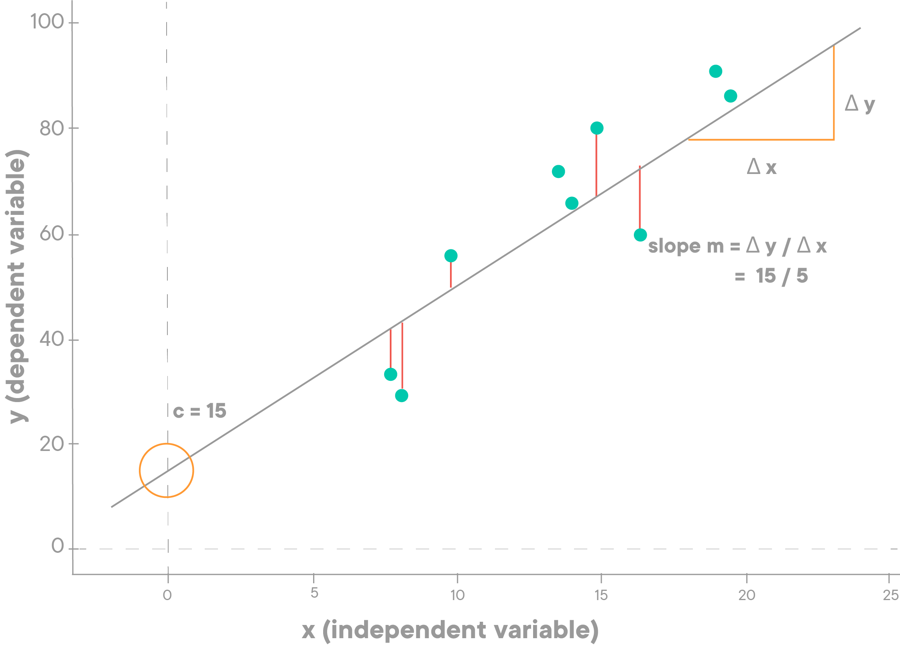

# Simple Linear Regression 

## Introduction
Regression analysis is often the first real "learning algorithm" that aspiring data scientists will come across. It is one of the simplest algorithms to master, but it still requires some mathematical and statistical understanding of the underlying regression process. This lesson will introduce you to the regression process based on the statistical ideas we have discovered so far. 

## Objectives
You will be able to:

* Describe statistical modeling with simple regression 
* Explain simple linear regression analysis as solving for straight line equation: $y=mx+c$
* Calculate the slope and y-intercept given a set of data points
* Calculate a regression line based on calculated slope and intercept
* Predict a target value for a previously unseen input feature, based on model coefficients

## Linear Regression

Regression analysis is one of the most important statistical techniques for business applications. It’s a statistical methodology that helps estimate the strength and direction of the relationship between two (or more variables). Regression results show whether the relationship is valid or not. It also helps to _predict_ an unknown value based on the derived relationship.

> Regression Analysis is a __parametric__ technique used to **predict** the value of an unknown target variable (or dependent variable) $y$ based on one or more of known input features (or independent variables, predictors), often denoted by $x$. 

Let's consider another example. Someone's height and foot size are generally considered to be related. Generally speaking, taller people tend to have bigger feet (and, obviously, shoe size).

We can use a linear regression analysis here to predict foot size (dependent variable), given height (independent variable) of an individual. Regression is proven to give credible results if the data follows standard parametric assumptions like normality, linearity etc. These will be covered in upcoming lessons in detail. In general, regression analysis helps us in the following ways:

* Finding an **association** or relationship between certain phenomenons or variables
* Identifying **which variables contribute** more towards the outcomes
* **Prediction** of future observations

### Why "linear" regression?

As you learned in previous lesson, the term **linear** implies that the model functions along with a straight (or nearly straight) line. **Linearity**, one of the assumptions of this approach, suggests that the relationship between dependent and independent variable can be expressed as a straight line. 

**Simple Linear Regression** uses a single feature (one independent variable) to model a linear relationship with a target (the dependent variable) by fitting an optimal model (i.e. the best straight line) to describe this relationship.  

**Multiple Linear Regression** uses more than one features to predict a target variable by fitting the best linear relationship. 

In this section, we will mainly focus on simple regression to build a sound understanding. For the example shown above i.e. height vs foot size, a simple linear regression model would fit a line to the data points as follows:

This line can then be used to describe the data and conduct further experiments using this fitted model. So let's move on and see how to calculate this "best fit line" in a simple linear regression context 

## Calculating Regression Coefficients: Slope and Intercepts

As seen in the previous lesson, you remember that a straight line can be written as :

$$y=mx+c$$
or, alternatively

$$y =  \beta_0+ \beta_1 x $$

You may come across other ways of expressing this straight line equation for simple linear regression. Yet there are **four key components** you'll to keep in mind: 

A quick recap: 

* a **dependent variable** that needs to estimated and predicted (here: $y$) 
* An **independent variable**, the input variable (here: $x$)
* The **slope** which determines the angle of the line. Here, the slope is denoted as $m$, or $\beta_1$.
* The **intercept** which is the constant determining the value of $y$ when $x$ is 0. We denoted the intercept here as $c$ or $\beta_0$.

>_Slope_ and _Intercept_ are the **coefficients** or the **parameters** of a linear regression model. Calculating the regression model simply involves the calculation of these two values. 

**Linear regression is simply a manifestation of this simple equation!** So this is as complicated as our linear regression model gets. The equation here is the same one used to find a line in algebra, but in statistics, the actual data points don't actually lie on a line!

>The real challenge for regression analysis is to fit a line, out of an infinite number of lines that best describes that data.

Consider the line below to see how we calculate slope and intercept.

In our example:

$c$ is equal to 15, which is where our line intersects with the y-axis.

$m$ is equal to 3, which is our slope. 

You can find a slope by taking an arbitrary part of the line, looking at the
differences for the x-value and the y-value for that part of the line, and dividing $\Delta y$ by $\Delta x$. In other words, you can look at the **change in y over the change in x** to find the slope!

### Important note on notation

Now that you know how the slope and intercept define the line, it's time for some more notation.

Looking at the above plots, you know that you have the blue diamonds there are our observations with associated x- and y-values. 

Now, when we draw our regression line based on these few blew diamonds, we use the following notations:

$$\hat{y}=\hat m x+ \hat{c}$$ or 
$$\hat y =  \hat \beta_0+ \hat \beta_1 x $$

As you can see, you're using a "hat" notation which stands for the fact that we are working with **estimations**.
- When trying to draw a "best fit line", you're **estimating** the most appropriate value possible for your intercept and your slope, hence $\hat{c}$ /$ \hat \beta_0 $ and  $\hat{m}$ /$ \hat \beta_1 $.
- Next, when we use our line to predict new values $y$ given $x$, your estimate is an **approximation** based on our estimated parameter values. Hence we use $\hat y $ instead of $y$. $\hat y$ lies _ON_ your regression line, $y$ is the associated y-value for each of the blue diamonds in the plot below. The **error** or the **vertical offset** between the line and the actual observation values is denoted by the red vertical lines in the plot above. Mathematically, the vertical offset can be written as $\mid \hat y - y\mid$.

So how do you find the line with the best fit? You may think that you have to try lots and lots of different lines to see which one fits best. Fortunately, this task is not as complicated as in may seem. Given some data points, the best-fit line always has a distinct slope and y-intercept that can be calculated using simple linear algebraic approaches. Let's quickly visit the required formulas.

### Best-Fit Line Ingredients

Before we calculate the best-fit line, we have to make sure that we have calculated the following measures for variables X and Y:

* The mean of the X $(\bar{X})$

* The mean of the Y $(\bar{Y})$

* The standard deviation of the X values $(S_X)$

* The standard deviation of the y values $(S_Y)$

* The correlation between X and Y ( often denoted by the Greek letter "Rho" or $\rho$ - Pearson Correlation)

## Calculating Slope  

With the above ingredients in hand, we can calculate the slope (shown as $b$ below) of the best-fit line, using the formula:

$$\hat m = \rho \frac{S_Y}{S_X}$$

This formula is also known as the **least squares method**.

[You can visit this Wikipedia link](https://en.wikipedia.org/wiki/Simple_linear_regression#Fitting_the_regression_line) to get take a look into the maths behind derivation of this formula.

The slope of the best-fit line can be a negative number following a negative correlation.  For example, if an increase in police officers is related to a decrease in the number of crimes in a linear fashion, the correlation and hence the slope of the best-fitting line in this particular setting is negative.

## Calculating Intercept

So now that we have the slope value (\hat m), we can put it back into our formula $(\hat y = \hat m x+ \hat c)$ to calculate intercept. The idea is that

$$\bar{Y} = \hat c + \hat m \bar{X}$$
$$ \hat c = \bar{Y} - \hat m\bar{X}$$

Recall that $\bar{X}$ and $\bar{Y}$ are the mean values for variables X and Y.  So, in order to calculate the $\hat y$-intercept of the best-fit line, we start by finding the slope of the best-fit line using the above formula. Then to find the $\hat y$-intercept, we multiply slope value by mean of x and subtract the result from mean of y. 

## Predicting from the model

As mentioned before, when you have a regression line with defined parameters slope and intercept as calculated above, you can easily predict the $\hat{y}$ (target) value for a new $x$ (feature) value using the estimated parameter values:

$$\hat{y} = \hat mx + \hat c$$

Remember that the difference between y and $\hat{y}$ is that $\hat{y}$ is the value predicted by the fitted model, whereas $y$ carries actual values of the variable (called the truth values) that were used to calculate the best fit. 

Next, let's move on and try to code these equations in to draw a regression line to a simple dataset to see all of this in action. 

## Additional Reading 

Visit the following series of blogs by Bernadette Low for details on topics covered in this lesson.

- [Super Simple Machine Learning — Simple Linear Regression Part 1](https://towardsdatascience.com/super-simple-machine-learning-by-me-simple-linear-regression-part-1-concept-and-r-4b5b39bbdb5d)
- [Super Simple Machine Learning — Simple Linear Regression Part 2](https://towardsdatascience.com/super-simple-machine-learning-simple-linear-regression-part-2-math-and-python-1137acb4c352)

## Summary 

In this lesson, You learned the basics of simple linear regression between two variables as a problem of fitting a straight line to best describe the data associations on a 2-dimensional plane.

