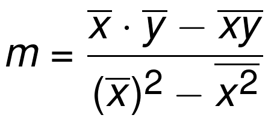
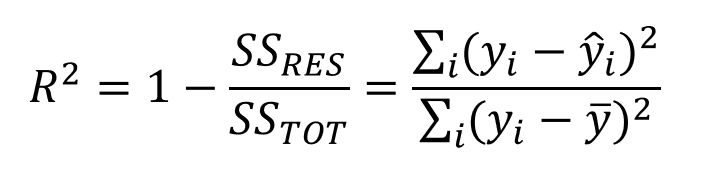
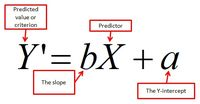

# Regression Lab

Now have all the necessary functions to calculate the slope, intercept, best-fit line, prediction and visualizations. In this lab you will put them all together to run a regression experiment and calculate model loss. 

## SWBAT

* Run a complete regression analysis through code only. 

## Here are all the formulas to put everything in perspective

#### Slope


#### Intercept 


#### R-squared


#### Prediction



Use the functions created earlier to implement these formulas to run a regression analysis using X and Y as input variables. 


```python

# Combine all the functions created so far to run a complete regression experiment. 
# Produce an output similar to the one shown below. 

X = np.array([1,2,3,4,5,6,7,8,9,10], dtype=np.float64)
Y = np.array([7,7,8,9,9,10,10,11,11,12], dtype=np.float64)

```


```python
# Basic Regression Diagnostics
# ----------------------------
# Slope: 0.56
# Y-Intercept: 6.33
# R-Squared: 0.97
# ----------------------------
# Model: Y = 0.56 * X + 6.33
```

    Basic Regression Diagnostics
    ----------------------------
    Slope: 0.56
    Y-Intercept: 6.33
    R-Squared: 0.97
    ----------------------------
    Model: Y = 0.56 * X + 6.33


## Make Predictions

Predict and plot the value of y using regression line above for a new value of x = 4.5.


```python
# Make prediction using given value and visualize on the scatter plot

```


```python

```


## Level up - Optional 
Load the "heightWeight.csv" dataset. Use the height as an independant and weight as a dependant variable and draw a regression line to data using your code above. Calculate your R-square for the model and try to predict new values of Y. 

## Summary

In this lab, we ran a complete simple regression analysis experiment using functions created so far. Next We shall see how we can use python's built in modules to perform such analyses with a much higher level of sophistication. 
