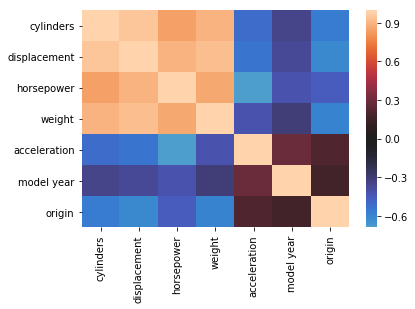

# Multicollinearity of Features

## Introduction
In the previous section you have learned about correlation and covariance. Now that we're moving towards regression models with multiple predictors, let's explore what it means when predictors are correlated with each other.

## Objectives
You will be able to:
* Understand multicollinearity and possible negative impacts on regression outcome
* Use heatmaps to visually inspect multicollinearity

## Possible negative impacts of multicollinearity


As we're performing a regression analysis, the main goal is to identify the relationship between each predictor and the outcome variable. The interpretation of a regression coefficient is that it represents the average change in the dependent variable for each 1 unit change in a predictor, assuming that all the other predictor variables are kept constant.
And it is exactly because of that reason that multicollinearity can cause problems.

Because the idea behind regression is that you can change one variable and keep the others constant, correlation is a problem, because it indicates that changes in one predictor are associated with changes in another one as well. Because of this, the estimates of the coefficients can have big fluctuations as a result of small changes in the model. As a result, you may not be able to trust the p-values associated with correlated predictors. 

In this lecture, we'll learn about methods to identify multicollinearity, and will remove preditors that are highly correlated with others. You'll learn about other (and less ad-hoc) ways to deal with multicollinearity later on.

## Identifying multicollinearity

To illustrate ways to identify multicollinearity, let's have a look at the "auto-mpg" data again.


```python
## import numpy as np
import pandas as pd
data = pd.read_csv("auto-mpg.csv")
data['horsepower'].astype(str).astype(int) # don't worry about this for now
data.head()
```


<div>
<style scoped>
    .dataframe tbody tr th:only-of-type {
        vertical-align: middle;
    }

    .dataframe tbody tr th {
        vertical-align: top;
    }

    .dataframe thead th {
        text-align: right;
    }
</style>
<table border="1" class="dataframe">
  <thead>
    <tr style="text-align: right;">
      <th></th>
      <th>mpg</th>
      <th>cylinders</th>
      <th>displacement</th>
      <th>horsepower</th>
      <th>weight</th>
      <th>acceleration</th>
      <th>model year</th>
      <th>origin</th>
      <th>car name</th>
    </tr>
  </thead>
  <tbody>
    <tr>
      <th>0</th>
      <td>18.0</td>
      <td>8</td>
      <td>307.0</td>
      <td>130</td>
      <td>3504</td>
      <td>12.0</td>
      <td>70</td>
      <td>1</td>
      <td>chevrolet chevelle malibu</td>
    </tr>
    <tr>
      <th>1</th>
      <td>15.0</td>
      <td>8</td>
      <td>350.0</td>
      <td>165</td>
      <td>3693</td>
      <td>11.5</td>
      <td>70</td>
      <td>1</td>
      <td>buick skylark 320</td>
    </tr>
    <tr>
      <th>2</th>
      <td>18.0</td>
      <td>8</td>
      <td>318.0</td>
      <td>150</td>
      <td>3436</td>
      <td>11.0</td>
      <td>70</td>
      <td>1</td>
      <td>plymouth satellite</td>
    </tr>
    <tr>
      <th>3</th>
      <td>16.0</td>
      <td>8</td>
      <td>304.0</td>
      <td>150</td>
      <td>3433</td>
      <td>12.0</td>
      <td>70</td>
      <td>1</td>
      <td>amc rebel sst</td>
    </tr>
    <tr>
      <th>4</th>
      <td>17.0</td>
      <td>8</td>
      <td>302.0</td>
      <td>140</td>
      <td>3449</td>
      <td>10.5</td>
      <td>70</td>
      <td>1</td>
      <td>ford torino</td>
    </tr>
  </tbody>
</table>
</div>


To understand the correlation structure of the predictors, we'll take a copy of the data but this time without the target variable (mpg) in it. Also, we'll remove the "car name" column as keeping those in won't lead to meaningful results.


```python
data_pred= data.iloc[:,1:8]
data_pred.head()
```


<div>
<style scoped>
    .dataframe tbody tr th:only-of-type {
        vertical-align: middle;
    }

    .dataframe tbody tr th {
        vertical-align: top;
    }

    .dataframe thead th {
        text-align: right;
    }
</style>
<table border="1" class="dataframe">
  <thead>
    <tr style="text-align: right;">
      <th></th>
      <th>cylinders</th>
      <th>displacement</th>
      <th>horsepower</th>
      <th>weight</th>
      <th>acceleration</th>
      <th>model year</th>
      <th>origin</th>
    </tr>
  </thead>
  <tbody>
    <tr>
      <th>0</th>
      <td>8</td>
      <td>307.0</td>
      <td>130</td>
      <td>3504</td>
      <td>12.0</td>
      <td>70</td>
      <td>1</td>
    </tr>
    <tr>
      <th>1</th>
      <td>8</td>
      <td>350.0</td>
      <td>165</td>
      <td>3693</td>
      <td>11.5</td>
      <td>70</td>
      <td>1</td>
    </tr>
    <tr>
      <th>2</th>
      <td>8</td>
      <td>318.0</td>
      <td>150</td>
      <td>3436</td>
      <td>11.0</td>
      <td>70</td>
      <td>1</td>
    </tr>
    <tr>
      <th>3</th>
      <td>8</td>
      <td>304.0</td>
      <td>150</td>
      <td>3433</td>
      <td>12.0</td>
      <td>70</td>
      <td>1</td>
    </tr>
    <tr>
      <th>4</th>
      <td>8</td>
      <td>302.0</td>
      <td>140</td>
      <td>3449</td>
      <td>10.5</td>
      <td>70</td>
      <td>1</td>
    </tr>
  </tbody>
</table>
</div>


For an initial idea on how the predictors relate, we can take a look at scatterplots between predictors. You can use Pandas to generate a scatter matrix as follows:


```python
pd.plotting.scatter_matrix(data_pred,figsize  = [9, 9]);
```

This matrix has the cool feature that it returns scatterplots for relationships between two predictors, and histograms for a single feature on the diagonal. Have a quick look at this. When talking about correlation, what sort of scatter plots will catch our eye? You're right: the ones with scatter plots that reveal some sort of linear relationship. Seems like we can detect a few: weight and displacement seem to be highly correlatyed. Weight and horsepower as well, and (not surprisingly) displacement and horsepower. This is nice, but it would be hard to evaluate to examine each plot in detail when having a ton of features. Let's look at the correlation matrix instead. Instead of returning scatter plots and histograms, a correlation matrix returns pairwise correlations. Recall that correlations take a value between -1 and 1, -1 being a perfectly negative linear relationship, and +1 a perfectly positive linear relationship. 


```python
data_pred.corr()
```


<div>
<style scoped>
    .dataframe tbody tr th:only-of-type {
        vertical-align: middle;
    }

    .dataframe tbody tr th {
        vertical-align: top;
    }

    .dataframe thead th {
        text-align: right;
    }
</style>
<table border="1" class="dataframe">
  <thead>
    <tr style="text-align: right;">
      <th></th>
      <th>cylinders</th>
      <th>displacement</th>
      <th>horsepower</th>
      <th>weight</th>
      <th>acceleration</th>
      <th>model year</th>
      <th>origin</th>
    </tr>
  </thead>
  <tbody>
    <tr>
      <th>cylinders</th>
      <td>1.000000</td>
      <td>0.950823</td>
      <td>0.842983</td>
      <td>0.897527</td>
      <td>-0.504683</td>
      <td>-0.345647</td>
      <td>-0.568932</td>
    </tr>
    <tr>
      <th>displacement</th>
      <td>0.950823</td>
      <td>1.000000</td>
      <td>0.897257</td>
      <td>0.932994</td>
      <td>-0.543800</td>
      <td>-0.369855</td>
      <td>-0.614535</td>
    </tr>
    <tr>
      <th>horsepower</th>
      <td>0.842983</td>
      <td>0.897257</td>
      <td>1.000000</td>
      <td>0.864538</td>
      <td>-0.689196</td>
      <td>-0.416361</td>
      <td>-0.455171</td>
    </tr>
    <tr>
      <th>weight</th>
      <td>0.897527</td>
      <td>0.932994</td>
      <td>0.864538</td>
      <td>1.000000</td>
      <td>-0.416839</td>
      <td>-0.309120</td>
      <td>-0.585005</td>
    </tr>
    <tr>
      <th>acceleration</th>
      <td>-0.504683</td>
      <td>-0.543800</td>
      <td>-0.689196</td>
      <td>-0.416839</td>
      <td>1.000000</td>
      <td>0.290316</td>
      <td>0.212746</td>
    </tr>
    <tr>
      <th>model year</th>
      <td>-0.345647</td>
      <td>-0.369855</td>
      <td>-0.416361</td>
      <td>-0.309120</td>
      <td>0.290316</td>
      <td>1.000000</td>
      <td>0.181528</td>
    </tr>
    <tr>
      <th>origin</th>
      <td>-0.568932</td>
      <td>-0.614535</td>
      <td>-0.455171</td>
      <td>-0.585005</td>
      <td>0.212746</td>
      <td>0.181528</td>
      <td>1.000000</td>
    </tr>
  </tbody>
</table>
</div>


Note that correlations on the diagonal are automatically equal to one as they represent correlations between a variable and the variable itself. So when do we consider a correlation "high"? Generally, a correlation with an absolute value around 0.7-0.8 or higher is considered a high correlation. If we take 0.75 as a cut-off, how many high correlations do we have?


```python
abs(data_pred.corr()) > 0.75
```


<div>
<style scoped>
    .dataframe tbody tr th:only-of-type {
        vertical-align: middle;
    }

    .dataframe tbody tr th {
        vertical-align: top;
    }

    .dataframe thead th {
        text-align: right;
    }
</style>
<table border="1" class="dataframe">
  <thead>
    <tr style="text-align: right;">
      <th></th>
      <th>cylinders</th>
      <th>displacement</th>
      <th>horsepower</th>
      <th>weight</th>
      <th>acceleration</th>
      <th>model year</th>
      <th>origin</th>
    </tr>
  </thead>
  <tbody>
    <tr>
      <th>cylinders</th>
      <td>True</td>
      <td>True</td>
      <td>True</td>
      <td>True</td>
      <td>False</td>
      <td>False</td>
      <td>False</td>
    </tr>
    <tr>
      <th>displacement</th>
      <td>True</td>
      <td>True</td>
      <td>True</td>
      <td>True</td>
      <td>False</td>
      <td>False</td>
      <td>False</td>
    </tr>
    <tr>
      <th>horsepower</th>
      <td>True</td>
      <td>True</td>
      <td>True</td>
      <td>True</td>
      <td>False</td>
      <td>False</td>
      <td>False</td>
    </tr>
    <tr>
      <th>weight</th>
      <td>True</td>
      <td>True</td>
      <td>True</td>
      <td>True</td>
      <td>False</td>
      <td>False</td>
      <td>False</td>
    </tr>
    <tr>
      <th>acceleration</th>
      <td>False</td>
      <td>False</td>
      <td>False</td>
      <td>False</td>
      <td>True</td>
      <td>False</td>
      <td>False</td>
    </tr>
    <tr>
      <th>model year</th>
      <td>False</td>
      <td>False</td>
      <td>False</td>
      <td>False</td>
      <td>False</td>
      <td>True</td>
      <td>False</td>
    </tr>
    <tr>
      <th>origin</th>
      <td>False</td>
      <td>False</td>
      <td>False</td>
      <td>False</td>
      <td>False</td>
      <td>False</td>
      <td>True</td>
    </tr>
  </tbody>
</table>
</div>


It seems like the variables "cylinder", "displacement", "horsepower" and "weight" are all pretty highly correlated among each other. In our analysis, we would decide to remove three of those. Again here, it would be nice to have easier visuals in case when our predictor base grows (sometimes models have 100s of predictors!). A nice visualization of the correlation matrix is the heatmap. 


```python
import seaborn as sns
sns.heatmap(data_pred.corr(), center=0);
```





You can see that light pink colors represent high correlations.

## Summary

In this section, you learned about multicollinearity and how it can negatively affect regression outcome. Additionally, you learned about correlation matrices and heatmaps to visually inspect multicollinearity.
