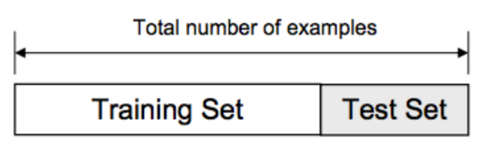
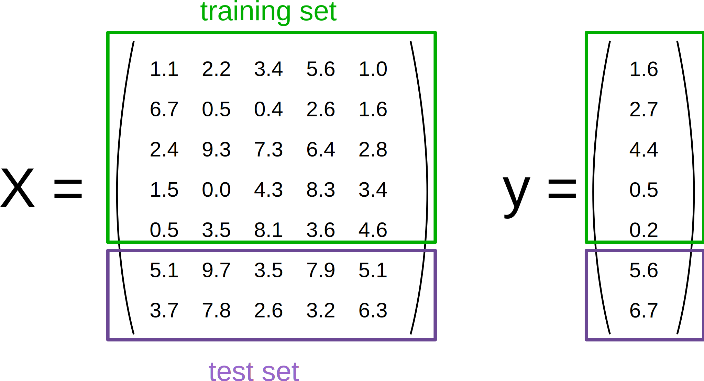

# Holdout Validation

## Introduction
In this lesson, we will look at the basic model validation technique knows as hold out validation. This technique is generally used in predictive analysis to measure the predictive ability of the algorithms under study. 

## Objectives
You will be able to:

* Understand the concept of holdout validation and why it is used
* Understand the implementation of  holdout validation

## Validation Testing 

Validation testing is probably the most commonly used technique that a data scientist employs when there is  a need to **validate** the performance of A machine learning model. Validation testing is performed with one key question during predictive analysis : 

> **How well it would generalize to new data.**

We have to be confident that our model has learned the patterns from the data correctly without taking into the consideration the noise. This lesson introduces you to the most basic validation technique called the "Hold-out Validation". 


#### Typically, different validation strategies exist based on the number of splits being done in the dataset.

## Train/Test split or Holdout Validation.

In this strategy, we simply split the data into two sets in a way that our observations do not overlap between train and test set do not overlap. That is the reason why **it is important not to have duplicated samples in our dataset**.


For simple hold-out validation testing, data is split into two groups i.e. Training set and Testing set as shown below



### Train Dataset 

>The sample of data that we use to fit the model.

This is the actual dataset that we use to train the model for learning parameters(slope and intercepts for regression analyses). The model trains on and learns from training data.

### Test Dataset

> The sample of data that we use to train the model 

The Test dataset provides the gold standard used to evaluate the model. It is only used once a model is completely trained(using the train set). The test set is generally what is used to evaluate competing models. The test set is generally well curated. It contains carefully sampled data that spans the various classes that the model would face, when used in the real world.

#### How to Split ??

Depending on the number of observations available in our dataset, we can choose the level of split that we want to apply on the data. Usually it ranges anywhere between a 60/40 to 90/10 split for train/test data. If we have a large number of observations, we can hold back a large test set to be very sure about the validation process. For smaller dataset, we may not have the luxury of taking away 40% for the testing, so we might have to live with only  10% - or even less.

The split gets applied to both predictors and the target variables so the split contains corresponding rows. IF X is a set of predictors and Y is the outcome, a train.test split may give an output as shown below:



The green boxes show X and Y for training, whereas the purple sections of data show the test set which would be "Held Out" till the validation stage. 

## Splitting Data in Python 

Python's Scikit-Learn library' offers handy data splitting methods out of the box. 
> **sklearn.model_selection.train_test_split(*arrays, **options)**

[Click Here to visit the official documentation for this method.](http://scikit-learn.org/stable/modules/generated/sklearn.model_selection.train_test_split.html)

Here is how you would run it . We will first generate some sample data to represent our X and y variables, and see how the split is applied to the data. 


```python
import numpy as np
from sklearn.model_selection import train_test_split
X = np.arange(10).reshape((5, 2))
y = range(5)

print (X)
print (list(y))
```

    [[0 1]
     [2 3]
     [4 5]
     [6 7]
     [8 9]]
    [0, 1, 2, 3, 4]


We can now apply the split using the method shown earlier. For this example we will do a 70/30 split by specifying  `test_size=0.3` which means we are allocating 30% of the data to our test set. 


```python
 X_train, X_test, y_train, y_test = train_test_split(X, y, 
                                                     test_size=0.3, 
                                                     random_state=42) # for reproducility
```


```python
# Print the split datasets
print (X_train)
print (y_train)
print (X_test)
print (y_test)
```

    [[4 5]
     [0 1]
     [6 7]]
    [2, 0, 3]
    [[2 3]
     [8 9]]
    [1, 4]


This method performs random sampling on the data so there is no order to the output you see above. This is a best approach to avoid any bias in the splitting process. 

In the following lab, we will apply the split on the Walmart dataset to validate our findings. 

## Summary 

In this lesson, we learned about the hold out validation technique as a way to validate our fitted models. Later we will see the shortcomings of this basic approach and also how to use more advanced validation techniques like cross validation and k-fold cross validation etc.  
