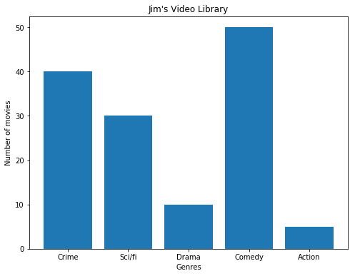
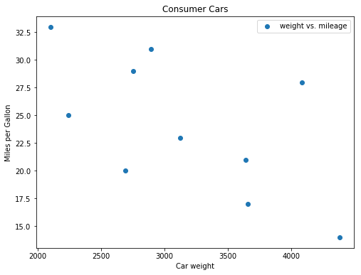
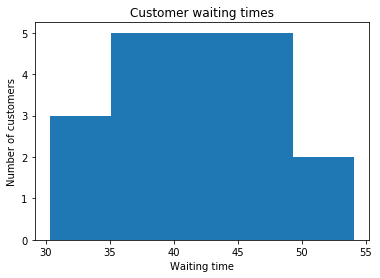

# Data Visualization Lab

## Introduction
This lab will give you some structured practice working with the concepts introduced in the previous lesson.

# Objectives
You will be able to:
* Understand matplotlib plot structure for drawing basic plots.
* Visualize data using scatterplots, barplots and histograms

## Exercise 1

Make a vertical bar graph using `plt.bar()` for the following set of data:

>Jim's Video Library contains 40 crime/mystery, 30 science fiction, 10 drama, 50 comedy, 25 action and 5 documentary movies.

* Set a figure size of 8x6 inches
* Set x-axis (genres) and y-axis (number of movies)
* Plot and label the bar graph
* Provide a suitable title
* Label x and y-axis


```python
# import the required libraries
import numpy as np
import matplotlib.pyplot as plt

y = None
x =None
labels = None

# Set a figure size

# Plot vertical bars of fixed width by passing x and y values to .bar() function 

# Give a title to the bar graph

# Output the final plot

```





## Exercise 2

The table shows the data collected by a Consumer Products Group on the relationship between the weight of a car and its average gas mileage.

      Car Type  Weight	miles per gallon
        A	    2750	   29
        B	    3125	   23
        C	    2100	   33
        D	    4082	   18
        E	    2690	   20
        F	    3640	   21
        G	    4380	   14
        H	    2241	   25
        I	    2895	   31
        J	    3659	   17
        
* Use a scatter plot to show the relationship between mpg and weight of a car. 
* Set an appropriate figure size, labels for axes and the plot.
* Give a title to the plot

Looking the scatter plot, how would you describe the relationship between these two attributes?


```python
weight = None
mpg = None

# Set the figure size in inches

# Plot with scatter()

# Set x and y axes labels and give titles

```





## Exercise 3

Joe is the branch manager at a bank. Recently, Joe been receiving customer feedback saying that the waiting times for a client to be served by a customer service representative are too long. Joe decides to observe and write down the time spent by each customer on waiting. Here are his findings from observing and writing down the wait times (in seconds), spent by 20 customers:

43.1, 35.6, 37.5, 36.5, 45.3, 43.4, 40.3, 50.2, 47.3, 31.2, 42.2, 45.5, 30.3, 31.4, 35.6, 45.2, 54.1, 45.6, 36.5, 43.1

* Build a histogram of these values using the `hist()` function
* Plot, label and give a title as above. Use  `bins=5`
* Briefly describe the output in terms of waiting times. 


```python
x = None

#Plot the distogram with hist() function

# Label, give title and show the plot

```





## Summary

Hopefully this lab has given you some good practice working with creating plots in Python using Matplotlib.
