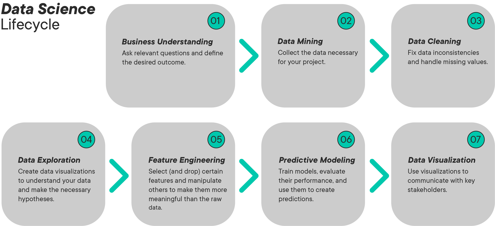
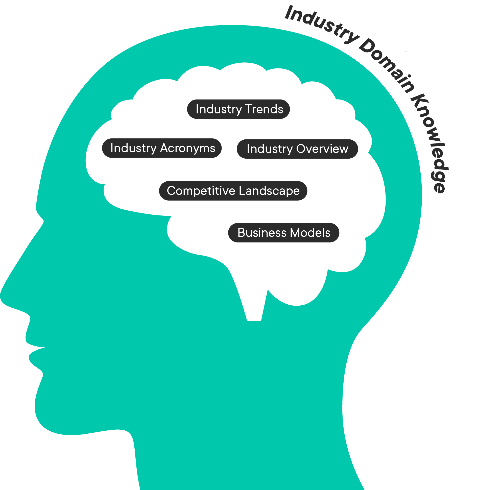
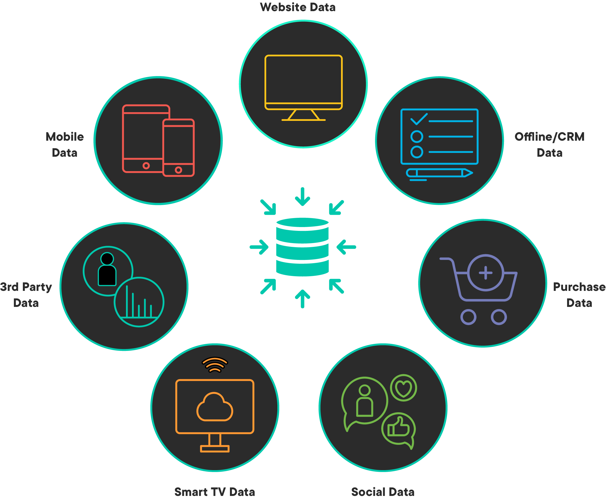
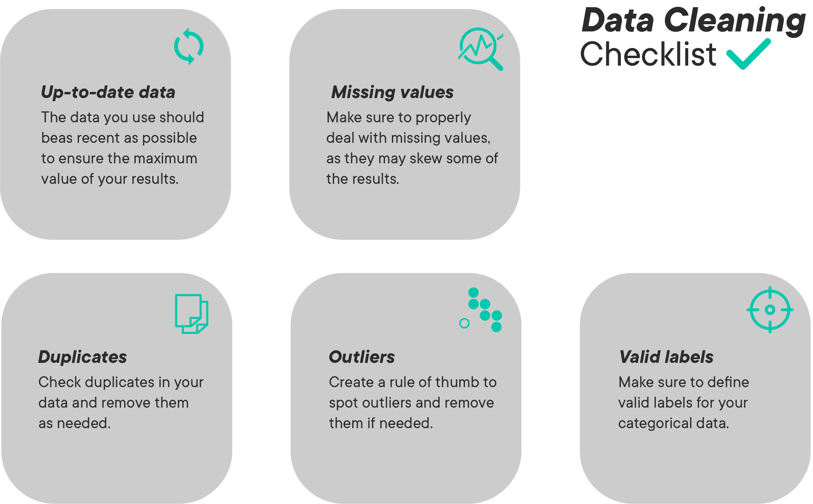
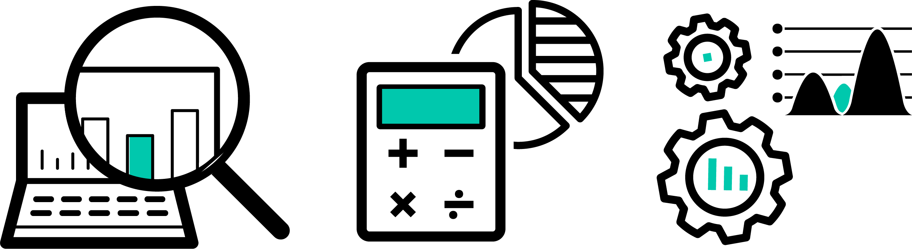
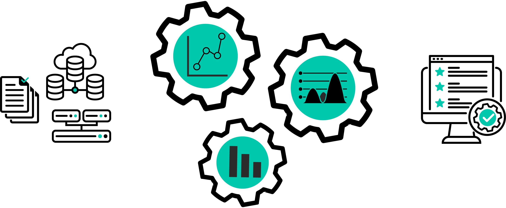
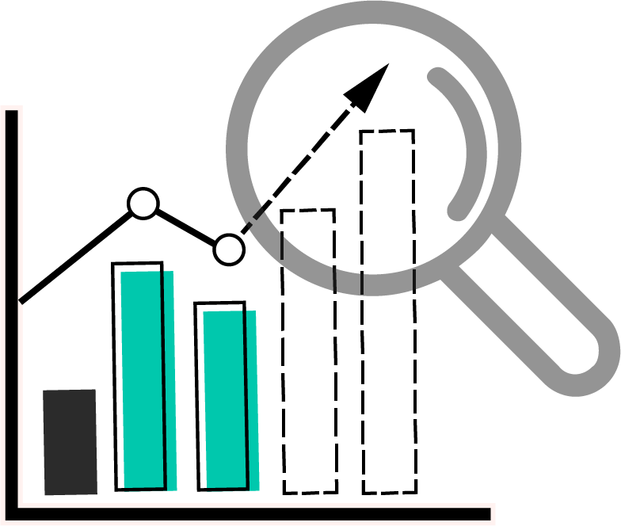
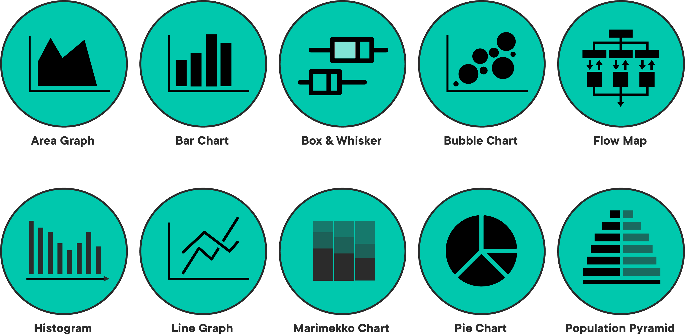

# The Data Science Process

## Introduction

Just as it's important to understand the kinds of problems that can be solved by data science, it's also important to have a sense of the process used to conduct data science. In this lesson, we'll outline the lifecycle of a typical data science project - from business understanding through data visualization.

## Objectives
You will be able to:
* Describe the data science process

## The Data Science Process

There is much more to data science that just selecting, applying and tuning Machine Learning algorithms. A data science project will often include the following stages:
 
 

 
 
In the following section, you will go through each of these stages and see what is involved.

## Business Understanding / Domain Knowledge

Before trying to solve a data related problem, it is important that a data scientist/analyst has a clear understanding of the problem domain and the kinds of question(s) that need to be answered by their analysis. Some of the questions that the data scientist might be asked to answer could include:

* How much or how many? E.g. Identifying the number of new customers likely to join your company in the next quarter. (Regression analysis)

* Which category? E.g. Assigning a document to a given category for a document management system. (Classification analysis)

* Which group? E.g. Creating a number of groups (segments) of your customers based on their monetary value. (Clustering)

* Is this weird? E.g. Detecting suspicious activities of customers by a credit card company to identify potential fraud. (Anomaly detection)

* Which option should be taken? E.g. Recommending new products (such as movies, books or music) to existing customers (Recommendation systems)

 

 

## Data Mining

After agreeing with the analytical question(s), identifying the objective for your analysis, the next stage of analysis is to identify and gather the required data. 

Data mining is a process of identifying and collecting data of interest from different sources - databases, text files, APIs, the Internet, and even printed documents. Some of the questions that you may ask yourself at this stage are:

* What data items do I need in order to answer my analytical question?
* Where can I find this data?
* How can I obtain the data from the data source?
* How do I sample from this data?
* Are there any privacy/ legal issues that I must consider prior to data usage?
 
 

 

## Data Cleaning

Data cleaning and wrangling is usually the most time-consuming stage within the data science process. This stage may take up to 50-80% of a data scientist's time as there are a vast number of possible problems that make the data "dirty" and unsuitable for analysis. Some of the problems you may see in data are as follows:

* Inconsistencies in data
* Mis-spelled text data
* Outliers
* Imbalanced data
* Invalid/outdated data
* Missing data

The data cleaning stage requires the development of a strategy on how to deal with these issues. Such a strategy may vary substantially between different analysis experiments depending on the nature of problems being solved. 

## Data Exploration

Data exploration or Exploratory Data Analysis is the stage that follows data cleaning. Exploratory analysis help highlight the patterns, relations, variance and bias of available data. Exploratory analysis may involve the following activities:

* Selecting a subset of a bigger dataset for exploration
* Calculating basic descriptive statistics such as the mean, the median, and the mode
* Creating a range of plots including histograms, scatter plots and distribution curves to identify trends in the data
* Other interactive visualization with filtering to focus on a specific segment of data 

## Feature Engineering

A "Feature" is a measurable attribute of the phenomenon being observed - the number of bedrooms in a house or the weight of a vehicle. Based on the nature of the analytical question asked in the first step, a data scientist may have to engineer additional features not found in the original dataset. Feature engineering is the process of using expert knowledge to transform raw data into meaningful features that directly address the problem you are trying to solve. For example, taking weight and height to calculate Body Mass Index for the individuals in the dataset. This stage will substantially influence the accuracy of the predictive model you construct in the next stage. 

## Predictive Modelling

Modeling is the stage where you use mathematical and/or statistical approaches to answer your analytical question. Predictive Modeling refers to the process of using probabilistic statistical methods to try to predict the outcome of an event. For example, based on employee data, an organization can develop a predictive model to identify employee attrition rate in order to develop better retention strategies.

Choosing the "right" model is often a challenging decision as there is never a single right answer. Selecting a model involves balancing the accuracy and computational cost of the analysis process. For example, some recent approaches in predictive modeling such as deep learning have been shown to offer vastly improved accuracy of results, but with a very high computational cost.

## Data Visualization

After deriving the required results from a statistical model, visualizations are normally used to summarize and present the findings of the analysis process in a form which is easily understandable by non-technical decision makers. 

Data visualization could be thought of as an evolution of visual communication techniques as it deals with the visual representation of data. There are a wide range of different data visualization techniques, from bar graphs, line graphs and scatter plots to alluvial diagrams and spatio-temporal visualizations, each of which will work better for presenting certain types of information.

## Summary

In this lesson, we looked at the end to end data science process to give a sense of the activities that data scientists engaged with.
