# Your First Data Science Codealong!

## Introduction

In this codealong, you'll get to do your first taste of a real data science workflow! You'll use Jupyter Notebook to import pre-written libraries, import data into your notebook from a Comma Seperated Values file (a .csv file) and you'll even get to create some plots!

Don't worry if it feels like a lot or you get confused on this codealogn. Our goal here is just to give you a taste of what you'll be able to do as a data scientist, and afterwards, we'll go back and re-introduce all of the concepts that we skimmed over this time through, so by the end of the section you should have a much stronger understanding of this - even if you have no previous experience of programming.

Don't worry about running tests for this notebook. Just take your time to explore the data and the code.

## Objectives
You will be able to:
* Code along (following detailed instructions) to import a csv file and then plot the data

## Jupyter Notebook and Running Cells

**Welcome to programming!**
Juptyer Notebooks (historically called IPythonNotebooks) will be our primary tool when conducting data science. The first thing to know with this is that each cell block [of code] can be run be pressing **shift+enter**. Try running the below code block:


```python
print('This is code being run.')
```

## Importing Packages
The next thing we're going to do is load in some python packages that will be part of our toolbox for manipulating and analyzing data. The standard python package for working with data tables is called **pandas**. Below, we import this under the **alias** pd, which is the industry standard. This will give us a shorthand way to access special functions and methods within the package without having to type the longer name pandas. 

* Again, press **shift+enter** to run the code below


```python
import pandas as pd
import matplotlib.pyplot as plt
%matplotlib inline
```

# Jupyter Notebook Cell Types

You might have started to notice that the code blocks have little notes that say **In [ ]:** before you run them, and then are filled with a number after you run them. This is important, as it tells you what order cell blocks were run. (Which can sometimes affect how a program runs.)

You may also notice that other cell blocks, such as this one, do not have the **In [ ]:** label as with the code blocks. This is because this cell block is formatted as **Markdown** rather then code. You can see (and change) what type of cell is by clicking the dropdown menu at the top:
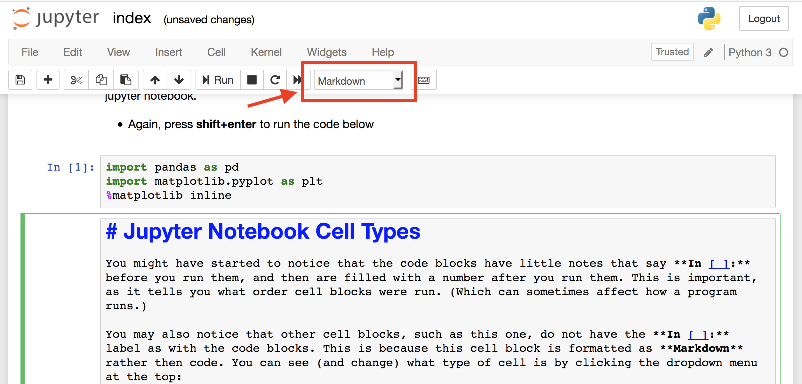

# Command Versus Edit Mode

You should also start to notice that when you are in a cell writing code (or notes), the cell is highlighted in **green** meaning you are in **edit mode**. 

Alternatively, if you **press esc**, the cursor will be in **blue** inidicating that you are in **command mode**.

### Edit Mode
Edit mode is the standard mode for editing cells, whether its writing code or notes.
To enter edit mode from command mode simply hit enter, or double click on a cell.

### Command Mode
In command mode, you can delete cells, add cells, copy cells, paste cells, change cell types, and more. You can also do these tasks in a more cumbersome (and time consuming) manner by using the various headers in the menu bar at top.
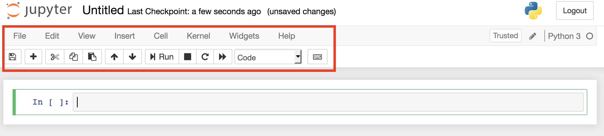
You can also see a full list of shortcuts available in command and edit mode under the help menu.

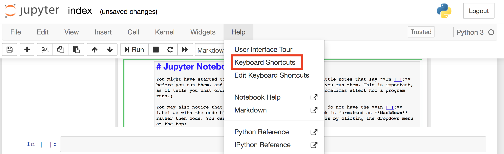

# Running Bash Commands

We can also run bash commands just as we did before from the terminal directly within iPython notebooks!  
 (Note: bash commands cannot be mixed with python and must be in their own cell block.)   
 
Try it out!


```python
pwd
```


```python
ls
```

## Loading a DataFrame
The primary datatype within the pandas package is called a dataframe and is similar to a spreadsheet in excel. Here's a brief example of loading a csv file from your hard drive:


```python
df = pd.read_csv('lego_sets.csv') #Loads the dataframe in
print(len(df)) #Prints the length of the dataframe
df.head() #Uses a built in method common to all Pandas Dataframes
```

    12261


<div>
<style scoped>
    .dataframe tbody tr th:only-of-type {
        vertical-align: middle;
    }

    .dataframe tbody tr th {
        vertical-align: top;
    }

    .dataframe thead th {
        text-align: right;
    }
</style>
<table border="1" class="dataframe">
  <thead>
    <tr style="text-align: right;">
      <th></th>
      <th>ages</th>
      <th>list_price</th>
      <th>num_reviews</th>
      <th>piece_count</th>
      <th>play_star_rating</th>
      <th>prod_desc</th>
      <th>prod_id</th>
      <th>prod_long_desc</th>
      <th>review_difficulty</th>
      <th>set_name</th>
      <th>star_rating</th>
      <th>theme_name</th>
      <th>val_star_rating</th>
      <th>country</th>
    </tr>
  </thead>
  <tbody>
    <tr>
      <th>0</th>
      <td>6-12</td>
      <td>29.99</td>
      <td>2.0</td>
      <td>277.0</td>
      <td>4.0</td>
      <td>Catapult into action and take back the eggs fr...</td>
      <td>75823.0</td>
      <td>Use the staircase catapult to launch Red into ...</td>
      <td>Average</td>
      <td>Bird Island Egg Heist</td>
      <td>4.5</td>
      <td>Angry Birds™</td>
      <td>4.0</td>
      <td>US</td>
    </tr>
    <tr>
      <th>1</th>
      <td>6-12</td>
      <td>19.99</td>
      <td>2.0</td>
      <td>168.0</td>
      <td>4.0</td>
      <td>Launch a flying attack and rescue the eggs fro...</td>
      <td>75822.0</td>
      <td>Pilot Pig has taken off from Bird Island with ...</td>
      <td>Easy</td>
      <td>Piggy Plane Attack</td>
      <td>5.0</td>
      <td>Angry Birds™</td>
      <td>4.0</td>
      <td>US</td>
    </tr>
    <tr>
      <th>2</th>
      <td>6-12</td>
      <td>12.99</td>
      <td>11.0</td>
      <td>74.0</td>
      <td>4.3</td>
      <td>Chase the piggy with lightning-fast Chuck and ...</td>
      <td>75821.0</td>
      <td>Pitch speedy bird Chuck against the Piggy Car....</td>
      <td>Easy</td>
      <td>Piggy Car Escape</td>
      <td>4.3</td>
      <td>Angry Birds™</td>
      <td>4.1</td>
      <td>US</td>
    </tr>
    <tr>
      <th>3</th>
      <td>12+</td>
      <td>99.99</td>
      <td>23.0</td>
      <td>1032.0</td>
      <td>3.6</td>
      <td>Explore the architecture of the United States ...</td>
      <td>21030.0</td>
      <td>Discover the architectural secrets of the icon...</td>
      <td>Average</td>
      <td>United States Capitol Building</td>
      <td>4.6</td>
      <td>Architecture</td>
      <td>4.3</td>
      <td>US</td>
    </tr>
    <tr>
      <th>4</th>
      <td>12+</td>
      <td>79.99</td>
      <td>14.0</td>
      <td>744.0</td>
      <td>3.2</td>
      <td>Recreate the Solomon R. Guggenheim Museum® wit...</td>
      <td>21035.0</td>
      <td>Discover the architectural secrets of Frank Ll...</td>
      <td>Challenging</td>
      <td>Solomon R. Guggenheim Museum®</td>
      <td>4.6</td>
      <td>Architecture</td>
      <td>4.1</td>
      <td>US</td>
    </tr>
  </tbody>
</table>
</div>


# Python Comments

Note the green text following the **#**.  
Anything following a **#** in python is a comment and will not actually execute.  
This is a useful feature for annotating your code with notes for yourself and other later so that your code is easy to read.

# Accessing Methods from Packages and Objects

A little more theory and context:

When we loaded in packages on our first cell block (import pandas as pd), we loaded code into memory. That code included functions, variables and other objects. Collectively, all of these items is loaded under the package name or alias.  

We demonstrated this when we used the **pd.read_csv()** method above.  

This also demonstrates the **dot notation** in python, which is how we access built in methods or attriubtes of a given object. Similar to what we saw with bash in the command line, we can also use **tab completion** to preview methods available in packages or other objects.  

### Try this out yourself

* In the cell below, navigate your cursor to the right of **pd.**
* Press tab to see a list of available methods/attributes

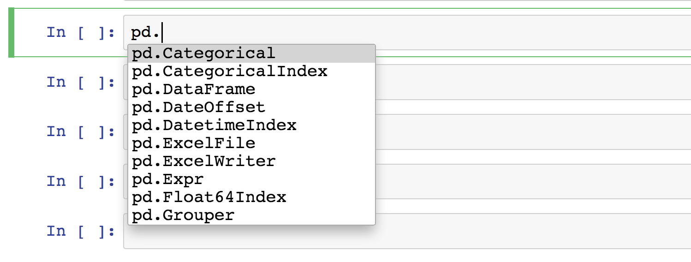


```python
pd.
```

You can also start typing to subset the list of available commands:


# Pulling up Docstrings

Even better, you can even see how a method works by pulling up its **docstring**!  
You can do this by writing **?** after the method and running the cell.

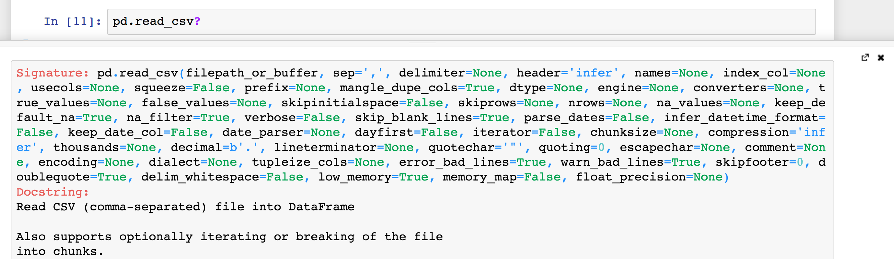 


Try it out!


```python
pd.read_csv?
```

Alternatively, you can pull up a preview of the docstring by pressing **shift+tab within the parentheses of a method**
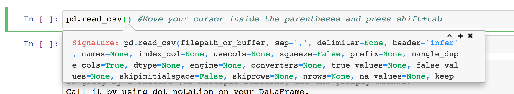


```python
pd.read_csv() #Move your cursor inside the parentheses and press shift+tab
```

# Variables

The other thing that happened in our block of code above was that we defined a **variable**.  

This happened in the first line of code:  
```df = pd.read_csv('lego_sets.csv')```

As we saw, we used the built in *read_csv* method from the *pandas* package which we imported under the *alias* *pd*.  

The output of this method was then assigned to the variable *df*. This is the standard syntax for declaring any variable. You do not have to specify variable types, as in many other programming languages. Simply:  

`variable_name = what_to_stor_in_the_variable`

# Built in Python Functions

We also used two built in python functions:  
    * len() #Returns the lenght of an object
    * print() #Prints stuff!
In general, **python has reserved keywords** for built in functions like this. 
**Be sure to not name your variables any of these!**

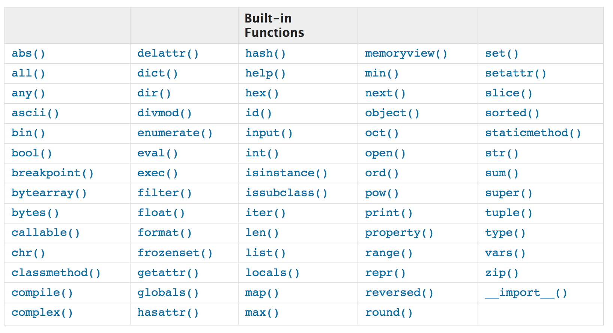

You can also check what type of object something is using the built in **type()** method. This can be useful when determining how to work with an object that you are unfamiliar with.


```python
type(df)
```

# Common DataFrame Methods
As you can see, our variable **df** is a DataFrame object (which is part of the Pandas core package). Here's some other common methods you will want to become familiar with when working with Pandas dataframes:  
* df.head() 
    * Preview the first 5 rows of a dataframe. Pass a number for more/less rows
* df.tail(10) 
    * Preview last 10 rows (default 5 if no number given)
* df.info() 
    * Returns column names and details about each column
* df.columns 
    * Return column names. Note that there is no parentheses for this. This is becuase this is an attribute as opposed to a method


```python
#Practice using some of these methods
```


```python
#Use tab completion to investigate at least 3 other methods under the df object. 
#Pull up their docstrings and investigate what they do.
```

# Pandas Series

While the entire spreadsheet is called a **dataframe**, each individual column is known as a **series**. You can access a specific column of a pandas dataframe one of two ways:  

`df['col_name']`

or  

```df.col_name```

First note that in `df['col_name']` we need 'quotations' around the column name. The quotations denote the column name is a **string**, python's built in variable type for storing text. This can alternatively be replaced with double quotes `df["col_name"]`. In general, anything in quotations is a string in python code. Occassionally, with very ill formatted column names with quotations in the names themselves, you may even need to wrap a name in triple quotes `df["""col_name"""]` . This will rarely happen in this particular context, but is also the general pattern for dealing with messy strings.   

Note that the second method, `df.col_name`, will only work if there are no spaces within the name of the column. Similarly to tab completion with the command line, this is a primary reason why programers use dashes (-) and underscores (_) in lieu of whitespace in their variable and file names. Also note that no quotations are used when using this format. (The column names have been stored as attributes to the DataFrame object!)


```python
#Previewing Data
```


```python
df.head(2) #preview your spreadsheet again; 2 keeps it a nice small preview
```


<div>
<style scoped>
    .dataframe tbody tr th:only-of-type {
        vertical-align: middle;
    }

    .dataframe tbody tr th {
        vertical-align: top;
    }

    .dataframe thead th {
        text-align: right;
    }
</style>
<table border="1" class="dataframe">
  <thead>
    <tr style="text-align: right;">
      <th></th>
      <th>ages</th>
      <th>list_price</th>
      <th>num_reviews</th>
      <th>piece_count</th>
      <th>play_star_rating</th>
      <th>prod_desc</th>
      <th>prod_id</th>
      <th>prod_long_desc</th>
      <th>review_difficulty</th>
      <th>set_name</th>
      <th>star_rating</th>
      <th>theme_name</th>
      <th>val_star_rating</th>
      <th>country</th>
    </tr>
  </thead>
  <tbody>
    <tr>
      <th>0</th>
      <td>6-12</td>
      <td>29.99</td>
      <td>2.0</td>
      <td>277.0</td>
      <td>4.0</td>
      <td>Catapult into action and take back the eggs fr...</td>
      <td>75823.0</td>
      <td>Use the staircase catapult to launch Red into ...</td>
      <td>Average</td>
      <td>Bird Island Egg Heist</td>
      <td>4.5</td>
      <td>Angry Birds™</td>
      <td>4.0</td>
      <td>US</td>
    </tr>
    <tr>
      <th>1</th>
      <td>6-12</td>
      <td>19.99</td>
      <td>2.0</td>
      <td>168.0</td>
      <td>4.0</td>
      <td>Launch a flying attack and rescue the eggs fro...</td>
      <td>75822.0</td>
      <td>Pilot Pig has taken off from Bird Island with ...</td>
      <td>Easy</td>
      <td>Piggy Plane Attack</td>
      <td>5.0</td>
      <td>Angry Birds™</td>
      <td>4.0</td>
      <td>US</td>
    </tr>
  </tbody>
</table>
</div>


```python
df.ages.head()
```


    0    6-12
    1    6-12
    2    6-12
    3     12+
    4     12+
    Name: ages, dtype: object


```python
df.ages[:5] #Here we introduce another new syntax the list slice [:5] this limits us to the first 5 items
```


    0    6-12
    1    6-12
    2    6-12
    3     12+
    4     12+
    Name: ages, dtype: object


# List and Series Slices
Above, we introduced an entirely new programming pattern called a slice.  
The syntax for a slice is `[start:end]`.   

You can also pass an additional third parameter `[start:end:count_by]` which will allow you to:  
count every other: `[start:end:2]`  
count backwards: `start:end:-1]`  
or potentially much more cryptic patterns, depending on what you pass.  

While we could have also used `df.State.head()`, slicing works for many more datatypes. This includes the previously mentioned *strings* as well as **lists** and other iterable objects. **Series**, the columns of the pandas DataFrame are similar to python's built in *lists*, but also have additional *methods* built in to them that we will continue to investigate.


```python
df.piece_count.
```

# Common Series Methods
Some very useful series methods include:  
* df.col_name.value_counts()
* df.col_name.astype()
* series.mean()     #Changing notation here: series refers to df.col_name (which is a series)!
* series.median()
* series.min()
* series.max()
* series.std()
* series.unique()
* series.nunique()
* series.sample()
* series.sort_values()

There are also many more but this is a very good starting point.
Start pulling up some docstrings and getting acquainted with reading them yourself before we go through a few of these methods together.


```python
df.play_star_rating.value_counts? #Read the docstring and tinker! See how it works.
```


```python
#Keep tinkering!
```

# Graphing

Our bread and butter tool for graphing in python will be **matplotlib**. 
There are a number of other packages you can also check out for visualization later on such as plotly, folium, and bokeh to name a few, but matplotlib is an industry standard used widely. As with the pandas package, we must import  the matplotlib package to use its built in functions and methods. Rather then import the entire package however, we import only the piece we intend to use (hence the dot notation) and again alias this under the shorthand *plt*. Finally, the iPython magic command **% matplotlib inline** makes these graphs appear within our jupyter notebook.


```python
#import a subset of the matplotlib package under the alias 'plt'
import matplotlib.pyplot as plt

#ipython magic command for displaying graphs within the notebook
%matplotlib inline
```


```python
to_graph = df.theme_name.value_counts()[:5]
to_graph.plot(kind='barh')
```


    <matplotlib.axes._subplots.AxesSubplot at 0x1135c9dd8>


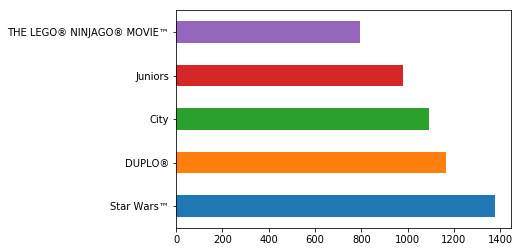


# Adding labels
The graph above is a good start, but we should be sure to add some labels! To do this we make successive calls to the `plt` package we imported. Some common methods you should be familiar with include:  
* plt.title()
* plt.xlabel()
* plt.ylabel()
* plt.legend()
* plt.xticks()
* plt.yticks()


```python
to_graph = df.theme_name.value_counts()[:5]
to_graph.plot(kind='barh') #lots of other optional parameters can be passed such as color
plt.title('Top 5 Lego Themes', fontsize=16) #fontsize is optional
plt.xlabel('Number of Lego Sets') #you could also pass in fontsize if you wanted here
plt.ylabel('Theme') #you could also rotate text if you wanted
```


    Text(0,0.5,'Theme')


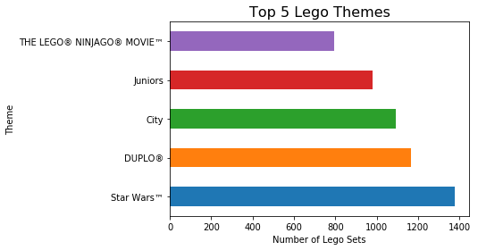


# Practice and Explore

Take a minute to try chaining some of these methods together to create a few of your own visuals for practice. Some ideas can include making a scatter plot with `plt.scatter(x , y)` where you pass in two series (one as x and the other as y), plotting histograms with the `series.hist()` method, or creating simple bar graphs as shown above.


```python
plt.scatter(df.play_star_rating, df.star_rating)
```


    <matplotlib.collections.PathCollection at 0x113ad3898>


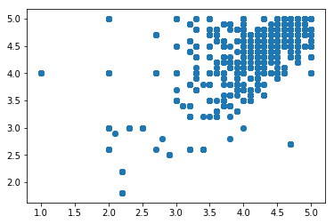


```python
df.play_star_rating.hist()
```


    <matplotlib.axes._subplots.AxesSubplot at 0x11383ad30>


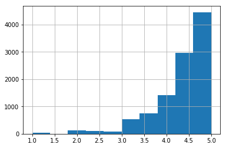


```python
#Your code here
```
