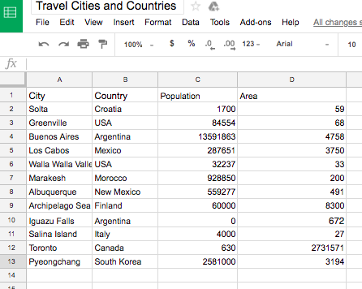

# Working with Dictionaries - Lab

## Introduction
Now that we know about dictionaries in Python, it is time to practice using them. In this lesson, we'll use our knowledge of dictionaries to retrieve and assign data about various cities.

## Objectives
You will be able to:
* Understand dictionaries and how to use them

## Instructions

Here is a dictionary representing the city of Greenville, North Carolina.  The area is in kilometers squared.


```python
greenville = {'Area': 68, 'City': 'Greenville', 'Country': 'USA', 'Population': 84554}
```

> Remember to press shift + enter to run the code.

Let's retrieve the population of the city and assign it to the variable `greenville_population`.


```python
greenville_population = None # change None
greenville_population # 84554
```

Now retrieve the area of Greenville and assign it to the variable `greenville_area`.


```python
greenville_area = None
greenville_area # 68
```

Now let's take a look at all of the keys in the `greenville` dictionary and coerce them into a list.  Assign this variable to the list `city_keys`.


```python
city_keys = None
city_keys # ['Area', 'City', 'Country', 'Population']
```

Alright, next let's get all of the values in our greenville dictionary and coerce it into a list.  Assign that list to the variable `city_values`.


```python
city_values = None
city_values # [68, 'Greenville', 'USA', 84554]
```

### Working with multiple cities

We can retrieve our data from an excel or Google sheets like the one [shown here](https://docs.google.com/spreadsheets/d/1BTJMMFH9t4p5UmHj5kiC6PGfMN6yaaaZkocx0mDqTK0/edit#gid=0) named Travel Cities and Countries.



Lukily for us, we already have the spreadsheet downloaded and located in the current folder.  You can find the file in this lessons the GitHub repository. Next, we will use a Library called **Pandas** to get this data from the excel file into Python code. We already have the code for reading an excel file into Python written for us below. Let's check it out.

> **Note:** To import a library or module in Python, we do so by writing `import` followed by the name of the thing we want to import. We can optionally include an *alias* for our import, which is done by writing **as** after the name of the thing we are importing followed by the name we would like to use for our *alias*. **Do not worry** about aliases right now. Just know that the *convention* for importing the pandas library is to import it and alias it as `pd` like we see below. 


```python
import pandas as pd
file_name = './cities.xlsx'
travel_df = pd.read_excel(file_name)
cities = travel_df.to_dict('records')
```

> Remember to press shift + enter.

Great! We just used pandas to read the data from our excel file and turn each row of data into a dictionary. Again, don't worry about exactly how pandas is doing this, but know that pandas is a great tool when trying to accomplish a task such as turning data from an excel file into data we can use in Python.

Run the cell below to see what our data looks like now.


```python
cities
```

Ok, so the list of countries associated with each city has been assigned to the variable `cities`.  Now we will work with reading and manipulating this list of cities.

### Working with our list of cities

First, access the third to last element and set it equal to the variable `salina`.


```python
salina = None 
salina
# {'Area': 27, 'City': 'Salina Island', 'Country': 'Italy', 'Population': 4000}
```

Now access the fourth country in the list, and set it's population equal to a variable called `los_cabos_pop`.


```python
los_cabos_pop = None
los_cabos_pop # 287651
```

Now calculate the number of cities in the list and assign the number to the variable `city_count`.


```python
city_count = None
city_count # 12
```

Finally, change the spelling of the South Korean city, Pyeongchang, to the string `'PyeongChang'`, its alternative spelling.


```python
cities[11]['City'] = None
cities[11]['City'] # 'PyeongChang'
```

Now let's work on retrieving a collection of information about a dictionary.  Use the appropriate dictionary function to return a list of values in the dictionary regarding Pyeongchang.   Assign the list to the variable `pyeongchang_values`.


```python
pyeongchang_values = None

pyeongchang_values # ['PyeongChang', 'South Korea', 2581000, 3194]
type(pyeongchang_values) # list
```

And now set `pyeongchang_keys` equal to a list of keys in the dictionary regarding Pyeongchang.


```python
pyeongchang_keys = None


pyeongchang_keys # ['City', 'Country', 'Population', 'Area']
type(pyeongchang_keys) # list
```

### Summary

In this section we saw how to retrieve and re-assign data in a dictionary.  We saw how we can retrieve a collection of information from a dictionary, like a list of it's keys and values, and we saw how we can work with a list of dictionaries.
