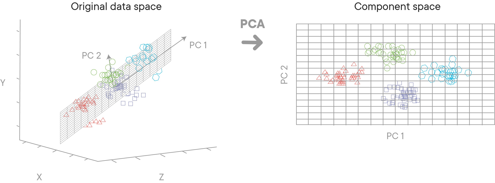

# Motivation for Linear Algebra in Data Science

## Introduction

In this section, you'll learn about algebra as a foundational step for data science, and later on machine learning. Later on, you'll see how linear algebra applies to statistics, and you'll use it while working with graphical models.
Linear algebra is also very important when moving on to machine learning models, where a solid understanding of linear equations plays a major role.  This lesson will attempt to present some motivational examples on how and why a solid foundation of linear algebra is valuable for data scientist.

## Objectives

You will be able to:

* Understand and state the importance of linear algebra in the fields of data science and machine learning
* Describe the areas in AI and machine learning where Linear Algebra might be used for advanced analytics

## Background 

Linear Algebra is foundational for a wide range of areas in mathematics, eg. geometry. The concepts of linear algebra are important if you want to understand how certain data science processes work. While having a deep understanding of linear algebra may not be mandatory, some basic knowledge is undoubtedly extremely helpful in your journey towards becoming a data scientist.

You may already know a number of linear algebraic concepts without even knowing it. Examples are: matrix multiplication and performing cross-products. Later on, you'll learn more complex algebraic concepts like the calculation of matrix determinants, cross-products, and eigenvalues/eigenvectors. As a data scientist, it is important to know some the theories as well as having practical understanding of these concepts in a real-world setting.

## An Analogy 

Think of a simple example where you first learn about a sine function as an infinite polynomial while learning trigonometry. Students usually practice this function by passing different values to this function it and getting the expected results, and then manage to relate this to triangles and vertices. When learning advanced physics, students get to learn more applications of sine and other similar functions in the area of sound and light. In the domain of Signal Processing for unidimensional data, these functions pop up again to help you solve filtering, time-series related problems. An introduction to numeric computation around sine functions can not alone help you understand its wider application areas. In fact sine functions are everywhere in the universe from music to light/sound/radio waves, from pendulum oscillations to alternating current. 

## Why Linear Algebra?

> Linear algebra is the branch of mathematics concerning vector spaces and linear relationships between such spaces. It includes the study of lines, planes, and subspace, but is also concerned with properties common to all vector spaces.

Analogous to the example we saw above, it's important that a data scientist understands how data structures are built with vectors and matrices following the geometric intuitions from linear algebra, in addition to the numeric calculations. A data-focused understanding of linear algebra can help machine learning practitioners decide what tools can be applied to a given problem and how to interpret the results of experiments. You'll see that a good understanding of linear algebra is particularly useful in many ML/AI algorithms, especially in deep learning, where a lot of the elements happen under the hood.

Following are some of the areas where linear algebra is commonly practiced in the domain of data science and machine learning. 

### Computer Vision / Image Processing

Computers are designed to process binary information only (only 0s and 1s). How can an image such as the dog shown here, with multiple attributes like color, be stored in a computer? This is achieved by storing the pixel intensities for red, blue and green colors in a matrix format. Color intensities can be coded into this matrix and can be processed further for analysis and other tasks. Any operation performed on this image would likely use some form of Linear Algebra with matrices at the back end.

### Deep Learning - Tensors

Deep Learning is a sub-domain of machine learning, concerned with algorithms that can imitate the functions and structure of a biological brain as a computational algorithm. These are called the artificial neural networks (ANNs). 

The algorithms usually store and process data in form of mathematical entities called tensors. A tensor is often thought of as a generalized matrix. That is, it could be a 1-D matrix (a vector is actually such a tensor),a 2-D matrix (like a data frame), a 3-D matrix (something like a cube of numbers), even a 0-D matrix (a single number), or a higher dimensional structure that is harder to visualize.

As shown in the image above where different input features are being extracted and stored as spatial locations inside a tensor which appears as a cube. A tensor encapsulates the scalar, vector and the matrix characteristics. For deep learning, creating and processing tensors and operations that are performed on these also require knowledge of linear algebra. Don't worry if you don't fully understand this right now, you'll learn more about tensors later!

### Natural Language Processing

Natural Language Processing (NLP) is another (very popular) area in Machine Learning dealing with text data. The most common techniques employed in NLP include BoW (Bag of Words) representation, Term Document Matrix etc. As shown in the image below, the idea is that words are being encoded as numbers and stored in a matrix format. Here, we just use 3 sentences to illustrate this:

This is just a short example, but you can store long documents in (giant) matrices like this. Using these counts in a matrix form can help perform tasks like semantic analysis, language translation, language generation etc.

### Dimensionality Reduction

Dimensionality reduction techniques, which are heavily used when dealing with big data sets, use matrices to process data in order to reduce its dimensions. Principle Component Analysis (PCA) is a widely used dimensionality reduction technique that relies solely on calculating Eigenvectors and Eigenvalues to identify principal components as a set of highly reduced dimensions. The picture below is an example of a three dimensional data being mapped into two dimensions using matrix manipulations. 

Great, you now know about some key areas where linear algebra is used! In what's next, you'll go through an introductory series of lessons and labs that will cover basic ideas of linear algebra: an understanding of vectors and matrices with some basic operations that can be performed on these mathematical entities. We will implement these ideas in Python, in an attempt to give you foundation knowledge to deal with these algebraic entities and their properties. These skills will be applied in advanced machine learning sections later in the course. 

## Further Reading 

[Youtube: Why Linear Algebra](https://www.youtube.com/watch?v=_MxCXGF9N-8)

[Boost your data science skills. Learn linear algebra.](https://towardsdatascience.com/boost-your-data-sciences-skills-learn-linear-algebra-2c30fdd008cf)

[Quora: Applications of Linear Algebra in Deep Learning](https://www.quora.com/What-are-the-applications-of-linear-algebra-in-machine-learning)

## Summary 

In this lesson, you learned about some Data Science examples that heavily rely on linear algebra principles. You looked at some use cases in practical machine learning problems where linear algebra and matrix manipulation might come in handy. In the following lessons, you'll take a deeper dive on specific concepts in linear algebra, working our way towards solving a regression problem using linear algebraic operations only. 
