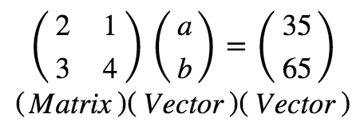

# Systems of Linear Equations 

## Introduction

Linear algebra is a sub-field of mathematics concerned with vectors, matrices, and linear transforms between them. 
The first step towards developing a good understanding of linear algebra is to get a good sense of *what are linear mappings and linear equations?*, *How do these relate vectors and matrices ?* and *whats all this got to do with data analysis* . Let's try to develop a basic intuition around these ideas by first understanding what linear equations are. 

## Objectives

You will be able to: 

* Describe a system of linear equations for solving simple analytical problems.
* Solve a system of equations using elimination and substitution. 
* Understand the role of matrices and vectors for solving linear equations. 


## What are Linear (Simultaneous) Equations ?

In mathematics, a system of linear equations (or linear system) is a collection of two or more linear equations involving the same set of variables. For example, look at following equations.
```
3x + 2y - z = 0
2x- 2y + 4z = -2
-x + 0.5y - z = 0
```

This is a system of three equations in the three variables x, y, z. A solution to a linear system is an assignment of values to the variables such that *all the equations are simultaneously satisfied*. A solution to the system above is given by:

```
x = 1
y = -8/3
z = -7/3
```

Since it makes all three equations valid. The word "system" indicates that the equations are to be considered collectively, rather than individually.

## Solving Linear Equations

A system of linear equations can always be expressed in a matrix form. Algebraically, both of these express the same thing. Let's work with a simple example to see how this is achieved. 

#### Example 

Let's say you go to a market and buy 2 apples and 1 banana. For this you end up paying 35 pence. If we denote apples by `a` and bananas  by `b`, the relationship between bought items bought and price paid can be written down as an equation - let's call it Eq. A:

**2a + b = 35** - (Eq. A)

In your next trip to the market, you buy 3 apples and 4 bananas, and the cost is 65 pence. Just like above, this can be written as Eq. B:

**3a + 4b = 65** - (Eq. B)

These two equations (known as simultaneous equation) form a system that can be easily solved by hand for values of `a` and `b` i.e. price of a single apple and banana. 

Let's try it quickly and solve this system for individual prices using a series of eliminations and substitutions:

Step 1 : Multiply Eq. 1 by 4

> **8a + 4b = 140** - (Eq. C)

Step 2 : Subtract Eq. B from Eq. C

> **5a = 75** - (Eq. D)

OR 

> **a = 15**

Step 3: Substitute the value of `a` in Eq. A

> **30 + b = 35** - (Eq. E)

OR 

> **b = 5**

So the price of an apple is 15 pence and price of banana is 5 pence. That was simple.

## From equations to vectors and matrices

Now, as your number of shopping trips increase, as well as the number of items you buy at each trip, the system of equations will become more complex and solving such system for individual price may become very expensive in terms of time and effort. In such cases, we expect a computer to find the solution for us. 

This example is simple linear algebra problem. The numbers 2, 1 from Eq. 1 and 3, 4 from Eq.2  are **linear co-efficients** that relate **input variables** `a` and `b` to the known **output** 13 and 52.  

Using linear algebra , we can write this system of equations as shown below:


So we see, that in order for a computational algorithm to solve this (and other similar) problems, the data we have first needs to get converted into a set of matrix and vector objects as shown above. Machine learning involves building up such objects from the given data, understanding their relationships and how to process them for a given problem. 

Solving these equations require knowledge around defining these vectors and matrices in a computational environment and of operations that can be performed on these entities to solve for unknown variables as we saw above. We shall look into this in upcoming lessons. 

## Summary

In this lesson, we learnt how a system of linear (simulatneous) equations can be solved using elimination and substitution, and also , how to covert these problems into matrices and vectors to be processed by computational algorithms. In next couple of lessons, we shall look at how to describe these entities in python and numpy and also how to perform arithmatic and other operations to solve such equations. 
