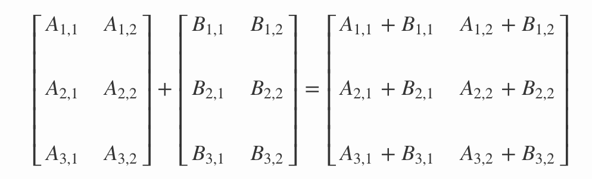
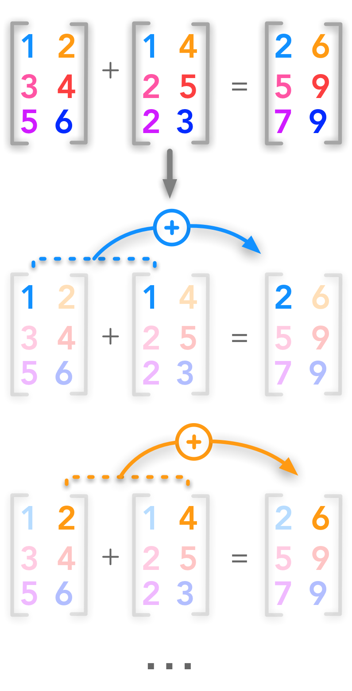
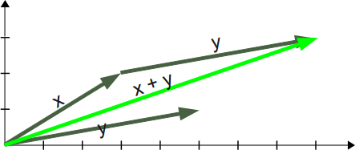
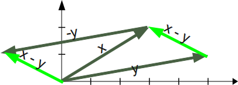
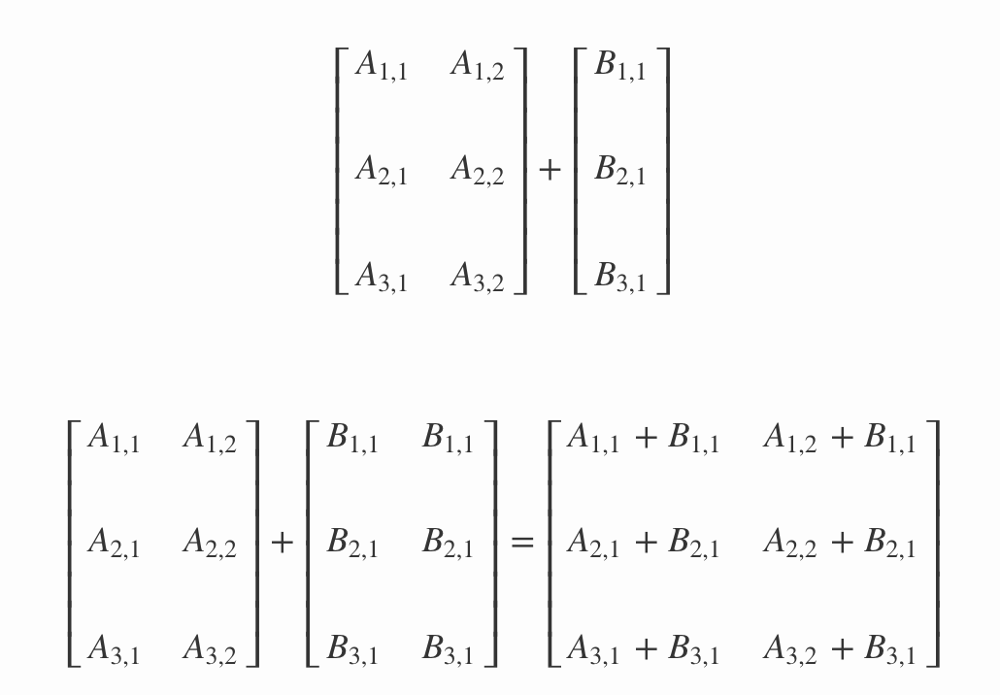

# Vector Addition and Broadcasting in Numpy - Code Along

## Introduction

This lesson is a supplement to the previous lesson where we learnt how to create numpy arrays as vectors or matrices and performed basic manipulations on these objects. In this lesson we shall look at matrix addition and broadcasting features offered by Numpy.

## Objectives
You will be able to:
* Understand and implement vector addition in Numpy 
* Understand how broadcasting differs from addition when adding mismatched dimensions.

## Vector Addition

We shall now look at simple vector addition, where all operations are performed element-wise between two vectors/matrices of equal size to result in a new vector/matrix with the same size.


Two arrays A and B with the same dimensions can be added together if:
* they have the same shape:
* each cell of A is added to the corresponding cell of B:

> **A <sub>i,j</sub> + B <sub>i,j</sub> = C <sub>i,j</sub>**



here A(i,j) and B(i,j) represent row and column locations. This is a more standard notation that you will find in most literature. Another visual representation of this process can be shown as :



1 dimensional arrays can be added together in exactly the same way following similar assumptions. The addition of two vectors x and y may be represented graphically by placing the start of the arrow y at the tip of the arrow x, and then drawing an arrow from the start (tail) of x to the tip (head) of y. The new arrow drawn represents the vector x + y


We can perform addition operations in Numpy as:
```python
import numpy as np

# Adding 1-D arrays
a = np.array([1,2,3])
b = np.array ([4,5,6]) 
c=a+b
c
```


```python
# Code here 
```

Subtracting a vector is the same as adding its negative. So, the difference of the vectors x and y is equal to the sum of x and -y: 
> x - y = x + (-y)

Geometrically, when we subtract y from x, we place the end points of x and y at the same point, and then draw an arrow from the tip of y to the tip of x. That arrow represents the vector x - y.


Mathematically, we subtract the corresponding components of vector y from the vector x.

```python
# Subtracting 1-D arrays
a = np.array([1,2,3])
b = np.array ([4,5,6]) 
c=b-a
c
```


```python
# Code here
```

Now lets try addition with matrices.

``` python
# Adding 2-D matrices
A = np.array([[1, 2], [3, 4], [5, 6]])
B = np.array([[1, 4], [2, 5], [2, 3]])
# Add matrices A and B
C = A + B
C
```


```python
# Code here 
```

```python
# Add matrices with mismatched dimensions
A = np.array([[1, 2], [3, 4], [5, 6]])
B = np.array([[1, 4], [2, 5]])
# Add matrices A and B
C = A + B
C
```


```python
# Code here 
```

Yes, an error, as expected due to dimension mismatch. Here it seems very intuitive to know why this happened , but when working with large matrices and tensors, shape mismatch could become a real problem and as data scientists, we must be sure about what dimensions our datasets carry. 

## Vector Scalar Addition

Scalar values can be added to matrices and vectors. In this case, the scalar value is added to each element of array as shown below:
```python
# Add scalars to arrays
# Add a scalar to a 1-D vector
print(a+4)
# Add a scalar to a 2-D matrix
print(A+4)
```


```python
# Code here 
```

## Broadcasting

Numpy can also handle operations on arrays of different shapes as some machine learning algorithms need that. The smaller array gets **extended** to match the shape of the larger array. In the scalar-vector addition, we used broadcasting so the scalar was converted in an array of same shape as A.


Let's see this is action while trying to add arrays with different shapes

```python
A = np.array([[1, 2], [3, 4], [5, 6]])
print(A)
B = np.array([[2], [4], [6]])
print(B)
A+B
```


```python
# Code here 
```

## Summary 

In this lesson, we saw how to add vectors and matrices and also looked at the dimension match assumption necessary for this addition. We also looked at how numpy allows you to use broadcasting to add scalars and vector/matrices to other objects with different dimensions. In the following lessons, we shall look at more complicated mathematical operations and their use in real life data analysis. 
