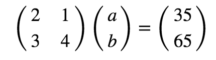

# Solving Systems of Linear Equations with NumPy - Code Along

## Introduction

In this lesson, you'll learn how to solve a system of linear equations using matrix algebra and Numpy.  You'll learn about the identity matrix and inverse matrices, which have some unique properties that can be used to solve for unknown values in systems of linear equations. Next, you'll discover how to create an identity matrix and calculate the inverse of a matrix in Python and Numpy. 

## Objectives

You will be able to:

* Understand and describe identity matrix and its role in linear equations
* Calculate Inverse of a matrix in order to solve linear problems
* Use the Matrix algebra and Numpy skills to solve a system of linear equations

## Identity Matrix

An identity matrix is a matrix whose dot product with another matrix $M$ equals the same matrix $M$.

The identity matrix is a square matrix which contains **1s** along the major diagonal (from the top left to the bottom right), while all its other entries are **0s**. The main diagonal is highlighted in the image below.


An identity matrix with the same $(3 \times 3)$-shape is containing all 1s along this diagnoal and 0s everywhere else as shown below:

$$
  \left[ {\begin{array}{ccc}
   1 & 0 & 0 \\
   0 & 1 & 0 \\
   0 & 0 & 1 \\
  \end{array} } \right]
$$


This would be called a $(3 \times 3)$ Identity matrix. The $(n \times n)$ Identity matrix is ususally denoted by $I_n$ which is a matrix with $n$ rows and $n$ columns. Other examples include $(2 \times 2)$, $(4 \times 4)$ Identity matrices, etc. 


The identity Matrix is also called the Unit Matrix or Elementary Matrix.

### Dot-Product of a Matrix and its Identity Matrix

Let's try to multiply a matrix with its identity matrix and check the output. Let's start with the coefficient matrix from the previous problem:

$$
  \left[ {\begin{array}{cc}
   1 & 2  \\
   3 & 4  \\
  \end{array} } \right]
$$

The identity matrix for this matrix would look like:

$$
  \left[ {\begin{array}{cc}
   1 & 0  \\
   0 & 1  \\
  \end{array} } \right]
$$

Let's take the dot-product for these two matrices as shown below:
```python
import numpy as np
A = np.array([[2,1],[3,4]])
I = np.array([[1,0],[0,1]])
print(I.dot(A))
print('\n', A.dot(I))
```


```python
# Code here 
```

You see that the dot-product of any matrix and the appropriate identity matrix is always the original matrix, regardless of the order in which the multiplication was performed! In other words, 

> $ A \cdot I = I \cdot A = A $

NumPy comes with a built-in function `np.identity()` to create an identity matrix. Just pass in the dimension (number of rows or columns) as the argument. You can add an argument `dtype=int` to make sure the elements are integers (if not, your identity matrix will contain floats):
```python
print(np.identity(4, dtype=int))
print(np.identity(5, dtype=int))
```


```python
# Code here 
```

## Inverse Matrix

The *Inverse* of a square matrix *A*, sometimes called a *reciprocal matrix*, is a matrix $A^{-1}$such that

> $A \cdot A^{-1} = I$

where $I$ is the Identity matrix. 

The inverse of a matrix is analogous to taking reciprocal of a number and multiplying by itself to get a 1, e.g. $5 * 5^{-1} = 1$. Let's see how to get inverse of a matrix in numpy. `numpy.linalg.inv(a)` takes in a matrix a and calculates its inverse as shown below.

```python
A = np.array([[4,2,1],[4,8,3],[1,1,0]])
A_inv = np.linalg.inv(A)
print(A_inv)
```


```python
# Code here 
```

This is great. So according to the principle shown above, if we multiply $A$ with $A^{-1}$, we should get an identity matrix $I$ in the output. 

```python
A_product = np.dot(A,A_inv)
A_product
```


```python
# Code here 
```

Note that this was meant to return the identity matrix. You have 1s along major diagonal, but the float operations returned not zeros but numbers very close to zero off-diagonal. Numpy has a `np.matrix.round` function to convert each element of above matrix into a decimal form. 

```python
np.matrix.round(A_product)
```


```python
# Code here 
```

This looks more like the identity matrix that we saw earlier. The negative signs remain after rounding off as the original small values were negative. This, however, wont effect computation in any way. 

## Why Do We Need an Inverse?

You need an inverse, because with matrices you can't divide! **There is no concept of dividing by a matrix**. However, you can multiply by an inverse, which achieves the same thing.

Imagine you want to share 10 apples with 2 people.

You can divide 10 by 2, or you can take the reciprocal of 2 (which is 0.5), so the answer is:

$10 \times 0.5 = 5$ means They get 5 apples each.

We use the very same idea here and this can be used to solve a system of linear equation in the problems we saw earlier in the section where: 

> $A \cdot X = B$ (remember $A$ is the matrix of coefficients, $X$ is the unknown variable and $B$ is the output)

Say you want to find matrix $X$, when you already know matrix $A$ and $B$:

It would've been great if you could divide both sides by $A$ to get $X = B / A$, but remember that you can't divide. You can obtain this if you multiply both sides by $A^{-1}$, as shown below:

> $X \cdot A \cdot A^{-1} = B \cdot A^{-1}$

From above , we that A . A<sup>-1</sup> = I, so:

> $X \cdot I = B \cdot A^{-1}$

We can remove I (because multiplying with identity matrix doesn't change a matrix). so:

> $X = B \cdot A^{-1}$

And there we have it, our answer. 

## Solve a System of Equations with Matrix Algebra. 

Now that you know everything about converting a simple real world problem into matrix format, and steps to solve the problem, let's try it out with the apples and bananas problem from very first lesson. let's give a quick recap of the problem:

Let's say you go to a market and buy 2 apples and 1 banana. For this you end up paying 35 pence. If you denote apples by $a$ and bananas  by $b$, the relationship between bought items bought and price paid can be written down as:

$2a + b = 35$  - (Eq. A)

In your next trip to the market, you buy 3 apples and 4 bananas, and the cost is 65 pence:

$3a + 4b = 65$ - (Eq. B)

As seen before, this is what that looks like in matrix notation:



So first we'll need to calculate the inverse of the square matrix containing coefficient values.
```python
# Define A and B 
A = np.matrix([[2, 1], [3, 4]])
B = np.matrix([35,65])

# Take the inverse of Matrix A 
A_inv = np.linalg.inv(A)
A_inv
```


```python
# Code here 
```

You can now take a dot product of `A_inv` and `B`. Also, as you want the output in the vector format (containing one column and two rows), you would need to transpose the matrix `B` to satisfy the multiplication rule you saw previously.

> **The product of an $M \times N$ matrix and an $N \times K$ matrix is an $M \times K$ matrix. The new matrix takes the number of rows from the first matrix and the number of columns from the second matrix**

```python
# Check the shape of B before after transposing
print(B.shape)
B = B.T
print (B.shape)
B
```


```python
# Code here 
```

Now, you can easily calculate $X$ as below:

```python
X = A_inv.dot(B)
X
```


```python
# Code here 
```

You can see that the prices of apples and bananas have been calculated as 15p per apple and 5p per banana, and these values satisfy both equations. Great!

The dot product of $A$ and $X$ should give matrix $B$. Let's try it:
```python
print(A.dot(X))
print (B)
```


```python
# Code here 
```

Success!

**You can also use `numpy.linalg.solve()` to solve a system of linear equations!**

Numpy has a built in function to solve such equations as `numpy.linalg.solve(a,b)` which takes in matrices in the correct orientation, and gives the answer by calculating the inverse. Here is how to use it. 

```python
# Use Numpy's built in function solve() to solve linear equations
x = np.linalg.solve(A,B)
x
```


```python
# Code here 
```

## Further Reading

* [Youtube: Solving System of Linear Equations using Python](https://youtu.be/AqIrdW2-K6k)
* [Inverse of a Matrix](http://www.mathwords.com/i/inverse_of_a_matrix.htm)
* [Don't invert that Matrix](https://www.johndcook.com/blog/2010/01/19/dont-invert-that-matrix/)

## Summary

In this lesson, you learned how to calculate the inverse of a matrix in order to solve a system of linear equations. You applied the skills learned on the apples and bananas problem introduced earlier. The result of the calculations helped us get unit values of variables that satisfy both equations. In the next lab, you'll go through some other similar problems.
