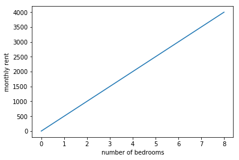
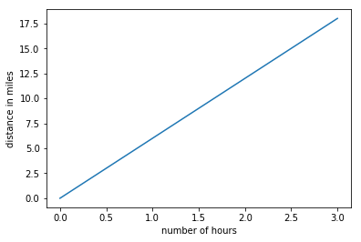
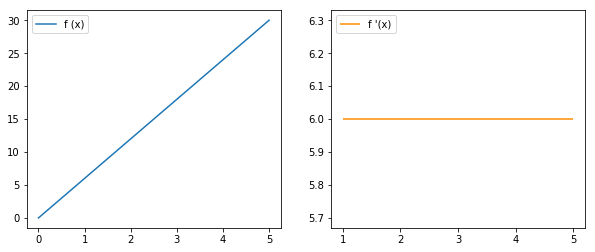
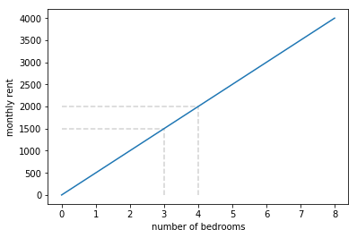
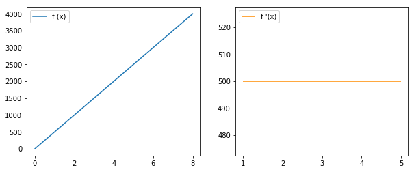

# Introduction to Derivatives

## Introduction

As you finished the linear regression section, you now get the basic notion of a mathematical *functions*. We estimated our parameters, so imagine that we used number of bedrooms as a predictor and house rental price as the target variable, we can formulate this as follows:

$$\text{price} = f(\text{number of bedrooms})$$ or, alternatively

$$ y = f(\text{x})$$

Now let's say the price of the apartment is set in a very simplified way, and there is a perfectly linear relationship between the apartment size and the rental price. Say that the price goes up by 500 USD/month for every bedroom an apartment has. In that case, we can express the price as follows:

$$\text{price} = 500 * \text{number of bedrooms}$$ or $$y = f(x) = 500 * x = 500x$$

Note that there is no intercept here! Now, we want to dive deeper in how the rental price changes as the number of bedrooms changes. This is what derivatives are all about!

## Objectives

You will be able to:

* Understand that derivatives are the instantaneous rate of change of a function
* Understand how to calculate a derivative of a straight line

## Let's look at our function

Our rental price example can be coded using a Python function as follows:


```python
def f(x):
    return 500*x
```

Using matplotlib, we can visualize this as:


```python
import matplotlib.pyplot as plt
import numpy as np
%matplotlib inline

x = np.linspace(0, 8, 100)

plt.plot(x, f(x))
plt.xlabel("number of bedrooms")
plt.ylabel("monthly rent")
plt.show();
```





As you can see, we get a straight line here. 

In this lesson, we'll introduce the concept of **derivatives**. Derivatives are important because they tell us how a function is changing at any given point. We'll focus on calculating the derivatives of straight line functions, or linear functions like the function above, before moving onto calculating the derivative of curved lines in a future lesson.   

## Understanding the rate of change

To introduce derivatives, let's introduce a new example. Say that we want a function that represents a person taking a jog. We'll represent this by drawing the following straight line.


```python
def jog(miles):
    return 6*miles
x = np.linspace(0, 3, 100)

plt.plot(x, jog(x))
plt.ylabel("distance in miles")
plt.xlabel("number of hours")
plt.show()
```





The graph above helps us see how distance changes in relation to time, or in other words speed.  So here, when we ask about **rate of change** (which is the core concept behind derivatives), we're basically asking how fast our is jogger traveling!

## Calculating the rate of change

To calculate the miles per hour we can see where a person is at a given time, then wait an hour and to see how far he traveled.  Or we can wait two hours and divide distance traveled by two.  Generally, our technique is to divide number of miles traveled by the number of hours passed.  In this specific example we'll imagine doing the following to calculate the speed at hour 1.

> * Start a stop watch after one hour and note the distance at that hour
> * Then, let one hour elapse and mark down the distance at that next hour.  
> * Finally, divide the difference in the distances by the elapsed time.  

In the below graph, we begin to calculate the speed at the first hour. We used matplotlib, which you learned about before, to do this.


```python
fig, ax = plt.subplots(figsize=(7.5,5.5))

x = np.linspace(0, 3.5, 100)

plt.plot(x, jog(x), label = "distance given # hours")

plt.hlines(y=6, xmin=0, xmax=1, linestyle = "dashed", color= 'lightgrey')
plt.vlines(x=1, ymin=0, ymax=6, linestyle = "dashed", color= 'lightgrey')

plt.hlines(y=12, xmin=0, xmax=2, linestyle = "dashed", color= 'lightgrey')
plt.vlines(x=2, ymin=0, ymax=12, linestyle = "dashed", color= 'lightgrey')

plt.vlines(x=2, ymin=6, ymax=12, color="darkorange", label = "y2 - y1 = 12 - 6 = 6")
plt.hlines(y=6, xmin=1, xmax=2, color="lightgreen", label = "x2 - x1 = 2 - 1 = 1")
ax.legend(loc='upper left', fontsize='large')

plt.ylabel("distance in miles")
plt.xlabel("number of hours")
plt.show()
```


We calculate our jogger's speed by seeing were he starts at hour one and ends at hour two.  Our jogger went from mile numbers six to twelve -- indicated by the orange line, so miles per hour is:

 $$ \frac{\text{miles}}{\text{hour}} = \frac {\text{end distance - start distance}}{\text{end time - start time}} = \frac {12 - 6}{2 - 1} = 6$$

Miles per hour is just one example of rate of change. Anytime we come across the word *per*, we know this is a form of rate of change.  All forms of **rate of change** are calculated the same way: the change in the value on our $y$-axis divided by the change in the value on our $x$-axis. 

* Another way of expressing **change in $y$** is:  
   * $y_2 - y_1$ or $\Delta y$, read delta y 
* Likewise, another way of expressing **change in $x$** is:  
   * $x_2 - x_1$ or $\Delta x$, read delta x

Generally, we can say that the derivative of a straight line is equal to the "rise over the "run": 

* rate of change $= \dfrac{\text{rise}}{\text{run}} = \dfrac{\Delta y}{\Delta x} = \dfrac{y_2 - y_1}{x_2 - x_1}$

Just like in our example, we saw: 

* miles per hour =  $\dfrac{\text{distance}_2 - \text{distance}_1}{\text{time}_2 - \text{time}_1} = \dfrac{12 - 6}{2 - 1} = \dfrac{6}{1} = 3$ mph

Derivatives are a specific kind of rate of change -- the rate of change of a function **at a given point**.  For a linear function as we work with here, we calculate them through rise over run, or the change in $y$ divided by the change in $x$, expressed $\dfrac{\Delta y}{\Delta x}$.  The rest of this lesson, will simply be introducing more math terms and symbols for expressing this same concept.  

> Stick with us, fully understanding these will pay off when we take the derivative of more complex functions.

## Derivatives using our function expression

Since our jogger is running at a constant rate, our calculated rate of change of 6 miles per hour is also the derivative.  Of course, we already coded this before, but we know that the mathematical function for our run is

$$f(x) = 6x$$

or, in Python


```python
def f(x):
    return 6*x
```

If we are given a function $f(x)$, we say the derivative of that function is $f'(x)$ -- read $f$ primed of $x$. 

We already can express the derivative of a linear function $f(x)$ many different ways: 

* $ f'(x) = \dfrac{\text{rise}}{\text{run}} = \dfrac{\Delta y}{\Delta x} = \dfrac{y_2 - y_1}{x_2 - x_1} =  \dfrac{f(x_2) - f(x_1)}{x_2 - x_1}$

Take a look to at the equation far to the right:
    
$$f'(x) = \frac{f(x_2) - f(x_1)}{x_2 - x_1} $$ 

You see that we replaced $y_2 - y_1$ with $f(x_2) - f(x_1)$.  This makes sense, because really when we say $y_2$ and $y_1$, we mean the function's output at the first value of $x$ and the function's output at the second value of $x$.  

We indicate that we are calculating the derivative of $f(x)$ at a specific point, say hour 1, by calling $f'(1)$.  That's the rate of change at hour 1.  Now we can plug in our values to calculate the derivative.  

* $x_1 = 1$ as hour 1 is our starting point
* $x_2 = 2$ as hour 2 is ending point starting point

giving us: 

$$f'(1) = \frac{f(2) - f(1)}{2 - 1} = \frac{12 - 6}{2 - 1} = 6 $$ 

So $f(x)$ equals the output at a given point.  And $f'(x)$ is the rate of change at a given point.  So then:
* $f(1)$ means the output at $x = 1$, or in our example, *the distance* at hour one, and 
* $f'(1)$ means the rate of change at $x = 1$, or in our example, *the speed* at hour one

Because the jogger's speed never changes throughout and since the derivative is the rate of change at a given point, we can conclude that the derivative also never changes. That's right! Let's take $x_1=3$ and $x_2=4$:

$$f'(3) = \frac{f(4) - f(3)}{4 - 3} = \frac{24 - 18}{2 - 1} = 6$$ 

Let's plot the distance from hours zero through five on the left and the speed from hours zero through five on the right to visualize this steady pace.


```python
x = [0, 1, 2]
x = np.linspace(0, 5, 100)

fig, ax = plt.subplots(figsize=(10,4))

# plot 1
plt.subplot(121)
plt.plot(x, f(x), label = "f (x)")
plt.legend(loc="upper left", bbox_to_anchor=[0, 1],
           ncol=2, fancybox=True)

# plot 2
plt.subplot(122)
plt.hlines(y=6, xmin=1, xmax=5, color="darkorange",label = "f '(x)")
plt.legend(loc="upper left");


plt.show()
```





> * To the left is a graph of $f(x) = 6x$ for different values of $x$  
> * And to the right is a plot of the rate of change of that function, $f'(x)$, for different values $x$
> * So while *the distance* changes through time, *the speed*, or rate of change, stays the same

## Expressing the derivative in terms of change

Now our above formulas for calculating the derivative do the job, but they don't exactly express our technique in the example of our jogger.  Remember that our technique for calculating the jogger's speed is the following: 

> * Start a stop watch after one hour and see the distance at that hour
> * Then, let time elapse one hour and see the distance at that hour 
> * Finally, divide the difference in the distances by the elapsed time  

This is what this looks like in terms of math: 

$f'(x) = \dfrac{f(x + \Delta x) - f(x)}{\Delta x} $

Let's take a second to fully understand this new formula because it's not going away.  

* $f'(x)$ is the rate of change at a given value, or here the speed at a given time


* $f(x)$ is the distance at a given time


* $\Delta x$ is the elapsed time, or the change in $x$


* $f(x + \Delta x)$ is the distance at the starting time plus the elapsed time 

This is the definition that we will often see.  It expresses our technique for calculating the derivative.  
* Subtract the output at one input, $x$, from the output at that initial input plus a change in $x$  
* Then divide that difference by the change in $x$

In summation, that is the derivative of a line, or the rate of change of a linear function.  The rate of change answers how much is our output changing at a given point. To wrap everything up, let's look at our house rental example again!


```python
def f(x):
    return 500*x

import matplotlib.pyplot as plt
import numpy as np

x = np.linspace(0, 8, 100)

plt.hlines(y=1500, xmin=0, xmax=3, linestyle = "dashed", color= 'lightgrey')
plt.vlines(x=3, ymin=0, ymax=1500, linestyle = "dashed", color= 'lightgrey')

plt.hlines(y=2000, xmin=0, xmax=4, linestyle = "dashed", color= 'lightgrey')
plt.vlines(x=4, ymin=0, ymax=2000, linestyle = "dashed", color= 'lightgrey')

plt.plot(x, f(x))
plt.xlabel("number of bedrooms")
plt.ylabel("monthly rent")
plt.show();
```





Using the definition of derivatives stated above, let's say $x=3$ and $\Delta x = 1$. Then:

$f'(x=3) = \dfrac{f(x + \Delta x) - f(x)}{\Delta x}= \dfrac{f(3 + 1) - f(3)}{1} = \dfrac{2000-1500}{1}= 500 $

In conclusion, our *derivative* or *rate of change* for the house rental example is equal to 500! The derivative as a function of any value $x$ is again given by a constant, and represented below:


```python
x = [0, 1, 2]
x = np.linspace(0, 8, 100)

fig, ax = plt.subplots(figsize=(10,4))

# plot 1
plt.subplot(121)
plt.plot(x, f(x), label = "f (x)")
plt.legend(loc="upper left", bbox_to_anchor=[0, 1],
           ncol=2, fancybox=True)

# plot 2
plt.subplot(122)
plt.hlines(y=500, xmin=1, xmax=5, color="darkorange",label = "f '(x)")
plt.legend(loc="upper left");


plt.show()
```





## Summary 

In this lesson, we saw that the derivative is the change in output per a change in input.  In the case of our jogger, the input was time and the output was distance traveled.  We learned that the derivative is the change in the runner's distance traveled divided by the amount of time passed.

Graphically, we see that the derivative is simply the rise over run or change in $x$ divided by change in $y$ or:

$$ f'(x) = \frac{\Delta y}{\Delta x} = \frac{y_2 - y_1}{x_2 - x_1} $$

Then we saw that we can express the derivative in terms of $f(x)$ instead of $y_1$ and $y_2$ as in the output at second $x$ minus the output at the first x divided by the difference between the two $x$ values.  Or, in an equation:

$$ f'(x) = \frac{f(x_2) - f(x_1)}{x_2 - x_1} $$

And finally we saw how we can express the derivative in terms of $\Delta x$ as in subtract the output at an initial value $x$ from the output at that initial value $x$ plus some change in $x$, then divide by that change in $x$:

$$ f'(x) = \frac{f(x + \Delta x) - f(x)}{\Delta x} $$

