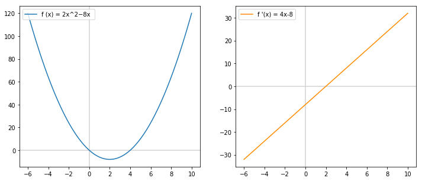
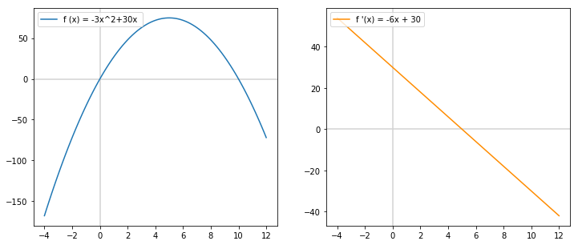

# Derivatives: Conclusion

## Introduction

Data science is all about finding good models to understand patterns in your data. You'll find yourself performing optimizations all the times: examples are: maximizing model likelihoods, minimizing errors,... essentially, you'll perform a lot of minimizations and maximizations along the way. And is just that where derivatives come in very handy!

## Objectives

You will be able to:
- Understand why derivatives are useful to find minima and maxima
- Calculate minima and maxima mathematically

## Finding Minima and Maxima

To illustrate this point, let's have another look at some functions.

For this lecture, we'll use the `derivatives.py`-file containing some functions we have created previously.


```python
from derivatives import *
```

Let's look at the function $2x^2-8x$ and its derivative. In the code below, we create the `function_values` and `derivative_values` for $x$-es ranging from -6 to 10.


```python
import numpy as np
tuple_sq_pos  = np.array([[2, 2], [-8, 1]])
x_values = np.linspace(-6, 10, 100)
function_values = list(map(lambda x: output_at(tuple_sq_pos, x), x_values))
derivative_values = list(map(lambda x: derivative_at(tuple_sq_pos, x),x_values))
```

Now, let's look at their plots side by side.


```python
import matplotlib.pyplot as plt
%matplotlib inline

fig, ax = plt.subplots(figsize=(12,5))

# plot 1
plt.subplot(121)
plt.axhline(y=0, color='lightgrey', )
plt.axvline(x=0, color='lightgrey')
plt.plot(x_values, function_values, label = "f (x) = 2x^2−8x ")

plt.legend(loc="upper left", bbox_to_anchor=[0, 1], ncol=2, fancybox=True)

# plot 2
plt.subplot(122)
plt.axhline(y=0, color='lightgrey')
plt.axvline(x=0, color='lightgrey')
plt.plot(x_values, derivative_values,color="darkorange", label = "f '(x) = 4x-8")

ax.grid(True, which='both')

plt.legend(loc="upper left");
```





We notice that our function, $2x^2-8x$ reaches a minimum at $x = 2$. interestingly, it is exactly at $x=2$ that our function $f'(x)$ crosses the x-axis! In mathematical terms $f'(2) = 0$!

This is great... and this is always the case when looking for minima! 

***OK, but what about maxima?***


Let's have a look!


```python
tuple_sq_neg  = np.array([[-3, 2], [30, 1]])
```


```python
x_values = np.linspace(-4, 12, 100)
function_values = list(map(lambda x: output_at(tuple_sq_neg, x), x_values))
derivative_values = list(map(lambda x: derivative_at(tuple_sq_neg, x),x_values))
```


```python
import matplotlib.pyplot as plt
%matplotlib inline

fig, ax = plt.subplots(figsize=(12,5))

# plot 1
plt.subplot(121)
plt.axhline(y=0, color='lightgrey', )
plt.axvline(x=0, color='lightgrey')
plt.plot(x_values, function_values, label = "f (x) = -3x^2+30x ")

plt.legend(loc="upper left", bbox_to_anchor=[0, 1], ncol=2, fancybox=True)

# plot 2
plt.subplot(122)
plt.axhline(y=0, color='lightgrey')
plt.axvline(x=0, color='lightgrey')
plt.plot(x_values, derivative_values,color="darkorange", label = "f '(x) = -6x + 30")

ax.grid(True, which='both')

plt.legend(loc="upper left");
```





You can see that here, $-3x^2+30x$ reaches a maximum at $x=5$. Similarly to what you've seen before like, we see that $f'(x) = 0$ when $x = 5$. So, in conclusion, minima or maxima can easily be found when looking at the derivative of a function. 

## How Does This Happen?

To understand what's happening, let's take a minute to refreshen our memories. Remember that a derivative is the ***instantaneous rate of change*** or the ***slope*** of a function at a certain point $x$. Then, think about what happens when you reach a minimum or a maximum. essentially, your slope changes from positive to negative for a maximum, and from negative to positive for a minimum. That is exactly what we see in the derivative functions: there is a change in sign for the $f'(x)$ values whenever $f(x)$ reaches a maximum or a minimum!

## Finding Minima or Maxima Mathematically

It is great to see this visually, but it is also easy to find minima or maxima just using the function expressions for $f(x)$ and $f'(x)$.

Let's look at our first example:

$f(x) = 2x^2-8x$

Then, we know that

$f'(x) = 4 x - 8 $

We know that $f(x)$ reaches an optimum (in this case, a minimum) for $f'(x) = 0$

So, we need to solve for $x$ as follows:

$$4x - 8 = 0 $$
$$ 4x = 8$$
$$ x= 2$$

And this is exactly where $f(x)$ reaches the minimum!

Great, now try this yourself for $-3x^2+30$!

## Summary

Great! That was quite a bit of theory. Now, all this will help you to code a more complicated linear regression model from scratch using gradient descent. That's what we'll do next!
