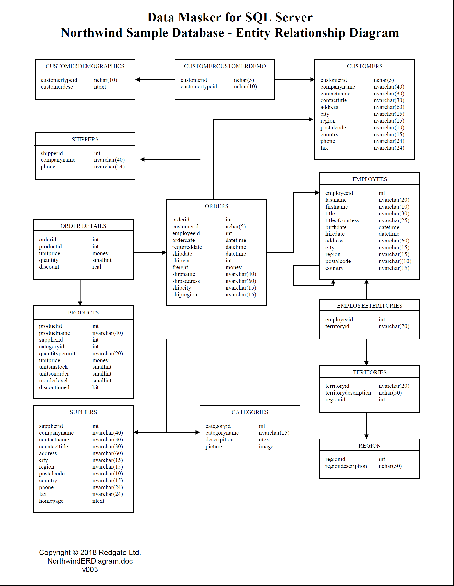

# Reading ERD Diagrams

## Introduction

In this lesson, we'll learn how to read **_Entity Relationship Diagrams_** to help us better understand the structure of relational database!

## Objectives

You will be able to:

* Read and understand ERD diagrams describing the structure of a database.

## What are ERD Diagrams?

Recall everything we learned in our previous lesson about database normalization and table relationships.  Any real database we'll ever work with will contain multiple tables, with the entities in those tables being connected to rows in other tables.  When working with a table in a new database, this leads us to two questions:

1. What tables are related to this table?
1. What sort of relationship is it?

The easiest way to show this is visually, with **_Entity Relationship Diagrams_**.

## Reading an ERD

Take a look at this example ERD from the [wikipedia page on entity-relationship modeling](https://en.wikipedia.org/wiki/Entity%E2%80%93relationship_model):

Even though we've never seen this database before, we can look at this diagram and quickly get a feel for the tables contained in the database, the information they contain, and the relationships they have with other tables. 

ERDs are effectively maps of a database.  Anytime we need to know something about a database, we can usually answer that question by inspected the ERD. The example above is fairly high-level, but many ERDs you see will contain more granular information about the tables they contain.  For example take a look at the ERD diagram for the Northwind Traders Database, a fictional database from Microsoft designed to help people learn SQL.

In this ERD, we can see the name of every field in every table, as well as that field's data type.  This is really useful!

**_Question:_**  Take a look at the ERD above.  By just looking at this table, can you construct a query to get the details of the top 20 orders with greatest quantity?

## Denoting Relationships In ERDs

Recall our review of table relationships in the previous lab.  This is important information that is often (but not always) contained within an ERD.  Note that the first ERD diagram in this notebook contains some information on table relationships (as denoted by the '1' and 'N' symbols on the lines connecting the Entities), but the Northwind Database does not contain this information. The industry has generally accepted the following notations as the symbols for denoting each of the different types of relationships possible in an ERD:

Here's an example of a highly-detailed ERD containing these symbols to denote the type of relationship between entities:

**_Question_**: Look at the ERD above. What sort of relationship does 'Authors' have to 'Books'? What about from 'Books' to 'Favorites'? How about from 'Books' to 'Authors'?

## Summary

ERDs are an extremely useful tool for data scientists when working with relational databases.  They allow us to understand anything we need to about that database with just a glance! 
