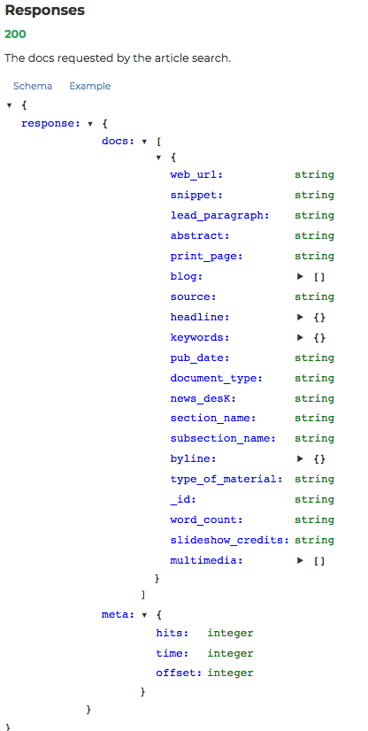
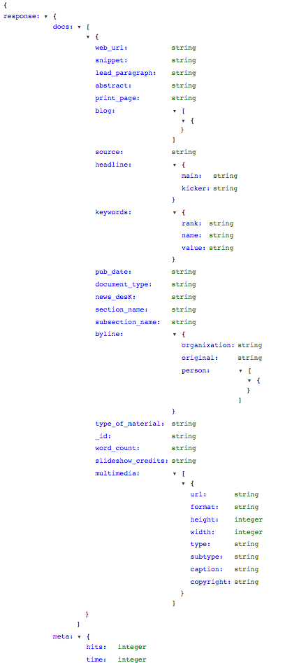

# Working with Known JSON Schemas

## Introduction
We've started taking a look at JSON files and we'll continue to explore how to navigate and traverse these files. One common use case of json files will be when we are connecting to various websites through their established APIs to retrieve data from them. With these, we are typically given a schema for how the data is structured and then will use this knowledge to retrieve pertinant information. In this lecture, we'll take a look at the response from the NY Times API.

## Objectives
You will be able to:
* Read JSON Documentation Schemas and translate into code
* Extract data from known json schemas
* Write data to predefined JSON schemas

## Reading a JSON Schema

Here's the JSON schema provided for a section of the NY Times API:


or a more detailed view (truncated):



You can see this yourself here:
https://developer.nytimes.com/article_search_v2.json#/Documentation/GET/articlesearch.json

You can see that the master structure is a dictionary and has a key named 'response'. This is also a dictionary and has two keys: 'data' and 'meta'. As you continue to examine the schema hierarchy, you'll notice the vast majority in this case are dictionaries. 

## Loading the Data File

As we saw before, let's start by importing this data from file. We open to file and load its contents.


```python
import json
```


```python
f = open('ny_times_response.json', 'r')
data = json.load(f)
```


```python
print(type(data))
print(data.keys())
```

    <class 'dict'>
    dict_keys(['status', 'copyright', 'response'])


You should see that there are two additional keys 'status' and 'copyright' which were not shown in the schema documentation.

## Loading Specific Data

Looking at the schema, we might be interested in retrieving a specific piece of data, such as the articles' headlines.
We see that this is a key under **'docs'**, which is under 'response'. This gives us roughly: **data['response']['docs']['headline']**. While this is close to the code we'll use to extract headlines, something is a bit off. Notice that if you look closely at the schema outline, that the 'docs' subheading is actually a list. Each item within this list should be a dictionary with the keys shown above, but that is an important distinction. Breaking it into two steps we have:


```python
docs = data['response']['docs']
print(type(docs), len(docs))
```

    <class 'list'> 9


```python
for doc in docs:
    print(doc['headline'])
```

    {'main': "HIGGINS, SPENT $22,189.53.; Governor-Elect's Election Expenses -- Harrison $9,220.28.", 'kicker': None, 'content_kicker': None, 'print_headline': None, 'name': None, 'seo': None, 'sub': None}
    {'main': 'GARDEN BOUTS CANCELED; Mauriello Says He Could Not Be Ready on Nov. 3', 'kicker': '1', 'content_kicker': None, 'print_headline': None, 'name': None, 'seo': None, 'sub': None}
    {'main': 'Stock Drop Is Biggest in 2 Months--Margin Rise Held Factor in Lightest Trading of 1955', 'kicker': '1', 'content_kicker': None, 'print_headline': None, 'name': None, 'seo': None, 'sub': None}
    {'main': 'MUSIC OF THE WEEK', 'kicker': None, 'content_kicker': None, 'print_headline': None, 'name': None, 'seo': None, 'sub': None}
    {'main': 'Anacomp Inc. reports earnings for Qtr to March 31', 'kicker': None, 'content_kicker': None, 'print_headline': None, 'name': None, 'seo': None, 'sub': None}
    {'main': 'Brooklyn Routs Yeshiva', 'kicker': '1', 'content_kicker': None, 'print_headline': None, 'name': None, 'seo': None, 'sub': None}
    {'main': 'Albuquerque Program Gives Drinkers a Lift', 'kicker': '1', 'content_kicker': None, 'print_headline': None, 'name': None, 'seo': None, 'sub': None}
    {'main': 'Front Page 7 -- No Title', 'kicker': '1', 'content_kicker': None, 'print_headline': None, 'name': None, 'seo': None, 'sub': None}
    {'main': 'UNIONS AND BUILDERS READY FOR LONG FIGHT; None of the Strikers Back - Lock-Out Soon in Effect. 23,000 ALREADY INVOLVED Orders Sent to Every Building Employer Within Twenty-five Miles -- House-smiths Vote Not to Strike.', 'kicker': None, 'content_kicker': None, 'print_headline': None, 'name': None, 'seo': None, 'sub': None}


Or if we want to just print the main headlines themselves:


```python
for doc in docs:
    print(doc['headline']['main'])
    print('\n')
```

    HIGGINS, SPENT $22,189.53.; Governor-Elect's Election Expenses -- Harrison $9,220.28.
    
    
    GARDEN BOUTS CANCELED; Mauriello Says He Could Not Be Ready on Nov. 3
    
    
    Stock Drop Is Biggest in 2 Months--Margin Rise Held Factor in Lightest Trading of 1955
    
    
    MUSIC OF THE WEEK
    
    
    Anacomp Inc. reports earnings for Qtr to March 31
    
    
    Brooklyn Routs Yeshiva
    
    
    Albuquerque Program Gives Drinkers a Lift
    
    
    Front Page 7 -- No Title
    
    
    UNIONS AND BUILDERS READY FOR LONG FIGHT; None of the Strikers Back - Lock-Out Soon in Effect. 23,000 ALREADY INVOLVED Orders Sent to Every Building Employer Within Twenty-five Miles -- House-smiths Vote Not to Strike.
    
    


## Transforming JSON to Alternative Formats

We also have previously started to take a look at how to transform JSON to DataFrames. Investigating our schema, a good option for this could again be the 'docs' subheading. While this still has nested data itself, I recommend loading the entire section as a dataframe and then using functions to break apart nested data from there.


```python
import pandas as pd
```


```python
df = pd.DataFrame(data['response']['docs'])
df.head(3)
```


<div>
<style scoped>
    .dataframe tbody tr th:only-of-type {
        vertical-align: middle;
    }

    .dataframe tbody tr th {
        vertical-align: top;
    }

    .dataframe thead th {
        text-align: right;
    }
</style>
<table border="1" class="dataframe">
  <thead>
    <tr style="text-align: right;">
      <th></th>
      <th>_id</th>
      <th>abstract</th>
      <th>blog</th>
      <th>byline</th>
      <th>document_type</th>
      <th>headline</th>
      <th>keywords</th>
      <th>multimedia</th>
      <th>news_desk</th>
      <th>print_page</th>
      <th>pub_date</th>
      <th>score</th>
      <th>snippet</th>
      <th>source</th>
      <th>type_of_material</th>
      <th>web_url</th>
      <th>word_count</th>
    </tr>
  </thead>
  <tbody>
    <tr>
      <th>0</th>
      <td>4fc04eb745c1498b0d23da00</td>
      <td>Spent $22,200</td>
      <td>{}</td>
      <td>NaN</td>
      <td>article</td>
      <td>{'main': 'HIGGINS, SPENT $22,189.53.; Governor...</td>
      <td>[{'name': 'persons', 'value': 'HIGGINS, LT. GO...</td>
      <td>[]</td>
      <td>NaN</td>
      <td>2</td>
      <td>1904-11-17T00:00:00Z</td>
      <td>1</td>
      <td>Spent $22,200</td>
      <td>The New York Times</td>
      <td>Article</td>
      <td>https://query.nytimes.com/gst/abstract.html?re...</td>
      <td>213</td>
    </tr>
    <tr>
      <th>1</th>
      <td>4fc21ebf45c1498b0d612b22</td>
      <td>NaN</td>
      <td>{}</td>
      <td>NaN</td>
      <td>article</td>
      <td>{'main': 'GARDEN BOUTS CANCELED; Mauriello Say...</td>
      <td>[]</td>
      <td>[]</td>
      <td>NaN</td>
      <td>15</td>
      <td>1944-10-23T00:00:00Z</td>
      <td>1</td>
      <td></td>
      <td>The New York Times</td>
      <td>Article</td>
      <td>https://query.nytimes.com/gst/abstract.html?re...</td>
      <td>149</td>
    </tr>
    <tr>
      <th>2</th>
      <td>4fc3b41d45c1498b0d7fd41e</td>
      <td>NaN</td>
      <td>{}</td>
      <td>{'original': 'By JOHN G. FORREST', 'person': [...</td>
      <td>article</td>
      <td>{'main': 'Stock Drop Is Biggest in 2 Months--M...</td>
      <td>[]</td>
      <td>[]</td>
      <td>NaN</td>
      <td>F1</td>
      <td>1955-05-15T00:00:00Z</td>
      <td>1</td>
      <td>Stock prices last week, on the lightest volume...</td>
      <td>The New York Times</td>
      <td>Article</td>
      <td>https://query.nytimes.com/gst/abstract.html?re...</td>
      <td>823</td>
    </tr>
  </tbody>
</table>
</div>


## Breaking out nested data

Now that we have the data loaded, let's clean it up by breaking out some of the nested data. For example, you should notice that the headline entries are actualy dictionaries. We could transform these into singular data columns with something like this:


```python
keys = df.headline.iloc[0].keys() #Get dictionary keys
#Keep track of columns we make for subsequent preview
new_cols = []
#Create a new feature for each of these keys
for key in keys:
    new_col = 'headline_{}'.format(key) #Create new column name
    df[new_col] = df.headline.map(lambda x: x[key]) #Create a new column
    new_cols.append(new_col)
df[new_cols].head()
```


<div>
<style scoped>
    .dataframe tbody tr th:only-of-type {
        vertical-align: middle;
    }

    .dataframe tbody tr th {
        vertical-align: top;
    }

    .dataframe thead th {
        text-align: right;
    }
</style>
<table border="1" class="dataframe">
  <thead>
    <tr style="text-align: right;">
      <th></th>
      <th>headline_main</th>
      <th>headline_kicker</th>
      <th>headline_content_kicker</th>
      <th>headline_print_headline</th>
      <th>headline_name</th>
      <th>headline_seo</th>
      <th>headline_sub</th>
    </tr>
  </thead>
  <tbody>
    <tr>
      <th>0</th>
      <td>HIGGINS, SPENT $22,189.53.; Governor-Elect's E...</td>
      <td>None</td>
      <td>None</td>
      <td>None</td>
      <td>None</td>
      <td>None</td>
      <td>None</td>
    </tr>
    <tr>
      <th>1</th>
      <td>GARDEN BOUTS CANCELED; Mauriello Says He Could...</td>
      <td>1</td>
      <td>None</td>
      <td>None</td>
      <td>None</td>
      <td>None</td>
      <td>None</td>
    </tr>
    <tr>
      <th>2</th>
      <td>Stock Drop Is Biggest in 2 Months--Margin Rise...</td>
      <td>1</td>
      <td>None</td>
      <td>None</td>
      <td>None</td>
      <td>None</td>
      <td>None</td>
    </tr>
    <tr>
      <th>3</th>
      <td>MUSIC OF THE WEEK</td>
      <td>None</td>
      <td>None</td>
      <td>None</td>
      <td>None</td>
      <td>None</td>
      <td>None</td>
    </tr>
    <tr>
      <th>4</th>
      <td>Anacomp Inc. reports earnings for Qtr to March 31</td>
      <td>None</td>
      <td>None</td>
      <td>None</td>
      <td>None</td>
      <td>None</td>
      <td>None</td>
    </tr>
  </tbody>
</table>
</div>


Wahoo! This is a good general strategy for transforming nested JSON: create a DataFrame and then break out nested features into their own column features.

## Outputing to JSON

Finally, let's look at how we can write data back to JSON. Like loading, we first open a file (this time with write permission) and use the json package to transfer data to that file container.


```python
with open('output.json', 'w') as f:
    json.dump(data, f)
```

## Summary
There you have it! In this, we took another look at JSON, taking a look at an example schema diagram and retrieving information. We also looked at a general procedure for transforming nested data to Pandas DataFrames (create a DataFrame, and then break apart nested data using lambda functions to create additional columns). We also took a brief look at saving data to json files. 
