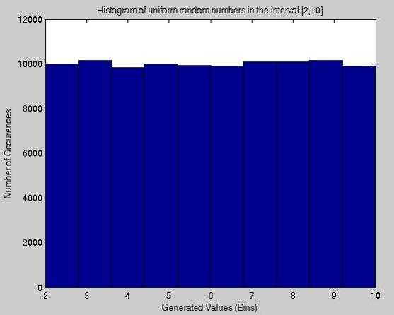
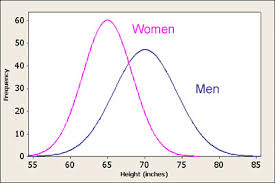
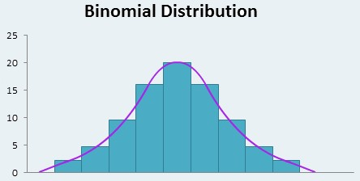

# Statistical Distributions

## Introduction

In this lesson, we'll discuss the concept of statistical distributions, and review prior the prior distributions we've covered--the Normal Distribution and the Binomial Distribution.

## Objectives

You will be able to:

* Understand and explain why statistical distributions are useful to data scientists
* Identify real-world use cases for problem solving with statistical distributions
* Review prior knowledge on **_Uniform_**, **_Normal_**, and **_Binomial Distributions_**

## Review: What is a Statistical Distribution?

In this section, we'll be learning about some more advanced statistical distributions, including:

1. **_Negative Binomial Distribution_**
1. **_Geometric Distribution_**
1. **_Poisson Distribution_**
1. **_Exponential Distribution_**

To make learning these distributions easier, it will be helpful to review what we have alreadylearned about of the more commom/more basic distributions such as the:

1. **_Uniform Distribution_**
1. **_Binomial Distribution_**
1. **_Normal Distribution_**

Although all of these distributions are quite different, in a way, they quite the same in how we use them--these statistical distributions tell us about the distribution of probability of an event or condition given a set of parameters.  Recall that distributions can be either discrete or continuous.  Let's review what those terms mean. 

### Continuous Distributions

The event we're measuring can be any real number.  We can get infinitely more precise if we choose to, and fractions/decimals are okay. A good example of a continuous distribution is height.  A person's height can be a value like 5' 9", or 5' 10", and it can also be literally any number in between those, up the level of precision we choose. 

### Discrete Distributions

Discrete Distributions deal with a series of boolean events or trials.  These events are often called **_Bernoulli Trials_**. Recall that Bernoulli Trials always have a binary outcome, and fractions/decimals are not allowed--there is no such thing as half a trial. A Good example of a discrete distribution is a coin flip.  The coin either lands on heads or it doesn't, and there is no such thing as a half-flipped coin.  Note that we can also represent events with multicategorical outcomes as a discrete distribution,  as long as we determine a single outcome of the event to be a success, and all other possible outcomes as a failure.  For instance, we can describe the event of rolling a six-sided die as a Bernoulli event if we classify rolling a 3 a success, and any other number a failure.  

Now, let's quickly review the previous distributions we've already learned about. 

## Review: Uniform Distribution

The **_Uniform Distribution_** describes an event where every possible outcome is equally likely.  No single outcome carries any more or less probability of happening than any other possible outcome.  **_The Uniform Distribution can be discrete or continuous_**. 

A **_Discrete Uniform Example_** would be rolling an $n$-sided die.  No matter how many sides the die has, a person is equally likely to roll every side.  

A **_Discrete Continuous Example_** would be the waiting for an elevator that is equally likely to be at any floor in the building when you call it, and can take between 0 and 40 seconds to arrive at your floor. Since the elevator is equally likely to at any given floor, we can assume every amount of time between 0 and 40 seconds (decimals and fractions allowed, to an infinite amount of precision) is equally likely to be the amount of time it takes for the elevator to get to us. 

**_Uniform Distribution Mean:_**

$$\frac{b + a}{2}$$

**_Uniform Distribution Standard Deviation_**:

$$\sqrt{\frac{(b - a)^2}{12}}$$

**_NOTE:_** If you're confused why there is a 12 in the denominator of the formula Standard Deviation for a Uniform Distribution, you're not alone.  The short answer is that it involves calculus. As a data scientist, you don't need to understand the derivation of this formula and where this 12 comes from--however, if you're interested, this [quora answer gives an excellent explanation](https://www.quora.com/Why-is-there-a-12-in-the-variance-of-uniform-distribution)!

## Review: Normal Distribution

The Normal Distribution is also called a **_Bell Curve_**, and is the distribution that people most often have some familiarity with.  The normal distribution is for continous-valued distributions. 

An example of is human height.  

The normal distribution is one of the most well-studied distributions.  Statisticans and Data Scientists are usually very happy when they find the data they are working with is normally distributed, because we can immediately answer a lot of questions about it. For instance, we know that:

* 68% of probability mass falls within 1 standard devation of the mean
* 95% of probability mass falls within 2 standard devation of the mean
* 99.7% of probability mass falls within 3 standard devation of the mean

Data Scientists often **_normalize_** continuous-valued data by converting to the **_Standard Normal Distribution_**, also known as the **_Z-distribution_**.  Recall that a **_Z-score_** tells us how many standard deviations away from the mean a given value is. We can convert any value to it's corresponding Z-score by subtracting the mean of the dataset and dividing by the standard deviation.  If we do this for every value in a dataset, then we have a **_normalized dataset_** consisting of Z-scores. Recall that values smaller than the sample mean will have a negative z-score, the mean will have a Z-score of 0, and values greater than the sample mean will have a positive Z-score. 

The formula for the **_Probability Density of the Normal Distribution_** is:

$$f(x\ |\ \mu,\ \sigma^2) = \frac{1}{\sqrt{2 \pi \sigma^2}}e$$

Where:

$x$ is the **_point_** we want to calculate the probability for

$\mu$ is the **_mean_** of the sample

$\pi$ is a mathematical constant, the irrational number $3.14159$

$\sigma^2$ is the **_variance_** (since $\sigma$ is the **_standard deviation_**)

$e$ is **_Euler's Constant_**, also known as the **_Base of the Natural Logarithm_**, $2.71828$

An example question we can answer with the Normal Distribution is "what percentage of people are at least 2 inches shorter than the global average hieght?"

## Review: Binomial Distribution

The **_Binomial Distribution_** is the discrete version of the normal distribution.  This distribution describes the probability distribution for a  of a given number of successes in a set of repeated Benoulli Trials, also known as a **_Binomial Experiment_**. Recall that Binomial Experiments have the following constraints:

* Each experiment consists of $n$ repeated trials.

* The outcome of each trial is binary, resulting in either success or failure (it doesn't matter which outcome we label as success or failure, just that we're able to assign the labels).

* The probability $p$ of a given outcome is the same on every trial.

* The trials are independent. The results of a given trial are not influenced by prior trial results, and will not influence future trial results in turn. 

We can calculate the mean of the binomial distribution with the following formula:

$$\mu = n * p$$

where $n$ is the number of trials, and $p$ is the probability of success for a given trial. 

The **_Standard Deviation for a Binomial Distribution_** is:

$$\sigma = \sqrt{n * p * (1 - p)}$$

The formula for the **_Point Probability of the Binomial Distribution_** is:

$$ \Big(\frac{n!} {x! (n-x)!}\Big) p^x (1 - p)^{n - x}$$

where $n$ is the number of trials, $p$ is the probability of success for a given trial, and $x$ is the number of successes.

The formula for the **_Cumulative Probability of the Binomial Distribution_** is:

$$\sum_{i=0}^{x}  \Big(\frac{n!} {x! (n-x)!}\Big) p^x (1 - p)^{n - x}  $$

where $n$ is the number of trials, $p$ is the probability of success for a given trial, and $x$ is the number of successes.

**_NOTE:_** The above equation may look scary at first glance, but it's something that you can easily figure out if we describe it with code instead of mathematical notation.  This formula represents the combined probabilities of every possible value less than and up to our value $x$. In python, this simply means writing a for loop to help us total the **_Point Probability_** for every value starting at $0$ and going to `x`, inclusive!

An example question we could answer with the Binomial Distribution is "if I flip a fair coin 5 times, what is the probability that exactly 2 of those flips lands on heads?"

## Summary

In this lesson, we reviewed the **_Uniform_**, **_Normal_**, and **_Binomial Distributions_**, as well as what it means to say if a distribution is **_Discrete_** or **_Continuous_**.
