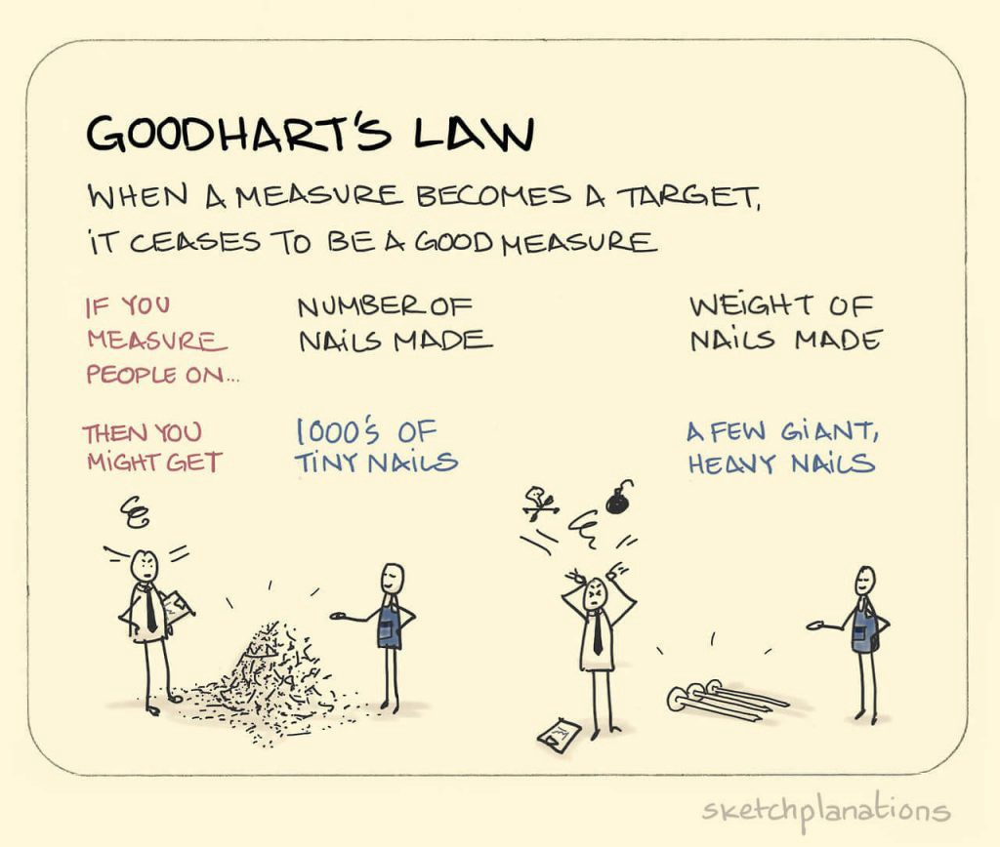

# Goodhart's Law and Metric Tracking

## Introduction

In this lesson, we'll learn about **_Goodhart's Law_** and why we should be cautious and thoughtful when making policy recommendations based on data. 

## Objectives

You will be able to:

* Understand and explain Goodhart's Law
* Identify real-world examples of Goodhart's Law in action

## What is Goodhart's Law?

[Goodhart's Law](https://en.wikipedia.org/wiki/Goodhart%27s_law) is an observation made by the British Economist Charles Goodhart in 1975.  Charles Goodhart famously said:

> "Any observed statistical regularity will tend to collapse once pressure is placed upon it for control purposes."  --Charles Goodhart

In plain English, this translates to:

> "Any measure which becomes a target ceases to be an effective measure!"

### So What Does That Mean?

Goodhart's Law succintly explains a cardinal sin that many data scientists, project managers, and CEOs make all the time without realizing it--they make policy or set goals based on statistical metrics without considering the unintended consequences and effects these policies might have!  

## Example 1: Cobra Skins

The [Cobra Effect](https://en.wikipedia.org/wiki/Cobra_effect) refers to an anecdote that demonstates an example of Goodhart's Law in effect during the time of British Rule of Colonial India.  As the story goes, a high-ranking officer in the British military was concerned about the number of highly venomous cobras that could be found in the Delhi. He had the bright idea of offering a bounty for every cobra skin brought to him! Initially, this seemed to work--people hunted cobras, sold the skins to the British government for their bounty, and the cobra population dipped slightly in the city.  However, this soon backfired spectacularly, when citizens started breeding cobras! As a result, the cobra population stopped declining, and even repopulated a bit.  After a while, the officer caught onto the breeding, as he realized they were paying out many bounties but the cobra problem in the city was still prevalent as ever.  After realizing this, he canceled the bounty.  Ironically, this meant that all the cobra breeders now had no reason to keep the cobras they were breeding, so they dumped them in the street--causing the city to have even more cobras than before the bounty program had been implemented in the first place!

(Fun fact: The French military made the same mistake when Hanoi, Vietnam was under their colonial rule with a rat bounty, and there is solid evidence to prove that this actually happened!)

### The Problem With Proxy Metrics

The first mistake by this British Commander was using a **_proxy metric_** in the form of "cobra skins collected".  He mistakenly assumed that there was an inverse relationship between the number of skins turned in for a bounty and the number of wild cobras in the city of Delhi! Although this may have been the case at first, as hunting cobras was pretty much the only way to obtain skins to turn in for the bounty, he failed to realize that there were other possible sources for cobra skins that he hadn't accounted for.  He wanted to reduce one metric, _Cobra Population_, but he wasn't actually tracking that metric--he was tracking a proxy for that metric which he assumed he could use to gauge what was happening to his target metric.  The system he implemented had no way of determining if the cobra skins turned in for bounties were skins from cobras on the streets of Delhi--with no way to tell, he had no way of knowing as his proxy metric became less and less relevant. 

### Policies Can Change Things You Didn't Plan For

This leads to his other mistake--he failed to account for how his policies might change things. Policies do not happen in a vacuum. They have a tendency to change things in unexpected ways, if not crafted thoughtfully and carefully! At first glance, introducing a monetary incentive for cobra skins seems like a good way to reduce the cobra population.  However, he failed to account for the way this new incentive might change people's behaviors.  By making cobra skins highly valuable, he inadvertently caused people to realize that breeding cobras was much safer, easier, and more lucrative than hunting them.  Although his policy may have caused the change he wanted in the beginning, he had no way of knowing what other sorts of behaviors this new policy might create or encourage. 

## Example 2: Standardized Testing in US Schools

A more depressing real-world example of Goodhart's Law in action is the prevalence of standardized testing in the American public school system. These tests were originally designed as a way to measure both individual student performance and overall teacher and school effectiveness.  However, school funding is tied directly to test scores.  This incentivizes schools to "teach to the test", spending a disproprionate amount of class time each year focusing on test preparation. By having incentivizing schools to focus heavily on preparing students for these tests, the system has ensured that the test results are no longer accurate metrics of student learning--just student ability to cram for that specific sort of test, which isn't very reflective of real-world skills or needs. Furthermore, many teachers point out that the amount of time spent preparing for the tests means that there is less time for students to actually learn! In this case, policy makers started out with a harmless, positive intention--measure student and school performance--but failing to account for Goodhart's Law by making schools aim for higher test scores has invalidated the usefulness of these test scores while actually reducing the overall learning that these tests were designed to measure!

## Why Does This Matter For Data Scientists?

Goodhart's Law is something that matters much to Data Scientists because it is our findings and experiments that often drive the policies and decisions made by a company.  Data Science is complex, and often, project managers, CEOs, and other decision makers don't want to know about experimental methodologies or confidence intervals--they just want to know what the best decision they can make is, based on what the data says! It's quite common for decision makers to not realize that setting a target for one metric can negatively affect other metrics in ways that aren't immediately obvious--for instance, pushing employees at a call center to reduce call times could possibly reduce customer satisfaction, because of employees hustling to get off the phone based on the shorter call time "target" handed down from management.  

As a data scientist, it is important to communicate your results clearly to stakeholders--but it is also important to be the voice of reason at times.  This is why communication with stakeholders is important throughout the process of any data science project.  The sooner you know how they plan on using your results, the more you can help them avoid ugly unforseen problems that come from Goodhart's Law--always remember that massive amounts of data are no substitute for _critical thinking_! At the very least, you should get a bit nervous when you see targets being set for certain metrics.  Note that this doesn't necessarily mean "don't set targets"--instead, seek to encourage decision makers to think critically about any unintended consequences these targets could have, and track changes in metrics early and often when new policies or targets are put in place to ensure that unintended consequences are caught early!

## Summary

In this lesson, you learned about Goodhart's Law and why you should be cautious and thoughtful when making policy recommendations based on data.
