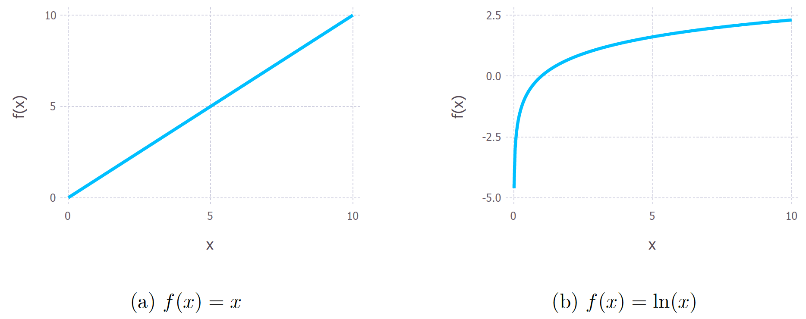

# Maximum Likelihood Estimation (MLE)

## Introduction

"Parameter Inference" is one of the most important concepts of predictive machine learning. In this lesson, we will try to build an intuition and develop a sound understanding of the the ideas around this concept. We will first look at the maximum likelihood estimation (MLE) for the posterior probability based on observed data. The lesson explains the context of a random experiment involving a series of coin tosses to conclude the general formula for MLE for a binomial distribution. 

## Objectives

You will be able to:
* Understand and describe parametric inference based in context of identifying optimal values for model parameters
* Understand the concept of likelihood , and the difference between likelihood and a probability
* Describe MLE assumption of IID samples and its implications on model development

## Parameter Inference

Parameter Inference is the process of probabilistically inferring parameter(s) for a model of our choice, that is which parameter values best describe the underlying dataset, used in an analytical context. Let's try to understand this with a simple experiment with a 10 times coin flip and inspecting the outcome. 


```python
import random
def coinToss():
    number = int(input("Number of times to flip coin: "))
    recordList = []
    heads = 0
    tails = 0
    for amount in range(number):
         flip = random.randint(0, 1)
         if (flip == 0):
              print("Toss", amount+1 ,':' , "Heads")
              recordList.append("Heads")
         else:
              print("Toss", amount+1 ,':' , "Tails")
              recordList.append("Tails")
    print(str(recordList))
    print(str(recordList.count("Heads")) + str(recordList.count("Tails")))
    return recordList
```


```python
lst = coinToss()
```

    Number of times to flip coin: 10
    Toss 1 : Tails
    Toss 2 : Tails
    Toss 3 : Heads
    Toss 4 : Tails
    Toss 5 : Tails
    Toss 6 : Heads
    Toss 7 : Tails
    Toss 8 : Tails
    Toss 9 : Heads
    Toss 10 : Heads
    ['Tails', 'Tails', 'Heads', 'Tails', 'Tails', 'Heads', 'Tails', 'Tails', 'Heads', 'Heads']
    46


Remember its a random experiment so the output will change everytime you run it. Here is the output sequence we'll use in this lesson: 
```
['Heads', 'Heads', 'Tails', 'Tails', 'Tails', 'Heads', 'Tails', 'Heads', 'Heads', 'Heads']
```
Considering its a random experiment, we can say that there has to be *some* underlying parameter for the outcome of a coin flip. Also, consider other random experiments with dice rolls. Can we identify a parameter that determines the outcome of such experiments ? 

Parameter Inference is all to do with identifying that parameter with its optimal value. The first key step in this process is Maximum Likelihood Estimation (MLE). Below we shall look into this process with our simple coin flip example. 

## Maximum Likelihood Estimation

MLE primarily deals with **determining the parameters** that **maximize the probability of the data**. Such a determination can help us predict the outcome of future experiments e.g. If we Toss the coin 1 more time, what is the probability of seeing a Head? 

* Its a fair coin so probability is 0.5. 

This is a safe assumption as it assumes independence between coin flips and hence past events have no impact on future ones. 

We know we can also calculate the probability based on outcomes of previous events


```python
p_head = lst.count("Heads")/10
p_head
```


    0.4


With both these approaches in hand , let's see which answer is more suitable by creating a general case from this example. We want to know the probability of 11th flip $ p_{11}(f_{11})$, being a head so we can write:

> $p_{11}(f_{11}=Heads)$

We can also write above for calculating probability of $ith$ flip being a Head:

> $p_i(f_i = Heads) = \theta_i$


Here we introduce $\theta_i$, which is the parameter that governs the outcome of ith flip. To signify that the probability distribution depends on $\theta_i$, we can use conditioning as we saw earlier and write down the last equation to show the probability distribution function along with its dependence on theta_i. 

> $p_i((f_i = Heads) | \theta_i)$

*The probability of seeing heads in the ith flip , given theta_i*

This makes sense so far, but raises a few confusing points: If the data depends on theta parameter, then the first ten coin flips f_1 to f_10 depend on theta_1 to theta_10  for i = 1 to 10. So looking at the outcome of first ten experiments, how can we extrapolate it to theta_11? 

*There are two kinds people in the world: First, Those who can extrapolate from incomplete data* 

So let's see how we can do this. If we say that random outcome of a sequence of flips is governed (or modeled) by the parameters theta_1 to theta_10 we calculate the probability function based on observed data as:

> $P (Heads, Heads, Tails, Tails, Tails, Heads, Tails, Heads, Heads, Heads) | \theta_{1}\theta_{2} .. \theta_{10})$


Apparently, still we know nothing about theta_1 .. theta_10, and how these thetas are connected to theta_11?

This is where Maximum Likelihood Estimation steps into the equation. The problem we have now is that we need to find values of thetas 1 to 10.  MLE helps find theta_i’s such that that probability function shown above is **as high as possible** and this is the basic principle of MLE. Let's develop our intuition further on this. 


#### Likelihood - The probability of data

MLE looks at the probability of data and it tries to find those parameters (i.e. theta_1 through theta_10 in above case) that maximize the likelihood of this sequence occurring. 

> With maximum liklihood estimation, we want to choose those parameters under which our observations become most **likely**.


Going back to our coin flip example. If in our understanding, the coin flips do not affect each other, i.e., they are independent (the outcome of first flip does not affect the outcome of the second flip):
>$P (H, H, T, T, T, H, T, H, H, H) | \theta_{1}\theta_{2} .. \theta_{10})$

>$= P(F_1 = H | \theta_1).P(F_2 = H | \theta_2) .. P(F_{10} = H | \theta_{10})$

>$= \prod_{i=1}^{10} p_i(F_i = f_i | \theta_i)$ - The general case for coin flip

Note: $\prod$ signifies the product over a series, shown in the previous equation, just as $\Sigma$ denotes summation over a series.

### MLE Assumptions

So here we see that the **independence assumption** allows us to simplify the complex likelihood term into ten simpler factors that can be shown through a general notation in the last equation. 

The independence assumption allows simplification of the likelihood term but we still don’t have theta_11 in the equation.

There is another assumption we can introduce, based on the fact that the coin does not change significantly after each flip i.e.:

* **The flips are quantitatively same, i.e., they are identically distributed**. 

This implies that the flips are taking place under similar circumstances, we can assume that the parameter governing the flips is one and same i.e. just the $\theta$ without any subscripts. BAse on this assumption, we can rewrite above equation as :

>$\prod_{i=1}^{10} p_i(F_i = f_i | \theta_i) = \prod_{i=1}^{10} p(F_i = f_i | \theta) $

Our assumption leads us to believe that 10 flips we observed are governed by the same parameter theta. We now have just one parameter governing the entire sequence of coin flips, and that includes the 11th flip as well. 

This is how MLE allows us to connect first 10 coin flips to the 11th coin flip and is the key for inference.

### The two assumptions we made are used so often in Machine Learning that they have a special name together as an entity : "The i.i.d. assumption" i.e. Independent and Identically distributed samples.

This means that the 10 flips are independent and identically distributed which is great as it will allow us to explicitly write down the likelihood that we are trying to optimize. 

Remember that theta was defined as the probability of the flip showing up Heads; the probability of our sequence w.r.t. theta can now be formulated as:

$ \prod_{i=1}^{10} p(F_i = f_i | \theta)$ 

$= \theta \theta (1-\theta)(1-\theta)(1-\theta) \theta(1-\theta)\theta\theta\theta$

$=\theta^6(1-\theta)^4$

* theta = Probability of seeing a head
* 1 - theta = Probability of seeing a tail
* The sequence:  H,H,T,T,T,H,T,H,H,H


We see here the i.i.d. assumptions simplifies  the likelihood function to a simple polynomial; to a point where we can **start optimizing the function for the parameter theta**.


This simplified polynomial expression can be interpreted as a function of theta i.e., 
> $f(\theta)$ 

Now we want to find out the maxima (maximum likelihood) of this function. 


Following the intuition in the image above, We can achieve theta this by taking the derivative 
> $\frac{df}{d(\theta)}$ 

We set this  zero, and solve for theta. And then verify the critical point i.e. maxima, by inserting it into the second derivative of f(theta). This is a simple approach , however, the application of product rule repeatedly in this process could be a technically challenging process. This calculation can be simplified using a monotonic function. 


### Monotonic function

> In mathematics, a monotonic function(or monotone function) is a function between ordered sets that preserves or reverses the given order. This concept first arose in calculus, and was later generalized to the more abstract setting of order theory. [Wiki](https://en.wikipedia.org/wiki/Monotonic_function)


According to this theory, if we apply a monotonic function to another function , like the one we are trying to optimize above, this application will preserve the critical points (maxima in this case) of the original function. Logarithmic functions are normally used within the domain of machine learning to achieve the functionality of monotonicity  The logarithmic function is described as:

> $log_b(x)$

* where b is any number such that b > 0, b≠ 1, and x > 0. 
* The function is read "log base b of x".

The logarithm y is the exponent to which b must be raised to get x. The behaviour of a log function can be understood from following image.





So this helps us realize that **log of f(θ) i.e. log(f(θ)) will have the save maxima as the likelihood function f(θ).** This is better known as the **log likelihood**. 

So our optimization function i.e. $\theta^6(1-\theta)^4$ , that we are trying to optimize w.r.t. theta can be written down as:

>$\underset{\theta}{\operatorname{argmax}} \theta^6(1-\theta)^4$

>In mathematics, the arguments of the maxima (abbreviated arg max or argmax) are the points of the domain of some function at which the function values are maximized

Remember that we are not concerned with the actual maximum value of the function. We want to **learn the value for theta** where the **function has the maximum value**.

Following the monotonicity principle, our argmax function can be written with natural log *ln* as:

>$\underset{\theta}{\operatorname{argmax}} ln(\theta^6(1-\theta)^4)$
 
> $=\underset{\theta}{\operatorname{argmax}} 6 (ln (\theta)) *4 (ln(1-\theta))$

Let's call our log likelihood function $g(\theta)$, take its derivative and set it to zero. 


> $ \frac{d}{d\theta}[g(\theta)] = |H|\frac{1}{\theta} + |T|\frac{1}{1-\theta}(-1)$

|T| are the number of tails = 4 
|H| are the number of heads = 6 

We are simply solving for a general case here , so we shall use |T| and |H|

> $|H|\frac{1}{\theta} + {|T|}\frac{1}{1-\theta}(-1) = 0 $

> $|H|(1-\theta) - |T|\theta = 0$

> $\theta = \frac{|H|}{|H|+ |T|}$

So here, we have a Maximum Likelihood Function $\theta_MLE$ for any given sequence of coins. 

$$\theta_{MLE} = \frac{|H|}{|H|+ |T|}$$

For our initial problem, where H = 6  and T = 4, we get MLE for theta as 6/10 = 0.6 , or , 60% chance of seeing a head for the 11th coin given the data from first 10 coin flips. 

> This maximum is called the **MLE for theta** as it makes our observed sequence **most likely**.

## Limitations of MLE

Consider a scenario where you get this sequence by total chance: [T,T,T,T,T]. What would be the probability of seeing a head at 6th coin toss? According to our MLE formula, it would be zero. And this can serious hurt an analytical process as MLE heavily depends on past data to find the likelihood function.  This tells us that finding MLE only a first step for Parameter Estimation. We shall come across more sophisticated approaches like Maximum Aposteriori Estimate (MAP) and Fully Bayesian Analysis. 

An example similar to above is described [Here](https://alexanderetz.com/2015/04/15/understanding-bayes-a-look-at-the-likelihood/) in context of Bayes theorem and great visual illustrations. 

## Additional Resources
Due to this section being heavy in maths and some new concepts like optimization, maximas and minimas, monotonicity and log functions etc. You are advised to go through following resources to see more example of MLE calculation and get a deep dive into necessary mathematics. 

* [Probability Concepts Explained: Maximum Likelihood Estimation](https://towardsdatascience.com/probability-concepts-explained-maximum-likelihood-estimation-c7b4342fdbb1) - Example for calculating MLE with normal distributions.
* [IID Statistics: Independent and Identically Distributed ](https://www.statisticshowto.datasciencecentral.com/iid-statistics/)
* [Monotonically Increasing and Decreasing function: An algebraic approach](https://opencurriculum.org/5512/monotonically-increasing-and-decreasing-functions-an-algebraic-approach/)
* [Logarithm Functions](https://mathbitsnotebook.com/Algebra2/Exponential/EXLogFunctions.html)

## Level Up - Optional 

* Take the value of theta calculated in this lesson and substitute this critical value in the second derivative to mathematically verify that it is indeed the maximum

## Summary 

In this lesson we saw how o develop an intuition around MLE as a popular estimation technique. We saw how we can use monotonicity principle of MAthematics to simplify complex probability calculations into simple arithmatic operations. We looked at a simple example of a coin toss for this intuition. NExt, we shall look at more parametric estimation techniques which are deemed necessary in machine learning. 
