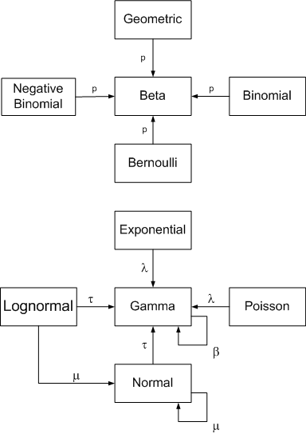

# Conjugate Prior Distributions

## Introduction

In Bayesian probability theory, if the posterior distributions p(θ | X) are in the same probability distribution family as the prior probability distribution p(θ), the prior and posterior are then called conjugate distributions, and the prior is called a conjugate prior for the likelihood function. Here we shall look at the case of bernoulli distribution and see how we can use a beta prior in this case, with quick references to other use cases. 

## Objectives

You will be able to:
* Understand and describe what a conjugate prior is
* Justify the use of a beta prior distribution for bernoulli experiments like a simple coin toss
* Get an overview of a number of different data distributions and their conjugate priors

## What Is a Conjugate Prior?

So now we know that based on Bayes theorem, we can rewrite $P(\theta|X)$ as:

$$P(\theta|X) = \frac{P(X|\theta)P(\theta)}{P(X)}$$

Let's think again of our coin toss example, where we want to learn weather coin is fair or not. $P(\theta)$ on RHS represents our belief about $\theta$. We can say that based on our prior experience with other coins we estimate $\theta$ to be around 0.5 - A subjective prior. However this is just our belief and could be wrong in case of a used up , slightly biased coin. To model our belief about $\theta$ we need another distribution. Theoretically, we are free to select any distribution, but using some random distribution makes the whole calculation very difficult. It turns out that if select a distribution for $P(\theta)$ that has the same form as of $P(\theta|X)$ then the whole computation becomes much easier.  In this case, 

> The distribution associated with $P(\theta)$ is known as **conjugate prior** if distribution of $P(\theta)$ has the same form as of $P(\theta|X)$

### Bernoulli Distribution and Beta Prior

For bernoulli distribution, the conjugate prior is given by Beta distribution which takes two parameters $(\alpha~and~\beta)$ and the probability density function of the Beta distribution is given as:

$$P(\theta) = \frac{1}{B(\alpha, \beta)}{\theta^{\alpha-1}}{(1-\theta)^{\beta-1}}$$

Here  $B(\alpha, \beta)$ represents beta function. [Check here for more information o using beta priors for bernoulli distributions](https://rpubs.com/sitaramgautam/145048)

For different values of $\alpha~and~\beta$, we get different shapes of beta distribution each of which peaks at 

$$(\alpha,\beta)=\frac{\Gamma(\alpha)\Gamma(\beta)}{\Gamma(\alpha+\beta)}.$$

To check if $\theta (= 0.5)$, we try different values of $\alpha~and~\beta$ and find where $P(\theta = 0.5)$  maximizes. we can rewrite our Bayesian tranformation as

$$P(\theta|X) = \frac{P(X|\theta)\frac{1}{B(\alpha, \beta)}{\theta^{\alpha-1}}{(1-\theta)^{\beta-1}}}{P(X)}$$

Now We can simplify the above equation. 
* We can get rid of the denominator as it is only for normalization purpose. 
* We take the log sum instead of product to avoid the number overflow problem.

$$log P(\theta|X) = log P(X|\theta) + log \frac{1}{B(\alpha, \beta)} + log \theta^{\alpha-1} + log (1-\theta)^{\beta-1}$$

$$log P(\theta|X) = \sum_{x \epsilon X}{log P(x|\theta)} + log \frac{1}{B(\alpha, \beta)} + log \theta^{\alpha-1} + log (1-\theta)^{\beta-1}$$

$$log P(\theta|X) = n^1 log \theta + n^0 log (1-\theta) + log \frac{1}{B(\alpha, \beta)} + log \theta^{\alpha-1} + log (1-\theta)^{\beta-1}$$

As we saw in the MLE lesson, now we take the derivative of the above equation with respect to $\theta$ and setit to zero. This will give us the value of $\theta$ that maximizes $P(\theta|X)$.

$$\frac{\partial(n^1 log~\theta + n^0 log~(1-\theta) + log \frac{1}{B(\alpha, \beta)} + log \theta^{\alpha-1} + log (1-\theta)^{\beta-1})}{\partial\theta}=0$$

$$\frac{n^1}{\theta}-\frac{n^0}{1-\theta}+\frac{\alpha-1}{\theta}-\frac{\beta-1}{1-\theta} = 0$$

$$\therefore \theta_{MAP} \Rightarrow \theta = \frac{n^1+\alpha-1}{n^1+n^0+\alpha+\beta-2}$$

Since,$ n^1 = 7~and~n^0=3$ and if we use $\alpha=\beta=5$ ,we get: 
$$\theta_{MAP} = \frac{11}{18} = 0.61$$

## Conjugate prior relationships

The following diagram (from [John D. Cook's](https://www.johndcook.com/blog/conjugate_prior_diagram/) website) summarizes conjugate prior relationships for a number of common sampling distributions.

Arrows point from a sampling distribution to its conjugate prior distribution. The symbol near the arrow indicates which parameter the prior is unknown. These relationships depend critically on choice of parameterization, some of which are uncommon. Following quick reference list highlights PDFs and PMF functions for some major distributions (you dont have to understand all of these at this stage) along with their parameters and posterior distributions. 

## Parameterizations
Let C(n, k) denote the binomial coefficient(n, k).

- The Bernoulli distribution has probability of success $p$

- The beta distribution has PDF: $f(p) = Γ(α + β) pα-1(1-p)β-1 / (Γ(α) Γ(β))$

- The geometric distribution has only one parameter, p, and has PMF: $f(x) = p (1-p)x$

- The binomial distribution with parameters n and p has PMF: $f(x) = C(n, x) px(1-p)n–x$

- The negative binomial distribution with parameters r and p has PMF: $f(x) = C(r + x – 1, x) pr(1-p)x$

- The exponential distribution parameterized in terms of the rate λ has PDF: $f(x) = λ exp(-λ x)$

- The gamma distribution parameterized in terms of the rate has PDF: $f(x) = βα xα-1exp(-β x) / Γ(α)$

- The Poisson distribution has one parameter λ and PMF $f(x) = exp(-λ) λx/ x!$

- The normal distribution parameterized in terms of precision $τ (τ = 1/σ2)$ has PDF:
$$f(x) = (τ/2π)1/2 exp( -τ(x – μ)2/2 )$$

## Posterior parameters
For each sampling distribution, assume we have data $x1, x2, …, xn$

- If the sampling distribution for x is binomial(m, p) with m known, and the prior distribution is beta(α, β), the posterior distribution for p is $beta(α + Σxi, β + mn – Σx_i)$. The Bernoulli is the special case of the binomial with m = 1.

- If the sampling distribution for x is negative binomial(r, p) with r known, and the prior distribution is beta(α, β), the posterior distribution for p is $beta(α + nr, β + Σxi)$. The geometric is the special case of the negative binomial with r = 1.

- If the sampling distribution for x is gamma(α, β) with α known, and the prior distribution on β is gamma(α0, β0), the posterior distribution for β is $gamma(α0 + nα, β0 + Σxi)$. The exponential is a special case of the gamma with α = 1.

- If the sampling distribution for x is Poisson(λ), and the prior distribution on λ is gamma(α0, β0), the posterior on λ is $gamma(α0 + Σxi, β0 + n)$.

- If the sampling distribution for x is normal(μ, τ) with τ known, and the prior distribution on μ is normal(μ0, τ0), the posterior distribution on μ is $normal((μ0 τ0 + τ Σxi)/(τ0 + nτ), τ0 + nτ)$.

- If the sampling distribution for x is normal(μ, τ) with μ known, and the prior distribution on τ is gamma(α, β), the posterior distribution on τ is $gamma(α + n/2, (n-1)S2)$ where S2 is the sample variance.

- If the sampling distribution for x is lognormal(μ, τ) with τ known, and the prior distribution on μ is normal(μ0, τ0), the posterior distribution on μ is $normal((μ0 τ0 + τ Πxi)/(τ0 + nτ), τ0 + nτ)$.

- If the sampling distribution for x is lognormal(μ, τ) with μ known, and the prior distribution on τ is gamma(α, β), the posterior distribution on τ is $gamma(α + n/2, (n-1)S2)$ where S2 is the sample variance.

## Additional Resources
[A compendium of Conjugate prios](https://www.johndcook.com/CompendiumOfConjugatePriors.pdf) - A reference document for details on selecting a suitable prior for a given distribution. 

## Summary 

In this lesson we looked at the idea of using a conjugate priors for Bayesian inferencing. These section might be getting a bit heavy on the mathematics, without showing great details on the applications of Bayes in real life scenarios, other than coin toss experiments. The understanding from this chapter will be used throughout the machine learning sections of our course. And you will have ample chance to revisit these equations for a deeper dive. At this stage , we expect you to have a conceptual understanding of the Bayesian Inference process. Let's move on to our last lab to run some simulations around Bayesian inferencing, using the good old coin toss examples. 
