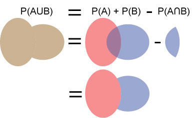
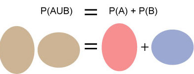
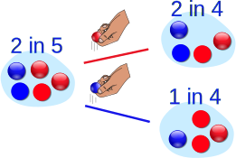
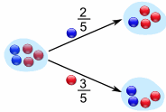
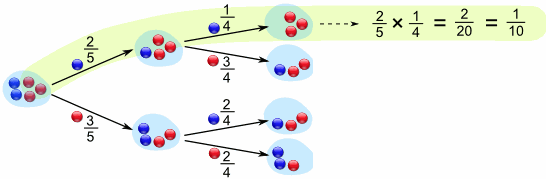
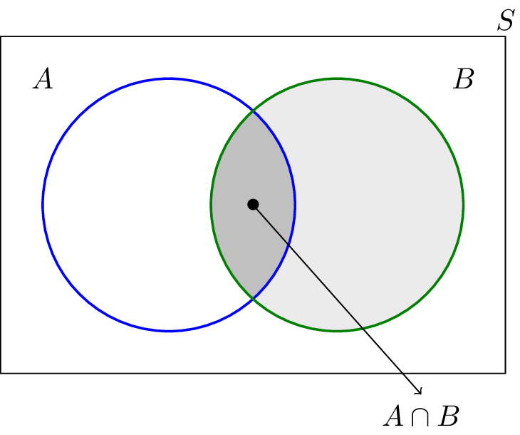
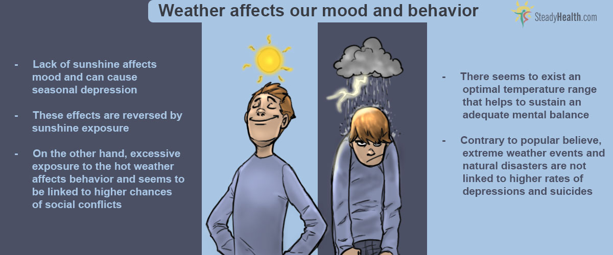

# Conditional Probability 

## Introduction

In the previous lessons and labs, you learned about some fundamentals of probability theory, along with basic combinatorics such as permutations and combinations. You'll now extend your knowledge on probability by learning about **Conditional Probability**. You'll see how Conditional Probability is extremely important in Statistics, and the foundation of many applications. Understanding conditional probability is essential when exploring fields in Machine Learning and Artificial Intelligence.

In this lesson, you'll learn about conditional probability, what it is, and how and when to use it. Later on, you'll see how this simple idea becomes a key component in most statistical machine learning algorithms. 

## Objectives 
You will be able to:

* Differentiate between independent and dependent random events 
* Understand and Explain the conditional probability: $P(A \cap B) = P(A\mid B)P(B) $
* Use the multiplication rule to find the probability of the intersection of two events
* Understand and describe some important theorems based on conditional probabilities

## Events and Sample Space

Before introducing you to to specific event types, let's do a quick recap of the notion of event and sample space.

An **event** is the outcome of an experiment, for example, obtaining heads when tossing of a coin or getting 3 after a dice roll. Note: an event can also be a collection of different events grouped together (or a so-called **compound** event), eg. getting a 3 twice when rolling a dice twice.  

A **eample space** is a collection of every single possible outcome in a trial, generally represented by $\Omega$. 
The sample space for 1 random dice throw is  {1,2,3,4,5,6}. 

As you remember for the previous lessons, we can combine event and sample space to compute event probability.

You'll learn about 3 important event types: **independent**, **disjunct**, and **dependent** events.

### Independent Events

** Events $A$ and $B$ are independent when, the occurrence of $A$ has no effect on whether $B$ will occur (or not).**

Consider following independent events 

* Getting heads after flipping a coin **and** getting a 5 on throw of a fair dice
* Choosing a marble from a container **and** getting heads after flipping a coin

#### Two independent events

Formally, events A and B are independent if 
- $P(A \cap B) = P(A)P(B)$,  and
- $P (A \cup B) = P(A) + P(B) - P(A\cap B)$  

#### Three independent events
Three events A, B and C if

- $P(A \cap B) = P(A)P(B)$ 
- $P(A \cap C) = P(A)P(C)$ 
- $P(B \cap C) = P(B)P(C)$
- $P(A \cap B \cap C) = P(A)P(B)P(C)$
 
So you need both *pairwise independence* and *three-way independence*

### Disjoint Events

**Events $A$ and $B$ are disjoint if $A$ occurring means that $B$ cannot occur.**

Disjoint events are **mutually exclusive**. $P (A \cap B)$ is **empty**.

### Dependent Events 

** Events $A$ and $B$ are dependent when, the occurrence of $A$ somehow has an effect on whether $B$ will occur (or not).**

Now things start getting a bit more interesting. 

Let's look at an example. To explain this example, we used images from this [mathisfun.com](https://www.mathsisfun.com/data/probability-events-conditional.html)-page. Let's say event $A$ is taking a red or blue marble out of a jar. The jar contains 3 red and 2 blue marbles. 

The probability of getting a blue marble is $\dfrac{2}{5}$ and getting a red marble is $\dfrac{3}{5}$.

At that point, one marble is taken out and we now take another marble from the jar (event $B$).

Here you can see that our second event is dependent on the outcome of first draw.

- If we drew a red marble first, the probability of getting a blue marble for event B is $\dfrac{2}{4}$. 
- If we saw a blue marble first, however, the probability of seeing a blue in second trial is $\dfrac{1}{4}$. 

In simple terms, the probability of seeing an event $B$ in the second trial depends on the outcome $A$ of the first trial. We say that $P(B)$ is **conditional** on $P(A)$.

A **tree diagram** can be used to explore all possible events.

## Conditional Probability 

**Conditional probability emerges when the outcome a trial may influence the results of the upcoming trials.**

While calculating the probability of the second event (event $B$) given that the primary event (event $A$) has just happened, we say that the probability of event $B$ is relies on the occurrence of event $A$.

Here are some more examples: 

* Drawing a 2nd Ace from a deck of cards given that the first card you drew was an Ace.
* Finding the probability of liking "the Matrix" given that you known this person likes science fiction.

Let's say that $P(A)$ is the event we are interested in, and this event depends on a certain event $B$ that has happened. 

The conditional probability (Probability of $A$ **given** $B$) can be written as:
$$ P (A \mid B) = \dfrac{P(A \cap B)}{P(B)}$$

$P(A|B)$, is the probability A **given** that $B$ has just happened. 

Understanding this formula may be easier if you look at two simple Venn Diagrams and use the multiplication rule. Here's how to derive this formula:

Step 1: Write out the multiplication rule:
* $P(A \cap B)= P(B)*P(A\mid B)$

Step 2: Divide both sides of the equation by P(B):
* $\dfrac{P(A \cap B)}{ P(B)} = \dfrac{P(B)*P(A\mid B)}{P(B)}$

Step 3: Cancel P(B) on the right side of the equation:
* $\dfrac{P(A \cap B)}{P(B)} = P(A \mid B)$

Step 4: This is of course equal to:
* $ P(A \mid B)=\dfrac{P(A \cap B)}{P(B)} $

And this is our conditional probability formula. 

There are a few variations and theorems that are related to and/or results of this conditional probability formula. The most important ones are: the **product rule**, the **chain rule** and **Bayes Theorem**

### Theorem 1 - Product Rule

The **product rule** was used to derive the conditional probability formula above, but often used as is in situations where the conditional probability is easy to compute, but the probability of intersections of events isn't. 

The intersection of events $A$ and $B$ can be given by

\begin{align}
    P(A \cap B) = P(B) P(A \mid B) = P(A) P(B \mid A)
\end{align}

Remember that if $A$ and $B$ are independent, then conditioning on $B$ means nothing (and vice-versa) so $P(A|B) = P(A)$, and $P(A \cap B) = P(A) P(B)$.

### Theorem 2 - Chain Rule

The **chain rule** (also called the **general product rule**) permits the calculation of any member of the joint distribution of a set of random variables using only conditional probabilities. 

Recall the product rule: 

$P(A \cap B) = P(A \mid B) P(B)$

When you extend this for three variables:

$P(A\cap B \cap C) = P(A\cap( B \cap C)) = P(A\mid B \cap C) P(B \cap C) = P(A \mid B \cap C) P(B \mid C) P(C)$

And you can keep extending this to $n$ variables:

$$P(A_1 \cap A_2 \cap \ldots \cap A_n) = P(A_1 \mid A_2 \cap \ldots\cap A_n) P(A_2 \mid A_3  \cap \ldots \cap \ A_n) P(A_{n-1}|A_n) P(A_n)$$

This idea is known as the **chain rule**.

If on the other hand you have disjoint events $C_1, C_2,...,C_m$ such that $C_1\cup C_2\cup ··· \cup  C_m = \Omega$, the probability of any event can be decomposed as:

\begin{align}
P(A) = P(A \mid C_1)P(C_1) + P(A \mid C_2)P(C_2) + \ldots + P(A \mid C_m)P(C_m)
\end{align}

### Theorem 3 - Bayes Theorem

The **Bayes theorem**, which is the outcome of this section. Below is the formula that we will dig deeper into , in upcoming lessons.

\begin{align}
    P(A|B) = \frac{P(B|A)P(A)}{P(B)} \text{-        this follows from Theorem 1}
\end{align}

### Additional note: the complement of an event

You learned about (absolute and relative) complements before, but in the complement of an event is also extendible to conditional probabilities.

The basic rule is:

$P(A) + P(A') = 1$

with A' being the complement of A.

Similarly, extending this to conditional probabilities:

$P(A|B) + P(A'|B) = 1$

## Example : An Aspiring Data Scientist's Dilemma

Let's see a very simple use of conditional probability formula. A data scientist comes across following infographic:

Curious as data scientists are, he starts collecting data about weather conditions and his own mood. 

Consider the data in the following table, recorded over a month with 50 days by our data scientist. On each day he recorded whether it was sunny or Cloudy, and whether his mood was good or not.

|           | Sunny weather | Cloudy weather |
|-----------|----------------|---------------|
| Good mood | 14             | 11            |
| Bad mood  | 2              | 23            |

He wants to now know if his mood had anything to do with the weather on a particular day and how can he calculate the probability of having a good mood given the weather conditions. 

### If he picked a day at random from the 50 days on record, what is the probability that he was in a good mood on that day, $P(G)$? 

* The sample space is 50 days here
* The event space is "good mood", so $14 + 11 = 25$.
* $P(G) = \dfrac{25}{50} = 0.5$

### What is the probability that the day chosen was a Sunny day, $P(S)$?

* The sample space is still 50 days
* It was sunny on $14 + 2 = 16$
* $P(S) = \dfrac{16}{50} = 0.32$

### What is probability of having a good mood given its a sunny day  $P(G \mid S)$ ?

* $P(G \mid S) = \dfrac{P(G \cap S)}{ P(S)}$, so we need to calculate $P(G \cap S)$ first. 

* $P(G \cap S)$ consists of sunny days in which he is in a good mood. There were 14 of them, so $P(G \cap S) = \dfrac{14}{50}$
* Therefore $P(G \mid S) =\dfrac{\frac{14}{50}}{\frac{16}{50}} = 0.875 $

The infographic had some truth in it indeed. There's a $87.5%$ chance that our curious data scientist would be in good mood on a sunny day.  

The data scientist is satisfied and thinks the outcome is comforting. 

Surfing the Internet, however, he comes across a Garth Stein quote. Although not very scientific, this raises his curiosity further. The quote goes as follows:

> $\large \text{"That which is around me does not affect my mood; my mood affects that which is around me"}$
 
What if...?

### Now the data scientist wants to know if his mood had any impact on the weather.  What is $P(S \mid G)$

$P(S \mid G) =\dfrac{P(G \cap S)}{ P(G)} = \dfrac{\frac{14}{50}}{\frac{25}{50}} = 0.56$

He finds that the probability is slightly higher than random chance (50%). In other words, there's a 56% chance that it will be all nice and sunny given that he is in a good mood. 

He also realizes that $P(G \mid S)$ is not equal to $P(S \mid G)$ . So does this mean that weather has a higher impact on his mood than his mood has on the weather...?

This doesn't really make sense. Our mood doesn't *cause* the weather, so there is no cause-effect relationship. In the example above, the weather and other such external conditions can have a positive effect on human mood and behavior, and this can be said with reference to literature. however it is unlikely that mood has any effect on weather, there is no scientific evidence to support this notion (and it's very unlikely that there will ever be). What is clear, however, is that there is a relationship between weather and mood.

### Say Hello to Reverend Thomas Bayes

Bayes theorem ([Image source here](https://commons.wikimedia.org/wiki/File:Thomas_Bayes.gif))
is a very foundational theorem that uses the fact that $P(A \cap B) = P(B) P(A \mid B) = P(A) P(B \mid A)$. Note that, using Bayes theorem, you can compute conditional probabilities without explicitly needing to know $P(A \cap B)$! 

This theorem is extremely important in many machine learning algorithms.

Our data scientist realizes that he needs to learn a bit of Bayesian reasoning in order to get more meaningful results. And that is exactly what we will discuss further. First we need to cover a few topics to fully understand how this simple equation lets you do some serious predictive analysis. 

You'll do a few exercises next to get a good grip of conditional probability calculations.

## Additional Resources

You are strongly advised to visit following links to get an indepth understanding with examples and proofs for formulas highlighted in this lesson. 

[Conditional probability, Independence and Bayes rule](http://faculty.arts.ubc.ca/vmarmer/econ327/327_02_cond_probability.pdf) - A deeper mathematical explanation around Independence and theorems we have seen above (and some we shall cover in upcoming lessons)

[Tree Diagrams](https://www.mathsisfun.com/data/probability-tree-diagrams.html) - Drawing tree diagrams to calculate conditional probability

[Conditional Probability, Examples and simple exercises](https://www.mathgoodies.com/lessons/vol6/conditional) - Practice around probability calculations

[Conditional probability: A visual explanation](http://setosa.io/conditional/) - A great little interactive animation to explain how conditional probability works

## Summary 

In this lesson, you learned about the conditional probabilities in case you have dependent events in your sample space. You looked at the formula to calculate these probabilities with a brief proof. You also looked at an example to see this concept in action. In the upcoming lessons, you'll build further on these ideas towards having a clear understanding of Bayesian Logic and its role in machine learning. 
