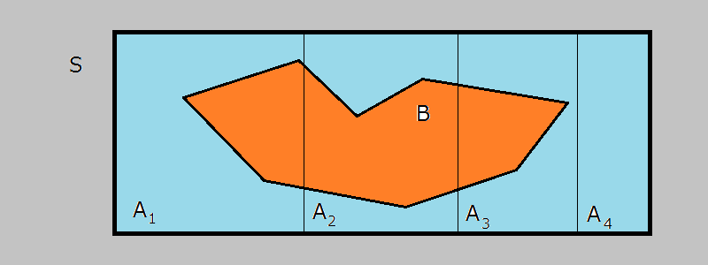
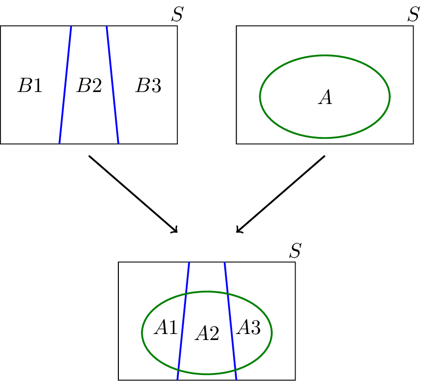
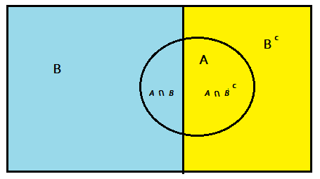

# Partitioning and Law of Total Probability

## Introduction 
In this lesson, we'll look at the law of total probability. In probability theory, the law (or formula) of total probability is a fundamental rule relating **marginal probabilities** to conditional probabilities. It expresses the total probability of an outcome which can be realized via several distinct events.

## Objectives
You will be able to:
* Understand and explain the concept of event space and partitioning 
* State the law of total probabilities based on a partitioned event space
* Understand and able to perform partitioning based on known and unknown probabilities to solve a problem
* Understand and describe conditional independence

## Partitioning a Sample Space

the Law of Total Probability can be used to calculate $P(B)$. The law requires that you have a set of disjoint events $A_i$ that collectively "cover" the event $B$. Then, instead of calculating $P(B)$ directly, you add up the intersection of $B$ with each of the events $A_i$. Let's see this graphically below:

Let $A_1, A_2, \dots, A_n$ partition sample space $S$ into disjoint regions that sum up to $S$. In the example, 4 regions of $A_1, A_2, A_3$ and $A_n$ sum up to sample space $S$.

The probability of a random event $B$ (orange area) can be written down as:

\begin{align}
    P(B) &= P(B \cap A_1) + P(B \cap A_2) + P(B \cap A_3)+ P(B \cap A_4) \\
         &= P(B \mid A_1)P(A_1) + P(B \mid A_2)P(A_2) +P(B \mid A_3)P(A_3)+ P(B \mid A_4)P(A_4)
\end{align}

Here we use the first theorem mentioned in the previous lesson to find the combined probabilities. 

### Example 
Let's use a simple example to clarify the image above! The example is created to match the image.

In a certain country, there are four provinces (eg. disjoint regions) $A_1, A_2$, $A_3$ and $A_4$.

You are interested in the total forest area in the country. 

Suppose that you know that the forest area in $A_1$, $A_2$, and $A_3$ are 100 km$^2$, 50 km$^2$, and 150 km$^2$, and 0 km$^2$ respectively. What is the total forest area in the country? 

100km$^2$ + 50km$^2$ + 150km$^2$+ 0 km$^2$ = 300 km$^2$

We can simply add forest areas in each province to obtain the forest area in the whole country. 

If you want to formalize this in terms of the law of total probability, say:

This is the idea behind the law of total probability, in which the area of forest is replaced by probability of an event $B$. In particular, if you want to find $P(B)$, you can look at a partition of $S$ (our sample space composed of $A_1,\ldots, A_4$), and add the amount of probability of $A$ that falls in each partition. 

### Two Events 

In general, we can say that for any two events $A$ and $B$:

$P(A)=P(A \cap B)+P(A \cap B')$

and using the definition of conditional probability, $P(A \cap B)=P(A \mid B)P(B)$, we can write

$P(A)=P(A \mid B)P(B)+P(A \mid B')P(B')$

The law of total probability is basically a general version of this. 

## Law of Total Probability 

If B1,B2,B3,⋯ is a partition of the sample space S, then for any event A we have

$$P(A)= \sum_i P(A \cap B_i)= \sum_i P(A \mid B_i)P(B_i)$$

Using a Venn diagram, we can pictorially see the idea behind the law of total probability. In the figure below, we have

* $A_1 = A \cap B_1$
* $A_2 = A \cap B_2$
* $A_3 = A \cap B_3$

As it can be seen from the figure, $A_1$, $A_2$, and $A_3$ form a partition of the set A, and thus 

$P(A)=P(A_1)+P(A_2)+P(A_3)$

Here is a typical scenario in which we use the law of total probability. We are interested in finding the probability of an event $A$, but we don't know how to find P(A) directly. Instead, we know the conditional probability of $A$ given some events $B_i$, where the $B_i$'s form a partition of the sample space. This way, you can use $P(A)$ using the law of total probability

$P(A)=\sum_i P(A \mid B_i)P(B_i)$

## More on Partitions

* The natural numbers $\mathbb{N}$ can be partitioned into even and odd numbers. 
* The set of animal species in the world can be partitioned into subsets where a subset reflects a continent and each species is positioned in a subset depending on which continent they originated from. 

In statistics choosing the right partitioning is key as bad choices of partitions may results in many, even more difficult to solve sub-problems.

The probability of $A$ can be written as sums of event $B$ (note that $B^c$ is abother way of writing $B'$) The total probability rule is:

$P(A) = P(A \cap B) + P(A \cap B^c)$

An alternate version of the total probability rule (found with the multiplication rule) can be used when the necessary probabilities are known  :

$P(A \cap B) = P(A \mid B)  P(B) + P(A \cap B^c) = P(A \mid B^c)P(B^c)$

You need to be careful when dealing with conditional probabilities and conditioning. Let's look at a few examples to see this idea in action. 

### Example 1
In a certain county, $60\%$ of registered voters are Republicans, $30\%$ are Democrats and $10\%$ are Independents.

When those voters were asked about increasing military spending
* $40\%$ of Republicans opposed it
* $65\%$ of the Democrats opposed it
* $55\%$ of the Independents opposed it.

What is the probability that a randomly selected voter in this county opposes increased military spending?

You know that:

* $\Omega$ = {registered voters in the county}
* $R$ = {registered republicans}, $P(R)$ = 0.6
* $D$ = {registered democrats}, $P(D)$ = 0.3
* $I$= {registered independents}, $P(I)$ = 0.1
* $B$ = {registered voters opposing increased military spending}

You also know that:

* $P(B \mid R) = 0.4 $
* $P(B \mid D) = 0.65$
* $P(B \mid I) = 0.55$

By the total probability theorem:

$Pr(B) = Pr(B \mid R) Pr(R) + Pr(B \mid D) Pr(D) + Pr(B \mid I) Pr(I)$

$= (0.4 * 0.6) + (0.65 * 0.3) + (0.55 * 0.1) = 0.49 $

### Example 2 

Let's consider a 2-card hand drawn from a standard playing deck. What is the probability of drawing 2 aces, given that we know one of the cards is an ace?

$P(\text{both are aces | one is ace}) = \dfrac{P(\text{both are aces})}{P(\text{one is ace})} = \dfrac{P(\text{both are aces})}{1 - P(\text{neither is ace})} =\dfrac{\binom{4}{2}/\binom{52}{2}}{1 - \binom{48}{2}/\binom{52}{2}}=\dfrac{1}{33}$

But now think about this: What is the probability of drawing 2 aces, knowing that one of the cards __is the ace of spades__?

$P(\text{both are aces | ace of spades}) = P(\text{other card is also an ace}) = \dfrac{3}{51}= \dfrac{1}{17}$

_Notice how the fact that we know we have the ace of spades nearly doubles the probability of having 2 aces_

### Example 3

Suppose there is a test for a disease, and this test is said to be "95% accurate". The disease in question afflicts 1% of the population. Now say that there is a patient who tests positive for this disease under this test.

First we define the events in question:

Let $D$ be the event that the patient actually has the disease.

Let $T$ be the event that the patient tests positive.

Since that phrase "95% accurate" is ambiguous,  we need to clarify that.

$P(T|D) = P(T^c|D^c) = 0.95$

In other words, __conditioning on whether or not the patient has the disease__, we will assume that the test is 95% accurate.

_What exactly are we trying to find?_

What the patient really wants to know is not $P(T|D)$, which is the accuracy of the test; but rather $P(D|T)$, or the probability she has the disease given that the test returns positive. Fortunately, we know how $P(T|D)$ relates to $P(D|T)$.

\begin{align}
    P(D|T) &= \frac{P(T|D)P(D)}{P(T)} ~~~~ & &\text{... Bayes Rule} \\
    &= \frac{P(T|D)P(D)}{P(T|D)P(D) + P(T|D^c)P(D^c)} ~~~~ &  & \text{... by the Law of Total Probability} \\
    &= \frac{(0.95)(0.01)}{(0.95)(0.01) + (0.05)(0.99)} ~~~~ & & \text{... the rarity of the disease competes with the rarity of true negatives}\\
    &\approx 0.16
\end{align}

## Common Pitfalls

- Mistaking $P(A|B)$ for $P(B|A)$. 

This is also known as the [Prosecutor's Fallacy](https://en.wikipedia.org/wiki/Prosecutor%27s_fallacy), where instead of asking about the _probability of guilt (or innocence) given all the evidence_, we make the mistake of concerning ourselves with the _probability of the evidence given guilt_.

- Confusing _prior_ $P(A)$ with _posterior_ $P(A \mid B)$. 

Observing that event $A$ occurred does __not__ mean that $P(A) = 1$. But $P(A \mid A) = 1$ and $P(A) \neq 1$.

- Confusing _independence_ with __conditional independence__. 

This is more subtle than the other two. Let's look at this in a bit more detail

## Conditional Independence

Events $A$ and $B$ are __conditionally independent__ given event $C$, if

$P(A \cap B \mid C) = P(A \mid C)P(B \mid C)$

i.e. conditioning on event $C$ does not give us any additional information on $A$ or $B$.

### Conditional independence given $C$ DOES NOT imply unconditional independence

Consider playing a series of 5 games against a chess opponent of unknown strength. Winning all five games gives would give you a good idea that you are better player. So winning each successive game actually is providing us with information about the strength of our opponent. If you have prior knowledge about the strength of your opponent, you condition on the strength of our opponent i.e. Winning one game would not provide us with any additional information on the probability of winning the next. Having no prior knowledge of your opponent, and winning a string a games will give you information about the probability of winning the next game.

The games are conditionally independent given the strength of our opponent, but **not** independent unconditionally.

### Unconditional independence DOES NOT imply conditional independence given $C$

For example, lett $A$ be the event of the fire alarm going off, $F$ be the event of a fire and $C$ be the event of someone making popcorn. Suppose that either $F$ or $C$ will result in $A$ and the fire alarm going off. Now if $F$ and $C$ are independent: knowing that there's a fire $F$ doesn't tell me anything about anyone making popcorn $C$, and vice versa. But the probability of a fire given that the alarm goes off **and** no one is making any popcorn is given by  $P(F \mid A,C^c) = 1$. After all, if the fire alarm goes off and no one is making popcorn, there can only be one explanation: _there must be a fire_.

So $F$ and $C$ may be independent, but they are not _conditionally independent_ when we condition on event $A$. Knowing that nobody is making any popcorn when the alarm goes off can only mean that there is a fire.

## Additional Resources
You are strongly advised to visit following links to get an indepth understanding with examples and proofs for formulas highlighted in this lesson. 

[The law of total probability - concept and proof](https://www.youtube.com/watch?v=J7Evcn4lfhc) - Excellent YouTube video by Phil Chan.

[Conditional (Partitioned) Probability — A Primer](https://jeremykun.com/2013/03/28/conditional-partitioned-probability-a-primer/) - Deep dive into partitions (A Must read)

[Law of Total Probability](https://www.sangakoo.com/en/unit/law-of-total-probability) - More examples for a deeper understanding around partitioning

## Summary 

In this lesson, you further learned about the ideas of conditional probability covered in the previous lessons to explain the law of total probability using partitioning of the sample space. You learned how you can partition probabilities with respect to some other event, when the direct probabilities are not known. Let's move on to some practice!
