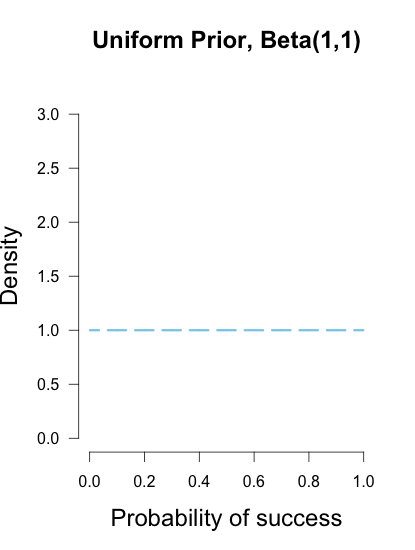

# Maximum A Posteriori (MAP) Estimation 

## Introduction

**Maximum Likelihood Estimation** (MLE) and **Maximum A Posteriori (MAP)** are both methods for estimating some variable in the space of a probability distributions. They are similar, as they compute a **single estimate**, instead of a full distribution. In this lesson, we shall introduce MAP as an estimation technique in the context of Bayes theorem. We shall also look at the similarities between two approaches and their use cases. 

## Objectives:

You will be able to:
* Understand and explain the difference between MLE and MAP
* Evaluate the role of prior into the MAP equation, for a Bayesian estimation
* Understand how for beta distribution priors, the MAP is equal to MLE

## MLE - A quick recap

We have used the concept of MLE before. For example, if you want to fit a normal distribution to your data, you can take the sample mean and variance as the parameters associated with this normal distribution. This is in fact exactly what you are doing when using Maximum Likelihood Estimation: you are in fact trying to find parameters associated with (simple or even very complex) distrubtions.

Here's a quick summary of what we now know, let’s say we have a likelihood function $P(X|θ)$ i.e. the MLE for theta, given the data (X), then parameter we want to infer is:

$$\theta_{MLE} = \underset{\theta}{\operatorname{argmax}}P(X | \theta)$$

$$=\underset{\theta}{\operatorname{argmax}}\prod_{i}P(x_i|\theta)$$

For above equation, product of some numbers $< 1$ will continue to shrink and would approach 0 as the number of those numbers goes to infinity. This would render it computationally inefficient because of number of operations involved. Hence, we will instead work in the monotonically increasing log space because we know that maximizing a function is equal to maximizing the log of that function.

$$\theta_{MLE} = \underset{\theta}{\operatorname{argmax}}\log P(x_i | \theta)$$

To use this optimization framework, we need to derive the log likelihood of our model, then maximizing it with regard of θ . We can maximize it using an optimization algorithm like Gradient Descent.

## MAP - Maximum A Posteriori 

ONce we understand how MLE works, we can move on to understand the  MAP estimation.

> MAP usually comes up in Bayesian setting. Because, as the name suggests, it works on a posterior distribution, not only the likelihood.

**With Bayes’ rule, the posterior is a product of likelihood and prior** :

\begin{align}
    P(\theta|X) = \frac{P(X|\theta)P(\theta)}{P(X)} ~~~~ \text{this follows from Bayes' Theorem of conditional probabilities}
\end{align}

\begin{align}
    P(\theta|X) ∝ P(X|\theta)P(X)~~~~ \text{ignoring the normalization constant}
\end{align}

We usually ignore the denominator (i.e. the normalizing constant) as we are only concerned with optimization here, so proportionality is sufficient.

If we replace the likelihood in the MLE formula above with the posterior, we get:

\begin{align}
    \theta_{MAP} = \underset{\theta}{\operatorname{argmax}}P(X | \theta)P(\theta)
\end{align}

Following same line of reasoning as we used for MLE calculation, we can take the log of this function

\begin{align}
    \theta_{MAP} = \underset{\theta}{\operatorname{argmax}}\log P(X | \theta)P(\theta)
\end{align}

\begin{align}
    \theta_{MAP} = \underset{\theta}{\operatorname{argmax}}  \log \underset{i}{\operatorname{\prod}}   P(x_i | \theta)P(\theta)
\end{align}

\begin{align}
   \theta_{MAP} = \underset{\theta}{\operatorname{argmax}}  \underset{i}{\operatorname{\sum}}  \log  P(x_i | \theta)P(\theta)
    \text{ - (According to log properties)}
\end{align}

So this is our MAP equation. Comparing this with MLE , the key difference is the prior $P(θ)$, otherwise they are identical. 

> **With MAP, the likelihood is weighted with some weight coming from the Prior $P(θ)$.**

## The Beta Prior

We can choose the simplest prior in our MAP estimation, i.e. uniform prior. This means, we assign equal weights everywhere, on all possible values of the θ. Below is an exmaple of a uniform prior ( A Beta Distribution ) showing equal outcomes for a values of theta. 

The implication is that the likelihood is equivalently weighted by some constants. Being constant, we could be ignored from our MAP equation, as it will not contribute to the maximization.

We can be more precise by assigning six possible values into θ. Now, our prior 
P(θ) is 1/6 everywhere in the distribution. And consequently, we could ignore that constant in our MAP estimation.

\begin{align}
   \theta_{MAP} = \underset{\theta}{\operatorname{argmax}}  \underset{i}{\operatorname{\sum}}  \log  P(x_i | \theta)P(\theta)
\end{align}

\begin{align}
    = \underset{\theta}{\operatorname{argmax}}  \underset{i}{\operatorname{\sum}}  \log  P(x_i | \theta)constant
\end{align}

\begin{align}
    = \underset{\theta}{\operatorname{argmax}}  \underset{i}{\operatorname{\sum}}  \log  P(x_i | \theta)
\end{align}

\begin{align}
    = \theta_{MLE}
\end{align}

So thats our MLE equation again. While using a different prior, say, a Gaussian, our prior is not constant anymore due to the density curve, as depending on the region of the distribution, the probability is high or low, never always the same.

We can conclude:
> **MLE is a special case of MAP, where the prior is uniform**

## Additional Resources
[ML, MAP, and Bayesian — The Holy Trinity of Parameter Estimation and Data Prediction](https://engineering.purdue.edu/kak/Tutorials/Trinity.pdf) - An Excellent reference document for parametric estimations with well summarized and structured information.

## Summary 

In this lesson we looked at the MAP estimation technique and how it relates to MLE. We saw how we can add knowledge to a Bayesian estimation using the prior P(A). We looked at how if for prior, we use a uniform beta distribution, the MAP calculation becomes as simple as just MLE. We shall see in more learning experiments how these ideas manifest themselves repeatedly to help us simply our calculations towards the "Learning" phase of "Machine Learning". 
