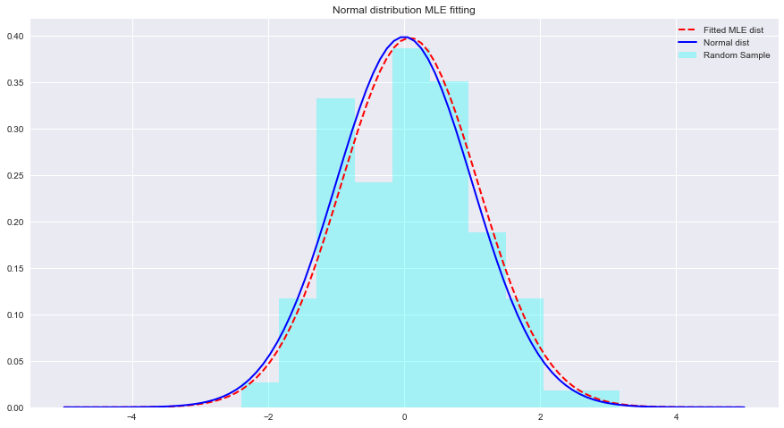

# MLE with Normal Distributions - Lab

## Introduction

In this lab, we shall put in practice, the mathematical formulas we saw in previous lesson to see how MLE works with normal distributions. 

## Objectives
You will be able to:

* Understand and describe how MLE works with normal distributions
* Fit a normal distribution to given data identifying mean and variance
* Visually compare the fitted distribution vs. real distribution


**Note:** *A detailed derivation of all MLE equations with proofs can be seen [at this website](https://www.statlect.com/fundamentals-of-statistics/normal-distribution-maximum-likelihood). *

## MLE in Python

Let's see an example of MLE and distribution fittings with Python below. Here `scipy.stats.norm.fit` calculates the distribution parameters using Maximum Likelihood Estimation.

### Import necessary libraries


```python
from scipy.stats import norm # for generating sample data and fitting distributions
import matplotlib.pyplot as plt
plt.style.use('seaborn')
import numpy as np
```

### Generate an array of 200 random sample from a normal dist with mean 0 and stdv 1


```python
sample = None
```

### Distribution fitting through MLE
#### -  Use `stats.norm.fit(data)` to fit a distribution to above data.
#### - This returns a list of two parameters : (mean,: parameters[0] and std:  parameters[1]) via a MLE approach 


```python
param = None

#param[0], param[1]
# (0.08241224761452863, 1.002987490235812)
```

### Calculate the PDF from a) actual data parameters b) fitted parameters with `x = np.linspace(-5,5,100)`


```python
x = np.linspace(-5,5,100)

# Generate the pdf from fitted parameters (fitted distribution)
fitted_pdf = None
# Generate the pdf without fitting (normal distribution non fitted)
normal_pdf = None
```

### Visualize both PDFs 


```python
# Your code here 
```





```python
#  Your comments/observations
```

## Summary 

In this short lab, we looked at Bayesian setting in a Gaussian context i.e. when the underlying random variables are normally distributed. We learned that MLE can estimate the unknown parameters of a normal distribution, by maximizing the likelihood of expected mean. The expected mean comes very close to the mean of a non-fitted normal distribution within that parameter space. We shall move ahead with this understanding towards learning how such estimations are performed in estimating means of a number of classes present in the data distribution using Naive Bayes Classifier.
