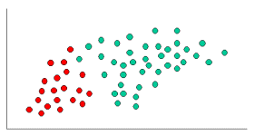
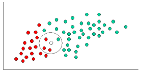
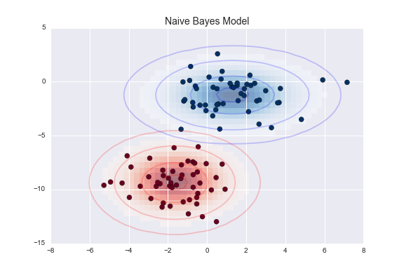

# MAP and Naive Bayes Classifier

## Introduction

Previously, we looked at how Maximum likelihood estimations can be used to calculate the posterior probability by learning some unknown variable theta, given all the available data.  In this is lesson, we shall look at using this Bayesian setting with a simple (rather naive) supervised classification algorithm, called "The Naive Bayes Classifier". So let's get on with it.  

## Objectives
You will be able to:

* Revise basic principles of MAP estimations and inclusion of prior to MLE
* Understand how joint probability modeling with MAP allows classification of data in Naive Bayes Classifier
* Explain how MAP estimations for thetas can be used in a predictive context with Naive Bayes
* Understand how normal distributions are used for modeling in Naive Bayes classifications

## MAP (Maximum A Posteriori)  Estimation for Posterior probability

As we saw before , we use MAP when we have *some* idea about the prior probability of the data. We can calclate marginal probabilities or simply a subjective value for the **prior probability** in a Bayesian context. We can write Bayes' theorem as:

$$P(\theta|X) = \frac{P(X|\theta)P(\theta)}{P(X)}$$

$$ = \frac{P(X|\theta)P(\theta)}{\sum_\Theta  P(\theta,X)}$$

$$ = \frac{P(X|\theta)P(\theta)}{\sum_\Theta  P(X|\theta)P(\theta)}$$

Note : In above equations, $\theta$ is the unknown parameter while $\Theta$ is the domain of X (think about the partition functions and total probabilities law here).

Maximizing our posterior probabilities with respect to the $\theta$, we get

$$argmax_\theta P(\theta |X) = argmax_\theta \frac{P(X|\theta)P(\theta)}{\sum_\Theta  P(X|\theta)P(\theta)}$$

So here we are just maximizing the numerator in above equation, as the denominator is a only a normalizing constant. You do not really have to normalize the probabilities if you only care about knowing which class $(ŷ)$ your input $(x=x_1,…,x_n)$ most likely belongs to. Sensitivity and Specificity with type 1 and 2 errors is achieved through normalizing. If no normalization is required , above can be re-written as:

$$argmax_\theta P(\theta |X) = argmax_\theta P(X|\theta)P(\theta)$$

As mentioned earlier, the difference between this and MLE is the presence of the prior. The prior in this case will effect our estimation towards the prior value of $\theta$. Note that **when $p(\theta)$ is uniform i.e. giving same prior probability to all possible values (P(H) in a coin toss is 0.5), MLE and MAP are equivalent, and as the number of observations in X increases, MLE and MAP converge** i.e. they both estimate the underlying parameters. 

The prior term in MAP has less of an effect on the estimation of $\theta$ as the amount of data in X increases, and intuitively this makes sense. 
> **The more data we have, the more reason we have to adjust our prior beliefs to fit the new data.**

## The Naive Bayes Classifier

MAP is the basis of **Naive Bayes (NB) Classifier**. It is a simple algorithm that uses the integration of maximum likelihood estimation techniques for classification. It is actually also possible to present naive Bayes in terms of a dynamic all-round machine learning algorithm, but we will focus on its mechanics as a predictive statistical modeling algorithm that results from a few probabilistic assumptions. Let's quickly look at how a "Supervised Classification" algorithm generally works. 

### Supervised Classification

> Supervised learning is the machine learning task of learning a function that maps an input to an output based on example input-output pairs. It infers a function from labeled training data consisting of a set of training examples.[2] In supervised learning, each example is a pair consisting of an input vector and a desired output value. A supervised learning algorithm analyzes the training data and produces an inferred function, which can be used for mapping new examples. An optimal scenario will allow for the algorithm to correctly determine the class labels for unseen instances. (wiki)

So unlike regression, where a real number value is predicted by learning the model parameters, a classification task, in simple words, allows us to classify data into one class (or group) out of many. For example, we may want to classify our customers as "highly profitable" and "not profitable" by learning different unknown parameters like buying behavior, profitability, frequency etc. from the available data. Following image shows that classification problems involve drawing a "decision boundary" to group data into classes , as opposed to regression, where the linear relationship of features is learned to extend the prediction line. 

We shall see more into details on classification problems in future lessons. Here we shall bring focus back to the learning mechanism of Naive Bayes , which is one of the simplest classification algorithms. 

### Joint Probability Modeling 

Let’s assume that we now have a number of parameter (thetas) determining the outcome of our random experiment. For a coin flip, instead of outcomes just depending on the flexibility of the coin material, we now model the outcome of H and T as a function of flexibility, wind direction/speed, ground surface angle, bounciness of floor material, height of experimenter, gravitational force … you can go wild with this to improve your model. 

The basic idea of NB is that we are going to **jointly** model both the input x (features) and output y (target) of a machine learning prediction problem. Assuming that the input $X=(x_1, ..., x_n)$ are either binary, categorical, or Gaussian random features, and that the target $Y$ is a binary or categorical variable, the aim is to **learn** the joint distribution: $P(X,Y)$.
>  If X and Y are discrete random variables, the function given by $f (x, y) = P(X = x, Y = y)$ for each pair of values $(x, y$) **within the range of X** is called the joint probability distribution of X and Y. 

$$P(X,Y) = P(X\mid Y)P(Y)$$

X could be a multidimensional vector (as we saw with multiple regression)and to represent the entire distribution, we need to model every possible instance of X (whether it exists or not). That would need $2^n - 1$ parameters. The independence assumption of Naive Bayes tells us that **individual features $Xi$ are conditionaly idependent GIVEN $Y$**. This lets us represent the condition distribution p(X∣Y) as

$$P(X \mid Y) = \prod_{i=1}^n P(X_i \mid Y)$$

$P(Xi∣Y=y)$ can be used as a separate distribution for each value of Y. Thus, we only need to represent n∗k different distributions to completely represent our joint distribution, where k is the number of classes/groups and n is the total number of attributes. 

## Making Predictions

With joint probability modeling as shown above, how do we use this to make a prediction given some new input x. The difficulty here is that we have only modeled the conditional distribution $P(X∣Y)$, not $P(Y∣X)$. And this is where we use the Bayes theorem. 

$$P(Y \mid X) = \frac{P(X \mid Y)P(Y)}{\sum_y P(X \mid y) P(y)}$$

As mentioned earlier, if we are only doing class prediction, we don’t need to compute the precise denominator probabilities here, we can just compute the numerator terms for each class and then predict the class with the maximum probability. Denominator is just the sum of of the numerator terms over ALL classes for normalization. So we can write above as 

$$P(Y \mid X) = P(X \mid Y)P(Y)$$

## Example
To demonstrate the concept of Naive Bayes Classification, consider the example displayed below. As indicated, the objects can be classified as either GREEN or RED (the target), based on their position on the 2-D plane i.e. x and y co ordinates. Our task is to classify new cases as they arrive, i.e., decide to which class label they belong, based on the positions currently exiting objects.

### Prior Class Probability 

Since there are twice as many GREEN objects as RED, it would seem that a new case (which hasn't been observed yet) is twice as likely to have membership GREEN rather than RED and this would be the basis of our prior probability. Prior probabilities are based on previous experience. SO we can write:

#### Prior Probability of Green = Total Green Objects / Total Objects
#### Prior Probability of Red = Total Red Objects / Total Objects

There is a total of 60 objects, 40 of which are GREEN and 20 RED, our prior probabilities for class membership are:

#### Prior Probability of Green = 2/3
#### Prior Probability of Red = 1/3

### Posterior Probability of Unseen Data
Having formulated our prior probability, we are now ready to classify a new object (WHITE circle) i.e. calculate the posterior probability of new object, based on its position on the 2-D plane.  

Since the objects are well clustered, it is reasonable to assume that the more GREEN (or RED) objects in the vicinity of X, the more likely that the new cases belong to that particular color. 

### Likehood of Data 

To measure this likelihood, we draw a circle around X which encompasses a number to define "**Vicinity**" (this can be chosen arbitrarily and changed to view the impact on likelihood) of points irrespective of their class labels. We can then calculate the number of points in the circle belonging to each class label. From this we calculate the likelihood:

#### Likelihood of X given Green = No. of Green Objects in the vicinity of X / Total Green Objects
#### Likelihood of X given Red = No. of Red Objects cin the vicinity of X / Total Red Objects

From the illustration above, it is clear that Likelihood of X given GREEN is smaller than Likelihood of X given RED, since the circle encompasses 1 GREEN object and 3 RED ones. Thus:

#### Likelihood of X given Green = 1/40
#### Likelihood of X given Red = 3/20

### Prediction For New Data

Although the prior probabilities indicate that X may belong to GREEN (given that there are twice as many GREEN compared to RED) the likelihood indicates otherwise; that the class membership of X is RED (given that there are more RED objects in the vicinity of X than GREEN). In the Bayesian analysis, the final classification is produced by combining both sources of information, i.e., the prior and the likelihood, to form a posterior probability using the Bayes' theorem.

#### Posterior Probability of X being Green = Likelihood of X given Green * Prior Probability of Green

> 2/3* 1/40 = 1/60

#### Posterior Probability of X being Red = Likelihood of X given Red * Prior Probability of Red

> 1/3* 3/20 = 1/20

Finally, we classify X as **RED** since its class membership achieves the largest posterior probability i.e. the **ARGMAX**. We simplify maximized the likelihood of color given the data. 

Note.The above probabilities are not normalized. However, this does not affect the classification outcome since their normalizing constants are the same.

### Gaussian Distributions

We can apply any model for the distribution $P(Xi∣Y)$, and just estimate its parameters via maximum likelihood estimation. Naive Bayes performs great with binomial, multinomial and Gaussian distributions. With the example above, instead of only looking at the position of new data on an x-y coordinate, we try to fit a distribution to classes and calculate the likelihood of it belonging to a certain class based on mean and variances. This is shown below:

If $x_i$ is real-valued random variable, we can have a joint Gaussian probability function $P(Xi∣Y)$.

$$P(X_i = x_i \mid Y =y) = \mathcal{N}(x_i;\mu_y \sigma_y^2)$$

$\mathcal{N}(x_i;\mu_y \sigma_y^2)$ is the joint distribution of $x_i$ with y, where $\mu_y~and~\sigma_y^2$ are the parameters of the y distribution. Again, following the maximum likelihood formulation, we can estimate these parameters as:

$$\mu_y = \frac{\sum_{j=1}^m x_i \mathrm{1}\{y^{(j)} = y\}}{\sum_{j=1}^m \mathrm{1}\{y^{(j)} = y\}}, \;\; 
\sigma^2_y = \frac{\sum_{j=1}^m (x_i^{(j)}-\mu_y)^2 \mathrm{1}\{y^{(j)} = y\}}{\sum_{j=1}^m \mathrm{1}\{y^{(j)} = y\}}$$

This can be visualized through following image based on the distributions above. Remember we are now looking at the data from a PDF perspective , and not the x-y coordinates. 

[Visit this link](https://www.cs.cmu.edu/~mgormley/courses/10601-s17/slides/lecture6-gnb.pdf) for some interesting examples in a Gaussian context.

Another common technique for handling continuous values is to use binning to discretize the feature values, to obtain a new set of Bernoulli-distributed features. However, remember that discretization may throw away some useful discriminative information as shown below. Naive Bayes, however, works fine with Bernoulli. 

## Summary 

In this lesson, we looked at how MAP estimations can be used to model the class probability of data with more than one target classes (as compared to real values in regression). NExt we shall see ow to implement this function in python including all the necessary calculations. We shall also look at the scikitlearn functions to run this classifier. 
